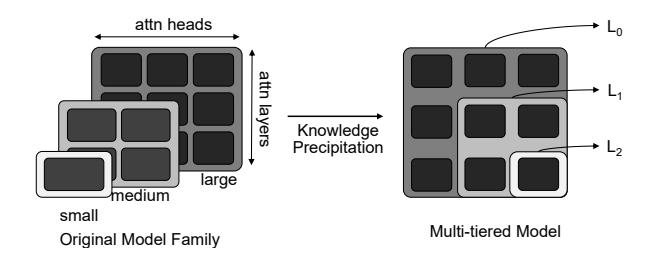
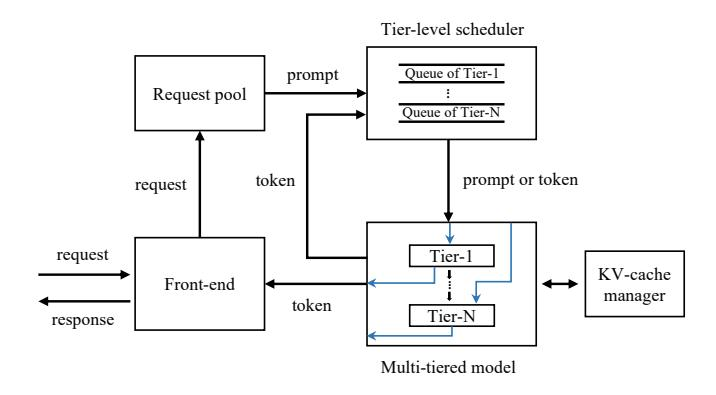
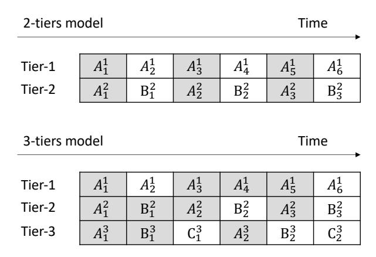
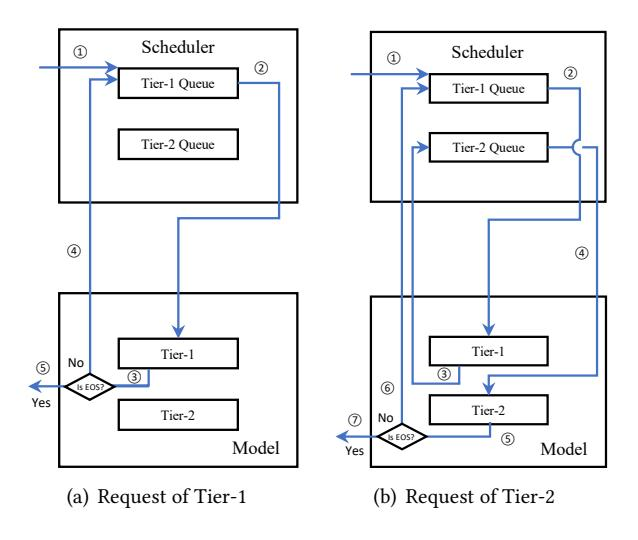

# 3 Design

In this section, we introduce MFS, a serving system targeting LLM model families. We first illustrate how to transfer a pretrained LLM model family into a multi-tiered model, then we describe how to integrate the multi-tiered model into LLM serving systems and enforce further optimization.

#### 3.1 Building Multi-tiered Structure

Now we explore how to encapsulate a series of LLMs with only one model and introduce the system-aware optimization.

Design goal. MFS aims to develop a universal method to transform any pre-trained decoder-based LLM model family into a multi-tiered model, where each tier corresponds to a specific model from the family. The requirements are: 1) The quality of generated content and inference timing of each tier must be equivalent to its corresponding original independent model. 2) Minimize GPU computation power consumption and time cost. 3) Bringing opportunities to optimize the batching and KV-cache sharing among different tiers.

Strawman model. In previous work, the design of early exiting matches the multi-tiered structure. Therefore, we first implement a strawman design based on early exiting. We first evenly divide the largest model in a model family into several segments by layer, with the number of segments matching the number of models in the family. Since it is a generative task in our case, we add an output layer (a fully connected layer followed by a softmax function). However, our experiment on Llama2-chat family shows that this approach does not work. The lower-tier model generates

meaningless words that do not even form grammatically correct sentences.

We further apply parameter-efficient fine-tuning (PEFT) [\[20\]](#page-13-14), which incorporates additional adapters (LoRA) [\[21\]](#page-13-15) into each layer to refine model performance. However, it still does not work. This observation aligns with prior research findings [\[39\]](#page-14-3), which highlight limitations in leveraging shallow layers for complex tasks.

Early exiting. A straightforward approach is to train, from scratch, a multi-tiered model for a given model family. This can be realized by attaching an independent classification head to every Transformer layer and imposing a loss at each layer, thereby endowing each layer with full languagemodeling capability. Early-exit training has been applied to Transformers in DeeBERT [\[40\]](#page-14-4), demonstrating its effectiveness.

However, this approach is prohibitively expensive: training Llama2-70B [\[34\]](#page-13-1) requires approximately 1.7 million A100 GPU hours. Moreover, our system does not require every layer to achieve independent language-modeling capability; a small number of consecutive blocks suffices.

In addition, state-of-the-art LLM training also requires access to trillion-token, high-quality corpora (often nonpublic), which are typically unavailable to system designers.

Deep pruning. Deep pruning reduces model size by removing parameters. However, it removes parameters in structurally discontinuous ways, which makes advanced optimizations—such as incremental computation and KV-cache sharing—impractical. For example, pruning a middle layer in a Transformer invalidates the KV-caches of all subsequent layers. Although deep pruning can efficiently produce smaller models without additional fine-tuning, our system requires a specific model structure that preserves KV-cache compatibility for memory efficiency, rendering deep pruning unsuitable.

Knowledge precipitation. Given the high resource cost of early exiting and the low generation quality achieved by the strawman and PEFT variants, we adopt full-parameter fine-tuning to balance efficiency and accuracy.

We adopt Knowledge Precipitation [\[19\]](#page-13-16), a post-training fine-tuning technique. It uses a larger model to guide the optimization of a smaller model, effectively distilling knowledge from the former into the latter. This enables the smaller model to attain competitive performance with substantially less training compute than directly training it on task data.

In this work, we use Knowledge Precipitation as a preparatory step for our inference system because it naturally yields a usable multi-tier model, which is pivotal to our design. It also enables a key system insight: KV-cache sharing. In multimodel autoregressive generation, requests often switch between small and large models because token difficulty varies (e.g., technical terms versus function words). In conventional systems where the models are independent, when a token is

generated by the small model and the next token requires the large model, the large model cannot reuse the small model's KV-cache due to parameter mismatch, incurring extra computation and memory. By contrast, when the small model is structurally embedded in the large model (as produced by Knowledge Precipitation), KV-caches remain compatible across switches and can be reused end-to-end.

In practice, we create tiers from the largest model in a model family by dividing it according to layers and heads, corresponding to all other models in the family. These tiers are nested and share parameters, forming a multi-tiered structure. We utilize only the parameters from the largest model because models in a family typically follow a common training procedure and use identical datasets, ensuring consistency and efficiency in leveraging pre-trained knowledge. The division of layers and heads is based on the corresponding model's size, with each tier's layer and head count proportionally adjusted to match or not exceed the model's size, considering variations in hidden size.

Figure 3. Workflow of knowledge precipitation.

Figure 3 illustrates an example workflow. The left side shows the original model family, and the right side depicts the multi-tiered model created through knowledge precipitation. In this example, the model family consists of three models, i.e., large, medium, and small. The large model has three layers, with each layer containing three heads. The multi-tiered model is structured into three hierarchical tiers, each corresponding to one of the family's models.

Each tier defines an independent loss  $L_i$ . We train all tiers jointly by minimizing a weighted sum:

$$L = L_0 + \lambda_1 L_1 + \cdots + \lambda_i L_i.$$

This objective encourages every tier to acquire full language-modeling capability. Moreover, joint backpropagation allows gradients from higher tiers to guide parameter updates of smaller tiers—the core idea of knowledge precipitation.

Furthermore, for the knowledge precipitation of multitier models, step-by-step fine-tuning is necessary. The full-parameter fine-tuning process has multiple steps according to the number of tiers, each focusing on precipitating the knowledge from the higher tiered models down to the next. For a n-tier structure, we need n-1 steps of fine-tuning. The loss functions for step i is  $L_0 + \lambda_1 L_1 + \cdots + \lambda_i L_i$ , where  $L_k$  is

the loss of tier k, with each tier featuring an additional output layer. This can be intuitively understood as knowledge precipitating from the largest model to the lower model tier step by step. Our experiments show that if the loss functions of all tiers are directly added together without step-by-step fine-tuning to perform the knowledge precipitation of all model tiers at once, the performance of the lower-level model tiers will become uncontrollable.

System-aware optimization. Based on the above multitiered structure, we consider further optimizations tailored to the requirement of the serving system. Instead of splitting both layers and heads, we opt to divide only the layers. The reason is that: 1) Prior work [39] has shown that the number of layers has a greater impact on inference latency, since layers operate serially while heads can be calculated in parallel. 2) The computation of attention involves all heads in each layer, requiring that each tier has the same heads to achieve consistent KV-cache results in each layer. However, splitting only layers to match each tier's size with its corresponding model can lead to insufficient layers in lower tiers. For example, Llama2-70B has 80 layers. To keep the sizes consistent, the tier corresponding to Llama2-7B will only have 8 layers, note that the original Llama2-70B has 32 layers.

We observe that model size is not exactly proportional to the inference latency. Therefore, by measuring the inference latency of smaller models in the model family, we identify the corresponding layer number of the largest model. For example, we find that the inference latency of Llama2-7B (32 layers) and Llama2-13B (40 layers) correspond to 20 and 25 layers of Llama2-70B, when the prompt size is 1024.

#### 3.2 Model Family Serving System

Here we introduce the serving system for model family with the above multi-tiered model. We first show the system overview, then we describe the procedure of batching and caching optimization. Finally, we introduce the possibility of integrating several multi-model scheduling algorithms into our architecture and discuss several design details.

**3.2.1 System Overview.** MFS system design consists of a front-end, request pool, tier-level scheduler, multi-tiered model, and KV-cache manager. As shown in Figure 4. The front-end provides a user interface or API, handling the receipt of user requests, i.e., prompts and the required model, and delivers the system-generated responses back to the users. The request pool is responsible for storing pending requests. The tier-level scheduler acts as the control center for the entire model family serving, determining the order of execution of each request's inference. It uses several queues to schedule requests of different tiers and decides which unprocessed requests to take out from the request pool. The execution of inference is carried out by the multi-tiered model, which replaces the model family to handle requests with varying QoS requirements. The KV-cache manager stores

**Figure 4.** Overview of MFS. We replace the model family with the multi-tiered model. A request first comes to the front-end to create a user session or reuse an existing session. The front-end sends the request to the request pool.

and manages the KV-cache of the multi-tiered model during the inference.

**3.2.2 Optimization on Batching and Caching.** The multitiered structure presents opportunities to optimize batching and caching within the model family serving system. Essentially, the inference processes for requests across different tiers share the same portions of the model. This commonality facilitates the batching of overlapping parts and enables the possibility of KV-cache sharing.

MFS employs three techniques to optimize batching and caching. First, unlike traditional inference batching which is limited to identical and complete models, we introduce group batching that maximizes parallel processing for common model parts across different tiers. Considering that each inference iteration in the decoding stage processes and generates only one token, leading to low GPU parallel utilization, we propose attention fusion to enable parallel execution of attention calculations across different requests. Finally, to enable KV-cache sharing among requests from different tiers, we introduce a shareable KV-cache management method.

**Group Batching.** Recall that in a multi-tiered model, the front layers of a higher-tier model correspond to a lower-tier model. When processing a higher-tier request within these shared layers, it can be batched together with requests from the lower tier. We call this procedure as group batching, where parts of requests that utilize the same model components are batched together. Figure 5 illustrates two examples of group batching. The first case is running six tier-1 requests and three tier-2 requests in a 2-tier model. At time-1, we simultaneously serve the first requests of tier-1  $(A_1^1)$  and tier-2  $(A_1^2)$ , which share the same model part and are batch-processable. At time-2, we run the second request of tier-1  $(A_2^1)$  on GPU-1 and the remaining of the first request of tier-2  $(B_1^2)$  on GPU-2. The second case shows running six tier-1, three tier-2 and two tier-3 requests on 3-tier models. As we

**Figure 5.** Group batching of multi-tiered model (using First-Come-First-Serve). The first case is a 2-tiers model and the second is 3-tiers. Grey squares represent batch-processable for the concurrent requests. A,B,C represent different tiers of the model. For simplicity, we assume the corresponding model part for each tier runs on a separate GPU and only one token was generated for each request within this time snippet.

can see, as the number of tiers increases, it leads to more batch processing opportunities.

**Attention fusion.** For generative tasks, the varying lengths and number of tokens generated per request prevent direct parallel processing. Previous methods use padding to uniform lengths or employed selective batching to batch only certain operations. Padding significantly increases latency for shorter requests (thus not a consideration in our design), while selective batching reduces GPU parallelism as it does not allow batching for certain operations, primarily attention. When serving a model family, the average batch size tends to be smaller compared to serving a single model, which can reduce GPU parallel efficiency. To compensate, we propose attention fusion, which allows the attention computations of different requests to be batch processed. Attention fusion processes the attention of all requests within a batch by first concatenating the QKV (Query, Key, Value) matrices of each request. It then performs matrix multiplication to compute the attention between different positions. Although this approach introduces some redundant computations, such as the attention between tokens of different requests, it does not increase computational time due to the parallel processing capabilities of GPUs.

Shareable KV-cache. The multi-tiered structure inherently facilitates more dynamic and extensive KV-cache sharing across different levels of the model due to the uniform structure and redundancy inherent in the transformer layers. Our design utilizes the inherent structural similarities and redundancies within the transformer architecture to enable smart KV-cache sharing. Each tier in the multi-tiered model

setup corresponds to a different model size and complexity, making it possible to tailor cache utilization according to the processing needs of specific tiers. For instance, higher tiers, which handle more complex queries, can dynamically borrow computation results from lower tiers when similar requests are processed concurrently. This not only reduces the overall computational load but also speeds up the inference time by avoiding redundant calculations.

Figure 6. Example of tier-level scheduling.

3.2.3 Request Scheduling on Multi-tier. As shown in Figure [6,](#page-7-0) our scheduling system operates at a more granular level by focusing on individual tiers of the model architecture. This approach allows for a more detailed control over resource allocation, ensuring that each tier receives the necessary computational resources based on its current load and computational requirements. By managing resources at the tier level, our system can more effectively handle the dynamic nature of LLM requests, which vary significantly in complexity and urgency.

To enhance the responsiveness of our LLM serving system, we incorporate preemptive scheduling strategies that allow for the interruption of lower-priority tasks in favor of higher-priority ones. This capability is particularly crucial when dealing with a range of request complexities across different model tiers. For example, urgent requests that require immediate attention can preempt ongoing tasks within lower tiers, thus reducing wait times for critical operations.

Our scheduling system also implements priority-based queuing mechanisms. Each request is assigned a priority level based on several factors, including the expected computational load, the urgency of the request, and the service level agreement (SLA) associated with the user or task. This structured prioritization helps in managing the queue more effectively, ensuring that high-priority requests are serviced promptly.

Fairness is a critical component of our scheduling strategy, especially when serving requests across multiple tiered models. We aim to provide equitable access to computational resources for all requests, regardless of the tier they originate from. To achieve this, our system employs fair queuing algorithms that balance resource allocation across different tiers, preventing any single tier from monopolizing the GPU resources.

### 3.3 Distributed Architecture

As the LLM size grows, model parameters require multiple GPUs for deployment. Existing work, e.g., FasterTransformer and Orca, uses two parallelism strategies for distributed deployment, i.e., intra-layer and inter-layer parallelism. The former slices tensors (linear or attention parameters) within the same layer across different GPUs, while the latter distributes layers on different GPUs. MFS also supports the above two types of distributed execution. Similar to Orca, each worker process is responsible for one inter-layer partition (different partitions may cross servers), and there are multiple GPUs within a worker (same server) to perform intra-layer parallelism.MFS has an inherent advantage in distributed scenarios. Considering the structural characteristics of multi-tiered, when performing inter-layer partitioning, MFS partitions the layers belonging to the same tier together, so that different inter-layer partitions can be asynchronous with each other, avoiding synchronization overhead.

#### 3.4 Design Discussion of Scheduling

As noted earlier, our multi-tier inference architecture does not prescribe a specific algorithm for scheduling requests across models. Scheduling can be treated as a plug-and-play module that integrates with our framework to exploit its memory and computational efficiencies. Below, we discuss two state-of-the-art multi-model scheduling strategies. In Section 5.3, we implement speculative sampling and show how our system accelerates it.

Heuristically determine the query level. Heuristic algorithm automatically identifies the optimal complexity level for processing a query within a multi-tiered model structure. This method uses differences in output distributions from models of varying sizes to intelligently select the smallest model capable of handling the query with minimal accuracy loss.

The core idea here is to use a smaller version of the largest model in the model family to quickly assess the complexity of the incoming query. The smaller model generates preliminary results, and based on certain metrics or thresholds, such as confidence scores or deviation from expected patterns, the system determines whether the query can be satisfactorily resolved at this level or if it needs to be escalated to a more complex model.

Speculative sampling. Speculative sampling technique utilizes the hierarchical model structure by using lower-tiered models as draft models, which are less computationally demanding and quicker to execute, making them suitable for initial evaluations of multiple potential continuations of an input sequence. This approach not only speeds up initial computations but also provides early insights that help reduce the computational load on more complex target models.

The Speculative sampling architecture can be optimized by our system because sharing computation results and KVcaches between the draft and target models further reduces the computational cost. Once a draft model processes an input, its outputs and associated KV-cache are reused by the target model, eliminating the need to recompute initial sequence stages and conserving GPU resources. This efficient cache integration minimizes redundant calculations and enhances response times.

Additionally, our system implements batch processing for both draft and target models to maximize computational resource utilization. This strategy, combined with our shared KV-cache system, allows simultaneous sequence generation across multiple requests, optimizing GPU use and improving overall throughput. We show in detail the speedup of our system for speculative sampling in section 5.3.

