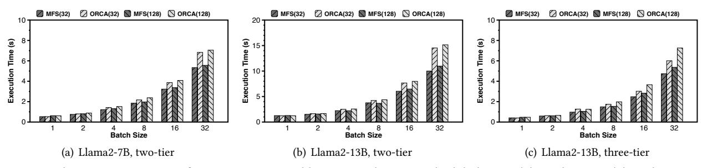
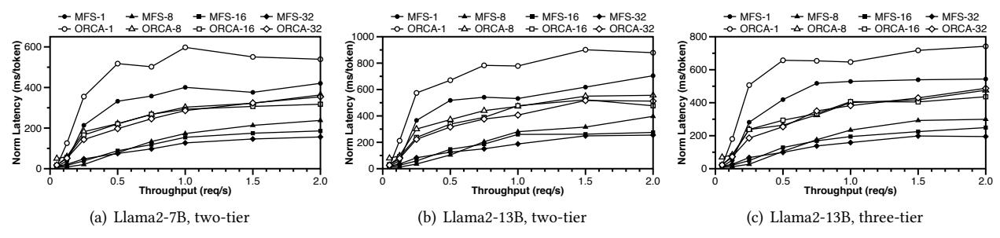
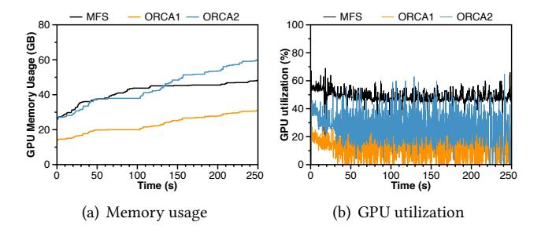
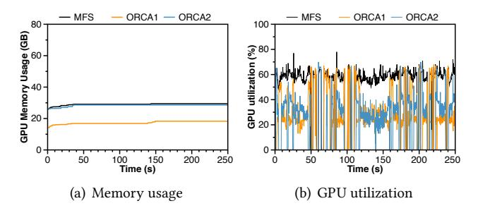

# 5 Evaluation

In this section, we first assess the effectiveness of knowledge precipitation in constructing multi-tiered models. Then, we evaluate the system performance and inference speedup of MFS. Finally, we deep dive into the scenarios of KV-cache sharing and speculative sampling. The key findings are as follows:

- We assess the effectiveness of knowledge precipitation by evaluating the quality of content generated by multi-tiered models. Using ten widely-used LLM metrics, we find that it can achieve performance comparable to that of the original model family.
- We evaluate the system improvement of MFS on batching. Results show that MFS can improve the JCT by up to 31.2% and reduce the response latency by up to 56.1% compared to ORCA.
- Further evaluation on the scenarios of KV-cache sharing and speculative sampling show that MFS can reduce the GPU memory footprint by up to 47.8% and increase the GPU utilization from 23.9% to 59.8%.

## 5.1 Baselines and Metrics

To evaluate the quality of content generated by the multitiered model, we use Llama2-7B-chat and Llama2-13B-chat as baselines, hereafter referred to as Llama2-7B and Llama2-13B, which are publicly available versions of the Llama2 models. We assess performance across ten common tasks, serving as metrics for evaluation. These include MMLU [\[18\]](#page-13-17), a multitask benchmark; PIQA [\[6\]](#page-13-18), which focuses on physical commonsense reasoning; OpenBookQA [\[25\]](#page-13-19), centered on opendomain question answering; HellaSWAG [\[43\]](#page-14-5), which predicts sentence completions in a narrative context; BoolQ [\[8\]](#page-13-20), a yes/no question answering dataset; ARC Easy and ARC Challenge [\[9\]](#page-13-21), which involve science question answering; and ANLI rounds 1, 2, and 3 [\[26\]](#page-13-22), which are adversarial NLI tasks designed to test reasoning abilities under progressively challenging conditions. To evaluate MFS, we compare it with Orca [\[42\]](#page-14-1), the state-of-the-art batching design for

| Metric     | Llama2-7B | MFS-7B | FT-7B | Llama2-3B | MFS-3B |
|------------|-----------|--------|-------|-----------|--------|
| mmlu       | 0.48      | 0.46   | 0.48  | 0.24      | 0.43   |
| piqa       | 0.78      | 0.76   | 0.77  | 0.75      | 0.71   |
| openbookqa | 0.29      | 0.33   | 0.32  | 0.27      | 0.25   |
| hellaswag  | 0.56      | 0.57   | 0.59  | 0.49      | 0.49   |
| boolq      | 0.75      | 0.78   | 0.70  | 0.68      | 0.76   |
| arc-easy   | 0.68      | 0.71   | 0.69  | 0.69      | 0.57   |
| arc-hard   | 0.39      | 0.42   | 0.42  | 0.34      | 0.33   |
| anli-r1    | 0.35      | 0.35   | 0.39  | 0.33      | 0.34   |
| anli-r2    | 0.34      | 0.35   | 0.40  | 0.32      | 0.34   |
| anli-r3    | 0.37      | 0.38   | 0.36  | 0.35      | 0.36   |

Table 2. Convert Llama2-7B into a two-tier structure.

LLM serving and measure both average execution time of requests and response latency to generate each token. We also measure the reduction of GPU memory footprint and the improvement in GPU utilization by using multi-tiered model to replace the serial of models in a model family.

We do not compare MFS against state-of-the-art generalpurpose serving systems (e.g., vLLM) because the optimization targets fundamentally differ, making a direct comparison inappropriate. vLLM primarily optimizes distributed execution across multi-node, multi-GPU, and heterogeneous environments using tensor, pipeline, and sequence parallelism (TP, PP, SP). It does not modify model architecture or parameter allocation during fine-tuning.

#### 5.2 Quality of Multi-tiered Models

Before deploying MFS, we need to transform the model family into a multi-tiered model, ensuring that each tier matches the corresponding model in terms of inference latency and content quality. In this section, we first evaluate the performance of the multi-tiered models obtained through knowledge precipitation and further assess the impact of systemaware optimizations. To ensure generality, we test various tier configurations and different LLM model families.

Effectiveness of knowledge precipitation. We first assess the quality of content generated by models using knowledge precipitation without system-aware optimization. As shown in Table [2](#page-9-0) and Table [3,](#page-9-0) we convert both Llama2-7B and Llama2-13B into a two-tier structure. For the 7B model, which consists of 32 layers and 32 heads per layer, we transform it into a two-tier model incorporating a 3B model. Since the Llama2 family does not have an official 3B version, we chose a popular open-source 3B version [\[5\]](#page-12-3) with around 80,000 monthly downloads, featuring 24 layers and 24 heads each. For the 13B model, we convert it into a two-tier structure including a 7B model.

Table [2](#page-9-0) shows the scores of the two-tier model based on Llama2-7B across various tasks. We compare its first tier, MFS-3B, with Llama2-3B, and the second tier, MFS-7B, with Llama2-7B. To exclude the impact of the fine-tuning dataset, we also fine-tune the Llama2-7B baseline directly on the same dataset to obtain FT-7B. As shown in the table, compared to Llama2-7B, MFS-7B performs better in eight out of ten metrics, and the remaining two metrics are also comparable.

| Metric     | Llama2-13B | MFS-13B | FT-13B | Llama2-7B | MFS-7B |
|------------|------------|---------|--------|-----------|--------|
| mmlu       | 0.53       | 0.54    | 0.53   | 0.48      | 0.51   |
| piqa       | 0.78       | 0.78    | 0.77   | 0.78      | 0.77   |
| openbookqa | 0.35       | 0.36    | 0.36   | 0.29      | 0.33   |
| hellaswag  | 0.61       | 0.60    | 0.59   | 0.56      | 0.54   |
| boolq      | 0.82       | 0.77    | 0.79   | 0.75      | 0.76   |
| arc-easy   | 0.78       | 0.79    | 0.76   | 0.68      | 0.69   |
| arc-hard   | 0.46       | 0.49    | 0.47   | 0.39      | 0.39   |
| anli-r1    | 0.43       | 0.47    | 0.43   | 0.35      | 0.43   |
| anli-r2    | 0.43       | 0.46    | 0.43   | 0.34      | 0.41   |
| anli-r3    | 0.41       | 0.46    | 0.43   | 0.37      | 0.43   |

Table 3. Convert Llama2-13B into a two-tier structure.

For MFS-3B, the number is 5 out of 10. Additionally, FT-7B and Llama2-7B have similar performances across all metrics, with some minor variations, indicating that the dataset and the fine-tuning process do not significantly influence the results. Table [3](#page-9-0) shows the performance metrics for the two-tier model derived from Llama2-13B. MFS-13B/MFS-7B has 8/7 better metrics compared to Llama2-13B/Llama2-7B, respectively. These results all demonstrate that knowledge precipitation successfully produces multi-tiered models that meet the required performance standards.

We further observe that the two-tier model derived from Llama2-13B exhibits larger gains over its baseline than the two-tier model derived from Llama2-7B. Larger LLMs generally contain greater representational redundancy, making them more amenable to conversion into multi-tier structures. This finding strengthens the case for the feasibility and robustness of scaling knowledge precipitation to increasingly larger models.

Another notable observation from Table [2](#page-9-0) is that the MFS-7B model obtained via knowledge precipitation surpasses the independently fine-tuned 7B baseline (FT-7B) on several metrics. Knowledge precipitation transfers information from a larger model to a smaller one. During training, the objective = 0 + 1—where 0 and 1 denote the losses of the large and small tiers, respectively—allows gradients from the large model to guide updates in the small model, effectively distilling its knowledge. This paradigm is widely adopted in practice to train compact, high-performing models; for example, DeepSeek distilled a high-performance 32B model (DeepSeek-R1-Distill) from the 671B DeepSeek-R1 [\[24\]](#page-13-23).

Impact of system-aware optimization. Considering system batching and caching, we apply system-aware optimization by splitting only by layer. We split the layers based on the inference latency with different numbers of layers. We find that the inference latency of Llama2-7B corresponds to the latency of 24 layers in Llama2-13B. The input prompt size is 1024 in the measurement. Note that the prompt size affects inference latency, when the prompt size is less than 1024, the layer number at the intersection point for the same latency is always greater than or equal to 24. Given that most prompt sizes are below 1024 [\[34\]](#page-13-1), selecting the first 24 layers of Llama2-13B can meet the inference latency requirements. Table [7](#page-10-0) shows the results of the two-tier model obtained by

| Metric     | MFS-13B | Llama2-7B | MFS-7B | Llama2-3B | MFS-3B |
|------------|---------|-----------|--------|-----------|--------|
| mmlu       | 0.53    | 0.48      | 0.50   | 0.24      | 0.23   |
| piqa       | 0.79    | 0.78      | 0.77   | 0.75      | 0.68   |
| openbookqa | 0.35    | 0.29      | 0.30   | 0.27      | 0.18   |
| hellaswag  | 0.60    | 0.56      | 0.54   | 0.49      | 0.33   |
| boolq      | 0.82    | 0.75      | 0.81   | 0.68      | 0.64   |
| arc-easy   | 0.78    | 0.68      | 0.64   | 0.69      | 0.52   |
| arc-hard   | 0.49    | 0.39      | 0.36   | 0.34      | 0.29   |
| anli-r1    | 0.46    | 0.35      | 0.42   | 0.33      | 0.37   |
| anli-r2    | 0.45    | 0.34      | 0.43   | 0.32      | 0.33   |
| anli-r3    | 0.46    | 0.37      | 0.41   | 0.35      | 0.35   |

Table 4. MFS contains 13B, 7B and 3B

| Metric     | Qwen-14B | MFS-14B | FT-14B | Qwen-7B | MFS-7B |
|------------|----------|---------|--------|---------|--------|
| mmlu       | 0.68     | 0.64    | 0.65   | 0.62    | 0.58   |
| piqa       | 0.75     | 0.79    | 0.76   | 0.75    | 0.72   |
| openbookqa | 0.36     | 0.34    | 0.36   | 0.32    | 0.28   |
| hellaswag  | 0.62     | 0.58    | 0.59   | 0.59    | 0.52   |
| boolq      | 0.86     | 0.84    | 0.84   | 0.84    | 0.81   |
| arc-easy   | 0.72     | 0.73    | 0.71   | 0.68    | 0.63   |
| arc-hard   | 0.45     | 0.44    | 0.43   | 0.43    | 0.38   |
| anli-r1    | 0.47     | 0.45    | 0.44   | 0.42    | 0.41   |
| anli-r2    | 0.43     | 0.42    | 0.42   | 0.40    | 0.38   |
| anli-r3    | 0.45     | 0.43    | 0.42   | 0.41    | 0.40   |

Table 6. Qwen-14B, two-tiers

| Metric     | Llama2-13B | MFS-13B | FT-13B | Llama2-7B | MFS-7B |
|------------|------------|---------|--------|-----------|--------|
| mmlu       | 0.53       | 0.54    | 0.53   | 0.48      | 0.53   |
| piqa       | 0.78       | 0.79    | 0.77   | 0.78      | 0.73   |
| openbookqa | 0.35       | 0.36    | 0.36   | 0.29      | 0.31   |
| hellaswag  | 0.61       | 0.59    | 0.59   | 0.56      | 0.52   |
| boolq      | 0.82       | 0.81    | 0.79   | 0.75      | 0.82   |
| arc-easy   | 0.78       | 0.75    | 0.76   | 0.68      | 0.68   |
| arc-hard   | 0.46       | 0.46    | 0.47   | 0.39      | 0.38   |
| anli-r1    | 0.43       | 0.43    | 0.43   | 0.35      | 0.44   |
| anli-r2    | 0.43       | 0.43    | 0.43   | 0.34      | 0.45   |
| anli-r3    | 0.41       | 0.40    | 0.43   | 0.37      | 0.44   |

Table 7. Apply system-aware optimization.

selecting only the first 24 layers of Llama2-13B. We observe that both MFS-13B and MFS-7B achieve comparable or even better performance in terms of generated content quality.

Validation on three-tier model. Building on system-aware optimization, we further evaluate the performance of converting Llama2-13B into different-sized three-tier models. Table [4](#page-10-1) displays the results of cutting Llama2-13B into tiers corresponding to sizes of 13B, 7B, and 3B, with layer divisions at 24 and 16 respectively. Table [5](#page-10-1) presents the results of cutting layers into 13B, 10B, and 7B tiers, with divisions at 32 and 24 layers. Since Llama2 does not have a 10B version, we only show the results for MFS-10B. The experiments show that each tier achieves content generation quality comparable to the corresponding baselines. Notably, we observe that the performance corresponding to Llama2-3B was significantly inferior, especially in MMLU. Nevertheless, MFS-3B works well in MMLU, as it is fine-tuned from the official Llama2-13B model through knowledge precipitation. Meanwhile, MFS-10B achieves performance between Llama2-13B and Llama2-7B, suggesting that our multi-tiered model can

| Metric     | Llama2-13B | MFS-13B | MFS-10B | Llama2-7B | MFS-7B |
|------------|------------|---------|---------|-----------|--------|
| mmlu       | 0.53       | 0.54    | 0.53    | 0.48      | 0.53   |
| piqa       | 0.78       | 0.79    | 0.78    | 0.78      | 0.73   |
| openbookqa | 0.35       | 0.36    | 0.37    | 0.29      | 0.31   |
| hellaswag  | 0.61       | 0.59    | 0.57    | 0.56      | 0.52   |
| boolq      | 0.82       | 0.81    | 0.84    | 0.75      | 0.82   |
| arc-easy   | 0.78       | 0.75    | 0.74    | 0.68      | 0.68   |
| arc-hard   | 0.46       | 0.46    | 0.42    | 0.39      | 0.38   |
| anli-r1    | 0.43       | 0.43    | 0.46    | 0.35      | 0.44   |
| anli-r2    | 0.43       | 0.43    | 0.45    | 0.34      | 0.45   |
| anli-r3    | 0.41       | 0.40    | 0.45    | 0.37      | 0.44   |

Table 5. MFS contains 13B, 10B and 7B

generate a more granular range of models with different QoS, thereby offering more fine-grained services.

Validation on Qwen model family. In addition to the Llama2 model family, we also validate the effectiveness of knowledge precipitation with system-aware optimization on the Qwen1.5 model family. Due to computational limitations, we select only Qwen-14B and Qwen-7B from the Qwen model family. We transform Qwen-14B into a two-tier model. Table [6](#page-10-2) shows the experimental results, the metrics for the corresponding MFS-14B and MFS-7B are comparable to their respective Qwen baseline models. We leave the finetuning and validation of more and larger model families as future work.

#### Generalization of knowledge precipitation in LLM fam-

ily. Theoretically, the applicability of knowledge precipitation to large language models rests on the stacked, decoderonly Transformer architecture. Because contemporary LLMs (including but not limited to GPT, Gemini, Claude, and Deep-Seek) adopt this design, the technique can be readily extended across model families. Moreover, larger models—with deeper stacks of Transformer blocks—tend to exhibit greater optimization stability and representational redundancy. Given that smaller models with fewer layers already train stably and accurately under knowledge precipitation, it is reasonable to expect equal or greater benefits when scaling the technique to larger models.

#### 5.3 System Performance of MFS

In this section, we integrate the multi-tier models into MFS and evaluate its system performance. We measure the improvements MFS brings to LLM serving in terms of batching, caching, and sampling.

Batching performance. In our evaluation, we initially compare the performance of MFS and Orca in terms of request execution time and token generation latency. We adopt a testing approach based on the experimental settings used in Orca, which are designed to assess the Orca engine's performance without the influence of its iteration-level scheduling. Specifically, we do not activate the Orca scheduler; instead, we inject the same batch of requests into the ORCA engine repeatedly until all requests are processed. This setup aims to

Figure 7. Median execution time of requests processed by MFS and ORCA. The label "MFS (n)" and "ORCA(n)" indicate results from MFS and ORCA when handling requests with n input tokens.

Figure 8. Relation of median end-to-end latency per generated token with throughput. The label "MFS-n" and "ORCA-n" indicate results from MFS and ORCA with n batch size.

emulate the behavior of conventional request-level scheduling, ensuring all requests in the batch have the same number of input tokens and generate the same number of output tokens. We measure the time taken to process the entire batch, not individual requests. Additionally, we simulate an end-toend performance scenario similar to ORCA's, synthesizing a trace of client requests due to the lack of publicly available request traces for generative language models. Each request in our synthesized trace randomly specifies the number of input tokens and a max generated tokens attribute. For our experiments, we assume that the proportion of each model within a request batch is equal, facilitating a fair comparison across different system configurations and model tiers.

Figure [7](#page-11-0) shows the execution time of a batch of requests. When the batch size is 1, the execution time of MFS and ORCA are similar due to the absence of batch processing. As the batch size increases, the improvement of MFS over ORCA becomes more significant.

Figure [8](#page-11-1) shows the median end-to-end latency for each token. We can observe that MFS achieves a greater improvement in per-token generation latency. This is because the median latency for each token is primarily determined by the decoding phase, which is memory-bound. Therefore, MFS's efficient batch processing capability can be more fully utilized.

KV-cache sharing. We evaluate KV-cache sharing by configuring two distinct systems to imitate the inferencing process of MFS and Orca. System 1 is MFS, which enables KV-cache

Figure 9. KV-cache sharing.

sharing with a two-tier model where each tier outputs tokens, and the hidden states from the first tier serve as inputs to the second tier. System 2 is Orca without KV-cache sharing, which duplicates the first tier model: one operates independently as a small model, and the other is paired with a second tier to form a larger model. For each inference request, two sub-requests with identical prompts are injected: one requiring only the first tier and the other requiring both tiers.

Tasks are injected following a Poisson distribution. Output data format includes the request ID, total number of tokens generated, the total time from request to completion, and a timestamp at the end of processing, useful for calculating throughput and establishing absolute request timing. The result is shown in Figure [9.](#page-11-2) For Orca, lines with orange color reflect data from the first tier of model and lines with blue color reflect data from the second tier of model, representing two sub-requests per inference. Under low system loads, Orca performs comparably to MFS due to ample batch space for handling both tasks, though GPU usage in Orca is about 50% higher. As system load increases, Orca's batches fill up faster than those in MFS, significantly decreasing efficiency and increasing memory utilization.

Figure 10. Speculative sampling.

Speculative sampling. In this section, we evaluate the performance of speculative sampling adapted to our system. Speculative sampling allows our system to leverage the multitiered model structure effectively, using lower-tiered models for quick preliminary predictions and higher-tiered models for refining these predictions when necessary.

To measure the effectiveness of speculative sampling, we set up experiments that compare the response times and accuracy of token predictions across different tiers of our model. We also assess the impact of speculative sampling on overall system throughput and latency, particularly focusing on how well it integrates with our batching and caching mechanisms, meanwhile reusing the lower-tiered KV-Cache without recalculating.

In Figure [10,](#page-12-4) it can be seen that the memory utilization of Orca's large model is roughly the same as the total memory utilization of MFS, but Orca additionally takes up memory space for the small model. This is the extra memory waste caused by the inability to share model parameters and KV-Cache.

Besides, the GPU utilization of MFS consistently remains higher compared to ORCA. In the ORCA system, since the KV cache is not shared between the two-level models, the KV cache becomes invalid when switching models, leading to heavy memory access and decreased GPU utilization.

