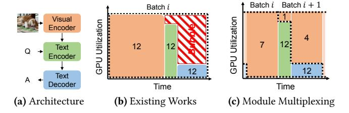

# Abstract

Multimodal learning enables models to process and reason over diverse information sources, unlocking human-like perceptual and cognitive capabilities. As such models gain adoption, e!ciently serving them on GPUs has become increasingly important. However, the modular architecture of multimodal models poses signi"cant challenges to existing unimodal serving systems, which treat models as monolithic and overlook inter-module heterogeneity. This results in severe GPU underutilization. To address this, we propose E!"!!, a multimodal serving system based on a new scheduling paradigm we call *module multiplexing*. Unlike prior approaches that execute all modules sequentially with uniform batch sizes, E!"!! schedules modality-speci"c modules concurrently on the same GPU with independently tuned batching and resource allocation. This design enables "ne-grained GPU sharing, boosting intra-GPU parallelism and improving request-level throughput. We implement a prototype of E!"!! and evaluate it on several representative multimodal models (e.g., CLIP, BLIP, LLaVA, InternVL). Our results show that E!"!! signi"cantly outperforms state-of-the-art serving systems in both throughput and GPU utilization.

## *CCS Concepts:* • Computing methodologies → Machine learning.

*Keywords:* Multimodal model, GPU multiplexing, e!cient serving system

#### ACM Reference Format:

Zicong Hong¶ Yuyan Chen† Haoyue Zhang¶ Peng Li\$, Wuhui Chen† Song Guo¶ Xiaowei Shen . 2026. E!cient Multimodal Serving via Module Multiplexing. In *European Conference on Computer Systems (EUROSYS '26), April 27–30, 2026, Edinburgh, Scotland Uk.* ACM, New York, NY, USA, [16](#page-15-0) pages. h [//doi.org/10.1145/3767295.3769389](https://doi.org/10.1145/3767295.3769389)

[This work is licensed under a Creative Commons Attribution 4.0 Interna](https://creativecommons.org/licenses/by/4.0/legalcode)[tional License.](https://creativecommons.org/licenses/by/4.0/legalcode)

*EUROSYS '26, April 27–30, 2026, Edinburgh, Scotland Uk* © 2026 Copyright held by the owner/author(s). ACM ISBN 979-8-4007-2212-7/26/04. . . \$15.00 h

Figure 1. Comparison between the existing multimodal model serving scheme and our E!"!! (i.e., module multiplexing). Each number denotes a module's batch size.

