# 1 Introduction

The rapid proliferation of Large Language Models (LLMs) has revolutionized diverse application domains [\[65\]](#page-15-1). Beyond deploying LLM in cloud-based data centers, edge deployment of LLMs is increasingly crucial to address inherent limitations of centralized approaches, including high latency, privacy vulnerabilities, and network dependency [\[17\]](#page-14-0). Consequently, enabling edge deployment of LLMs has emerged as a critical research focus, with both academia [\[6,](#page-13-0) [59,](#page-15-2) [63\]](#page-15-3) and industry [\[4,](#page-13-1) [24,](#page-14-1) [44\]](#page-14-2) actively working to accelerate the adoption of LLMs on resource-constrained edge devices.

Specifically, MoE replaces the traditional MLP module with a MoE module in the transformer architecture. However, MoE-based LLMs demand substantial GPU memory for parameter storage. For instance, the Mixtral-8x7B model [\[27\]](#page-14-3), despite activating only 14 billion parameters per token, requires 87GB of memory to store its complete set of 45 billion parameters. This poses significant deployment challenges on memory-constrained edge devices, such as the NVIDIA

∗Both authors contributed equally to this research.

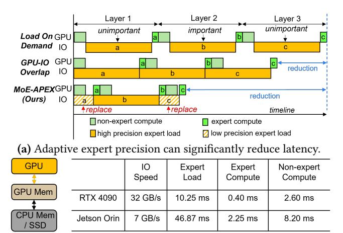

(b) Execution time in different parts for one expert in Mixtral-8x7B.

Figure 1. MoE inference timeline and execution costs.

Jetson AGX Orin with its 32GB memory capacity. Expertoffloading techniques address this limitation by keeping only part of the parameters in memory, leveraging the sparse activation patterns inherent in MoE.

The core principle behind expert-offloading systems involves maintaining all non-expert weights and a subset of critical experts in GPU memory (the "expert cache"), while relegating remaining experts to CPU memory or SSD (the "next-level memory"). However, as illustrated in Figure [1-](#page-1-0)(a), traditional approaches primarily rely on load-on-demand and GPU-IO overlap, which fail to fully address latency challenges due to significant loading delays that cannot be completely hidden by computation overlap. Figure [1-](#page-1-0)(b) further quantifies these issues, showing that loading a single expert (336MB in float16) on a memory-constrained device, such as the Jetson Orin, is approximately 20× slower than GPU computation and 5× slower than non-expert processing.

To fundamentally address this performance bottleneck, we propose a novel adaptive precision approach for expert loading. Our key insight is that not all experts contribute equally to model outputs, making it possible to selectively replace less critical experts with low-precision variants during cache misses. This approach promises significant reductions in loading time while maintaining model accuracy. However, implementing adaptive precision expert loading introduces several fundamental challenges that require systematic redesign across the entire MoE inference stack:

Dynamic Expert Importance Assessment. Determining which experts can be safely loaded in lower precision represents a critical challenge in adaptive precision systems. Existing approaches either rely on offline static profiling to determine expert bit-widths (EdgeMoE [\[60\]](#page-15-4), MC-MoE [\[22\]](#page-14-4)), lacking flexibility across diverse inputs, or aggressively skip experts (AdapMoE [\[66\]](#page-15-5)), causing accuracy degradation with small top-k values. An online dynamic

mechanism is needed to assess expert importance at runtime and make fine-grained precision decisions without adding significant computational overhead.

Optimized Prefetching for Mixed-Precision Experts. Conventional prefetching techniques face substantial challenges in the context of mixed-precision experts. Existing methods like MoE-Infinity [\[58\]](#page-15-6), MoE-Offloading [\[13\]](#page-14-5), and Pre-gated MoE [\[25\]](#page-14-6) attempt to predict which experts will be needed in subsequent layers, but achieve limited benefits because they fail to account for the significant imbalance between expert-loading cost and GPU computation time. In an adaptive precision context, the challenge becomes even more complex, requiring greater foresight to fully leverage the benefits of adaptive precision expertise.

Precision-Aware Cache Management. Traditional cache replacement policies are ill-suited to handle the unique characteristics of mixed-precision expert caching. For instance, the least frequently used (LFU) policy, employed in previous works [\[58,](#page-15-6) [60\]](#page-15-4), tracks the usage frequency of each expert but overlooks the varying loading costs associated with highand low-precision experts. This results in suboptimal performance when loading experts of different precisions.

In response to these challenges, we present MoE-APEX, a system designed to accelerate expert loading across three levels of MoE computation. As shown in Figure [1-](#page-1-0)(a), MoE-APEX significantly accelerates MoE-based LLM inference on memory-limited devices by dynamically replacing unimportant experts with low-precision versions. Our architecture maps directly to the natural hierarchy of MoE computation: at the token level, a Dynamic Expert Loader assesses importance through gating outputs; at the layer level, an Adaptive Expert Predictor leverages similarity between consecutive layers for efficient prefetching; and at the sequence level, a Cost-aware Cache Manager implements optimized caching policies. These modules work in concert to minimize expert loading latency while maintaining model accuracy, enabling efficient deployment of large-scale MoE models on resource-constrained edge devices. The key contributions are summarized as follows:

- We propose a token-level dynamic expert loading mechanism that reduces latency through low-precision replacement of less critical cache-miss experts, maintaining accuracy and flexibility.
- We introduce a layer-level adaptive expert prefetching technique with high prediction accuracy, leveraging mixed-precision prefetching to optimize computationcommunication overlap.
- We develop a sequence-level cost-aware expert caching policy that combines model-specific locality characteristics with mixed-precision features to efficiently manage the expert cache and minimize miss penalties.
- We implement MoE-APEX on top of Llama.cpp with 8,500 additional lines of C++/C code, and evaluate it on

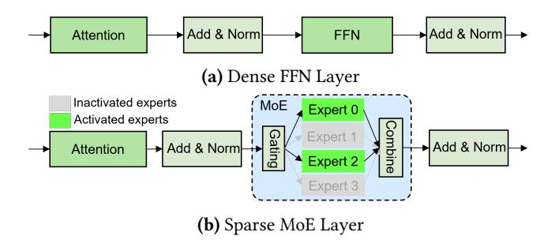

Figure 2. Comparison between different LLM architectures.

four popular MoE-based LLMs across three memory-limited platforms, demonstrating up to 9.75× speedup in decoding over state-of-the-art systems.

## 2 Background and Motivation

#### 2.1 Background

**Sparse MoE Layer**. Due to the effectiveness of the MoE architecture [26], numerous MoE-based models [12, 21, 51] have emerged. In this work, we focus on the most widely used sparse MoE layer [45], which employs multiple FFNs (Feed-Forward Networks) as experts. As shown in Figure 2, unlike dense layers, the MoE layer uses a gating function to select the K most relevant experts (2 in the figure) for each input token, aggregating their outputs. For an input x, the output y of the MoE module can be formulated as:

$$y = \sum_{i=1}^{K} G(x)_{e_i} E_{e_i}(x)$$
 (1)

where  $e_i$  is the *i*-th selected expert in the current layer,  $G(x)_{e_i}$  represents the gating weight of expert  $e_i$ , and  $E_{e_i}(x)$  is the output of expert  $e_i$ . The gating function G(x) is typically implemented using a linear layer followed by a Top-k operation [10, 15, 27, 50].

Expert Offloading. Parameter-offloading techniques typically transfer part of the model's parameters to CPU memory or SSDs when GPU memory is insufficient [3]. However, most offloading systems, such as Zero-Infinity [43] and Accelerate [20], are designed for dense LLMs and load model parameters layer-by-layer on demand. This approach overlooks the sparse activation nature of MoE models, resulting in substantial latency. For instance, loading a layer (approximately 2.7 GB) of the Mixtral-8x7B model from CPU memory via a PCIe 4.0 link (32GB/s) takes approximately 80ms, while computing it on an RTX 4090 GPU requires only about 3ms.

To address this issue, some studies have developed expert-offloading, a specialized form of parameter-offloading tailored to the sparse activation characteristic of MoE [13, 28, 58]. As shown in Figure 3-(a), this technique typically considers two levels of hardware memory: GPU memory stores all non-expert weights, a subset of "hot experts" (expert cache), and internal activations, while other experts are offloaded to

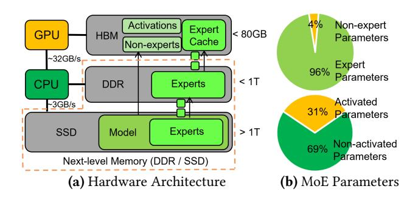

**Figure 3.** Expert-offloading on hardware architecture and model parameter distribution for Mixtral-8x7B.

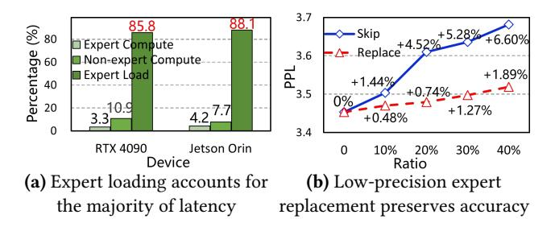

Figure 4. Analysis of expert loading acceleration chances.

CPU memory or SSD and loaded on demand. This approach is effective because of the sparse activation pattern in MoE models, where each token requires all non-expert weights but only a fraction of the experts. As illustrated in Figure 3-(b), non-expert weights account for only 4% of the Mixtral-8x7B model, and only 31% of the parameters are activated per token. Despite the effectiveness, existing expert-offloading techniques still incur high latency due to on-demand loading. While some of the works focus on optimizing prefetching techniques and cache replacement policies to accelerate inference speed, they remain constrained by the significant cost of expert loading during cache misses.

#### 2.2 Motivations

We identify two key observations that motivate our work: **Expert loading dominates inference cost.** To quantify the bottlenecks in MoE model inference, we measured the time costs of different operations when running a Mixtral-8x7B layer on two memory-limited edge devices: an RTX 4090 (representing an edge server) and a Jetson Orin (representing an end device). As shown in Figure 4-(a), expert loading dominates the total inference time, consuming approximately 85.8% on the RTX 4090 and 88.1% on the Jetson Orin, while computation accounts for only a small fraction. While prefetching is commonly used to accelerate offloading by overlapping computation with data loading, its benefits are severely limited in MoE models due to this disproportionate time distribution. Some researchers have attempted to

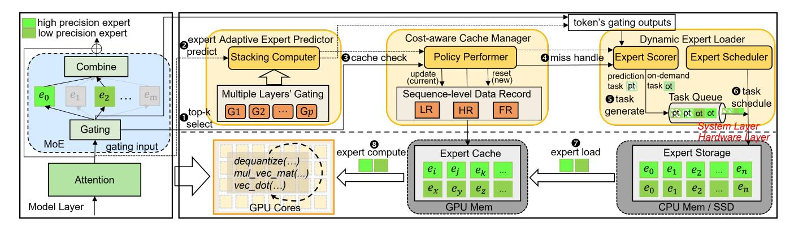

Figure 5. System overview of MoE-APEX.

address this by employing dynamic gating to limit the number of experts loaded [33, 66]. However, this approach comes with significant accuracy trade-offs. As shown in Figure 4-(b), the "Expert Skip" method results in notable degradation of model performance, with a 10% expert skip rate causing more than a 1% increase in perplexity (PPL).

Mixed precision expert preserves model accuracy. Quantization is an effective method for reducing model parameter size, but directly quantizing the entire model can result in substantial accuracy loss. In MoE models, different experts have varying levels of importance [30, 60, 66], so quantizing only the less important experts minimally impacts accuracy. As shown in Figure 4-(b), compared to skipping some experts, replacing them with low-precision versions better maintains model accuracy, and the gap between skipping and replacing grows as the ratio increases. In particular, when fewer than 20% of the experts are quantized, model performance declines by no more than 1%. Thus, applying quantization to low-importance experts in expert-offloading techniques can significantly reduce expert-loading cost. Specifically, if a required expert is not available in GPU memory and its importance is low, we can fetch a lower-precision version to replace it, thereby greatly reducing loading time. For instance, replacing a float16 expert with an int2 version can achieve up to a 8× speedup in the loading process.

These observations motivate the need for a system that can dynamically manage expert precision during inference while maintaining model accuracy.

#### 3 MoE-APEX System

#### 3.1 Overview of MoE-APEX

MoE-APEX is an Adaptive Precision EXpert offloading system designed for the inference of MoE-based LLMs on memory-limited devices. It incorporates three-level innovations: (i) a token-level dynamic expert loading mechanism that selects the appropriate precision expert from CPU memory or SSD; (ii) a layer-level adaptive expert prefetching technique

that provides highly accurate prefetching decisions for subsequent layers; and (iii) a sequence-level cost-aware expert caching policy that explores the locality characteristics of MoE models along with the unique features of the mixed precision experts. As shown in Figure 5, MoE-APEX consists of three main modules built upon these mechanisms: Dynamic Expert Loader, Adaptive Expert Predictor, and Cost-aware Cache Manager. The three-level design of MoE-APEX directly maps to the natural hierarchy of MoE computation, ensuring comprehensive optimization.

When executing a MoE layer on the GPU, the system first ① selects the top-k required experts (referred to as ondemand experts) for MoE computation based on the gating outputs. Simultaneously, the Adaptive Expert Predictor ② predicts the experts needed for subsequent layers (referred to as prediction experts) using its Stacking Computer, based on the current gating input. The Cost-aware Cache Manager then ③ checks if the required experts are present in the expert cache and updates (for the current processing sequence) or resets (for a new coming sequence) the data record with its Policy Performer. If all on-demand experts are present in the cache, ③ the expert computation is performed on GPU cores.

If any on-demand or prediction experts are missing from the cache, the Dynamic Expert Loader uses the Expert Scorer to **4** handle the cache miss based on the gating outputs of the current processing token. The Expert Scorer dynamically **6** generates the corresponding loading tasks with varying precision requirements, adding them to the Task Queue. The Expert Scheduler module in the Dynamic Expert Loader **6** then fetches tasks from the Task Queue and **7** loads the corresponding experts from the Expert Storage into the Expert Cache. If necessary, the Cost-aware Cache Manager will replace older experts in the cache based on the proposed caching policy. The system waits for all on-demand expert loading tasks to complete before **3** computing the outputs of the experts for the MoE module and advancing to the next layer. This process efficiently handles expert cache misses and accelerates inference by reducing expert-loading costs through the use of adaptive precision experts.

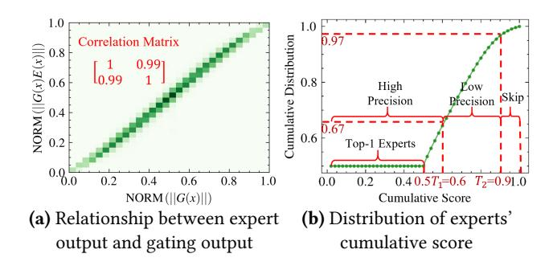

Figure 6. Gating output statistics of Mixtral-8x7B.

#### 3.2 Token-level Dynamic Expert Loading

Loading low-precision experts during cache misses effectively mitigates expert loading latency, as demonstrated in Section 2.2. However, to preserve model accuracy, this replacement should target only less important experts. While model profiling on specific datasets can identify expert importance, this static approach is impractical for diverse deployment environments. Instead, we need a dynamic method to assess expert importance based on runtime inputs during the LLM's generation process.

**Expert importance estimation.** Based on the computing pattern of the MoE module in Equation (1), expert  $e_i$ contributes  $G(x)_{e_i} E_{e_i}(x)$  to the output y. We can represent the influence of expert  $e_i$  on the output using the magnitude  $||G(x)_{e_i}E_{e_i}(x)||$  (where  $||\cdot||$  denotes magnitude), as a smaller magnitude implies that the values in the tensor are closer to zero. Since  $E_{e_i}(x)$  cannot be computed without the weight of expert  $e_i$ , we approximate  $||G(x)e_iE_{e_i}(x)||$  using  $||G(x)_{e_i}||$ . This approximation is based on our observation that  $||G(x)_{e_i}||$  and  $||G(x)_{e_i}E_{e_i}(x)||$  are positively correlated. To confirm this positive relationship, we collected both the expert output ||G(x)E(x)|| and the gating output ||G(x)||from the Mixtral-8x7B model. After normalizing the data, we compute the Pearson correlation coefficient matrix and plot a heatmap to visualize their relationship. As shown in Figure 6-(a), the two variables exhibit a strong positive correlation, with a coefficient of 0.99.

**Takeaways:** We can leverage ||G(x)|| as a computationally efficient proxy for expert importance, given its strong positive correlation with ||G(x)E(x)||.

**Expert loader design.** Based on the observations above, we first rank the selected K experts in descending order of  $||G(x)_{e_i}||$  (where a larger i corresponds to a smaller  $||G(x)_{e_i}||$ , and ||G(x)|| values are normalized). Next, we calculate the cumulative score  $s_{e_i}$  for each expert  $e_i$  as follows:

$$s_{e_i}(x) = \begin{cases} \sum_{j=0}^{i-1} ||G(x)_{e_j}||, & i > 0\\ 0, & i = 0 \end{cases}$$
 (2)

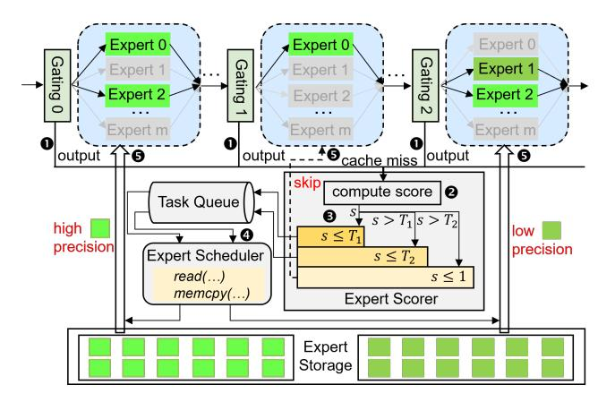

Figure 7. Token-level Dynamic Expert Loader.

where x is the gating input of current processing token. This score will determine whether the expert is replaced with a low-precision version. Specifically, we set a threshold  $T_1$  (where  $0 \le T_1 \le 1$ ): if  $s_{e_i} \le T_1$ , we consider the expert important and load the high-precision version; otherwise, we opt for the low-precision version to reduce loading overhead due to its minimal influence on the output. Notably, we always treat the first expert ( $e_0$ ) as important, keeping it in high precision to maintain model accuracy.

Based on the cumulative score, we implement the Dynamic Expert Loader as illustrated in Figure 7. To increase flexibility, we introduce a second threshold  $T_2$ , allowing the system to bypass less important experts. As shown in Figure 7, when **0** a cache miss occurs, the Expert Scorer module 2 computes the scores of the missed experts and generates appropriate tasks based on these scores, 3 adding them to the Task Queue. The Expert Scheduler then **4** fetches tasks from the queue and **6** loads the corresponding precision experts from expert storage via system calls, such as read(...). For instance, in the figure, Gating 0 retrieves a high-precision expert due to its high importance, Gating 1 skips an expert deemed of very low importance, and Gating 2 fetches a low-precision expert for moderate importance. To select the threshold values, we can profile the score distribution of all experts. As depicted in Figure 6-(b), we set  $T_1 = 0.6$  and  $T_2 = 0.9$  for the Mixtral-8x7B model, dividing the experts into three groups: 67% in high precision, 30% in low precision, and 3% to skip. This configuration maintains model accuracy while significantly reducing expert-loading costs. Due to Mixtral-8x7B's top-2 selection mechanism, all top-1 experts (50% of selections) receive scores of 0 and remain in the high-precision group.

With this method, MoE-APEX can dynamically load experts with the appropriate precision based on the current input when a cache miss occurs, significantly reducing expert-loading latency while maintaining both model accuracy and deployment flexibility.

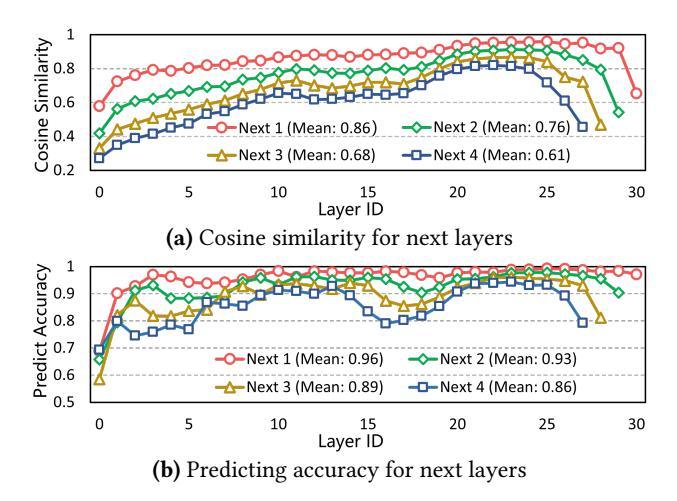

Figure 8. Cosine similarity and predicting accuracy across layers of Mixtral-8x7B, where "Next i" refers to the next -th layer from the current layer.

#### 3.3 Layer-level Adaptive Expert Prefetching

To fully leverage the benefits of overlapping communication with computation, we require a highly accurate method for prefetching mixed precision experts for subsequent layers. Due to the layer-by-layer structure of LLMs, we can explore the similarities between model layers to design the method.

Similarity between layers. Due to the residual structure in LLMs, hidden states across consecutive layers exhibit significant similarity [\[5,](#page-13-5) [29,](#page-14-16) [39\]](#page-14-17). This suggests that the inputs to the gating function in the MoE module also share high similarity across successive layers. As shown in Figure [8-](#page-5-0)(a), the cosine similarity of gating inputs between two consecutive layers (labeled as "Next 1" in the figure) is notably high in the Mixtral-8x7B model. In fact, even the inputs for the next two and three layers exhibit considerable similarity. As a result, we can leverage the gating input from the current layer to predict the required experts for subsequent layers. Figure [8-](#page-5-0)(b) demonstrates that the top-1 expert prediction accuracy for the next layer is very high, averaging 96% across layers. Even for the next two or three layers, the accuracy remains around 90% on average across all layers.

Takeaways: We can exploit the strong layer-wise similarity of gating inputs to design an accurate and efficient expert prefetching mechanism.

Expert predictor design. Based on these observations, we build the layer-level Adaptive Expert Predictor. As depicted in Figure [9,](#page-5-1) we begin by ❶ predicting the experts required for the next layer. If all predicted experts are present in the expert cache, we then proceed to predict for the subsequent layer. This process ❷ continues until either some predicted experts are missing from the cache or all predictions are completed (predicting subsequent layers per layer).

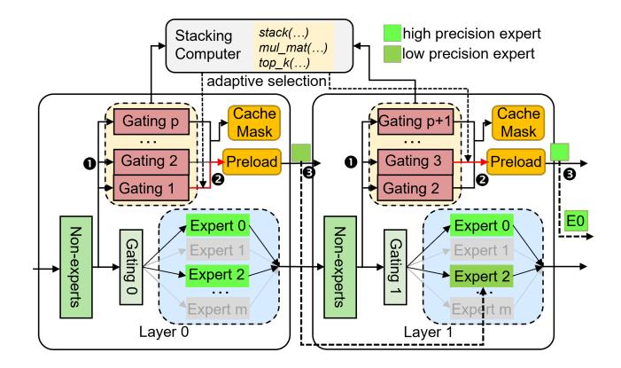

Figure 9. Layer-level Adaptive Expert Predictor.

For example, in layer 0, ❸ the expert 2 for layer 1 (gating 1) need to be preloaded, while expert 0 for layer 3 (gating 3) are preloaded at layer 1 since all predicted experts for layer 2 are already in the expert cache. Furthermore, we mask all predicted experts to prevent them from being evicted from the expert cache, as they are highly likely to be used in the subsequent layers. And we preload versions of the experts with different precision levels to facilitate faster loading.

When integrating the predictor into the system, we must consider the computational overhead of the predictor. In a naive approach, the gating function would be computed sequentially until the required experts are identified, resulting in an overhead that grows linearly with the number of gating computations. Obviously, this method is inefficient. Given that one dimension of the gating module's weight corresponds to the number of experts (typically small values such as 8, 16, or 64), we can optimize the process by stacking all gating modules together and computing them simultaneously. This approach nearly matches the computational speed of a single gating module, taking advantage of the high parallel performance offered by GPUs. Therefore, we design the Stacking Computer module to compute all gating modules at once using several tensor operations, including stacking, matrix multiplication, and top-k selection, and to adaptively select the required experts for preloading. This stacking module efficiently identifies the required experts while minimizing the prediction overhead.

In addition, enables effective prefetching requires minimizing misprediction overhead. By using overlapped, block-byblock loading with immediate termination, the worst-case overhead is limited to a single weight block load (e.g., 3–4 ms for Mixtral-8x7B), a negligible penalty given the high prediction accuracy. Overall, with this predictor, MoE-APEX can fully exploit the benefits of prefetching for mixed precision expert loading.

## 3.4 Sequence-level Cost-aware Expert Caching

To fully leverage the potential of the mixed precision expert cache, it is crucial to design an effective cache replacement

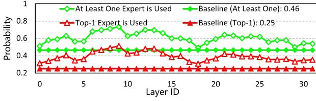

(a) Probability of experts used between two consecutive tokens

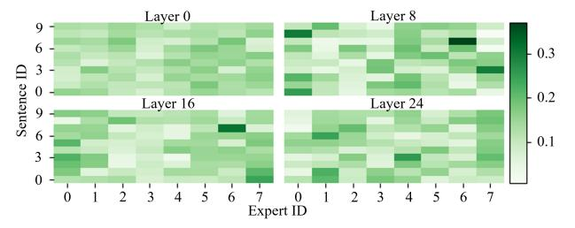

(b) Frequency of experts used in different sequences

**Figure 10.** Statistics of experts usage for Mixtral-8x7B.

policy that accounts for the varying loading costs of low-precision and high-precision experts.

Cache replacement policies. Traditionally, Least Recently Used (LRU) and LFU methods have been employed for cache management. Previous studies [13, 27] suggest that if an expert is used in the current token's forward pass, it has a higher probability of being utilized in the next token's forward pass, a behavior characteristic of LRU. As illustrated in Figure 10-(a), in the Mixtral-8x7B model, the top-1 expert used in the current token process has a significantly higher likelihood of being used in the next token process than the theoretical probability of 0.25. Additionally, the probability of reusing at least one of the two experts exceeds the theoretical 0.46.

While MoE models are typically trained with an auxiliary loss to promote uniform expert selection, the frequency of expert selection varies at the sequence level. Figure 10-(b) shows that different sequences exhibit preferences for specific experts in different layers. Therefore, a sequence-level LFU can be a possible option. Furthermore, due to the layerwise structure of these models, experts from nearer layers are more likely to be used, which we refer to as the Farthest Layer Distance (FLD) policy.

For our special mixed precision expert cache, it is necessary to define a specialized cache miss penalty rather than relying solely on the cache miss ratio to evaluate replacement policies, as experts of different precisions incur different penalties. Specifically, if an expert is missed, the cost of loading its high-precision version is C, while the cost of loading the low-precision version is only  $\frac{B_l}{B_h}C$ , where  $B_l$  and  $B_h$  represent the bit-widths of the low- and high-precision versions, respectively. Consequently, a new policy is needed to manage this mixed-precision scenario in order to minimize miss penalties effectively.

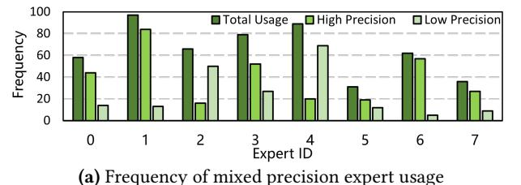

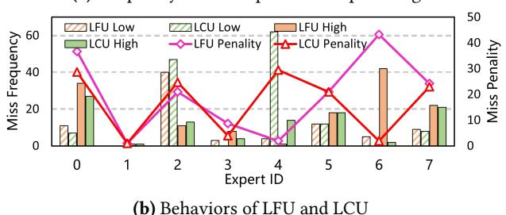

**Figure 11.** Mixed precision expert usage in one layer.

**Takeaways:** Mixed precision scenario necessitates a costaware caching policy that integrates the characteristics of LRU and sequence-level LFU.

Cache manager design. To minimize cache miss penalties in the mixed precision expert cache, we propose a costaware caching policy called Least Costly Used (LCU), which priorities experts that incur higher loading costs. Unlike LFU, LCU simultaneously tracks the usage frequencies of both the low- and high-precision versions of each expert. As shown in Figure 11-(a), the usage frequencies of low- and high-precision versions differ from one another and from the total usage frequency. To combine the costs of both the low- and high-precision versions, we define the cost  $C_t$  of expert t as follows:

$$C_t = H_t + \frac{B_l}{B_h} L_t \tag{3}$$

where  $H_t$  is the frequency of high-precision usage in the current sequence, and  $L_t$  is the frequency of low-precision usage. With this metric, LCU would prioritize expert 6 while LFU would prioritize expert 4 in Figure 11-(a), making LCU a distinct policy from LFU in this context.

Figure 11-(b) shows the performance comparison between LFU and LCU for these experts. The results indicate that LCU causes more cache misses for expert 4, especially for its low-precision version, while LFU keeps expert 4 in the cache with fewer misses. However, for expert 6, LCU assigns higher priority, resulting in fewer misses, especially for the high-precision version. Since expert 6 would causes higher costs due to its greater use of the high-precision version, LCU reduces cache miss penalties more effectively than LFU. Overall, for these experts, LCU reduces cache miss penalties by about 15% compared to LFU totally. Therefore, LCU is a more suitable policy in our specific scenario than LFU.

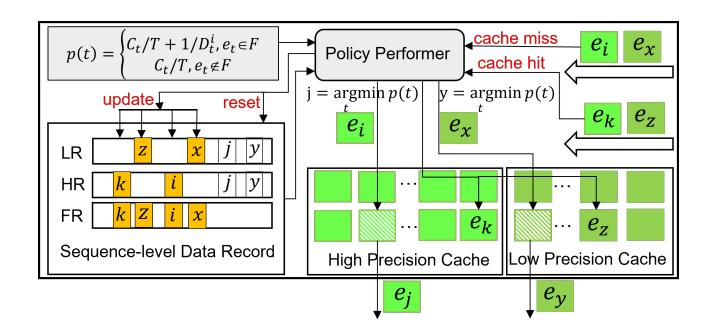

Figure 12. Sequence-level Cost-aware Cache Manager.

To leverage the observation that an expert is more likely to be used in the current forward pass if it was used in the previous one, we assign additional priority to those experts that were used in the last forward pass. Therefore, the final priority of expert t is defined as follows:

$$p_t = \begin{cases} C_t/T + \frac{1}{D_t^i}, e_t \in F \\ C_t/T, e_t \notin F \end{cases}$$
 (4)

where  $C_t$  is the cost defined in Equation (3), T is the current token number used to normalize  $C_t$ ,  $D_t^i$  is the layer distance of expert t to expert i, computed as  $(l_t - l_i + l_n)\% l_n + \delta$ . Here,  $l_i$  is the layer ID of the currently used expert i,  $l_t$  is the layer ID of expert t,  $l_n$  is the total number of layers in the model, and  $\delta$  is a small constant (0.1 in our setting) to avoid division by zero when i = t. F is the set that contains the experts used in last forward pass.

Using this equation, we can identify the expert *j* with the lowest priority in the cache, relative to the current expert i, and replace j with i. As shown in Figure 12, We build the Cost-aware Cache Manager based on this equation and data records. The Cache Manager maintains separate caches for high- and low-precision experts and a sequence-level data record to store history statistics required in Equation (4). Specifically, LR records the frequency of low-precision versions, HR records the frequency of high-precision versions, and FR contains the experts used in last forward pass. Whenever a high-precision expert  $e_i$  is added to the cache (a cache miss), the Policy Performer module in Cache Manager will update HR, and FR records and determine the lowest-priority expert  $e_i$  based on Equation (4) and the data in the record. The Policy Performer then evict  $e_i$  and replace it with  $e_i$ in the high-precision cache. Similarly, for a low-precision expert  $e_x$ , the Policy Performer performs the same operation but updates the LR instead of the HR. On a cache hit, the Policy Performer only updates the relevant records (e.g.,  $e_k$ and  $e_z$  in the figure). Additionally, at the start of each new sequence, the Policy Performer resets all records.

By fully leveraging the characteristics of MoE models and unique features of mixed expert cache, the Cost-aware Cache Manager can efficiently manage the cache and achieve lower

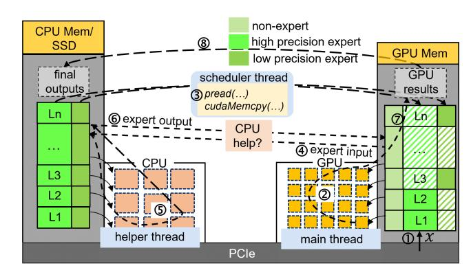

**Figure 13.** The implementation of MoE-APEX.

cache miss penalties than previous approaches, resulting in faster inference.

## 4 System Implementation

We build our system on top of Llama.cpp by modifying the distribution of model weights and computation patterns, implemented with 8,500 lines of C++/C code. The Llama.cpp system places a sufficient number of layers in GPU memory, with the remaining layers stored in CPU memory or on SSD. It processes input on the GPU using layers in GPU memory, then sends the internal activations of the last GPU-processed layer to the CPU. It continues processing with the remaining layers on the CPU, and finally gets the results. While this computation pattern works well for dense models, it is not optimal for MoE-based LLMs.

To optimize our system for MoE models, we modify the distribution of model weights. As illustrated in Figure 13, we place all non-expert weights and a portion of experts, in multiple precision versions, in GPU memory, and all expert weights reside in CPU memory or SSD. To ensure the system performs efficiently across various hardware setups, we implement two computing modes: GPU-centric computing and CPU-GPU cooperative computing.

In the GPU-centric computing mode, when 1 input x is processed, the main thread 2 handles it on the GPU using the corresponding model weights. If the required expert are not in GPU memory, the scheduler thread 3 loads the appropriate version of the expert from CPU memory or SSD through system interfaces. Once the required expert is loaded into GPU memory, the main thread 7 resumes computation and eventually 8 transfers the final results back to the CPU.

In the CPU-GPU cooperative computing mode, if the required expert is not in GPU memory, the main thread ® sends the expert's input to the CPU, where a helper thread ® processes it using the corresponding expert. The helper thread then ® sends the expert's output back to the GPU. Once receiving the data, the main thread ® continues the computation and ® copies the results back to the CPU.

Table 1. Hardware setups of three tested platforms.

|              | Jetson Orin | RTX 4090 | RTX 2080 Ti |
|--------------|-------------|----------|-------------|
| GPU Mem.     | 32GB        | 24GB     | 11GB        |
| CPU Mem./SSD | 1TB         | 256GB    | 256GB       |
| IO Speed     | 7GB/s       | 32GB/s   | 16GB/s      |
| CPU Cores    | 12          | 64       | 40          |

Table 2. Configuration of evaluated MoE models.

|                     | Mixtral-8x7B | Phi-MoE    |
|---------------------|--------------|------------|
| Total Weight Size   | 87GB         | 78GB       |
| Experts Weight Size | 84GB (96%)   | 75GB (96%) |
| Layer Number        | 32           | 32         |
| Expert Number/Layer | 8            | 16         |
| Top-K               | 2            | 2          |

|                     | DeepSeek-MoE | DeepSeekV2-Lite |
|---------------------|--------------|-----------------|
| Total Weight Size   | 31GB         | 29GB            |
| Experts Weight Size | 28GB (90%)   | 27GB (93%)      |
| Layer Number        | 28           | 27              |
| Expert Number/Layer | 64           | 64              |
| Top-K               | 6            | 6               |

While both computing modes work well for MoE models, we primarily focus on the GPU-centric computing mode, as CPU resources are typically insufficient on edge devices and are usually required by other processes.

