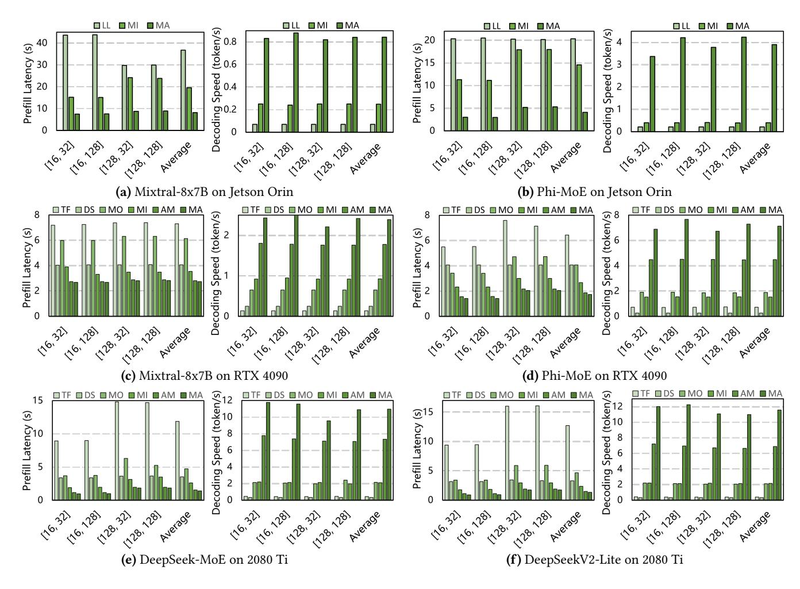

# 5 Experimental Evaluation

#### 5.1 Experimental Methodology

Hardwares. To evaluate MoE-APEX in different environments, we use three common edge devices: the NVIDIA Jetson AGX Orin [\[42\]](#page-14-18), the NVIDIA GeForce RTX 4090 [\[41\]](#page-14-19), and the NVIDIA GeForce RTX 2080 Ti [\[40\]](#page-14-20). As shown in Table [1,](#page-8-0) the Jetson Orin has 32GB of unified memory shared with its 12 CPU cores. For model weight storage, we use a Samsung NVMe SSD 980 PRO, which provides 1TB of storage with a theoretical read speed of 7,000 MB/s (approximately 3,000 MB/s in practice). The RTX 4090 has 24GB of GPU memory, 256GB of CPU memory, and 64 CPU cores. The connection between the CPU and GPU uses PCIe 4.0, offering a theoretical bandwidth of 32GB/s. The RTX 2080 Ti is equipped with 11GB of GPU memory, 256GB of CPU memory, and 40 CPU cores. Its CPU-GPU connection uses PCIe 3.0, with a theoretical bandwidth of 16GB/s.

Models. We evaluate our system using four popular MoEbased LLMs from Huggingface Hub [\[14\]](#page-14-21): Mixtral-8x7B [\[27\]](#page-14-3), Phi-MoE [\[1\]](#page-13-6), DeepSeek-MoE [\[9\]](#page-13-7), and DeepSeekV2-Lite [\[10\]](#page-13-3). As summarized in Table [2,](#page-8-1) Mixtral-8x7B employs 8 experts per layer with 2 experts activated per token, while Phi-MoE uses 16 experts per layer, also activating 2 experts per token. In contrast, the two DeepSeek models follow a more recent

Table 3. Speed (tokens/s) under different sample number.

|                 | 10   | 100  | 1,000 | 10,000 | 50,000 |
|-----------------|------|------|-------|--------|--------|
| Mixtral-8x7B    | 2.23 | 2.26 | 2.26  | 2.25   | 2.25   |
| Phi-MoE         | 6.09 | 6.15 | 6.08  | 6.14   | 6.10   |
| DeepSeek-MoE    | 9.07 | 9.24 | 9.28  | 9.25   | 9.27   |
| DeepSeekV2-Lite | 9.40 | 9.85 | 9.98  | 9.94   | 9.94   |

trend in MoE design, employing a larger number of experts per layer and a higher number of activated experts per token. Datasets. To efficiently evaluate inference speed, we select 60 high-quality samples from the 52k-sample Alpaca dataset [\[49\]](#page-15-9) as our speed test set. As reported in Table [3,](#page-8-2) varying the number of test samples has a negligible effect on measured decoding speed, validating the use of this small subset for performance comparisons. To evaluate the impact of MoE-APEX on model accuracy, we use GSM8K [\[8\]](#page-13-8), TruthfulQA [\[36\]](#page-14-22) and ARC [\[7\]](#page-13-9) as performance evaluation datasets. GSM8K is designed to evaluate a model's mathematical reasoning capabilities. TruthfulQA assesses whether a language model can generate factually accurate responses. And ARC measures a model's common sense reasoning abilities.

Baselines. We compare MoE-APEX (MA) with seven SOTA inference systems to evaluate its efficiency. (1) Transformers [\[55\]](#page-15-10) (TF), a general LLM library developed by Huggingface, offering thousands of pretrained models. (2) DeepSpeed-Inference [\[3\]](#page-13-4) (DS), a comprehensive inference system for LLMs, providing multi-GPU and heterogeneous inference solutions. (3) Llama.cpp [\[18\]](#page-14-23) (LL), an efficient LLM inference system written in pure C/C++, supporting simultaneous computation on both CPU and GPU. (4) MoE-Offloading [\[13\]](#page-14-5) (MO), a MoE-centric system that incorporates expert prediction and caching. (5) MoE-Infinity [\[58\]](#page-15-6) (MI), a system that tracks request-level processes to prefetch required experts into GPU memory. (6) AdapMoE [\[66\]](#page-15-5) (AM), an adaptive system that skips some unimportant experts to accelerate inference. (7) Fiddler [\[28\]](#page-14-13) (FD), a system that leverages CPU to process experts existed in CPU memory for minimizing data movement between the CPU and GPU.

Configurations. Due to platform differences, we use different configurations to evaluate baselines. On the RTX 4090, we employ Mixtral-8x7B and Phi-MoE with float16 precision. Since Llama.cpp and Fiddler utilize CPU computation, which follows a different computational pattern from other methods, we compare them separately for fairness. On the Jetson Orin, we use the int8 precision versions of Mixtral-8x7B and Phi-MoE, as the float16 versions are too large and slow to run due to the SSD's slow read speed. And we only evaluate Llama.cpp and MoE-Infinity on the Jetson Orin, as the other baselines don't support this device well. On the RTX 2080 Ti, we evaluate DeepSeek-MoE and DeepSeekV2-Lite using

Figure 14. Comparison of inference speed for MoE-APEX and the SOTA approaches.

float16 precision to assess system performance under configurations with a large number of experts. Furthermore, for MoE-APEX , we use int2 precision versions as replacements for both the float16 precision models and the int8 precision models to support dynamic precision expert loading.

Metrics. Since the generation process of LLMs consists of two phases (the prefill stage and the decoding stage), we use prefill latency (in seconds) and decoding speed (in tokens per second) as our performance metrics. To strengthen and diversify the results, we set four testing groups with different input and output lengths, including [16, 32], [16, 128], [128, 32], [128,128]. And we set the batch size to 1 in all cases, following prior works [\[13,](#page-14-5) [25,](#page-14-6) [30,](#page-14-15) [60\]](#page-15-4), as edge-side continuous serving scenarios often focus on single-batch inference.

