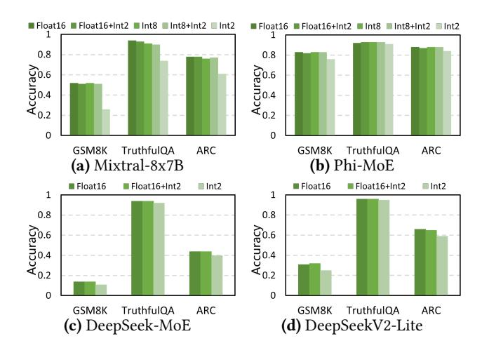
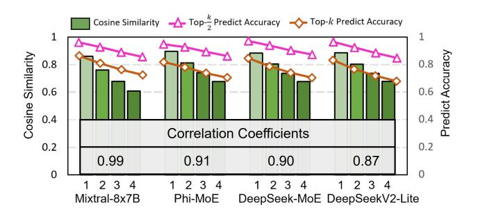
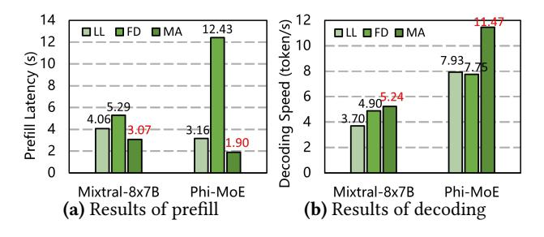
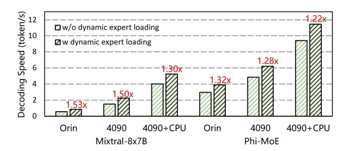
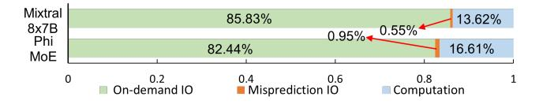
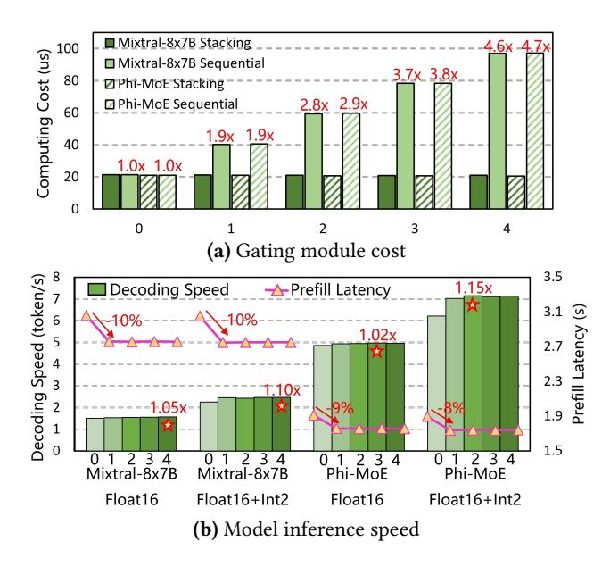
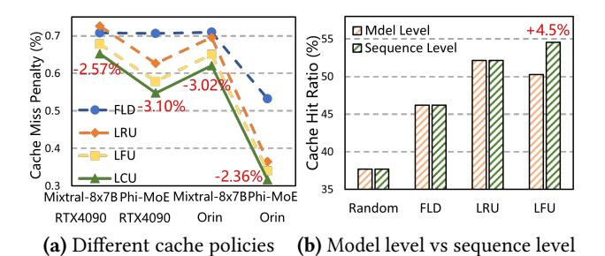

# 5.2 End-to-End Performance

To evaluate the inference speed of MoE-APEX, we conduct the experiments described before and obtain the results shown in Figure [14.](#page-9-0)

From Figure [14-](#page-9-0)(a) and (b), we can observe that MoE-APEX delivers the best performance in terms of both decoding speed and prefill latency for the evaluated models on the Jetson AGX Orin, outperforming both Llama.cpp and MoE-Infinity. Llama.cpp utilizes the mmap() interface for fast model loading, but this can result in severe page faults when there is insufficient CPU memory to store the model weights. Since Jetson AGX Orin shares memory between the CPU and GPU, allocating memory for GPU computation leaves limited memory available for the CPU, leading to performance degradation due to frequent page faults. MoE-Infinity, primarily designed for GPU servers, also faces challenges on Jetson AGX Orin due to the slower SSD read speeds. Compared to Llama.cpp, MoE-APEX achieves an average speedup of 12.0× for Mixtral-8x7B and 18.57× for Phi-MoE in decoding speed, along with a 78% and 80% reduction in prefill latency for these two models, respectively. Although MoE-APEX is built on Llama.cpp, it shows significantly greater advantages when deploying MoE-based LLMs on edge-embedded devices. In comparison to MoE-Infinity, MoE-APEX delivers

Figure 15. Model accuracy with mixed precision experts.

an average speedup of 3.36× and 9.75× in decoding speed, along with a 58% and 72% reduction in prefill latency for these two evaluated models, respectively. These improvements are largely attributed to its dynamic precision expert loading mechanism, which reduces the volume of data to be read, thereby accelerating inference speed.

On the GeForce RTX 4090, the results shown in Figure [14-](#page-9-0) (c) and (d) demonstrate that MoE-APEX again outperforms the other baselines. Transformers and DeepSpeed-Inference show poor performance compared to MoE-based systems, as they do not leverage the sparse activation feature of MoE and load model parameters layer by layer on demand. MoE-Offloading and MoE-Infinity exhibit varying performance in decoding speed depending on the model, with MoE-Infinity performing better on Mixtral-8x7B, while MoE-Offloading excels with Phi-MoE. However, MoE-Infinity consistently achieves lower prefill latency than MoE-Offloading for its good prefetching technique. While both methods surpass Transformers and DeepSpeed-Inference, they are hindered by high expert-loading latency. For example, loading two experts can take 20 ms, dwarfing the 3.4 ms required for computation (Figure [4-](#page-2-2)(a)). In contrast, AdapMoE improves performance over MoE-Offloading and MoE-Infinity by skipping unimportant experts, thereby reducing the number of experts that need to be loaded from CPU memory. However, compared to AdapMoE, MoE-APEX achieves higher decoding performance by not only skipping experts but also replacing them with lower-precision versions. This combination of skipping and replacement provides MoE-APEX with greater flexibility in reducing loading latency, whereas Adap-MoE's skip-only strategy can lead to significant accuracy degradation when too many experts are skipped. Specifically, compared with AdapMoE, MoE-APEX delivers an average decoding speedup of 1.34× for Mixtral-8x7B and 1.59× for Phi-MoE, along with prefill latency reductions of 2% and 7%.

Figure 16. Correlation coefficients, cosine similarity and predict accuracy for all models, where 1, 2, 3, and 4 indicate the next one, two, three, and four layers, respectively.

To verify that MoE-APEX remains effective with large MoE experts, we benchmark it on the RTX 2080 Ti with two DeepSeek models, which have 64 experts per layer. As shown in Figures [14-](#page-9-0)(e) and (f), MoE-APEX consistently outperforms all baselines in both prefill latency and decoding speed. Compared to the best baseline, AdapMoE, MoE-APEX achieves a 9% reduction in prefill latency and a 1.49× speedup in decoding speed for DeepSeek-MoE, and an 11% reduction and a 1.68× speedup for DeepSeekV2-Lite. These results demonstrate that MoE-APEX still works well with modern MoE architectures featuring a large number of experts.

Overall, our system achieves significant speedup compared to baselines, demonstrating its superior efficiency.

### 5.3 Model Accuracy

Since MoE-APEX replaces high-precision experts with lowprecision versions to accelerate expert loading, it is essential to verify that accuracy is not compromised. As shown in Figure [15,](#page-10-0) we report the average accuracy on GSM8K and ARC, along with the informative score for TruthfulQA. After applying the mixed-precision expert policy (the Float16+Int2 and Int8+Int2), accuracy drops by no more than 1% across all evaluated models and datasets in the three test groups of Figure [14.](#page-9-0) These results demonstrate that MoE-APEX achieves high inference speed while preserving model accuracy.

#### 5.4 Model Characteristic Analysis

To verify that all evaluated models share similar characteristics with Mixtral-8x7B, as previously described in Section [3,](#page-3-1) we analyze their key properties. First, as shown in Figure [16,](#page-10-1) the correlation coefficients follow the same trend observed in Figure [6-](#page-4-0)(a), confirming that all MoE models maintain high correlation levels similar to Mixtral-8x7B. This validates the reliability of our metric for assessing expert importance. Second, all models achieve high prediction accuracy and strong cosine similarity between layers, again aligning with the performance of Mixtral-8x7B. These results collectively demonstrate that our design generalizes well across different MoE models, confirming its robustness and applicability.

Figure 17. Inference speed for RTX 4090 + CPU setup.

#### 5.5 CPU Computation Assistant

Although we primarily focus on common GPU-centric scenarios, sometimes there are enough CPU resources to help speed up the computation. To accommodate such case, we implement a CPU-GPU cooperative computing mode to enhance system flexibility and maximize hardware resource utilization. We evaluate this computing mode using the RTX 4090 + CPU setup on Mixtral-8x7B and Phi-MoE.

From the results in Figure 17, we can observe that MoE-APEX consistently outperforms Llama.cpp in both decoding speed and prefill latency. Specifically, compared to Llama.cpp, MoE-APEX delivers a 1.42× and 1.45× speedup in decoding speed, along with a 24% and 40% reduction in prefill latency for the two evaluated models, respectively.

Fiddler demonstrates some advantages over Llama.cpp when running on Mixtral-8x7B, but exhibits similar decoding performance on Phi-MoE. However, Fiddler's prefill latency increases exponentially with the number of experts, as it explores all possible combinations (2n, where n is the number of experts per layer) to identify the optimal configuration for partitioning expert processing between the CPU and GPU. This becomes a performance bottleneck on Phi-MoE, where the number of experts is double that of Mixtral-8x7B, resulting in significantly higher prefill latency. Consequently, Fiddler is better suited for specific use cases and struggles to scale across different models and environments. In contrast, compared to Fiddler, MoE-APEX achieves a 1.07× and 1.48× speedup in decoding speed, and a 42% and 85% reduction in prefill latency for the two evaluated models, respectively.

Therefore, although CPU-GPU cooperation is not the primary use case for MoE-APEX , it still provides better performance than current systems.

### 5.6 Ablation Study

#### 5.6.1 Dynamic Expert Loading Mechanism Analysis.

To evaluate the benefits of the dynamic expert loading mechanism, we test models across all setups and averaged the results for different input and output lengths. As shown in Figure 18, using the dynamic loading mechanism provides a speedup ranging from 1.22× to 1.53× under different configurations. The highest speedup is observed when running

**Figure 18.** Inference speedup of dynamic expert loading.

Figure 19. Breakdown of inference latency (normalized).

models on the Jetson Orin device, which is due to its relatively slower data transfer speeds compared to the RTX 4090. Conversely, the lowest speedup is seen on the RTX 4090 assisted by the CPU, as in this setup, the performance gains primarily stem from CPU computing improvements with low-precision experts, rather than faster expert loading. Additionally, we observe that the Mixtral-8x7B model achieves a greater speedup than the Phi-MoE model, likely due to the larger expert sizes in the Mixtral-8x7B model. Overall, these findings suggest that the dynamic expert loading mechanism is especially advantageous in environments with slower data transfer speeds and for models with larger experts.

## 5.6.2 Adaptive Expert Prefetching Technique Analy-

sis. We begin by evaluating the stacking operation in our design. As shown in Figure 20-(a), the sequential operation time increases linearly as the number of predicting layers grows, whereas our stacking operation remains stable, validating our previous analysis. Next, we assess the benefits of the adaptive expert prefetching technique. Experiments were conducted on the RTX 4090 setup, comparing performance with and without dynamic expert loading. As illustrated in Figure 20-(b), the prefetching technique significantly improves performance during the prefill stage, reducing prefill latency by approximately 10% in all cases. During the decoding stage, the prefetching technique performs better when combined with dynamic expert loading (Float16+Int2). Specifically, without dynamic expert loading (Float16), the prefetching technique provides modest performance improvements, achieving a 1.05× speedup for Mixtral-8x7B and a 1.02× speedup for Phi-MoE. In contrast, with dynamic expert loading, the prefetching technique achieves a 1.10× speedup for Mixtral-8x7B and a 1.15× speedup for Phi-MoE. This demonstrates that the prefetching technique

**Figure 20.** Gating module cost and model inference speed with different configurations of the adaptive predictor, where 0 means no prediction, and 1, 2, 3, and 4 represent predictions for 1, 2, 3, and 4 subsequent layers, respectively.

provides greater benefits when combined with dynamic expert loading. We also find that the parameter p influences performance and our experiments suggest an optimal range of 2–4. Furthermore, we breakdown the inference latency for p=2 on the speed test set with input and output lengths of [16, 32]. As shown in Figure 19, expert loading (IO) dominates latency, accounting for over 80% in both models, whereas computation contributes less than 20%, consistent with prior observations. Moreover, the overhead (Misprediction IO) of misprediction is very small (less than 1%), far smaller than the performance benefits gained from prefetching. Overall, these results confirm the efficiency of the proposed adaptive prefetching technique.

## 5.6.3 Cost-aware Expert Caching Policy Analysis. To verify the robustness of our proposed cache replacement policy, we compared it with other commonly used policies across different settings. As shown in Figure 21-(a), LCU consistently achieves the lowest cache miss penalty (normalized against the random policy baseline, with the reduction compared to LFU highlighted, as LFU performs best among the baselines). Traditionally, LRU performs best under most cache conditions, but it performs poorly in this case due to the sequential execution mode of the layer-by-layer structure in LLMs. LFU outperforms LRU in this context, showing a reduction of 2.49% ~ 4.80% compared to LRU in cache miss penalties. Overall, LCU results in a $4.85\% \sim 7.88\%$ reduction in cache miss penalties compared to LRU and a $2.36\% \sim 3.10\%$ reduction compared to LFU. Additionally, we compared the model-level and sequence-level performance

Figure 21. Cache performance with different strategies.

Table 4. Memory overhead for evaluated models.

| <b>Total Size</b> | <b>Expert Size</b>      | Overhead                                  |
|-------------------|-------------------------|-------------------------------------------|
| 87 GB             | 84 GB                   | 10.5 GB (12%)                             |
| 78 GB             | 75 GB                   | 9.4 GB (12%)                              |
| 31 GB             | 28 GB                   | 4.7 GB (15%)                              |
| 29 GB             | 27 GB                   | 4.5 GB (16%)                              |
|                   | 87 GB 78 GB 31 GB | 87 GB 84 GB 78 GB 75 GB 31 GB 28 GB |

of different policies, as shown in Figure 21-(b). The sequence-level performance particularly affects LFU policies, where sequence-level LFU achieves a 4.5% increase in hit ratio. This behavior is expected, as the balanced loss function in the training process of MoE-based LLMs encourages an equal frequency of expert selection in a big dataset, as discussed earlier. In contrast, other policies perform similarly across both model-level and sequence-level conditions. Therefore, a sequence-level policy is particularly suitable for MoE when considering the LFU-based strategies.

#### 5.7 Overhead Analysis

MoE-APEX dynamically replaces high-precision experts with low-precision experts, which require additional CPU memory for storage. Since Int2 precision is employed, this memory overhead amounts to only 1/8 of the corresponding Float16 expert size. As shown in Table 4, the maximum memory overhead among the evaluated models does not exceed 11 GB, which is considered acceptable given that available CPU memory often extends to hundreds of gigabytes. The two DeepSeek models exhibit a slightly higher overhead ratio because their *down\_proj* weights are quantized using Int4 precision. This was necessary because the small dimensions of this particular matrix are not supported by the Int2 quantization implementation in Llama.cpp. Therefore, this overhead is not a fundamental limitation and is expected to be eliminated as quantization techniques advance.

#### 6 Related Work

**Expert-offloading systems for MoE-based LLMs.** Given the significant GPU memory requirements of MoE-based

LLMs, many systems have been developed to optimize inference on memory-constrained devices by offloading expert parameters to CPU memory or SSD. Some systems, such as fMoE [\[61\]](#page-15-11), ProMoE [\[46\]](#page-14-24), MoE-Offloading [\[13\]](#page-14-5), MoE-Infinity [\[58\]](#page-15-6), Pre-gated MoE [\[25\]](#page-14-6), and SwapMoE [\[30\]](#page-14-15), focus on optimizing prefetching techniques and cache replacement policies. Others, like EdgeMoE [\[60\]](#page-15-4) and AdapMoE [\[66\]](#page-15-5), aim to reduce expert-loading costs. Additionally, approaches such as Fiddler [\[28\]](#page-14-13) and DAOP [\[64\]](#page-15-12) leverage CPU computational power to assist in the inference process. However, these systems do not fully exploit the key characteristics of MoE-based LLMs, resulting in large expert-loading costs or big drops in model accuracy on edge devices.

Optimized inference systems for LLMs. The large size and complexity of LLMs have driven the development of various inference systems aimed at optimizing the efficiency and performance of the inference process [\[54,](#page-15-13) [56\]](#page-15-14). Some of these works focus on adaptive offloading, such as Vllm [\[31\]](#page-14-25), DeepSpeed [\[3\]](#page-13-4), Accelerate [\[20\]](#page-14-12) and Llama.cpp [\[18\]](#page-14-23), which speed up inference by offloading model weights or internal activations to alternative hardware, such as CPU memory or SSDs. Other works focus on exploiting the sparsity in LLMs to reduce computational cost and memory consumption by skipping the computation of inactive neurons. Examples include Deja Vu [\[37\]](#page-14-26), PowerInfer [\[47,](#page-14-27) [59\]](#page-15-2), and CATS [\[32\]](#page-14-28). However, these systems have primarily been designed to target dense LLMs, where all model parameters are utilized uniformly across different inputs. As a result, they often fail to exploit the unique characteristics of MoE-based LLMs [\[22\]](#page-14-4). Model compression techniques for LLMs. Model compression is a promising area of research that offers various techniques to effectively deploy LLMs in resource-constrained environments. The core idea of model compression is to reduce the size of a large model while preserving its performance. Popular compression techniques, such as model quantization [\[11,](#page-13-10) [16,](#page-14-29) [52,](#page-15-15) [57\]](#page-15-16), network pruning [\[35,](#page-14-30) [38,](#page-14-31) [39,](#page-14-17) [48\]](#page-14-32), knowledge distillation [\[2,](#page-13-11) [19,](#page-14-33) [23\]](#page-14-34), and low-rank factorization [\[34,](#page-14-35) [53,](#page-15-17) [62\]](#page-15-18), enable the creation of more resourceefficient LLMs. However, these methods only focus on algorithmic optimization, so they often overlook the practical challenges of deploying LLMs on resource-constrained devices, leading to inefficient deployments.

## 7 Conclusion

In this work, we introduce MoE-APEX, a flexible and efficient inference system for deploying MoE LLM models on memory-constrained edge devices. By addressing the high cost associated with expert loading in existing MoE inference systems, MoE-APEX enables significant speedups in inference performance. Additionally, we have integrated MoE-APEX into the Llama.cpp inference framework. This integration allows for flexible scalability across a wide range of platforms. Overall, MoE-APEX represents a significant step

forward in making complex MoE models more accessible and practical for edge computing environments.

## Acknowledgments

We sincerely thank all the anonymous reviewers for their valuable comments and feedback. This work was supported by the National Natural Science Foundation of China (No. U24A20234), the Young Elite Scientists Sponsorship Program by CAST (No. YESS20240529) and the Research Grants Council of the Hong Kong SAR, China, under Project T45-401/22- N. Xiaofeng Hou and Chao Li are the corresponding authors.

## References

- [1] Marah Abdin, Sam Ade Jacobs, Ammar Ahmad Awan, Jyoti Aneja, Ahmed Awadallah, Hany Awadalla, Nguyen Bach, Amit Bahree, Arash Bakhtiari, Harkirat Behl, et al. 2024. Phi-3 technical report: A highly capable language model locally on your phone. arXiv preprint arXiv:2404.14219 (2024).
- [2] Rishabh Agarwal, Nino Vieillard, Piotr Stanczyk, Sabela Ramos, Matthieu Geist, and Olivier Bachem. 2023. Gkd: Generalized knowledge distillation for auto-regressive sequence models. arXiv preprint arXiv:2306.13649 (2023).
- [3] Reza Yazdani Aminabadi, Samyam Rajbhandari, Ammar Ahmad Awan, Cheng Li, Du Li, Elton Zheng, Olatunji Ruwase, Shaden Smith, Minjia Zhang, Jeff Rasley, and Yuxiong He. 2022. DeepSpeed- Inference: Enabling Efficient Inference of Transformer Models at Unprecedented Scale. In SC22: International Conference for High Performance Computing, Networking, Storage and Analysis. 1–15.
- [4] Apple. 2024. Introducing Apple's On-Device and Server Foundation Models. [https://machinelearning.apple.com/research/introducing](https://machinelearning.apple.com/research/introducing-apple-foundation-models)[apple-foundation-models](https://machinelearning.apple.com/research/introducing-apple-foundation-models).
- [5] Xiaodong Chen, Yuxuan Hu, and Jing Zhang. 2024. Compressing large language models by streamlining the unimportant layer. arXiv preprint arXiv:2403.19135 (2024).
- [6] Xiangxiang Chu, Limeng Qiao, Xinyu Zhang, Shuang Xu, Fei Wei, Yang Yang, Xiaofei Sun, Yiming Hu, Xinyang Lin, Bo Zhang, et al. 2024. Mobilevlm v2: Faster and stronger baseline for vision language model. arXiv preprint arXiv:2402.03766 (2024).
- [7] Peter Clark, Isaac Cowhey, Oren Etzioni, Tushar Khot, Ashish Sabharwal, Carissa Schoenick, and Oyvind Tafjord. 2018. Think you have Solved Question Answering? Try ARC, the AI2 Reasoning Challenge. arXiv:1803.05457v1 (2018).
- [8] Karl Cobbe, Vineet Kosaraju, Mohammad Bavarian, Mark Chen, Heewoo Jun, Lukasz Kaiser, Matthias Plappert, Jerry Tworek, Jacob Hilton, Reiichiro Nakano, Christopher Hesse, and John Schulman. 2021. Training Verifiers to Solve Math Word Problems. arXiv preprint arXiv:2110.14168 (2021).
- [9] Damai Dai, Chengqi Deng, Chenggang Zhao, R. X. Xu, Huazuo Gao, Deli Chen, Jiashi Li, Wangding Zeng, Xingkai Yu, Y. Wu, Zhenda Xie, Y. K. Li, Panpan Huang, Fuli Luo, Chong Ruan, Zhifang Sui, and Wenfeng Liang. 2024. DeepSeekMoE: Towards Ultimate Expert Specialization in Mixture-of-Experts Language Models. CoRR abs/2401.06066 (2024).
- [10] DeepSeek-AI. 2024. DeepSeek-V2: A Strong, Economical, and Efficient Mixture-of-Experts Language Model. arXiv[:2405.04434](https://arxiv.org/abs/2405.04434) [cs.CL]
- [11] Tim Dettmers, Mike Lewis, Younes Belkada, and Luke Zettlemoyer. 2022. Gpt3. int8 (): 8-bit matrix multiplication for transformers at scale. Advances in Neural Information Processing Systems 35 (2022), 30318–30332.
- [12] David Eigen, Marc'Aurelio Ranzato, and Ilya Sutskever. 2013. Learning Factored Representations in a Deep Mixture of Experts. CoRR

- abs/1312.4314 (2013).
- [13] Artyom Eliseev and Denis Mazur. 2023. Fast inference of mixture-of-experts language models with offloading. arXiv preprint arXiv:2312.17238 (2023).
- [14] Hugging Face. 2024. Hugging Face Hub. [https://huggingface.co/docs/](https://huggingface.co/docs/hub/index) [hub/index](https://huggingface.co/docs/hub/index).
- [15] William Fedus, Barret Zoph, and Noam Shazeer. 2022. Switch transformers: scaling to trillion parameter models with simple and efficient sparsity. J. Mach. Learn. Res. 23, 1, Article 120 (jan 2022), 39 pages.
- [16] Elias Frantar, Saleh Ashkboos, Torsten Hoefler, and Dan Alistarh. 2022. Gptq: Accurate post-training quantization for generative pre-trained transformers. arXiv preprint arXiv:2210.17323 (2022).
- [17] Othmane Friha, Mohamed Amine Ferrag, Burak Kantarci, Burak Cakmak, Arda Ozgun, and Nassira Ghoualmi-Zine. 2024. LLM-Based Edge Intelligence: A Comprehensive Survey on Architectures, Applications, Security and Trustworthiness. IEEE Open Journal of the Communications Society (2024).
- [18] Georgi Gerganov. 2023. ggerganov/llama.cpp: Port of facebook's llama model in c/c++. <https://github.com/ggerganov/llama.cpp>.
- [19] Yuxian Gu, Li Dong, Furu Wei, and Minlie Huang. 2023. Knowledge distillation of large language models. arXiv preprint arXiv:2306.08543 (2023).
- [20] Sylvain Gugger, Lysandre Debut, Thomas Wolf, Philipp Schmid, Zachary Mueller, Sourab Mangrulkar, Marc Sun, and Benjamin Bossan. 2022. Accelerate: Training and inference at scale made simple, efficient and adaptable. <https://github.com/huggingface/accelerate>.
- [21] J.B. Hampshire and A. Waibel. 1992. The Meta-Pi network: building distributed knowledge representations for robust multisource pattern recognition. IEEE Transactions on Pattern Analysis and Machine Intelligence 14, 7 (1992), 751–769. doi:[10.1109/34.142911](https://doi.org/10.1109/34.142911)
- [22] Wei Huang, Yue Liao, Jianhui Liu, Ruifei He, Haoru Tan, Shiming Zhang, Hongsheng Li, Si Liu, and Xiaojuan Qi. 2024. Mixture Compressor for Mixture-of-Experts LLMs Gains More. arXiv preprint arXiv:2410.06270 (2024).
- [23] Yukun Huang, Yanda Chen, Zhou Yu, and Kathleen McKeown. 2022. In-context learning distillation: Transferring few-shot learning ability of pre-trained language models. arXiv preprint arXiv:2212.10670 (2022).
- [24] Huawei. 2023. Beating Google and Apple, Huawei brings large AI model to mobile voice assistant. [https://www.huaweicentral.](https://www.huaweicentral.com/beating-google-and-apple-huawei-brings-large-ai-model-to-mobile-voice-assistant/) [com/beating-google-and-apple-huawei-brings-large-ai-model-to](https://www.huaweicentral.com/beating-google-and-apple-huawei-brings-large-ai-model-to-mobile-voice-assistant/)[mobile-voice-assistant/](https://www.huaweicentral.com/beating-google-and-apple-huawei-brings-large-ai-model-to-mobile-voice-assistant/).
- [25] Ranggi Hwang, Jianyu Wei, Shijie Cao, Changho Hwang, Xiaohu Tang, Ting Cao, and Mao Yang. 2024. Pre-gated moe: An algorithmsystem co-design for fast and scalable mixture-of-expert inference. In 2024 ACM/IEEE 51st Annual International Symposium on Computer Architecture (ISCA). IEEE, 1018–1031.
- [26] Robert Jacobs, Michael Jordan, Steven Nowlan, and Geoffrey Hinton. 1991. Adaptive Mixture of Local Expert. Neural Computation 3 (02 1991), 78–88. doi:[10.1162/neco.1991.3.1.79](https://doi.org/10.1162/neco.1991.3.1.79)
- [27] Albert Q Jiang, Alexandre Sablayrolles, Antoine Roux, Arthur Mensch, Blanche Savary, Chris Bamford, Devendra Singh Chaplot, Diego de las Casas, Emma Bou Hanna, Florian Bressand, et al. 2024. Mixtral of experts. arXiv preprint arXiv:2401.04088 (2024).
- [28] Keisuke Kamahori, Yile Gu, Kan Zhu, and Baris Kasikci. 2024. Fiddler: CPU-GPU Orchestration for Fast Inference of Mixture-of-Experts Models. arXiv preprint arXiv:2402.07033 (2024).
- [29] Bo-Kyeong Kim, Geonmin Kim, Tae-Ho Kim, Thibault Castells, Shinkook Choi, Junho Shin, and Hyoung-Kyu Song. 2024. Shortened llama: A simple depth pruning for large language models. arXiv preprint arXiv:2402.02834 (2024).
- [30] Rui Kong, Yuanchun Li, Qingtian Feng, Weijun Wang, Xiaozhou Ye, Ye Ouyang, Linghe Kong, and Yunxin Liu. 2024. SwapMoE: Serving Offthe-shelf MoE-based Large Language Models with Tunable Memory Budget. In Proceedings of the 62nd Annual Meeting of the Association for Computational Linguistics (Volume 1: Long Papers), Lun-Wei Ku, Andre

- Martins, and Vivek Srikumar (Eds.). Association for Computational Linguistics, Bangkok, Thailand, 6710–6720.
- [31] Woosuk Kwon, Zhuohan Li, Siyuan Zhuang, Ying Sheng, Lianmin Zheng, Cody Hao Yu, Joseph Gonzalez, Hao Zhang, and Ion Stoica. 2023. Efficient memory management for large language model serving with pagedattention. In Proceedings of the 29th Symposium on Operating Systems Principles. 611–626.
- [32] Je-Yong Lee, Donghyun Lee, Genghan Zhang, Mo Tiwari, and Azalia Mirhoseini. 2024. CATS: Contextually-Aware Thresholding for Sparsity in Large Language Models. arXiv preprint arXiv:2404.08763 (2024).
- [33] Jiamin Li, Qiang Su, Yitao Yang, Yimin Jiang, Cong Wang, and Hong Xu. 2023. Adaptive gating in mixture-of-experts based language models. arXiv preprint arXiv:2310.07188 (2023).
- [34] Pingzhi Li, Zhenyu Zhang, Prateek Yadav, Yi-Lin Sung, Yu Cheng, Mohit Bansal, and Tianlong Chen. 2023. Merge, then compress: Demystify efficient SMoe with hints from its routing policy. arXiv preprint arXiv:2310.01334 (2023).
- [35] Yixiao Li, Yifan Yu, Qingru Zhang, Chen Liang, Pengcheng He, Weizhu Chen, and Tuo Zhao. 2023. Losparse: Structured compression of large language models based on low-rank and sparse approximation. In International Conference on Machine Learning. PMLR, 20336–20350.
- [36] Stephanie Lin, Jacob Hilton, and Owain Evans. 2021. Truthfulqa: Measuring how models mimic human falsehoods. arXiv preprint arXiv:2109.07958 (2021).
- [37] Zichang Liu, Jue Wang, Tri Dao, Tianyi Zhou, Binhang Yuan, Zhao Song, Anshumali Shrivastava, Ce Zhang, Yuandong Tian, Christopher Re, et al. 2023. Deja vu: Contextual sparsity for efficient llms at inference time. In International Conference on Machine Learning. PMLR, 22137–22176.
- [38] Xinyin Ma, Gongfan Fang, and Xinchao Wang. 2023. Llm-pruner: On the structural pruning of large language models. Advances in neural information processing systems 36 (2023), 21702–21720.
- [39] Xin Men, Mingyu Xu, Qingyu Zhang, Bingning Wang, Hongyu Lin, Yaojie Lu, Xianpei Han, and Weipeng Chen. 2024. Shortgpt: Layers in large language models are more redundant than you expect. arXiv preprint arXiv:2403.03853 (2024).
- [40] NVIDIA. 2019. GeForce RTX 2080 Ti. [https://www.nvidia.com/content/](https://www.nvidia.com/content/geforce-gtx/GEFORCE_RTX_2080Ti_User_Guide.pdf) [geforce-gtx/GEFORCE\\_RTX\\_2080Ti\\_User\\_Guide.pdf](https://www.nvidia.com/content/geforce-gtx/GEFORCE_RTX_2080Ti_User_Guide.pdf).
- [41] NVIDIA. 2024. GeForce RTX 4090. [https://www.nvidia.com/en-us/](https://www.nvidia.com/en-us/geforce/graphics-cards/40-series/rtx-4090/) [geforce/graphics-cards/40-series/rtx-4090/](https://www.nvidia.com/en-us/geforce/graphics-cards/40-series/rtx-4090/).
- [42] NVIDIA. 2024. Jetson AGX Orin Developer Kit. [https://www.nvidia.](https://www.nvidia.com/en-us/autonomous-machines/embedded-systems/jetson-orin/) [com/en-us/autonomous-machines/embedded-systems/jetson-orin/](https://www.nvidia.com/en-us/autonomous-machines/embedded-systems/jetson-orin/).
- [43] Samyam Rajbhandari, Olatunji Ruwase, Jeff Rasley, Shaden Smith, and Yuxiong He. 2021. Zero-infinity: Breaking the gpu memory wall for extreme scale deep learning. In Proceedings of the international conference for high performance computing, networking, storage and analysis. 1–14.
- [44] Qualcomm AI Research. 2023. World's first on-device demonstration of Stable Diffusion on an Android phone. [https://www.qualcomm.com/news/onq/2023/02/worlds-first](https://www.qualcomm.com/news/onq/2023/02/worlds-first-on-device-demonstration-of-stable-diffusion-on-android)[on-device-demonstration-of-stable-diffusion-on-android](https://www.qualcomm.com/news/onq/2023/02/worlds-first-on-device-demonstration-of-stable-diffusion-on-android).
- [45] Noam Shazeer, Azalia Mirhoseini, Krzysztof Maziarz, Andy Davis, Quoc Le, Geoffrey Hinton, and Jeff Dean. 2017. Outrageously large neural networks: The sparsely-gated mixture-of-experts layer. arXiv preprint arXiv:1701.06538 (2017).
- [46] Xiaoniu Song, Zihang Zhong, Rong Chen, and Haibo Chen. 2024. Promoe: Fast moe-based llm serving using proactive caching. arXiv preprint arXiv:2410.22134 (2024).
- [47] Yixin Song, Zeyu Mi, Haotong Xie, and Haibo Chen. 2023. Powerinfer: Fast large language model serving with a consumer-grade gpu. arXiv preprint arXiv:2312.12456 (2023).
- [48] Mingjie Sun, Zhuang Liu, Anna Bair, and J Zico Kolter. 2023. A simple and effective pruning approach for large language models. arXiv

- preprint arXiv:2306.11695 (2023).
- [49] Rohan Taori, Ishaan Gulrajani, Tianyi Zhang, Yann Dubois, Xuechen Li, Carlos Guestrin, Percy Liang, and Tatsunori B. Hashimoto. 2023. Stanford Alpaca: An Instruction-following LLaMA model. [https://](https://github.com/tatsu-lab/stanford_alpaca) [github.com/tatsu-lab/stanford\\_alpaca](https://github.com/tatsu-lab/stanford_alpaca).
- [50] Qwen Team. 2024. Qwen1.5-MoE: Matching 7B Model Performance with 1/3 Activated Parameters". [https://qwenlm.github.io/blog/qwen](https://qwenlm.github.io/blog/qwen-moe/)[moe/](https://qwenlm.github.io/blog/qwen-moe/)
- [51] Volker Tresp. 2000. Mixtures of Gaussian Processes. In Advances in Neural Information Processing Systems, T. Leen, T. Dietterich, and V. Tresp (Eds.), Vol. 13. MIT Press.
- [52] Hongyu Wang, Shuming Ma, Li Dong, Shaohan Huang, Huaijie Wang, Lingxiao Ma, Fan Yang, Ruiping Wang, Yi Wu, and Furu Wei. 2023. Bitnet: Scaling 1-bit transformers for large language models. arXiv preprint arXiv:2310.11453 (2023).
- [53] Xin Wang, Yu Zheng, Zhongwei Wan, and Mi Zhang. 2024. Svd-llm: Truncation-aware singular value decomposition for large language model compression. arXiv preprint arXiv:2403.07378 (2024).
- [54] Xinkai Wang, Yiming Zhuansun, Chao Li, Jing Wang, Xiaofeng Hou, Lingyu Sun, Luping Wang, and Minyi Guo. 2025. Asymserve: Demystifying and optimizing llm serving efficiency on cpu acceleration units. In International Symposium on Advanced Parallel Processing Technologies. Springer, 231–245.
- [55] Thomas Wolf, Lysandre Debut, Victor Sanh, Julien Chaumond, Clement Delangue, Anthony Moi, Pierric Cistac, Tim Rault, Rémi Louf, Morgan Funtowicz, Joe Davison, Sam Shleifer, Patrick von Platen, Clara Ma, Yacine Jernite, Julien Plu, Canwen Xu, Teven Le Scao, Sylvain Gugger, Mariama Drame, Quentin Lhoest, and Alexander M. Rush. 2020. Transformers: State-of-the-Art Natural Language Processing. In Proceedings of the 2020 Conference on Empirical Methods in Natural Language Processing: System Demonstrations. Association for Computational Linguistics, Online, 38–45.
- [56] Feiyang Wu, Zhuohang Bian, Guoyang Duan, Tianle Xu, Junchi Wu, Teng Ma, Yongqiang Yao, Ruihao Gong, and Youwei Zhuo. 2025. Token-Sim: Enabling hardware and software exploration for large language model inference systems. In International Symposium on Advanced

- Parallel Processing Technologies. Springer, 257–266.
- [57] Guangxuan Xiao, Ji Lin, Mickael Seznec, Hao Wu, Julien Demouth, and Song Han. 2023. Smoothquant: Accurate and efficient post-training quantization for large language models. In International Conference on Machine Learning. PMLR, 38087–38099.
- [58] Leyang Xue, Yao Fu, Zhan Lu, Luo Mai, and Mahesh Marina. 2024. Moe-infinity: Activation-aware expert offloading for efficient moe serving. arXiv preprint arXiv:2401.14361 (2024).
- [59] Zhenliang Xue, Yixin Song, Zeyu Mi, Le Chen, Yubin Xia, and Haibo Chen. 2024. PowerInfer-2: Fast Large Language Model Inference on a Smartphone. arXiv preprint arXiv:2406.06282 (2024).
- [60] Rongjie Yi, Liwei Guo, Shiyun Wei, Ao Zhou, Shangguang Wang, and Mengwei Xu. 2023. Edgemoe: Fast on-device inference of moe-based large language models. arXiv preprint arXiv:2308.14352 (2023).
- [61] Hanfei Yu, Xingqi Cui, Hong Zhang, and Hao Wang. 2025. fMoE: Fine-Grained Expert Offloading for Large Mixture-of-Experts Serving. arXiv preprint arXiv:2502.05370 (2025).
- [62] Zhihang Yuan, Yuzhang Shang, Yue Song, Qiang Wu, Yan Yan, and Guangyu Sun. 2023. Asvd: Activation-aware singular value decomposition for compressing large language models. arXiv preprint arXiv:2312.05821 (2023).
- [63] Peiyuan Zhang, Guangtao Zeng, Tianduo Wang, and Wei Lu. 2024. TinyLlama: An Open-Source Small Language Model. arXiv[:2401.02385](https://arxiv.org/abs/2401.02385) [cs.CL]
- [64] Yujie Zhang, Shivam Aggarwal, and Tulika Mitra. 2025. DAOP: Data-Aware Offloading and Predictive Pre-Calculation for Efficient MoE Inference. In 2025 Design, Automation & Test in Europe Conference (DATE). IEEE, 1–7.
- [65] Wayne Xin Zhao, Kun Zhou, Junyi Li, Tianyi Tang, Xiaolei Wang, Yupeng Hou, Yingqian Min, Beichen Zhang, Junjie Zhang, Zican Dong, et al. 2023. A survey of large language models. arXiv preprint arXiv:2303.18223 (2023).
- [66] Shuzhang Zhong, Ling Liang, Yuan Wang, Runsheng Wang, Ru Huang, and Meng Li. 2024. AdapMoE: Adaptive sensitivity-based expert gating and management for efficient moe inference. In Proceedings of the 43rd IEEE/ACM International Conference on Computer-Aided Design. 1–9.