# SAS: Sparse Attention Synthesizer for Efficient Language Model Inference

Yuan Zhou, Shaojie Xiang, Lingfan Yu, Zhenyu Song, Charith Mendis, Yida Wang {yazhom,shaojiex,lingfany,zhenyus,cmendis,wangyida}@amazon.com
Amazon Web Services
Santa Clara, California, USA

## **Abstract**

Modern large language models rely on attention mechanisms that attend to all tokens in a sequence, resulting in quadratic computational complexity that limits scalability. While sparse attention reduces compute and memory requirements by attending to only important tokens, implementing these techniques presents significant challenges due to the complexity of combining static and dynamic sparse patterns and optimizing key-value (KV) cache management.

To address these challenges, we present SAS, a sparse attention synthesizer that automatically generates performant sparse attention kernels for large language model inference. SAS introduces a set of primitives that effectively encapsulate both static and dynamic sparse attention mechanisms, enabling users to compose complex attention patterns through logic operators and declarative functions. The system employs a geometric-based pattern analyzer to optimize for KV caching by determining minimal cache sizes and automatically generating cache management functions. Supporting both Nvidia GPU and AWS Trainium backends, SAS demonstrates significant performance improvements: 1.10-1.22× speedup for context encoding and 2.68-2.80× speedup for token generation over FlexAttention, a state-of-the-art flexible attention kernel synthesis tool, on GPUs, and  $1.41-6.49 \times$ speedup for context encoding and 1.39-10.87× speedup for token generation over optimized dense attention on Trainium.

CCS Concepts: • Computing methodologies → Machine learning; • Software and its engineering → Compilers; Domain specific languages.

*Keywords:* Sparse Attention, Kernel Synthesis, Domain Specific Language, LLM Inference

#### **ACM Reference Format:**

Yuan Zhou, Shaojie Xiang, Lingfan Yu, Zhenyu Song, Charith Mendis, Yida Wang. 2026. SAS: Sparse Attention Synthesizer for Efficient Language Model Inference. In European Conference on Computer Systems (EUROSYS '26), April 27–30, 2026, Edinburgh, Scotland


This work is licensed under a Creative Commons Attribution 4.0 International License.

EUROSYS '26, April 27–30, 2026, Edinburgh, Scotland Uk
© 2026 Copyright held by the owner/author(s).
ACM ISBN 979-8-4007-2212-7/26/04.
https://doi.org/10.1145/3767295.3769364

Uk. ACM, New York, NY, USA, 15 pages. https://doi.org/10.1145/3767295.3769364

#### 1 Introduction

There has been an increasing adoption of transformer-based large language models (LLMs) in recent years. These models are powerful thanks to the self-attention mechanism [34], which allows the model to selectively focus on important parts of previous input tokens when producing every output token. However, vanilla self-attention is expensive because its time and space complexity grows quadratically with the input sequence length. Under the autoregressive generation scenario, key-value (KV) cache is introduced to avoid repetitively computing tokens that are already processed, reducing the time complexity of computing each output token to be linear with the number of processed tokens. However, in terms of space complexity, the memory required by the KV cache grows linearly with the number of processed tokens. For larger models, even this linear scaling is prohibitive for realistic model inference with long context.

Sparse attention is a promising approach to reducing both time and space complexity of LLM inference while maintaining model quality. The intuition behind sparse attention is that for each generated output token, the model only needs to attend to a small number of important prior tokens to get the correct result. From the compute perspective, the self-attention computation can be greatly reduced because the attention with "non-important" tokens does not need to be performed. From the memory perspective, the KV cache only needs to hold a much smaller number of tokens that are useful in the future. In addition, sparse attention masks can be used for addressing novel training scenarios where every token doesn't need to attend every other token [20]. Recent sparse attention techniques differ in the criteria of selecting important or relevant prior tokens. Some techniques employ static sparse attention patterns and choose tokens using relative position information [6, 9, 12, 21, 35, 38], while others leverage token embeddings to dynamically manage the KV cache [8, 25, 29, 32, 39]. State-of-the-art sparse attention techniques like Native Sparse Attention [37] use a combination of static and dynamic sparse attention patterns to achieve better model quality.

While sparse attention effectively reduces compute and memory costs, significant implementation gaps remain for

<span id="page-1-0"></span>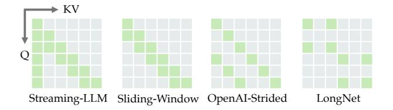

(a) Common static sparse attention patterns.

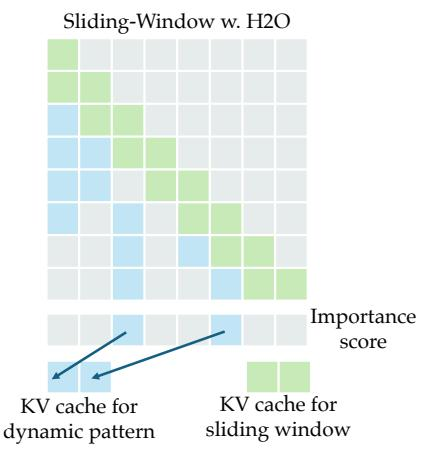

**(b)** Sliding window attention with H2O [39].

Figure 1. Examples of sparse attention patterns — (a) Static sparse attention patterns, each query token only attends to the key/value tokens indicated by the green blocks. (b) Sliding window attention with H2O that combines static and dynamic sparse attention. For each query token, green blocks indicate key/value tokens within the sliding window, while blue blocks show the key/value tokens in H2O's dynamic KV cache. An importance score for each token is maintained at run time to decide which tokens are kept in the KV cache.

deploying sparse attention in practical LLM inference scenarios. Below, we identify two major gaps and their associated technical challenges:

Gap 1: Programming abstraction – Figure 1 illustrates the attention patterns of several sparse attention techniques, each exhibiting distinct attention patterns which might be static (Figure 1a) or dynamic (Figure 1b). We use H2O [39] as a representative example of eviction-based dynamic sparse attention techniques. Under a fixed KV cache budget constraint, H2O maintains an importance score for each cached token. When processing a new token, the algorithm evaluates whether this token should replace the lowest-scoring cached token: replacement occurs if the new token's importance score exceeds that of the least important cached token, otherwise the new token is discarded. Figure 1b illustrates H2O's integration with sliding window attention, a widely adopted strategy for preserving local contextual information. In this hybrid approach, the KV cache contains two

components: a static sliding window component that maintains recent tokens, and a dynamic component managed by importance-based eviction. New tokens are first inserted into the static component of the KV cache. As tokens age out of the sliding window due to its fixed size constraint, they become candidates for insertion into the dynamic cache component, where they compete based on their computed importance scores.

In the development cycle, users need to repeatedly experiment with different techniques to optimize the trade-off between model speed and accuracy, or even create a custom sparse attention pattern for their specific use cases. Most existing sparse attention implementations are hard-coded for a few techniques. Some exceptions, like FlexAttention [14] and SPLAT [18], provides limited support to dynamic sparse attention techniques. Given that dynamic sparse attention demonstrates superior model quality compared to static approaches, the limited support for dynamic patterns significantly restricts developers' ability to meaningfully explore the full spectrum of sparse attention techniques.

The technical challenge behind this gap lies in creating a concise yet generic programming abstraction that accommodates both static and dynamic sparse attention patterns. Such an abstraction should enable users to create custom attention patterns with minimal coding overhead and intuitive reasoning, while providing a flexible mechanism for composing multiple static and dynamic patterns. Existing programming abstractions for sparse attention have notable limitations: FlexAttention requires users to write PyTorch code and reason about token indexing for attention masking, which is error-prone for complex patterns; SPLAT employs an affine-expression-based representation that imposes restrictive constraints on sparse patterns. Furthermore, neither of them supports dynamic sparse patterns.

Gap 2: KV caching optimizations — Many sparse attention techniques offer the potential to substantially reduce KV cache size and conserve device memory through their inherent sparse patterns. Unfortunately, existing sparse attention libraries like xFormers [24], FlexAttention, and SPLAT lack the capability of performing this optimization, resulting in kernels that fail to achieve memory savings over dense self-attention during token generation. As a result, optimizing KV cache management to achieve the ideal memory savings for sparse attention remains a labor-intensive and error-prone manual effort. For dynamic sparse attention techniques, users needs to implement the criteria for selecting important tokens and optimize performance for these additional computations, further extending development time.

The core technical challenge involves **automated and efficient KV cache management**. To achieve this goal, an attention synthesis tool need to automatically derive the following from the sparse attention pattern: (1) the minimum KV cache size, (2) an attention masking function to mask out invalid tokens in the KV cache, and (3) a KV cache

indexing function to correctly insert new tokens into the compressed KV cache. With sparse attention patterns becoming more complex, automating these steps becomes increasingly difficult. Many static sparse attention techniques utilize attention masks that cannot be represented as affine expressions amenable to static analysis. The incorporation of dynamic patterns further complicates the problem, as dynamic components must be seamlessly integrated into KV cache management utilities.

In response to the aforementioned challenges, we propose Sparse Attention Synthesizer (SAS), a comprehensive framework that automates the deployment of sparse attention for LLM inference. SAS addresses both technical challenges through innovative approaches to attention pattern description and analysis. For the programming abstraction challenge, SAS provides a set of composable primitives that enables developers to describe both static and dynamic sparse attention patterns with ease. To resolve the KV cache optimization challenge, SAS converts the static part of sparse attention patterns into geometric-based intermediate representations and uses an event-based simulator to derive functions for KV cache management and attention masking. For dynamic sparse attention, users can construct a chain of declarative primitives to describe the computation. SAS analyzes this description to generate optimized kernels for efficient KV cache management during inference. SAS's user interface and analysis passes are completely hardware-agnostic. To demonstrate this flexibility, we have implemented hardware backends targeting Nvidia GPUs and AWS Trainium accelerators. For each backend, SAS leverages highly optimized templates to generate performant sparse attention kernels. Our contributions are summarized as follows:

- To the best of our knowledge, SAS is the first automated tool that can generate optimized sparse attention kernels for LLM inference while supporting both static and dynamic sparse patterns.
- We propose a generic programming abstraction that allows users to compose sparse attention patterns from primitives using intuitive boolean logic operators and declarative functions.
- We present an analyzer that extracts regularity from attention patterns and automatically generates functions that handle KV cache management and compute attention masks at run time.
- We implement SAS on two distinct machine learning accelerators: NVIDIA GPUs and AWS Trainium, making it the first attention kernel synthesizer to support multiple hardware backends. SAS significantly reduces development complexity by generating performant kernels from concise pattern descriptions, eliminating the need for developers to write extensive low-level kernel code that typically spans hundreds to thousands of lines.

• Evaluation results show that on Nvidia GPU, compared with a state-of-the-art attention kernel synthesis tool, FlexAttention [14], SAS achieves 1.10-1.22× speedup for context encoding and 2.68-2.80× speedup for token generation. SAS is also able to reduce the KV cache size according to sparse patterns, while FlexAttention only skips redundant computation without compacting the KV cache. On AWS Trainium, we achieve an average speedup of 1.41-6.49× for context encoding and 1.39-10.87× for token generation, over a highly optimized dense attention baseline.

## 2 LLM Inference with Sparse Attention

In this section we provide some background information on how LLM inference works with sparse attention. We focus on modern decoder-only LLM architectures like GPT [1] and LLAMA [15].

#### 2.1 Standard LLM Inference

The basis of current LLMs is multi-head self-attention [34]. More recently, grouped-query attention (GQA) [3] was proposed to reduce the compute and memory overhead of LLMs, but the computation for each query head remains the same. Without sparse attention, the computation of each query head can be written as follows:

$$\operatorname{Attn}(Q, K, V) = \operatorname{softmax}\left(\operatorname{causal\_mask}(\frac{QK^T}{\sqrt{d}})\right)V \quad (1)$$

where Q, K, and V are each head's query, key and value embeddings projected from the input of the transformer layer, respectively. d is the size of each attention head. For decoder-only models, a causal mask is applied onto the attention scores before softmax to guarantee each token can only attend to itself and previous tokens.

An important optimization for the inference stage of decoderonly models is KV caching, where the key and value embeddings of processed tokens are stored and reused for future iterations. With KV caching, autoregressive model inference can be naturally divided into two stages. The first stage is context encoding, where the model takes a multi-token input prompt, generates one output token, and populates the KV cache with the keys and values of the input prompt tokens. The second stage is **token generation**, where the model takes the output token from the previous iteration, computes attention using this token and the content of the KV cache, updates the KV cache using the key and value embeddings of this token, and generates another new output token. The token generation stage repeats until the maximum sequence length is reached or an end-of-sequence token is generated. These two stages are also referred to as **prefill** and **decode** in other literature.

#### 2.2 Inference with Sparse Attention

Sparse attention reduces the compute and memory cost of LLM inference by selectively attending to a small set of important tokens. Conceptually, using sparse attention is equivalent to applying a special sparse mask to the attention score:

$$Attn(Q, K, V) = softmax \left( sparse\_mask(\frac{QK^{T}}{\sqrt{d}}) \right) V \quad (2)$$

Existing sparse attention techniques differ on their methods of generating this sparse mask. For techniques with static attention patterns, the sparse masks are independent to the token embeddings and can be generated using a fixed rule during model execution. For dynamic sparse attention techniques, such as H2O [39] and its variants, the mask is often derived from an importance score which is a function of the input Q, K, and V embeddings.

Effectively leveraging sparsity patterns to achieve the desired performance improvements in LLM inference presents several non-trivial implementation challenges. For context encoding, an efficient attention kernel should skip most of the computation masked out by the sparse pattern, including computing the attention score and the weighted sum with the value tensor. For token generation, the kernel must use the minimum KV cache size to save memory, and carefully manage the KV cache by generating correct KV cache index and attention mask for each input token. If the attention pattern is dynamic, the overhead of dynamically generating the attention mask must also be minimized. Manually implementing a kernel and optimizing for these goals requires substantial engineering effort. With SAS, developers just need to compose the desired sparse attention pattern using SAS's generic programming interface. SAS will automatically analyze the pattern and generate optimized sparse attention kernels.

## 3 System Overview

Figure 2 presents an overview of SAS's workflow. The only task for the user is to describe the desired sparse attention patterns using SAS's programming interface, which enables flexible composition of attention patterns by combining primitive components. As a fully automated tool, SAS handles attention pattern analysis and code generation without any user intervention beyond the initial pattern specification. For static attention patterns, SAS converts the description of the sparse attention pattern to a geometric-based polygon representation, analyzes the attention pattern to determine the optimal KV cache size, then executes an event-based simulation to derive functions for computing attention masks and KV cache indices. These functions are represented in Python Abstract Syntax Tree (AST) to facilitate code generation. For the dynamic components, SAS generates specialized functions for computing importance scores based on the userdefined criteria. SAS's programming interface and attention

pattern analyzer are completely hardware-agnostic and can be reused for different hardware targets.

<span id="page-3-0"></span>The last step is template-based code generation, which is the only hardware-dependent step of the workflow. We choose to use templates because a lot of components in the attention kernel can be shared across various sparse attention techniques. The intermediate representations generated by the pattern analysis step are lowered into formats compatible with the target hardware and inserted into the templates. In this work we target Nvidia GPU and AWS Trainium [30] as hardware backends. Our GPU backend leverages Triton [33] and CUDA [10] implementations of FlashAttention-2 [11], while for Trainium we implement optimized kernels using Neuron Kernel Interface (NKI) [5].

## 4 SAS Programming Abstraction

SAS introduces an innovative programming abstraction that enables developers to describe complex sparse attention patterns by composing basic components in a productive manner. Unlike previous approaches that require mathematical formulations of attention masking and KV cache indexing using token indices, SAS's programming abstraction is constructed upon intuitive geometric primitives. In addition, developers can easily compose the basic components to create custom static and dynamic sparse patterns. To the best of our knowledge, this is the first time such a composable and versatile abstraction is proposed for sparse attention development.

#### 4.1 Basic Sparse Attention Components

The most intuitive way of defining a sparse attention pattern is to use the attention mask during context encoding. Through a comprehensive investigation of existing sparse attention works, we identified three common basic components used to construct attention masks for sparse attention: (1) rectangle component, (2) diagonal component, and (3) dynamic component, as shown in Figure 3. Compared with the basic patterns used in MInference [21] and SPLAT [18], the basic components in SAS are more primitive and finergrained. SAS allows users to freely compose these components, thus being able to represent a wider range of sparse patterns than prior works. Below we introduce these three components in more details.

Both the rectangle and diagonal components cover areas where the attention mask is True. A **Rectangle** component defines a rectangular region that can be positioned anywhere within the attention matrix. As shown in Figure 3a, it can be customized with a stride to control the spacing between valid blocks and a stride offset to adjust the initial block position within the defined area. A **Diagonal** component covers an area in the diagonal direction of the attention matrix. Figure 3b shows several examples of using the Diagonal component to describe sliding window or causal masking.

<span id="page-4-0"></span>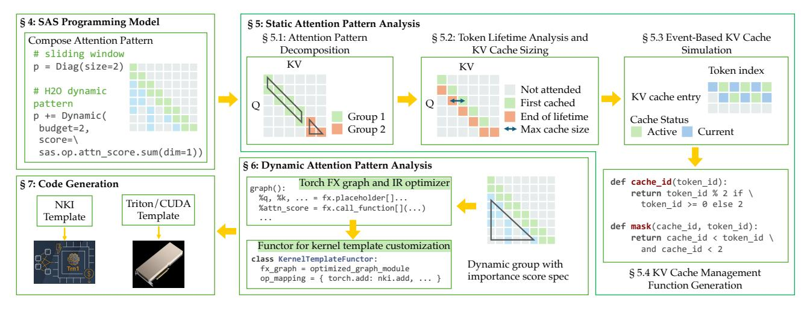

Figure 2. SAS Overall Flow.

A Dynamic component covers an area where attention mask is dynamically determined by query and key embeddings at run time. For this component, SAS currently supports token-wise importance score as described in H2O[\[39\]](#page-14-9) for attention masking and KV cache eviction, where in every iteration of token generation the least important token is evicted from the cache. When creating a dynamic component, users need to specify a maximum cache budget and describe the scheme for computing importance score. Figure [3c](#page-4-1) shows a few examples of using the dynamic component. Users can tweak the refresh mode ( in the figure) to determine how KV cache is updated when a new token is generated. When = , the KV cache preserves all past KV tokens but only loads a subset from it for each iteration, where the number of tokens loaded is determined by the cache budget . If = , the KV cache size is strictly equal to budget . In this case, tokens evicted from the cache are permanently erased and will not be attended to in later iterations.

For dynamic sparse attention, SAS provides a set of predefined operators to compute importance scores for each KV token pair, such as .attn\_score() to compute attention score from raw QK token sequence, .reduce() for tensor reduction at specified dimensions, or .pooling() to aggregate local information from previous scores. Each operator takes the output from previous one if any, update the scores and return a new score. SAS also allows users to define custom operators to compute token-wise importance scores. Figure [4](#page-5-0) shows an example of defining an operator to compute importance scores of tokens using their query token embedding and a pre-trained weight tensor provided by users. The custom op can be used along other predefined ops in SAS to calculate importance of tokens in inference. The custom operator interface enables users to define their own operators using PyTorch's native APIs, providing a generalized approach to support novel dynamic sparse patterns beyond

<span id="page-4-1"></span>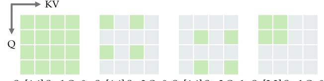

S=[4,4],St=1,O=0 S=[4,4],St=2,O=0 S=[4,4],St=2,O=1 S=[2,2],St=1,O=0

(a) Rectangle pattern — A rectangle pattern is defined by size S, stride St, and stride offset O.

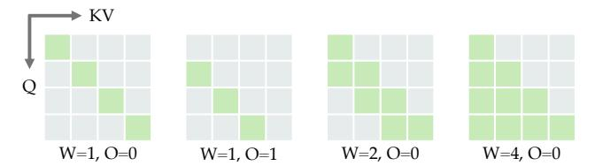

(b) Diagonal pattern — A diagonal pattern is defined by window size W and offset O.

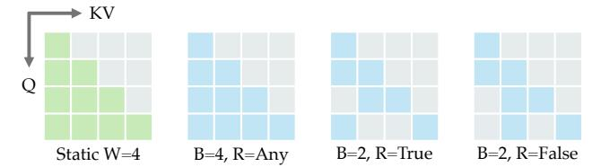

(c) Dynamic pattern (blue) attached to static pattern (green) — The dynamic pattern takes effect on top of the KV cache of the attached static pattern. Developers use cache budget B and refresh mode R to control the behavior of the dynamic pattern. When R is set to True, all prior tokens are kept in the cache but only tokens with the top-B importance score will be attended to. When R is False, tokens evicted from the cache are permanently erased.

Figure 3. Basic attention patterns in SAS.

those covered in this paper. When integrated with the aforementioned static components, it creates a comprehensive

```
1 @sas.ops.register
2 def mm_score():
3 # Symbolic inputs as torch tensors
4 q = sas.sym.active_Q
5 w = sas.sym.custom_weight(name="wgt")
6 return torch.matmul(q, w)
8 # Use custom mm_score() to compute token importance
9 p = Dynamic(budget=8, score=\
10 sas.ops.mm_score().sum(dim=1))
```

Figure 4. Building custom operator for dynamic sparse attention in SAS

<span id="page-5-1"></span>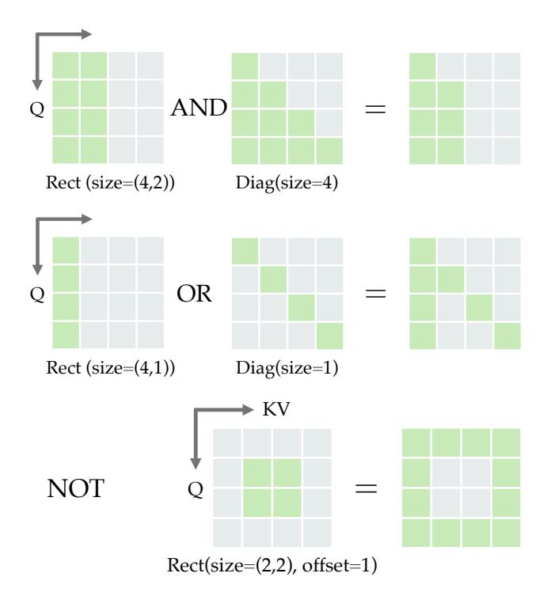

Figure 5. Examples of composing SAS's basic components with boolean logic operators.

design space that allows researchers to systematically explore and implement various sparse attention techniques within their models.

#### 4.2 Composing Sparse Attention

Programmers can perform common boolean logic operations on the basic patterns, including AND (\*), OR (+), and NOT (!), to create new sparse patterns. As shown in Figure [5,](#page-5-1) these boolean operations work in the same way as if we are directly using them on the boolean attention masks. We also introduce a spread operator (») for representing variants of block-sparse attention. The spread operator creates a new pattern from a rectangle pattern and another pattern by treating the rectangle as a unit and expanding the other pattern accordingly. Figure [6](#page-5-2) shows an example of creating

<span id="page-5-2"></span>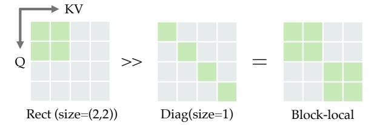

Figure 6. Block-sparse attention using spread operator.

a block-diagonal pattern, where we first define a 2×2 block pattern and then spread it across a diagonal pattern.

Figure [7](#page-6-0) shows how we define the sliding window + H2O pattern shown in Figure [1b](#page-1-0) and the strided block-local pattern from LongNet [\[12\]](#page-13-2). We can define both patterns with a few lines of code by composing basic attention patterns. In the supplementary material, we further illustrate what the user needs to write to implement the strided block-local pattern without SAS. Compared with FlexAttention, SAS provides an alternative and more intuitive way of describing the attention patterns. Without any automation, user would need to carefully reason about attention masking and KV cache indexing, then write hundreds of lines of code to implement the kernel in low-level languages like NKI [\[5\]](#page-13-10).

#### 4.3 Top-Level Interface

Once the desired sparse attention pattern is defined, it can be used to instantiate an attention kernel as shown in Figure [8.](#page-6-1) If the attention kernel takes other tensors as input, user can pass the tensors into the attention kernel by specifying a mapping from tensor names to their values. When being invoked for the first time, the kernel class analyzes the input sparse patterns to generate optimized compute schedule and kernels for hardware execution. More details for these steps will be covered in Section [5](#page-5-3) and [6.](#page-8-0) Users can directly integrate this class into existing workload without explicitly managing the KV cache or implementing sparse attention specific kernel optimizations.

## <span id="page-5-3"></span>5 Static Attention Pattern Analysis

SAS's programming abstraction describes sparse attention patterns efficiently, but it does not directly address the problem of efficient KV cache management during inference. In this section, we discuss how SAS tackles this challenge for static sparse attention. Effective KV cache management for static sparse attention depends on two functions: (1) cache index function, which determines where new token embeddings are stored in KV cache, and (2) attention mask function, which specifies the KV cache entries to use when computing attention scores. Below we explain how SAS automatically analyzes the attention pattern and generates these functions for model inference.

```
# Sliding window pattern
                                                                               # First create a diagonal pattern
p0 = Diag(offset=0, size=2)
                                                                               p1 = Diag(offset=0, size=1)
# Area covered by dynamic component
                                                                               # Then craete a rectangular block
p1 = Diag(offset=2, size=6)
                                                                               p2 = Rect(size=[4, 4])
# Add dynamic component
p2 = p1 * Dynamic(budget=2, score=\
                                                                               # Create the block local pattern
                                                                            6
                                                                               block_local = p2 >> p1
     ops.attn_score().sum(dim=1), \
     refresh=False)
                                                                               # Add stride
                                                                               strided block local = block local * \
# Compose
window w h2o pattern = p0 + p2
                                                                                 Rect(size=[8,8], stride=2, offset=1)
```

(a) Creating a sliding window + H2O pattern in SAS.

(b) Creating a strided block-local pattern in SAS.

Figure 7. Examples of composing custom sparse attention patterns using SAS's programming interface — SAS allows users to create realistic sparse attention patterns, potentially with dynamism, using only a few lines of code by composing primitive geometric components. Causal masking is omitted from the code for simplicity. (a) H2O is applied to the lower triangular area not covered by the sliding window pattern. (b) The spread operator (» in line 6) allows easy creation of block-sparse patterns. A global stride is applied on top of the block-local pattern using the logical AND operator (\* in line 8).

```
# Class signature
class SASAttnKernel(self,
```

Figure 8. Building a sparse attention kernel in SAS.

#### 5.1 Attention Pattern Decomposition

The composed sparse attention pattern can be complex and hard to analyze. Instead of analyzing the whole pattern in one shot, SAS breaks down the sparse attention pattern into smaller, more manageable groups, making it easier to reveal regularities. Internally, SAS represents attention patterns as polygon objects. Our pattern decomposition starts by analyzing the borders of the polygon and identifying all the corner points. We decompose attention patterns by making vertical cuts at the corner points and categorizing the part between every two cuts into the same group. Figure 9 shows how we decompose the attention patterns for the static part of the sliding window + H2O pattern and the strided blocklocal pattern. The diagonal pattern in sliding window H2O (static) gets split into a parallelogram and a tailing triangle, while the strided block-local pattern is decomposed to four vertical blocks with stride 2.

#### 5.2 Token Lifetime Analysis and KV Cache Sizing

Sparse attention patterns can be viewed as geometric objects, and their geometric features provide key insights into the KV cache status for each token in the sequence. In Figure 10, we present the attention matrices for the static part

<span id="page-6-2"></span>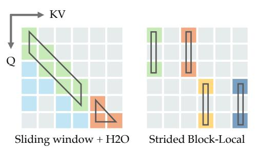

Figure 9. Decomposing static sparse attention into groups: static attention areas in same color belong to the same group, as outlined in the bounding boxes.

of sliding window + H2O and strided block-local attention, highlighting the implications for KV cache status. In these attention matrices, the color of blocks in a column indicates the lifespan of the corresponding KV embeddings. For sliding window + H2O, each column shows that a specific KV token is only attended to by current and next query token before reaching the end of its lifetime. For strided block-local attention, the first token remains in the KV cache until the attention score for the third token is calculated. Since it is not attended to by the second token, the first token is marked as inactive when the query token's index is 2.

<span id="page-6-3"></span>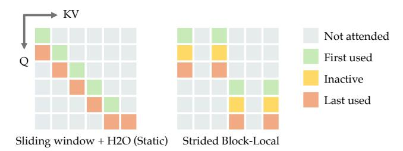

Figure 10. Token lifetime from attention geometry

The geometric features of sparse attention also reveal regularities that indicate repeating KV cache behaviors. For instance, in the sliding window + H2O (static) pattern, when

a new KV token is cached, the KV token from two positions back (if any) is at the end of its lifespan and can be evicted. These memory reuse patterns can be observed from borders of sparse attention and can help simplify KV cache management. We detail how we leverage this information to generate KV cache management functions in Section 5.3.

For a sparse attention pattern, its optimal KV cache size is determined by the maximum number of live KV tokens when processing each query token in the sequence. Deriving the optimal KV cache size requires making a horizontal cut for each Q token in the sequence and find the max length of intersection with KV token's lifespan. With decomposed attention groups, we can narrow down the search space to a smaller range by only examining the projections of all corner points of the decomposed groups onto the Q axis. Since the total number of corner points is significantly smaller than the sequence length, leveraging the decomposed groups greatly improves the scalability of our analysis.

#### <span id="page-7-0"></span>5.3 Event-based KV Cache Simulation

Dividing each attention pattern into groups of regularly shaped polygons simplifies the analysis. However, to track KV cache status during inference, we need to consider the interactions between multiple groups. For example, the KV cache allocation for subsequent groups depends on the allocation and status of the current and previous groups. To capture this, we develop an event-based KV cache simulator to track key events that represent state changes in KV cache:

- CacheStore: Store embeddings for KV tokens from certain range into the cache.
- CacheInactive: Mark certain KV cache entries as inactive for attention calculation of some Q tokens.
- CacheActive: Mark certain KV cache entries as active for attention calculation of some Q tokens.
- CacheEvict: Evict certain tokens from the KV cache when progressing through Q tokens beyond a range.

These cache events are defined by the borders of each attention group; the upper and lower borders correspond to CacheStore and CacheEvitc, while inner borders represent CacheActive and CacheInactive. These events are then added to a priority queue based on their associated token ranges.

KV Cache Simulation with Event Batching — The simulator processes these events in batches. Events with overlapping token ranges are grouped together, and each batch is processed sequentially, updating the KV cache traces. This approach, detailed in Algorithm 1, allows for efficient updates to KV cache traces by processing related events together. It's particularly necessary for patterns like sliding windows, where overlapping store and evict events allow new embedding to take cache entry that was just evicted, reducing unnecessary cache operations.

It is worth noting that simulation time correlates with sparse pattern complexity rather than sequence length. When

sparse patterns have less geometric regularity to exploit, they generate more KV cache events, increasing simulation complexity and analysis time. For example, a sliding window sparse pattern has high geometric regularity and translates to just three cache events in SAS: one CacheStore event for storing new tokens into KV cache as inference runs, one CacheEvict event for gradually removing oldest entries, and another CacheEvict event for clearing cache at inference end. As sequence length increases, the number of events remains constant; only the range within each event changes. Since simulation time depends solely on the number of cache events, the analysis time remains the same no matter how long the sequence length is.

#### <span id="page-7-1"></span>**Algorithm 1** Event-based KV Cache Simulator

```
Require: E = \{e_1, \dots, e_n\}: events with e_i.range = [x_i, y_i]
    and e_i.type \in \{\text{store}, \text{evict}, \text{active}, \text{inactive}\}
Ensure: Processed events and generated KV cache traces
 1: procedure KVCACHESIMULATOR(E)
        PQ \leftarrow PriorityQueue(E, key = (e) => e.range[0])
        cache \leftarrow new KVCache()
 3:
        while PQ is not empty do
 4:
 5:
            event \leftarrow PQ.pop()
            if not event.range overlaps lastRange then
 6:
                 cache.ProcessEvents()
                 cache.UpdateState()
 8:
 9:
            cache.RegisterEvent(e.type, e.range[0])
10:
11.
        end while
        return cache.GenerateTrace()
13: end procedure
```

Fast Tracing via Index Mapping: Algorithm 1 provides a general method for collecting KV cache traces from the geometric representation of sparse attention. However, it may encounter scalability issues with sparse attention patterns that include many non-adjacent geometric objects like the strided block-local pattern. In these cases, processing non-adjacent objects in separate batches sequentially leads to inefficiencies. To alleviate this limitation, we apply Algorithm 1 to the original mask, prior to spreading it to blocks or intersecting with striding patterns. The KV cache trace from this original mask can be represented as a simpler linear piecewise function of the token's index. We then use index mapping to derive the actual KV cache trace from the linear piecewise function that has not yet had block spreading or stride intersections applied to it. For instance, the trace of a block-sparse pattern with a block size of *B* can be obtained from the non-blocked version using the following mapping:

$$\operatorname{trace}_{b=B}(id) = \operatorname{trace}_{b=1}\left(\left|\frac{id}{B}\right|\right) \times B + id \bmod B$$
 (3)

In Figure [11,](#page-8-1) we present the derived KV cache traces from simulator for sliding window + H2O (static) and strided blocklocal attention. These traces show the storage locations of each token embedding in the KV cache and indicate which KV cache embeddings are used for attention calculations for each token in the sequence.

<span id="page-8-1"></span>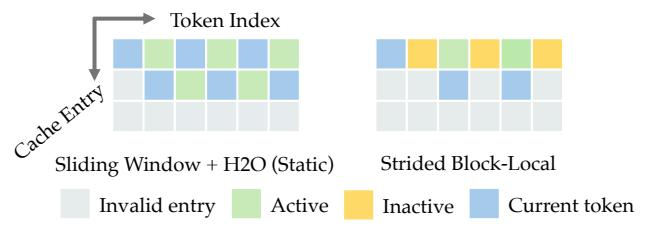

Figure 11. KV cache traces from simulation.

Active cache entries indicate that the cache holds valid KV embeddings, which are used to compute attention scores for the corresponding Q token. Inactive entries mean the KV embeddings are not used for the current Q token's attention computation but will be used later, so they are not evicted. The "current token" entry stores the computed embedding for the current token index. In the next section, we discuss how to convert these traces into AST expressions to enable efficient KV cache management at run time.

#### 5.4 KV Cache Management Function Generation

SAS analyzes KV cache traces and generates simplified functions represented in Python AST for KV cache management during inference. Two key functions are derived: (1) KV cache index function that tells which KV cache entry a specific KV token should be stored to, and (2) attention mask function that tells what KV cache entries should be included when calculating attention score for a specific Q token.

For static sparse attention, SAS generates expressions to capture the states of KV cache trace shown in Figure [11.](#page-8-1) Examples of generated expressions for sliding window + H2O (static) and strided block-local attention are shown in Figure [12.](#page-8-2) These functions distill critical information from static sparse attention, and can be directly integrated into an attention kernel for efficient KV cache management.

```
1 # Sliding window H2O. KV_CACHE_SIZE = 2
2 def cache_id_func(token_id):
3 return token_id % 2 if token_id >= 0 else -1
4 def mask_func(cache_id, token_id):
5 return cache_id <= token_id and cache_id < 2
7 # Strided block-local attention. KV_CACHE_SIZE = 2
8 def cache_id_func(token_id):
9 return token_id // 2 if token_id % 2 == 0 else -1
10 def mask_func(cache_id, token_id):
11 return cache_id <= (token_id // 2) % 2 \
12 if token_id % 2 == 0 else False
```

Figure 12. Functions for KV cache management.

## <span id="page-8-0"></span>6 Dynamic Attention Pattern Analysis

SAS adopts a compiler-driven approach to analyze the dynamic components in user-specified sparse attention patterns. This approach is necessary because these patterns exhibit runtime dynamism and are and not geometrically static, posing more challenges to predict its behavior.

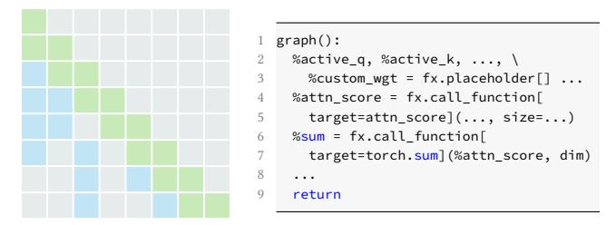

Figure 13. SAS tracing user-specified operator chain of dynamic sparse attention into torch FX graph.

Importance Score Specification Analysis — SAS traces the chain of operations specified by users into a torch FX graph, a high-level intermediate representation in PyTorch to capture and transform computational graphs. Each operator invoked in the chain is encapsulated into an individual call\_function node in FX graph. SAS then traverses the FX graph to locate patterns that are feasible for opportunistic operator fusion, e.g., fusing vector operations with activations into a single op to avoid allocating unnecessary on-chip memory.

Inter-kernel Memoization — Dynamic sparse attention involves both standard attention computations and additional calculations of importance scores needed for dynamic KV cache management. In SAS, these computations are organized into two separate kernels. One of common practice is to use attention scores as the base to derive KV importance scores [\[7,](#page-13-11) [23,](#page-14-15) [39\]](#page-14-9). In this case, the intermediate results, i.e., the row max and sum of exponentials from the FlashAttention kernel, can be memoized to avoid unnecessary recomputation. When the user-specified importance score spec starts with the attention score op, SAS leverages this characteristic and generates low-level kernel to enable inter-kernel memoization between flash attention kernel and importance score kernel.

Functor Generation for Template Customization — In the last step, SAS processes the operators in the graph and assigns the mapping from these operators to native operators for the target hardware backend. For example, when targeting AWS Trainium, SAS provides a mapping that converts operations in the optimized FX graph to library functions or low-level ISA instructions in NKI. The optimized FX graph and operator mapping are wrapped inside a functor, which is intended to be invoked from inside kernel template. Once being invoked, these operators are traced and lazily converted into native operator representation recognizable by the target hardware's compilation flow.

Dynamic KV Cache Management — SAS generates cache IDs and masking functions to manage KV cache indices and identify active tokens. Unlike static patterns where cache indices remain fixed across inference iterations, dynamic sparse attention requires real-time index calculation based on user-specified importance scores. Initially, when the dynamic KV cache budget has available capacity, cache IDs increment sequentially to accommodate new tokens while simultaneously maintaining and updating importance scores for each stored token at every iteration. Once the cache reaches its full budget, SAS transitions from this simple sequential allocation to a more sophisticated eviction-based strategy, where the token-wise importance scores are leveraged to determine which existing tokens should be removed from the cache, thereby creating space for incoming tokens while preserving the most contextually relevant information based on the user-defined scoring criteria.

