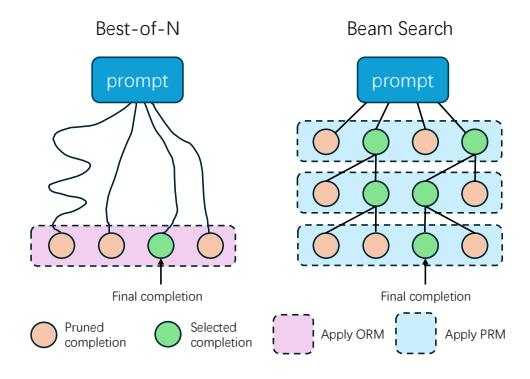
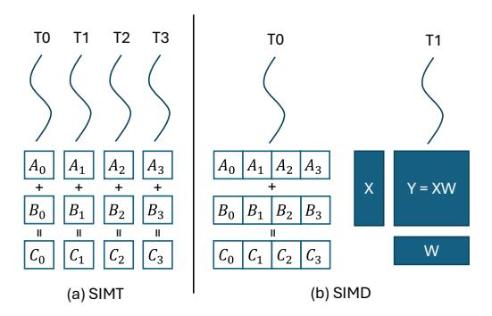
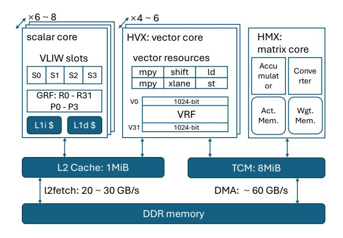
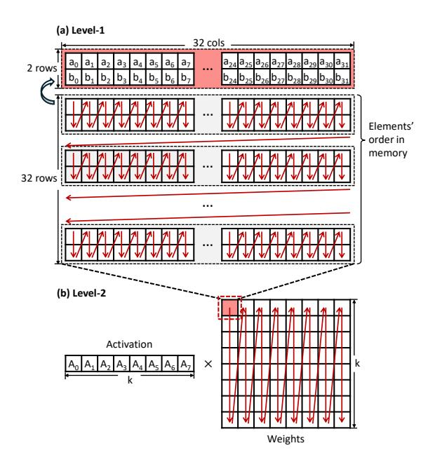

# 1 Introduction

With the advancements of commodity hardware and algorithms, deploying Large Language Models (LLMs) on mobile devices is becoming increasingly feasible. Many language models tailored for mobile devices have emerged, including Llama 3.2 [\[40\]](#page-15-1), MiniCPM [\[22,](#page-14-0) [65\]](#page-15-2), Gemma [\[51,](#page-15-3) [52\]](#page-15-4). However, these models generally underperform compared to their larger counterparts. A straightforward approach to improve model performance is to scale up the model size, yet this significantly increases memory consumption and bandwidth requirements, posing serious challenges for resourceconstrained mobile platforms.

Recently, a new paradigm named test-time scaling have introduced new opportunities to enhance LLM capabilities through increased inference-time computation. Parallel testtime scaling methods involve generating multiple paths and selecting the best sample among a number of generation candidates [\[3,](#page-13-0) [4,](#page-14-1) [23,](#page-14-2) [35,](#page-14-3) [50,](#page-15-5) [55,](#page-15-6) [57,](#page-15-7) [60\]](#page-15-8). So far, these methods are limited to cloud or offline settings where computational resources are abundant.

Intuitively, employing test-time scaling techniques to enhance LLM's generation quality on mobile devices may seem impractical. Mobile devices such as smartphones are typically considered resource-constrained, while LLM inference is known for its high resource consumption. On top of this, scaling compute resources at runtime requires even more computation.

However, recent integration of Neural Processing Units (NPUs) in mobile SoCs has begun to shift this landscape. Vendors including Qualcomm, Intel, and AMD have designed and integrated NPUs to accelerate AI workloads [\[9,](#page-14-4) [39,](#page-15-9) [48\]](#page-15-10). These NPUs not only achieve high peak computing power but also undergo rapid evolution: Qualcomm claims that its Hexagon NPU in Snapdragon X Elite delivers 45 TOPS of INT8 performance [\[25\]](#page-14-5), while recent generations of AMD NPUs have achieved 3.1× [1](#page-1-0) performance improvements [\[24\]](#page-14-6). These developments are transforming the computation capabilities of mobile devices.

We discover that mobile NPUs achieve high peak performance through dedicated matrix multiplication units that operate on large matrix tiles. However, in typical LLM inference, GEMM operations often degenerate into GEMV during the decoding phase, resulting in low hardware utilization and waste of computing capabilities of the large-tile optimized matrix units. This underutilization presents an opportunity: test-time scaling methods that increase sampling parallelism can leverage this available compute capacity without substantially adding to inference overhead.

Despite this potential, achieving efficient test-time scaling with mobile NPUs faces significant hardware challenges, which we categorize into two aspects:

Precision: Mobile NPUs were originally designed for coarse-grained quantized models and lack native support for fine-grained group quantization, which is essential for modern LLMs deployed in low bits. We observe that models quantized with conventional per-channel methods suffer severe performance degradation on reasoning tasks that are critical for test-time scaling.

Efficiency: While NPUs excel at matrix multiplication, their general-purpose vector units offer limited compute throughput and memory bandwidth. Many key non-matrix computations in LLM inference for test-time scaling must run on vector units, becoming a prominent bottleneck. Furthermore, the mismatch between the wide SIMD vector components and data granularity, coupled with the hardware's memory access limitations, makes it difficult for software to fully utilize the computing power of vector units, further exacerbating the problem.

To address these challenges, we present an end-to-end LLM inference system that leverages the abundant compute capacity of mobile NPUs to support test-time scaling workloads. To meet on-device resource constraints and precision requirements, we mainly adopt weight-only 4-bit finegrained group quantization. For the resulting efficiency challenges, our solution incorporates the following key techniques:

Hardware-aware Tile Quantization Scheme: We present a novel matrix and vector unit-aware quantization layout. Through weight layout transformations before and after quantization, we apply fine-grained group quantization on hardware-friendly tiles and align with NPU's memory access patterns, thereby minimizing runtime memory access overhead and maximizing vector compute utilization.

Efficient LUT-Based Computation: We replace complex key operations, including exponential computation in Softmax and the dequantization process in mixed precision GEMM, with efficient table lookup (LUT) instructions, alleviating computation bottleneck on the vector units.

We evaluate our system across three generations of Qualcomm Snapdragon platforms. Our proposed techniques bring up to 19.0× speedup for mixed-precision GEMM and 2.2× acceleration for Softmax compared to baselines, respectively. The results demonstrate the effectiveness of exploiting mobile NPUs for LLM test-time scaling workloads. Notably, we show that test-time scaling achieves state-of-the-art performancecost trade-offs: using test-time scaling with smaller models can match or even surpass the performance of larger models running without scaling. To the best of our knowledge, this is the first work to explore the feasibility and evaluate the trade-offs of test-time scaling methods for LLMs with NPUs on mobile devices. Our contributions are summarized as follows:

- We analyze the architecture of modern mobile NPUs and identify underutilization of the specialized matrix units during the LLM decoding phases.
- We present two techniques: a hardware-aware tile quantization scheme and LUT-based computations to accelerate LLM test-time scaling on mobile NPUs.
- We design and implement an end-to-end LLM inference system[2](#page-1-1) that leverages mobile NPUs to support test-time scaling workloads with minimal dependency on proprietary software stacks.
- We demonstrate that test-time scaling can effectively leverage otherwise wasted NPU compute capacity to enhance the generation quality of on-device small language models, achieving Pareto-frontier performance in accuracy and cost compared to traditional model scaling. It opens up new opportunities for deploying LLMs on mobile devices.

1The value is obtained by dividing the 50 TOPS of the AMD Ryzen AI 9 HX 370 NPU by the 16 TOPS of the AMD Ryzen 7 8845HS NPU.

2Our code is available at https://github.com/haozixu/llama.cpp-npu (main repo) and https://github.com/haozixu/htp-ops-lib (op library)

**Figure 1.** Two typical test-time scaling methods: Best-of-N and Beam Search.

## 2 Background

## 2.1 Scaling LLM Computation at Test-Time

Parallel test-time scaling emerges as a popular and effective new paradigm to improve model accuracy without modifying model parameters; instead, it devotes more computation at test-time. The simplest test-time scaling methods are majority-voting and self-consistency [3, 55], which are used to select the most consistent answer from multiple sets of generated samples. For math or programming problems with verifiable outcomes and domains with reward models (i.e., Outcome Reward Models), the highest scoring option can be chosen from completed sample sets, a strategy termed Best-of-N [50]. Through lookahead rollouts, methods similar to Monte Carlo Tree Search (MCTS) can select optimal paths from partially generated sequences, leading to the derivation of Process Reward Models (PRMs) [13, 43, 54, 67] that directly score intermediate results. With PRM assistance, lookahead-free step-level Beam Search [50, 57] dynamically discards low-quality generation paths to balance exploration and exploitation. Figure 1 illustrates the algorithm of two popular test-time scaling methods.

### 2.2 Neural Processing Units

With the growth of AI workloads, modern SoCs are increasingly integrating NPUs to accelerate neural network inference [9, 39, 48]. NPUs feature specialized acceleration of low-precision, computationally intensive core neural network operations (e.g., GEMM), delivering extremely high computational throughput while maintaining good power efficiency.

A widely adopted NPU architecture employs a "vector + matrix" combination, where the matrix unit accelerates operations like matrix multiplication and convolution, and the vector unit handles general-purpose computations such as normalization and complex activation functions. Well-known examples including Qualcomm's Hexagon NPU [39], Huawei's Ascend NPU [30], AMD's XDNA NPU [48], Intel NPU [9], and Intel's Gaudi HPU [10] all utilize this type

of architecture. Such NPUs differ significantly from common GPUs in their hardware execution model. As shown in Figure 2, in the GPU's SIMT model, different threads can independently perform branching, memory access, and computation, whereas in the NPU's SIMD-based execution model, a single thread operates on large vector or matrix data blocks. At the hardware level, NPUs typically employ fewer hardware threads and use VLIW architectures to reduce control logic overhead. Compared to GPUs, NPUs sacrifice programming flexibility and ease-of-use in exchange for higher execution efficiency and energy efficiency.

**Figure 2.** Comparison of (a) GPU's SIMT execution model and (b) NPU's SIMD execution model.

## 3 Motivation and Challenges

In this section, we first introduce some key features of mobile NPUs, and then analyze the opportunities of leveraging NPUs' free compute as well as the challenges in implementing efficient system for test-time scaling workloads.

## 3.1 Qualcomm's Hexagon NPU

The Hexagon NPU on Qualcomm's Snapdragon SoC is a representative mobile NPU due to its typical architecture, widespread adoption, and relatively accessible SDK. Therefore, we use it to demonstrate the core features of mobile NPUs.

3.1.1 Programming Interface. The primary approach to program Qualcomm's Hexagon NPU is through Qualcomm AI Engine Direct [47] (often referred to as QNN), a proprietary, closed-source DNN inference framework. In most cases, developers cannot customize high-performance low-level kernels even though the full LLVM toolchain for Hexagon NPU is provided in the Hexagon SDK, mainly because the instructions for the matrix unit remain undisclosed. We are able to utilize the FP16 matrix unit by reverse engineering the undocumented instructions in the binary libraries.

#### 3.1.2 Architecture.

Figure 3. Hexagon NPU Architecture.

Computation Units. The Hexagon NPU features a typical hybrid architecture of "vector + matrix". Its vector and matrix units are named HVX (Hexagon Vector eXtension) and HMX (Hexagon Matrix eXtension), respectively. The Hexagon NPU incorporates 6 to 8 scalar VLIW hardware threads for logical control. All vector or matrix instructions are issued from one of the four VLIW slots in a scalar core. The HVX unit context comprises 32 vector registers with a width of 1024 bits, and the number of such units ranges from 4 to 6. The number of HMX units is deduced to be 1 or 2.

*Memory Subsystem.* The Hexagon NPU includes a shared 1 MiB L2 cache and 8 MiB of TCM (Tightly Coupled Memory), the latter being a segment of software-managed on-chip memory. The HVX can read data from either the L2 cache or the TCM. Vector scatter/gather operations and all HMX instructions can only access TCM. Data can be loaded from DDR memory into the L2 cache and TCM via the 12fetch instruction and DMA mechanisms, respectively. Both support asynchronous transfers of 1D or 2D tensor data.

The HMX Unit. The powerful matrix multiplication capabilities of the Hexagon NPU originate from the HMX component. According to Qualcomm, the HMX unit supports various precisions, including INT4, INT8, INT16, and FP16 [39]. The following introduction is based mainly on FP16 HMX, with relevant information derived from reverse engineering, the Hexagon SDK, the QNN SDK, and publicly available information from Qualcomm.

The basic data unit for HMX operations is a tile, where each tile contains a matrix of a specific size. For FP16 HMX, a tile measures 32\*32, occupying 2 KiB of space. The HMX unit can load several tiles of weight memory and activation memory from the TCM. After performing matrix multiplication on each pair of matrix tiles, it accumulates the results into an internal accumulator. Finally, it outputs a tile corresponding to the accumulator. Meanwhile, the HMX unit can

**Figure 4.** (a) The memory layout of FP16 HMX tile. Each tile corresponds to a 32 \* 32 matrix and takes up 2048 bytes. Every two rows are permuted, having the same layout as the transposed 2 \* 32 sub-matrix. (b) The overall memory layout for HMX-based GEMM. The weight tiles are arranged in column-major layout since the hardware performs inner-product at tile level.

independently scale and add biases to each channel (column) of the output tile.

FP16 HMX tiles have a special memory layout, as shown in Figure 4 (a). Both input and output tiles follow this layout. A typical way to construct this layout is to use HVX instructions to perform cross-lane shuffling on every two adjacent rows of the original matrix.

