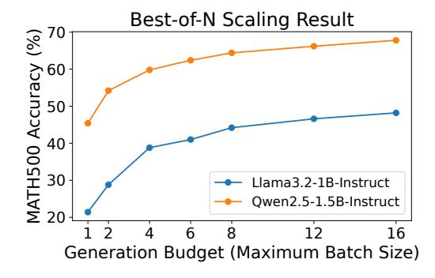

# 3.2 Opportunities: Free Matrix Computation During LLM Decoding

During the autoregressive generation process, LLM's input typically corresponds to only one token, which causes the GEMM operation to degenerate into GEMV. For example, an activation matrix of shape [1, hidden\_dim] is multiplied by a weight matrix of shape [hidden\_dim, proj\_dim]. In the case of using FP16 HMX, the effective size of each compute tile is [1,32]×[32,32]. Since the basic unit of hardware computation is a  $32 \times 32$  tile, 31 rows in the input activation tile do not correspond to actually useful content, resulting in low utilization of the matrix unit and waste of computing power.

Meanwhile, some test-time scaling algorithms can achieve better generation quality by increasing the computation during generation, including parallel sampling methods such as Self-Consistency, Best-of-N and Beam Search. Their characteristic is that they explore multiple generation paths using a batch size greater than 1 and use certain ways (e.g., an external verifier) to select the better generation paths. Figure 5 shows an example of test-time scaling using Best-of-N. As the generation budget (i.e. the maximum batch size in the decoding phase) increases, the model accuracy on the MATH500 dataset improves significantly.

Based on these, we propose running the test-time scaling workloads of LLM on mobile NPUs. In this way, the computing power of the NPU wasted during the conventional LLM generation process can be effectively leveraged. The decoding overhead will not increase significantly in theory, and the generation quality of the model can be improved at run-time without modifying the model weights.

**Figure 5.** An example of test-time scaling with two models. The accuracy on MATH500 improves as generation budget increases.

#### 3.3 Challenges

Although it is theoretically feasible to utilize mobile NPUs for test-time scaling, an efficient implementation faces numerous hardware challenges. We summarize these challenges as follows.

Insufficient Precision. Although HMX units support FP16 GEMM, deploying FP16 models on resource-constrained devices remains impractical, making quantized models the typical alternative. The matrix units in most mobile NPUs, including the HMX, were originally designed to accelerate integer-quantized DNN models that employ coarse-grained quantization schemes, such as per-tensor or per-channel quantization. As a concrete example, Hexagon NPUs lack native hardware support for the fine-grained quantization methods essential to modern LLMs. This limitation is further reflected in the software stack: QNN only supports pertensor or per-channel weight quantization. Applying coarse-grained low-bit quantization directly to LLM weights can lead to significant accuracy degradation.

As shown in Table 1, the accuracy results of the Llama 3.2 1B-Instruct model under QNN's per-channel quantization3 and AWQ per-group 4-bit quantization (both under W4A16 settings) indicate that the per-channel quantized model suffers severe performance degradation in challenging mathematical reasoning tasks. Unfortunately, since test-time scaling methods are applied in such tasks, the baseline accuracy achieved by QNN fails to meet even the minimal requirements for performance scaling.

| dataset      | AutoAWQ (W4A16) | QNN (W4A16) |
|--------------|-----------------|-------------|
| MATH500 (†)  | 15.9            | 2.1         |
| GSM8K (↑)    | 32.6            | 3.4         |
| Wiki PPL (↓) | 19.42           | 28.99       |

**Table 1.** Comparison of Llama3.2-1B-Instruct's performance under different implementation. QNN's quantization drastically hurts model's reasoning ability.

Weak General Purpose Compute and Memory Bandwidth. In the absence of native hardware support for finegrained group quantization, a common approach is to rely on general-purpose computing units to handle such computations. However, we discover a significant gap between the compute and memory access capabilities of the generalpurpose vector units and the specialized matrix units within the NPU. We measure the FP16 GEMM performance of both the HVX and the HMX on the Hexagon V75 NPU using a 1024×1024×1024 GEMM operation, with all inputs and outputs residing in on-chip TCM to reflect the hardware's peak performance. As shown in Table 2, the FP16 GEMM throughput of the matrix unit reaches up to 12 TFLOPS — over 300 times higher than that of a single vector thread. In terms of memory bandwidth, a dedicated DMA engine achieves over 60 GB/s read bandwidth from DDR, whereas the vector unit's memory read bandwidth via the core data path remains below 30 GB/s. However, the high bandwidth provided by DMA is restricted to large, regular 1D or 2D data blocks and cannot efficiently handle small or irregular memory accesses. These observations highlight that the general-purpose compute and memory bandwidth of the vector unit are insufficient to keep up with the computational throughput of the specialized matrix unit, posing a major challenge for implementing high-performance mixed-precision GEMM kernels under fine-grained quantization.

#### 4 Design Overview

We present an LLM inference system designed for mobile NPUs and optimized for test-time scaling workloads.

To address the accuracy challenge, we adopt 4-bit finegrained group quantization for the primary weights while

&lt;sup>3We use the official model released by PowerServe, available at https://huggingface.co/PowerServe/Llama-3.2-1B-PowerServe-QNN29-8G3

| hardware units         | HVX (1 Thread) | HMX      |  |
|------------------------|----------------|----------|--|
| FP16 GEMM GFLOPs       | 32.93          | 12032.54 |  |
| memory read bw. (GB/s) | 26             | 60 (DMA) |  |

Table 2. The performance metrics of the HVX and HMX units, in terms of FP16 GEMM computing power (in GFLOPs) and memory read bandwidth (in GB/s).

keeping activations in floating-point. During runtime, we dynamically dequantize the weights into floating-point values on the fly, leveraging the powerful FP16 matrix computation capabilities of the NPU to efficiently support test-time scaling tasks.

For the unavoidable general-purpose computations — where the vector processing units exhibit limited memory bandwidth and compute throughput, our core strategy includes:

- Employing hardware-aware offline design to minimize runtime computation overhead;
- Fully exploiting the intrinsic capabilities of SIMD vector units to bridge the gap between specialized hardware and flexible software requirements.

Specifically, we introduce the following techniques:

