# 5 System Design

## 5.1 Hardware-aware Fine-grained Tile Quantization Scheme

Existing work [\[28,](#page-14-10) [34\]](#page-14-11) has shown that quantization errors significantly degrade model performance in challenging tasks like mathematical reasoning. However, due to stringent ondevice resource constraints, full-precision models remain infeasible, making fine-grained quantization essential to maintain accuracy.

Unfortunately, implementing efficient dequantization-based GEMM kernels under fine-grained quantization on mobile

NPUs introduces substantial system challenges. We identify two primary issues:

- mismatch between the weight layout expected by the matrix unit and conventional group quantization layout;
- suboptimal utilization of the wide vector registers caused by small group sizes.

To overcome these limitations, we propose a novel tile quantization scheme that incorporates two components:

- a tile-based quantization strategy designed to align with the matrix unit's inherent data layout;
- a post-quantization weight permutation method that maximizes utilization of the vector unit's processing capabilities.

5.1.1 Tile-Group Quantization. In conventional quantized GEMM, weight matrices are typically stored in columnmajor layout, which aligns with the vector dot-product operations used in CPU-based matrix multiplication, such as in the llama.cpp CPU backend. The weights are divided into contiguous quantization groups — typically of size 32 — along the column dimension. Within each group, the values are quantized, and the resulting integer weights, along with their corresponding scale and zero-point parameters, are stored interleaved in memory, preserving the original column-wise ordering of the matrix.

However, on NPUs with special matrix units, the conventional group layout is often misaligned with hardware requirements. As illustrated in Figure [6,](#page-5-1) elements that are contiguous in the conventional layout become scattered in on-chip TCM. For SIMD vector units, such non-sequential access patterns are problematic. Although modern vector engines provide gather/scatter operations to alleviate scattered accesses, these operations remain expensive. Simply transposing the weight matrix does not resolve the mismatch, as the complex multi-level data layout expected by the matrix unit still results in noncontiguous memory access.

<span id="page-5-1"></span>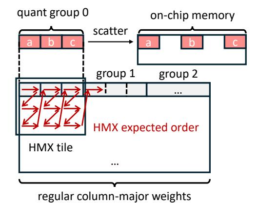

Figure 6. A simplified illustration of the mismatch between the quantization group layout and HMX tile layout.

To address this, we first permute the weights into the layout expected by the matrix unit, and then apply round-to-nearest quantization group by group. For a group size of 32, this method effectively performs group quantization in units of  $2\times 16$  tiles. Given that pretrained weights in typical models approximately follow a zero-mean Gaussian distribution, quantizing within these reshaped tile groups does not significantly alter the statistical properties within each group compared to conventional grouping. Therefore, the resulting quantization error remains comparable.

Specifically, we arrange the weights before quantization according to the layout shown in Figure 4, which is hierarchically structured into two levels: an outer column-major ordering of tiles, matching the tile-level inner product operation of the matrix unit, and an inner shuffling of every two rows within each tile. We then quantize the weights group-wise in the new memory order.

**5.1.2** Coalescing Quantization Groups for Wide Vector Accesses. By default, quantized weights are stored in an Array of Structures (AoS) layout. Taking Q4\_0 symmetric quantization as an example, each group of 32 elements consists of 16 bytes of INT4 quantized values and 2 bytes of FP16 scale values, with quantized values and scales interleaved in memory. Since memory access on the NPU architecture relies heavily on software-managed local 1D or 2D prefetching, we avoid the Structure of Arrays (SoA) layout, where quantized values and scales reside in separate large contiguous arrays, to better align with the hardware's preferred access pattern.

However, fine-grained quantization groups introduce a mismatch with the native vector processing granularity: A single quantization group is too small to fill a 128-byte wide vector register. Accessing such small groups would require multiple memory operations or additional instructions to merge data from multiple registers, resulting in inefficient memory bandwidth usage and computational overhead.

To solve the issue, we coalesce 8 quantization groups into a larger super-group and reorganize its content such that the INT4 values from 256 consecutive elements occupy exactly one full HVX register. This process is illustrated in Figure 7.

#### 5.2 LUT-Based Computations

Given the limited general-purpose computing performance of the vector unit, we propose using generalized look-up table (LUT) instructions to replace complex computations, thereby reducing instruction count and computational overhead. LUT-based computation is particularly effective for accelerating key operations in test-time scaling workloads, such as the exponential function in Softmax and the dequantization process.

**5.2.1 Fast Softmax via Vector Gather.** Test-time scaling methods typically increase sampling parallelism, leading to larger batch sizes and longer context lengths. We analyze

<span id="page-6-0"></span>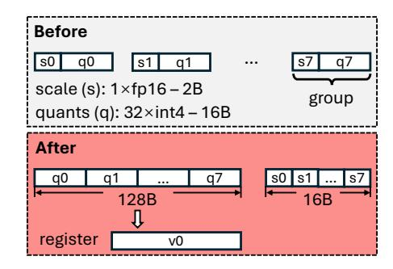

**Figure 7.** Repacking 8 fined-grained quantization groups into a super-block. The INT4 quantized values fit in a vector register.

<span id="page-6-1"></span>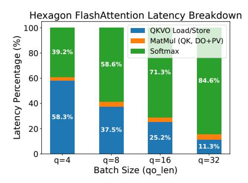

**Figure 8.** FlashAttention latency breakdown on Hexagon NPU. We use Qwen2.5-1.5B and prompt length is set to 4096.

the impact of these scaling factors on the major operators in transformer-based LLMs during generation:

- GEMM. Based on previously described NPU hardware characteristics, moderately increasing batch size in testtime scaling workloads does not substantially increase GEMM latency. Moreover, GEMM latency is independent of context length.
- Misc. Ops. For operators such as activation functions, LayerNorm, residual Add, and RoPE, although their computational overhead is roughly proportional to input size, we neglect their impacts due to their small computation and memory access volumes.
- Attention. The theoretical computational complexity of Attention scales with both batch size and context length, making it a potential performance bottleneck in test-time scaling scenarios.

We implement FlashAttention [11] on the Hexagon NPU using FP16 HMX and measure its latency composition at a prompt length of 4096 under various input batch sizes (query lengths), as shown in Figure 8. The results indicate that matrix multiplication contributes little to overall latency, whereas Softmax dominates Attention execution time as the query length increases.

Our analysis shows that the primary bottleneck of on-chip Softmax lies in the exponential computation, which must be applied to  $\Theta(N_q \times N_{kv})$  elements. Adding to the issue, these expensive exponential operations must be executed on the HVX, which lacks dedicated hardware support for special math functions. Following common practice, we replace exp with exp2 and absorb the coefficient  $\log_2 e$  in the  $QK^T$  scaling factor  $\frac{1}{\sqrt{d}}$ . For an input element x decomposed into integer part k and fractional part f,  $2^f$  is approximated using a Taylor series polynomial expansion, while k is directly added to the exponent field of  $2^f$ 's IEEE-754 representation. However, polynomial evaluation involves sequential dependencies, limiting instruction-level parallelism under the VLIW architecture.

To alleviate the exponential computation bottleneck, we explore replacing explicit exponent calculation with a precomputed lookup table (LUT). The HVX provides the vgather instruction, which can gather values from scattered locations in the TCM into a contiguous 128 byte TCM region. Although vgather can implement large LUTs, using LUTs for exp remains challenging: storing 2<sup>32</sup> elements for 32-bit floats is impractical. Furthermore, vgather itself introduces substantial latency — 24 to 48 instruction packets on Hexagon V75, so its usage must be minimized.

To enable practical LUT-based exp, we design the following approach. First, we extensively use FP16 throughout FlashAttention, with the on-chip computation process outlined in Algorithm 1. The matrices S,P,O and the vectors  $\vec{m},\vec{l}$  are stored in 16-bit floats, with both the input and output of the exp computation in 16-bit floats. In particular, FP16 HMX uses higher-precision floating-point numbers for accumulation internally, and we upcast elements to 32-bit precision for critical operations such as row-wise summation of matrix P.

Using 16-bit inputs and outputs restricts the LUT to 65536 entries, requiring 128 KiB of storage, which fits within the TCM. A variant of vgather supports gathering 64 2-byte elements in one instruction, with a maximum address offset of 65536 bytes. However, 65536 FP16 entries occupy 128 KiB, leaving half of the entries inaccessible with direct addressing. To solve this, we leverage the property of safe softmax [42], which ensures that all inputs to exp are non-positive by subtracting the row-wise maximum  $m_i$ . Thus, we only store values for  $x \le 0$ , resulting in a LUT with 32768 entries (64 KiB). During LUT-based exp computation, we ignore the MSB (sign bit) of the FP16 input and left-shift the input by one bit to generate the byte offset required by vgather.

The LUT is precomputed during system initialization, introducing no additional overhead during model inference. It occupies a fixed 64 KiB region in TCM, accounting for only  $64KiB/8MiB \approx 0.8\%$  of the total TCM capacity, thus minimally impacting TCM availability for other operations.

<span id="page-7-0"></span>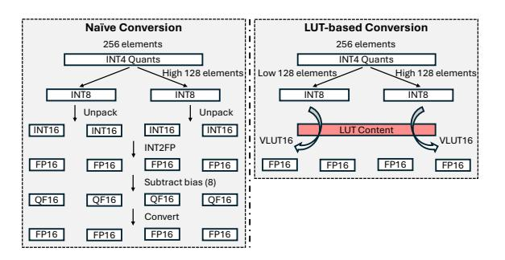

**Figure 9.** Converting INT4 quantized values into FP16 numbers via table lookup.

5.2.2 LUT-Centric Efficient Dequantization. The runtime HVX dequantization requires careful design to avoid additional overhead. We present an efficient dequantization process based on the HVX lookup table instructions. The vlut16 instruction is capable of performing a table lookup in a table of 16 elements for each 8 bit index in a source vector register. Each input byte is transformed into a 16-bit value, therefore vlut16 results in a pair of registers.

Fast INT4 to FP16 conversion via table lookup. Using vlut16 instructions, we directly transform 4-bits quantized values into [-8, 7] FP16 values for Q4\_0 quantization scheme, avoiding the conventional mask-unpack-convert instruction sequence. Figure 9 demonstrates the comparison of two approaches. For Hexagon NPU prior to V79, all HVX floating-point operations produce results in an internal format called qfloat, which requires extra instructions to convert back to standard IEEE-754 formats. The use of table-lookup eliminates these overheads. This LUT-centric design can easily support different 4-bit encoding schemes (e.g. FP4, NF4 [12], IQ4\_NL used in llama.cpp) simply by adjusting the table contents.

Scales broadcast via table lookup. A 128-byte HVX register can accommodate two FP16 quantization groups of size 32. Therefore, the conventional approach is to broadcast scalar scales to the entire vector register and then concatenate two registers for subsequent multiplication with quantized values. However, by using the scales of four groups as LUT contents and applying predefined constant indices, we can achieve the broadcast of four groups of scales with just one vlut16 instruction.

## 6 Implementation

Our inference system is implemented on top of llama.cpp [15] with approximately 7K lines of code in C/C++ and inline assembly. We use the LLVM toolchain in the Hexagon SDK (version 6.0.0.2) to generate code for Hexagon NPUs. We especially note that our system has no dependency on Qualcomm's QNN, avoiding inflexible static fixed-shape computation graphs.

Algorithm 1: On-chip computation of ours FP16 FlashAttention (different heads omitted)

```
Input: Head dimension d, Number of Query tiles T_q, Number of KV tiles T_{kv}, Query tile size B_q, KV tile size B_{kv} Input: Matrices Q_i (FP16) \in \mathbb{R}^{B_q \times d}, K_j, V_j (FP16) \in \mathbb{R}^{B_{kv} \times d}

1 Initialize O_i^{(0)} = (\mathbf{0}) \in \mathbb{R}^{B_q \times B_{kv}} (FP16), m = (-\infty) \in \mathbb{R}^{B_q} (FP16), l = (\mathbf{0}) \in \mathbb{R}^{B_q} (FP16);

2 S_i^{(j)} = \text{MatMul}(Q_i, K_j^T, \text{AccumType=FP32}) \in \mathbb{R}^{B_q \times B_{lv}} (FP16);

3 m_i^{(j)} = \max(m_i^{(j-1)}, \text{rowmax}(S_i^{(j)})) \in \mathbb{R}^{B_q} (FP16);

4 P_i^{(j)} = \text{LUT\_Exp}(S_i^{(j)} - m_i^{(j)}) \in \mathbb{R}^{B_q \times B_{kv}} (FP16);

5 l_i^{(j)} = e^{m_i^{(j-1)} - m_i^{(j)}} l_i^{(j-1)} + \text{rowsum}(P_i^{(j)}, \text{AccumType=FP32}) \in \mathbb{R}^{B_q} (FP16);

6 O_i^{(j)} = \text{diag}(e^{m_i^{(j-1)} - m_i^{(j)}}) O_i^{(j-1)} + P_i^{(j)} V_j \in \mathbb{R}^{B_q \times d} (FP16, AccumType=FP32);

Output: O_i = \text{diag}(l_i^{(T_{kv})})^{-1} O_i^{(T_{kv})}
```

Our implementation mainly consists of two modules: one module is the operator library for the Hexagon NPU, which is compiled into an independent Hexagon DSP shared object; the other module is integrated with llama.cpp on the CPU side. The NPU operator library implements computation kernels, power management, hardware resource management, and a computation thread pool. We add a Hexagon NPU backend to llama.cpp, leveraging rpcmem shared memory as the underlying buffer type. rpcmem is a wrapper for the kernel dmabuf memory and supports the sharing of physical memory between the CPU and the NPU. The related allocation, deallocation, and mapping interfaces are provided by libcdsprpc. so in the Android system's vendor libraries. By utilizing shared memory buffers, we not only eliminate unnecessary inter-processor data copy but also reuse the existing memory management system as much as possible. In addition, we are able to schedule the operators that have not been implemented on the NPU to run on the CPU, achieving seamless integrations with upper-layer applications.

During the backend initialization phase, we call the FastRPC [46] facility of the Hexagon SDK to start the remote NPU session and initialize an area of shared memory for communication. On the NPU side, a thread continuously polls in this shared-memory area to receive computation requests from the CPU. Compared to the default RPC implementation, communication through shared memory can have a lower latency. We note that after the CPU writes data to the shared memory, the NPU will not automatically invalidate the cache of the corresponding area as there is only one-way coherence between the CPU and the NPU on the Snapdragon SoC. Therefore, we manually clear the cache before NPU polls. Similar cache maintenance operations are also required for shared buffers containing model activations.

### 7 Evaluation

## 7.1 Experiment Setup

**Devices.** The experiments on NPU performance are conducted on three Android devices: OnePlus Ace3, OnePlus 12,

| Device           | SoC                | NPU Arch. |
|------------------|--------------------|-----------|
| OnePlus Ace3     | Snapdragon 8 Gen 2 | V73       |
| OnePlus 12       | Snapdragon 8 Gen 3 | V75       |
| OnePlus Ace5 Pro | Snapdragon 8 Elite | V79       |

**Table 3.** Mobile devices used in evaluation.

OnePlus Ace5 Pro. Some of the accuracy results are obtained on a server testbed equipped with NVIDIA RTX3090 GPUs.

Models. We choose models from the Qwen 2.5 [63] and Llama 3.2 [40] model family. Considering the actual resource limitations of mobile phones, we mainly evaluate Qwen 2.5 with model sizes of 1.5B and 3B, as well as Llama 3.2 with model sizes of 1B and 3B, which correspond to practical deployable model sizes. When evaluating the performance-cost trade-off of time-time scaling methods, we additionally consider Qwen 2.5 with a model size of 7B. In the evaluation of mathematical reasoning tasks, we use the Instruct model variants of Qwen 2.5 and Llama 3.2. For Best-of-N search and step-level beam search, Skywork-1.5B-PRM [43] is used as the outcome-reward and process-reward scorer.

**Datasets and metrics.** In the test-time scaling tasks, we evaluate the pass@1 accuracy of the models in two mathematical reasoning tasks, MATH500 [20] and GSM8K [8], and we uniformly use the 0-shot CoT prompt. For other accuracy measurements, the WinoGrande [49] accuracy, the MMLU [19] accuracy, and the Wikitext-2 perplexity are evaluated using llama-perplexity utility.

**Baselines.** Since we focus on test-time scaling tasks, we mainly present the performance of our implementation under different decoding workloads. To demonstrate the advantages of using NPUs to run test-time scaling workloads, we select the recent OpenCL backend of llama.cpp<sup>4</sup> as the GPU-based system for comparison. This OpenCL backend incorporates optimized Q4\_0 matrix multiplication kernels tailored for Snapdragon's Adreno GPU. Since existing NPU-based systems all have certain limitations in handling test-time scaling workloads, we do not use them as the primary

<span id="page-8-1"></span><sup>&</sup>lt;sup>4</sup>commit: 1caae7f

baselines: llm.npu [\[59\]](#page-15-19) does not utilize the NPU for computation during the decoding phase; other QNN-based systems have low accuracy (e.g., PowerServe [\[2\]](#page-13-1)); and systems like Powerinfer-2 [\[61\]](#page-15-20) and HeteroLLM [\[6\]](#page-14-18) are not open-source. Nevertheless, we still report the QNN-based data as a reference in Section [7.2.4.](#page-9-0)

Settings. In the operator-level evaluation of GEMM, we select the sizes of the weight matrices of the linear layers corresponding to Qwen2.5-1.5B, Qwen2.5-3B, Llama3.2-1B, and Llama3.2-3B. Specifically, these include the Attention projection matrices , and ,, in the Feed Forward Network (FFN). (For modern models that use Grouped Query Attention (GQA), the projection matrices , in Attention are not selected because their scale is smaller compared to , ). Most of the matrices adopt the Q4\_0 quantization scheme, which corresponds to 4.5 Bits Per Weight (BPW). As for the FFN down matrices, we apply the Q8\_0 quantization scheme (8.5 BPW) to reduce quantization errors, as existing work indicates their importance in preserving model accuracy [\[26,](#page-14-19) [31,](#page-14-20) [33\]](#page-14-21).

### 7.2 Overall Performance

7.2.1 Accuracy-Latency Trade-off of Test-time Scaling. Figure [10](#page-10-0) illustrates the performance-cost trade-off of the test-time scaling methods. We use the accuracy in MATH500 and GSM8K as metrics for generation quality and the average decoding latency of on-device models as the cost metric (the data here account for the increased context length introduced by TTS). In the figure, the top row and the bottom row correspond to Best-of-N and Beam Search results, respectively, while "QN"/"LN" denotes the Qwen2.5 or Llama3.2 models with billion parameters. The SoC results exclude the "8G2" entry due to a known NPU virtual address space limitation [\[17\]](#page-14-22) of Snapdragon 8 Gen 2 that prevents models with 3B or more parameters from running. The isolated points marked with a "base" represent the average performance obtained via conventional sampling with the models.

The data show that test-time scaling offers a trade-off space and achieves a more superior Pareto frontier under specific configurations, enabling a better performance-cost balance. In the Best-of-N method, the scaling results of Qwen2.5 1.5B and 3B outperform the baseline accuracies of the 3B and 7B models, respectively. For Beam Search, Qwen2.5-1.5B and Llama3.2-1B can achieve efficiency comparable to or slightly better than their respective 3B variants. Our results indicate that by leveraging the computing power of NPUs and test-time scaling algorithms, small on-device models have the potential to surpass larger models in terms of both generation quality and inference cost.

7.2.2 On-Device Decoding Performance. Figure [11](#page-10-1) demonstrates the on-device decoding throughput of different models in different batch sizes. We only evaluate Qwen2.5-1.5B

and Llama-3.2-1B on OnePlus Ace3 due to a 2GiB limitation of the virtual address space on older NPUs.

The data show that for the three devices, the end-to-end decoding throughput of the system significantly increases as the batch size increases. The fundamental reason for the increase in decoding throughput is that the idle computing power of the HMX unit is utilized, and, essentially, the computation time consumed on the core HMX does not increase at all. However, the decoding throughput does not scale perfectly linearly because the inference process contains parts that become much slower with the growth of the input length. Specifically, in our implementation, we conservatively place the weights of the lm\_head (the projection matrix from the hidden states to the vocabulary) and the related activations on the CPU instead of the NPU. Modern LLMs have a large vocabulary, making the lm\_head and logits occupy a large space. Unfortunately, the Hexagon NPU only has a 32-bit virtual address space, therefore placing the complete logits tensor on the NPU may prevent the complete model from running. Currently, we observe that when the batch size equals 16, the proportion of the computation time of logits on the CPU is close to or exceeds 50%. We expect that after addressing the limitations of the NPU address space and placing the logits computation on the NPU, the system will achieve better throughput scaling characteristics.

7.2.3 Power and Energy Consumption. We measure the power consumption during LLM decoding via sysfs interface on OnePlus 12 with the performance mode enabled. As the batch size increases in the decoding phase, the power consumption of running the 1.5B Qwen model increases, but the overall power consumption of the device is still within 5W; in contrast, the power consumption corresponding to running the 3B Qwen model stabilizes at around 4.3W. Figure [12](#page-10-2) shows the normalized energy consumption, which is calculated by multiplying the corresponding power consumption by the relative decoding latency. The scaling trait of energy consumption with respect to the batch size is similar to that of decoding latency; therefore, replacing the cost metric in Figure [10](#page-10-0) with energy also results in similar accuracy-cost trade-off characteristics. In particular, we note that the decoding energy consumption of the 1.5B model at a batch size of 8 is lower than that of the 3B model at a batch size of 1, while the test-time scaling accuracy of the 1.5B model when decoding with a batch size of 8 on mathematical tasks is comparable to the base accuracy of the 3B model.

<span id="page-9-0"></span>7.2.4 Comparison with Other Systems. The decoding and prefilling performance of our system is presented in Figure [13.](#page-11-0) We compare our system against a GPU-based implementation and add the performance of FP16 QNN as a reference. During the decoding phase, although the GPU decodes faster at batch size 1, our NPU-based system exhibits higher decoding throughput and better scaling characteristics at larger batch sizes, highlighting the advantage of

<span id="page-10-0"></span>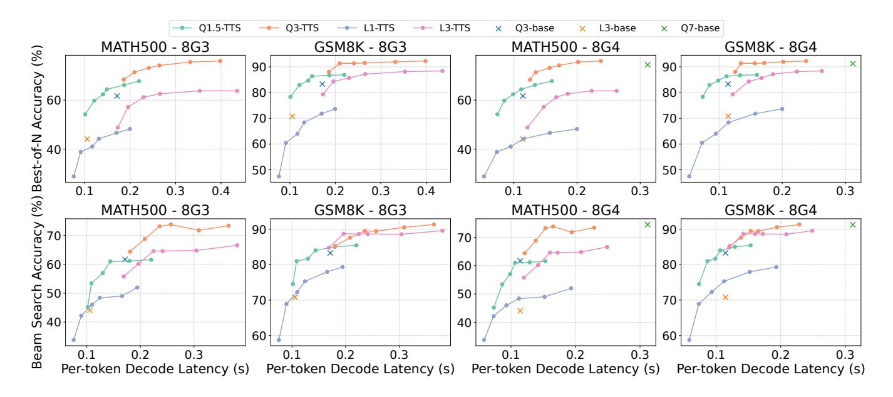

<span id="page-10-1"></span>Figure 10. Accuracy-latency trade-off of different test-time scaling methods on various combinations of dataset and hardware.

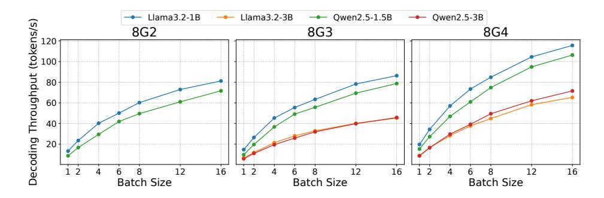

Figure 11. End-to-End decoding throughput of different models under various batch sizes and hardware settings.

<span id="page-10-2"></span>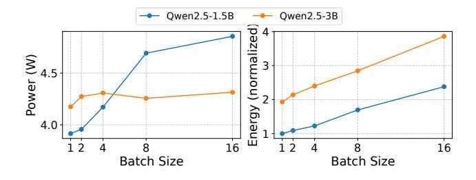

**Figure 12.** Power and energy consumption during the LLM decoding stage.

using NPUs in test-time scaling workloads. Our system also consistently outperforms the GPU-based system in terms of prefilling throughput, achieving comparable performance with proprietary QNN under certain workloads.

<span id="page-10-3"></span>

| dataset        | Tile group | Common group | F16    |
|----------------|------------|--------------|--------|
| WinoGrande (↑) | 62.559     | 63.349       | 64.613 |
| MMLU (↑)       | 35.465     | 35.271       | 34.819 |
| Wiki PPL (↓)   | 10.206     | 10.190       | 9.798  |

**Table 4.** Accuracy comparison between models using tile quantization groups tailored for HMX layout and models using conventional quantization groups.

## 7.3 Accuracy Assessment

Quantization Scheme. We evaluate the accuracies of the Qwen2.5-1.5B model corresponding to the tile quantization groups based on the HMX layout and the conventional quantization groups. As shown in Table 4, the model using our quantization layout has slightly higher accuracy in MMLU compared to the model with the conventional layout, and there is only a slight decrease in Winogrande and Wikitext PPL. Moreover, these accuracy differences are much smaller than the performance loss caused by quantization itself (as

<span id="page-11-0"></span>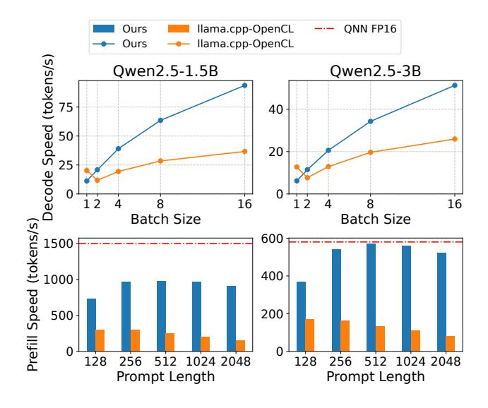

**Figure 13.** Inference throughput comparison.

indicated by Wikitext perplexity in the "F16" column). In general, using our proposed tile quantization group does not lead to a significant decrease in the accuracy of the quantized model.

<span id="page-11-1"></span>

| dataset        | Our LUT16 FA | F32 Attention |
|----------------|--------------|---------------|
| WinoGrande (↑) | 62.796       | 62.559        |
| MMLU (↑)       | 35.207       | 35.465        |
| Wiki PPL (↓)   | 10.205       | 10.206        |

**Table 5.** Accuracy comparison between models using our F16 FlashAttention with LUT-based Softmax and models using conventional F32 Attention.

Attention Implementation. Table 5 shows the model accuracies corresponding to our LUT-based FP16 Attention and the conventional FP32 Attention, using the same model and datasets as above. It can be seen that replacing the noncritical parts in Attention (except for the accumulation) with a lower FP16 precision does not have a noticeable impact on the end-to-end accuracy of the model.

#### 7.4 Ablation Study

Softmax in Attention. Figure 14 shows the on-chip softmax latency corresponding to the calculation of the exponential function exp using different methods under different attention workloads. The length of the input query for Attention is set to 1, 4, and 16, while the length of KV is set to 1024, 4096, or 16384. The figure indicates that our LUT-based exponential calculation achieves an acceleration of 1.26 to 2.19 times compared to the conventional 32-bit floating-point exp, and up to 1.60× speedup compared to the 16-bit floating-point exp. It is worth noting that when pre-computing the exp lookup table, floating-point numbers with a width of

<span id="page-11-2"></span>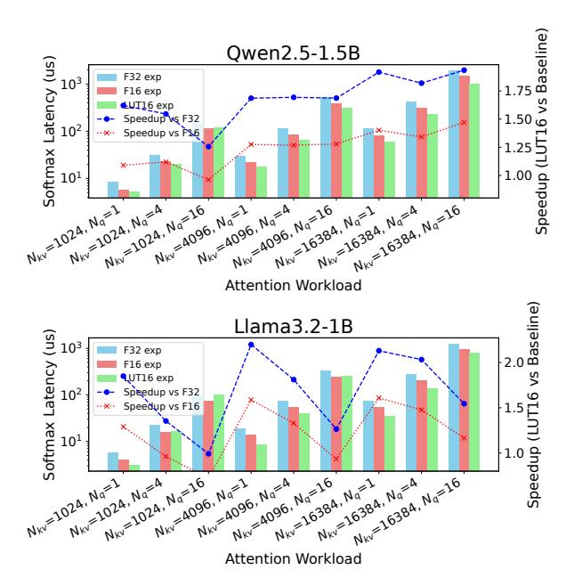

**Figure 14.** Ablation study of on-chip softmax of our proposed F16 Attention with LUT-based exponential computation. Performance is measured on OnePlus 12.

32 bits or higher can be used to calculate the intermediate results. Therefore, the LUT-based exp has a higher accuracy than the 16-bit polynomial approximation of exp. When the context length is short, a larger input query will slightly reduce the acceleration ratio, but this phenomenon will be alleviated when the KV length is longer.

**Dequantization-based GEMM.** Figure 15 presents the ablation experiment for optimization of the GEMM dequantization layout. The baseline method corresponds to the conventional memory layout, where the column-major weight matrix is quantized according to the continuous groups in memory. The GEMM kernel dequantizes the 32-sized groups one by one during runtime and then scatters the elements to the correct positions in the TCM. The item of "HMX layout" applies the offline weight rearrangement and tile quantization group for the HMX layout, enabling the FP16 weights to be continuously written into the TCM. "Ours" is the version that adopts all the optimizations including the quantization group coalesce. In addition, we add a set of data labeled "no dequantization". In this implementation, instead of performing actual weight dequantization, the quantized weights are read directly from the memory and copied to the on-chip memory without any computation. This set of data can be regarded as the performance upper bound of dequantizationbased methods.

Compared to the baseline, our method achieves an acceleration of 9.65 to 19.04 times under different matrix sizes. This is mainly because the scatter operations in the baseline

<span id="page-12-0"></span>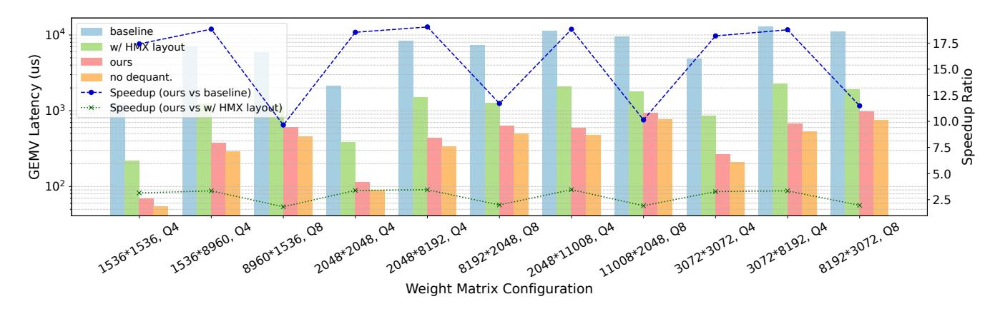

**Figure 15.** Ablation study of proposed optimizations on GEMM dequantization. We measure the performance of GEMV on OnePlus 12.

are extremely costly. After applying the HMX layout, the quantization group coalesces and the rearrangements also effectively reduce computational waste, bringing a speedup of  $1.82\times$  to  $3.45\times$ . In particular, compared to the "no dequantization" group, our method is only 27% slower on average, indicating that this implementation is already close to the performance upper limit of dequantization.

#### 7.5 Overhead and Sensitivity Analysis

<span id="page-12-1"></span>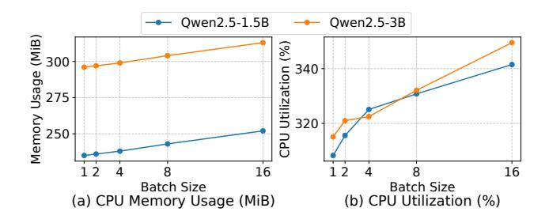

**Figure 16.** CPU and memory usage during the decoding stage.

CPU and Memory Usage. We evaluate the CPU utilization and memory consumption of the 1.5B and 3B Qwen2.5 models during the decoding stage on OnePlus 12. The CPU memory usage presented in Figure 16 is derived from the resident memory size reported by the top command. We also measure the total size of dmabuf (i.e., memory used by NPU) using pmap, yielding constant values of 1056 MiB and 2090 MiB under a context budget of 4096 tokens for the 1.5B and 3B models, respectively. The total memory consumption is approximately 1.3 GiB for the 1.5B model and 2.4 GiB for the 3B model. The CPU utilization increases with batch size due to the increased computation of vocabulary projection on CPU, yet the number of utilized cores is consistently limited to 4.

<span id="page-12-2"></span>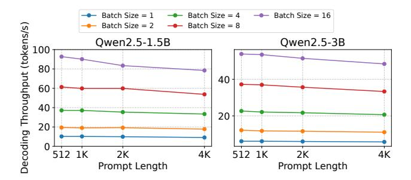

Figure 17. Impact of prompt length on decoding throughput.

Impact of Prompt Lengths. Figure 17 shows the impact of prompt lengths on decoding throughput. Across all batch sizes and both models, the decoding throughput exhibits a mild decreasing trend as the prompt length increases from 512 to 4096 tokens. However, within the range of prompt lengths up to 4096 tokens, this decline remains relatively subtle, indicating that prompt length exerts only a limited influence on decoding throughput in this interval.

#### 8 Discussion

Generalizability to Other Hardwares. We argue that the "vector + matrix" architecture of NPUs possesses a certain degree of universality and observe that the boundary between CPUs and NPUs is gradually blurring. Beyond NPUs, modern CPUs have also begun to incorporate dedicated matrix multiplication units, such as Intel AMX and ARM SME, endowing them with a similar "vector + matrix" architecture. Furthermore, we note that modern AI accelerators generally exhibit a significant disparity between general-purpose computing performance and specialized low-precision matrix multiplication capabilities (e.g. NVIDIA GPUs). Although specific hardware architectures may differ, the core ideas behind our techniques maintain broad applicability.

System Performance and Limitations. (a) Decoding Performance: The current decoding speed of our system is relatively constrained, primarily due to the overhead of dequantization. However, this does not undermine the effectiveness of test-time scaling. Quantized GEMM based on QNN typically utilizes only the DMA and HMX components without introducing HVX computational overhead. Approaches similar to T-MAC [\[56\]](#page-15-21) could potentially enable efficient GEMV with fine-grained group quantization on NPUs, thereby accelerating the LLM decoding process. (b) Prefill Performance: There remains room for improvement in the prefill performance of our current system. Offloading more operators to the NPU, reducing memory access and communication overhead through operator fusion, and optimizing tiling and pipelining strategies for matrix multiplication could all contribute to enhanced prefill performance. We leave these optimizations to future work. (c) Model Size Constraints: Our current implementation is limited by the 32-bit address space of a single NPU session on older devices. Employing multiple NPU sessions could help alleviate this issue.

Application Scope of Parallel Test-time Scaling. Although parallel test-time scaling methods currently dominate mathematical reasoning tasks, evidence from recent studies [\[7,](#page-14-23) [16,](#page-14-24) [21,](#page-14-25) [45,](#page-15-22) [62,](#page-15-23) [64\]](#page-15-24) indicates their extensibility to broader reasoning and planning domains, highlighting substantial generalizable potential.

