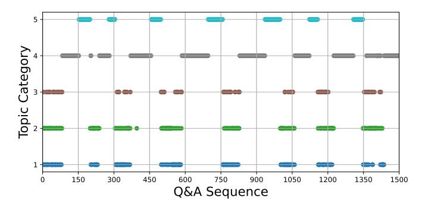
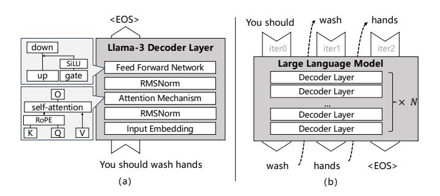
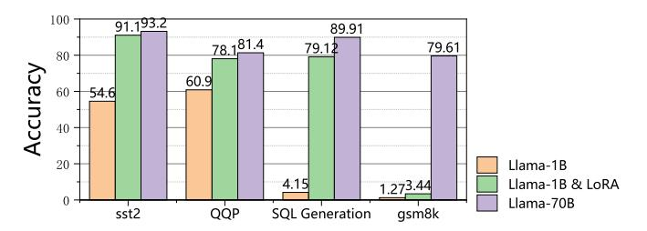

# 1 Introduction

Large language model (LLM) inference services (such as GPT[\[42\]](#page-14-0), Gemini[\[46\]](#page-14-1), etc.) are globally attracting users at a considerable rate, who rely on purely cloud-based remote inference services for large language models to perform all kinds of general-purpose machine learning tasks, including text translation, content summarization, knowledge retrieval, and logical inference. However, with the surge in the number of users, service providers have to increase their investment in cloud computing resources to maintain service quality[\[15,](#page-13-0) [34,](#page-14-2) [58\]](#page-14-3), which has caused the cost of inference services to rise sharply, even reaching or exceeding the well-known main expenditure of large language models: the cost of pretraining[\[13\]](#page-13-1).

In this context, deploying lightweight Small Language Models (such as TinyLlama[\[64\]](#page-15-1), Phi-2[\[31\]](#page-14-4), and MobileVLM[\[6\]](#page-13-2)) in fast-growing end-side devices is becoming an effective way to reduce the cost of LLM inference services[\[27,](#page-13-3) [27,](#page-13-3) [54\]](#page-14-5). However, constrained by the memory capacity of end devices, Small Language Models (SLMs) typically do not exceed an order of magnitude of 10B, below the 30B+ parameter threshold required to achieve complex cognitive tasks[\[1,](#page-13-4) [2,](#page-13-5) [7,](#page-13-6) [28\]](#page-13-7), which leads to a significant gap between the accuracy of small language models and cloud-based LLMs on complex tasks[\[4,](#page-13-8) [52,](#page-14-6) [53\]](#page-14-7).

To promote the large-scale application of LLM inference services, a key challenge in scaling LLM inference services is 'balancing multi-task accuracy, end-to-end latency, and cloud computing costs'. Single cloud or end deployment faces tradeoffs: cloud LLMs offer high accuracy but with high costs

**Figure 1.** Statistics on long-term conversational task topics from the publicly available dataset LoCoMo[39], with the vertical axis representing the 5 categories and the horizontal axis representing the order of questions.

and latency, while end-device SLMs provide low latency but limited accuracy. This paper proposes a collaborative end-cloud framework to better balance these metrics.

From the perspective of end-cloud collaborative systems, current mainstream research on LLM inference optimization can be broadly categorized into two main directions: model partitioning based on a single model [29, 30, 37, 67], and model collaboration involving multiple models [5, 11, 19, 61, 68?]. In the model partitioning approach, the decoder-stacked LLM is split across end and cloud, but the resulting communication overhead makes it unsuitable for inference under weak network conditions. In contrast, token-level collaborative inference exploits the autoregressive nature of LLMs, allowing the SLM to generate a preliminary draft that is subsequently validated by the cloud. However, frequent end-cloud interactions introduce cumulative latency, and cloud-side validation partially offsets the anticipated cost savings.

To circumvent the shortcomings of the above approach, we analyze the large language model inference task flow and obtain two key observations. (i) A few tasks cover most (over 70%) of the user's requests[51]. Despite the multitasking capability of LLM, user requests in real-world scenarios are highly concentrated on a small number of highfrequency tasks (e.g., text translation, content summarization, etc.). This finding suggests that by targeting and optimizing the performance of SLM on high-frequency tasks, the dependence on cloud-based LLM calls can be significantly reduced while maintaining accuracy. (ii) User requests are more predictable at the task-level rather than the token-level. These requests show cyclical patterns tied to temporal contexts; for example, among every 50 questions, 1 to 3 categories are typically repeated, with each appearing at a relatively stable cyclicality (see Figure 1). By leveraging these predictable temporal patterns, end devices can proactively preload task-specific SLMs. Given that the inference accuracy of these SLMs is trustworthy, inference

can be performed entirely on the device, avoiding frequent token validation with the cloud and significantly reducing latency.

Based on these observations, we propose TailorLLM, a task-level model collaboration framework. It integrates a small number of low-rank adaptation (LoRA) [23] matrices into the local SLM to improve inference accuracy for multiple high-frequency tasks, enabling most user requests to be processed on the end-side with lower latency and higher precision, while the cloud LLM handles more complex or rare tasks. This design reduces the frequency of end-cloud interactions, ensuring efficient and responsive inference. Nevertheless, TailorLLM still faces challenges in adapting to changing user needs under limited end-side storage. To address this, we propose two algorithms: RFLoRA and AdapterMgr, for the offline training and online inference stages respectively.

Motivated by **observation** (i), we need to deploy multiple task-specific SLMs on the device side. To address resource limitations, we store LoRAs for different tasks instead of full models, enabling lightweight task switching. RFLoRA further reduces transmission and storage costs by decoupling parameters and analyzing their importance to freeze low-impact parameters. This effectively doubles the number of LoRAs that can be stored on the end-side device. Inspired by **observation** (ii), AdapterMgr enhances adaptability to dynamic task demands by prefetching potentially useful LoRAs from the cloud. By employing the imitation learning strategy, its performance approximates a near-optimal prefetching policy. Together, these two designs enable the end-side device to achieve high task hit rates and efficient storage utilization under conditions of limited resources and dynamic demand.

We implemented end-side and cloud-side prototype systems of TailorLLM on NVIDIA Tesla T4 and RTX 3090 GPUs, respectively, connected via wireless network. The Llama3-1B and Llama3-70B[16] models were deployed as the SLM and LLM, respectively. Performance evaluation was conducted using simulated user datasets derived from public data [8, 9, 60] with periodic behavior. We compared our approach against SOTA methods. Experimental results demonstrate that TailorLLM achieves up to a 69.8% reduction in cloud computing resource usage and up to a 62% decrease in task processing latency, while maintaining relatively high multitasking accuracy.

In summary, the major contributions of this paper are as follows:

- We propose TailorLLM, a task-level end-cloud collaborative inference system for LLMs. While maintaining task accuracy, TailorLLM significantly reduces cloud computing costs and end-to-end inference latency.
- We propose the AdapterMgr algorithm to achieve efficient management of LoRA modules on end devices through a near-optimal model replacement strategy so that most inference tasks can be done locally.

 We propose RFLoRA as a resource-friendly low-rank adaptation algorithm that reduces the transmission overhead by nearly half and improves the efficiency of offline fine-tuning training.

## 2 Background and Motivation

This section describes the autoregressive inference mechanism for large language models, task-oriented, lightweight fine-tuning approaches, and highlights the limitations of existing model collaboration methods.

#### 2.1 Decoder-based LLM Inference

**Decoder-based LLM architecture**. Decoder-based language models, encompassing both pure decoder architectures and encoder-decoder architectures, have emerged as the predominant approach for generative tasks. Notable examples of these models include GPT-4[42], LLaMA[16], Qwen[59], and GLM-130B[12].

A typical large-scale decoder-based language model is built on top of a series of stacked decoder layers. In the case of LLaMA, each decoder layer contains several key components (see Figure 2(a)). The first is the normalization of the input using RMSNorm[63], followed by a complex attention mechanism to identify and process relevant information in the sequence. The output of the attention mechanism is then passed to the feedforward network. While the specific implementation of the different models may vary, for example, their choice of normalization techniques (LayerNorm vs. RM-SNorm), the underlying architectural framework of these high-level language models is consistent.

**Figure 2.** Subfigure (a) shows the single decoder-layer structure in Llama 3, and subfigure (b) shows the autoregressive inference pattern for LLM inference.

Autoregressive inference. Generative LLMs use an autoregressive inference mechanism to generate text through word-by-word iteration. Each generated lexical element serves as a new input for subsequent generation, e.g., given the initial prompt "You should", the model first generates "wash"; the next round takes "You should wash" as an input to generate "hands". The process continues to accumulate the generated lexical elements in the input sequence until the output

terminator <EOS> ends the generation (as shown in Figure 2(b)).

The autoregressive nature of this inference process poses unique challenges for LLM deployment, especially in terms of cloud computing costs and latency. In 'single request' scenarios (i.e., cases that do not include parallel processing of multiple requests), the process cannot effectively utilize the powerful parallel computing capabilities of cloud platforms, as the sequential nature of token generation becomes a major bottleneck. This leads to higher operational costs when using high-performance GPUs, as their superior computational capabilities remain largely underutilized.

#### 2.2 Task-Specific Small Language Model

End-side generation task requirements. In the field of natural language processing, generative tasks include language modeling, machine translation, text summarization, and question answering, which have been integrated into a variety of end devices, including smartphones. Examples include offline voice command parsing and multilingual navigation for Tesla Motors; native speech-to-text message writing for Apple Watch; and real-time menu translation for Nreal AR glasses. Lightweight optimization of task-specific LLMs for on-device deployment is a trend to meet the growing user demands for personalization, fast response time, and privacy.

**Figure 3.** Task accuracy comparison of Llama-1B before and after LoRA and with Llama3-70B. Performance is close to the 70B model in some tasks, but has low accuracy on more complex tasks (Math).

Parameter-Efficient Fine-Tuning. To make models perform better on specific tasks, models are often retrained using Full Fine-tuning for specific downstream tasks. However, there are three main challenges in traditional full-parameter fine-tuning: first, this process requires huge computational resources and training data; second, it may destroy the acquired knowledge in the pre-trained model, which is prone to cause catastrophic capability degradation; third, single-task fine-tuned models require storing multiple instances for different tasks, leading to high storage demands. To solve the above problems, the Parameter-Efficient Fine-Tuning (PEFT) technique was developed, whose core idea is to make large-scale pre-trained LLMs quickly adapt to downstream

tasks while maximally retaining their general-purpose capability through the tuning of a very small number of trainable parameters (usually only 0.1%-5% of the original model parameters).

Among many PEFT methods, LoRA has attracted much attention due to its excellent performance and unique 'plugand-play' feature. The core idea of LoRA is to approximate the model update by superimposing a very small low-rank matrix on the original weight matrix (see Figure [3\)](#page-2-1). More importantly, the LoRA modules can be stored and reused independently of the original model. This feature allows the LoRA module to support flexible switching between different tasks, which greatly reduces the storage pressure on the endside devices. Our experimental results show that the time overhead of LoRA module switching on the Llama3-1B model is less than 1 ms.

## 2.3 Challenges for LLM Collaboration

We focus more on the research path of model collaborative approaches due to the high communication latency, unavailability under weak network conditions, and limited flexibility of dynamic adjustment of model partitioning approaches. The mainstream approach adopts the speculative decoding mechanism of end-side SLM, generating drafts and cloud LLM co-verification to realize token-level collaboration. Its theoretical basis lies in the fact that the output probability distribution of SLM in a simple token generation task has a high similarity with LLM. The method cleverly balances the complementary characteristics between LLM and SLM flexibly by adjusting the value of the confidence level to achieve dynamic optimization of accuracy and cloud computing costs.

However, the token-level model collaborative approach has a serious problem: the communication frequency between the end and the cloud is too high. Due to the autoregressive generative property of language models, an erroneous token generated by a small model may propagate the error to the generation of subsequent tokens, which ultimately leads to disastrous results. To ensure reliability, the system needs to verify token-by-token and provide real-time feedback through cloud LLM. This high-frequency interaction mechanism may trigger dozens of end-cloud communications for a single Q&A in practical applications, which is superimposed on the round-trip latency of the wireless network, leading to a significant increase in the overall response time. At the same time, frequent cloud validations can partially offset the expected costs savings.

In comparison, we propose a task-level model collaborative approach. It carries out triage according to the access frequency and complexity of the task: for simple tasks that are frequently accessed by users, for more complex or less frequently accessed tasks (see Figure [3\)](#page-2-1), they are transferred to the cloud LLM for inference. This task-level collaboration approach reduces the end-cloud communication frequency

compared with the token-level approach, thus effectively controlling the end-to-end response latency of the system. In addition, through a reasonable task distribution strategy, the approach also ensures that the inference accuracy of the overall system can meet the user's needs.

