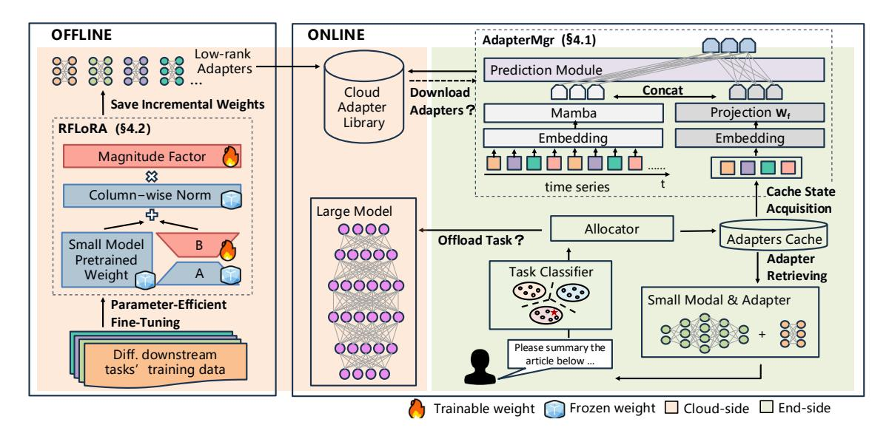
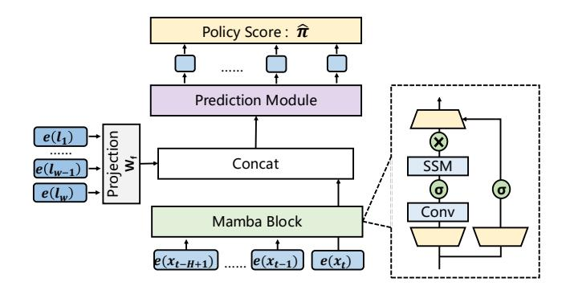
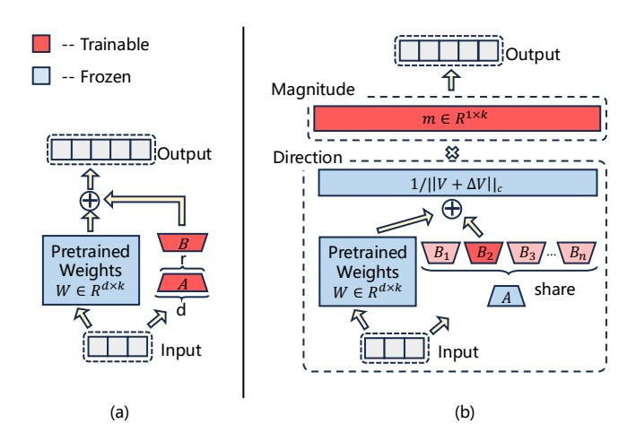
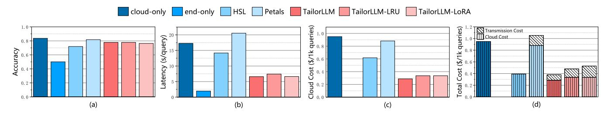
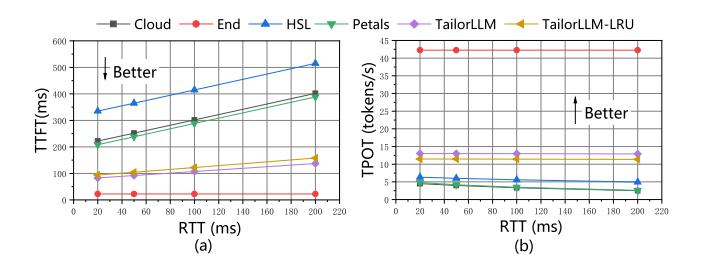
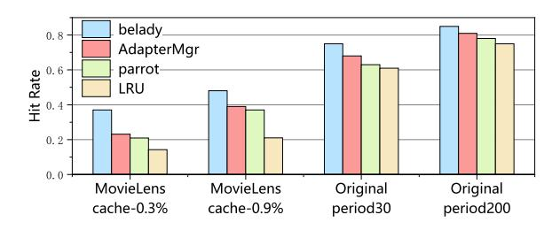
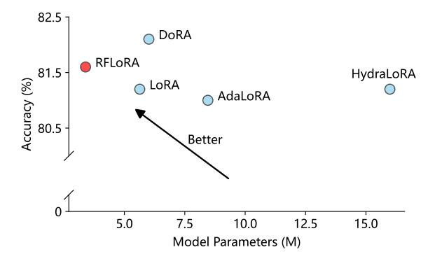
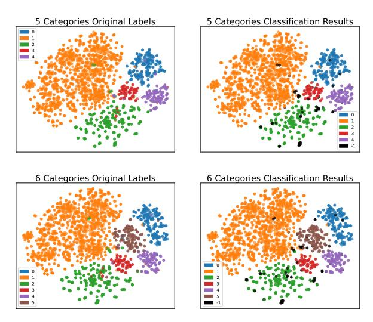
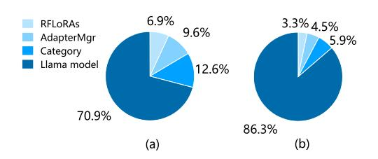

# 3 Overview of TailorLLM

We propose TailorLLM, a task-level collaborative inference framework for LLMs based on low-rank adaptation. The system solves the problem of difficulty in balancing the three-dimensional metrics of 'multi-task accuracy-response latency-cloud computing costs' in LLM end-cloud collaborative inference, especially alleviating the latency problem caused by token-level collaboration. As shown in Figure [4,](#page-4-0) the TailorLLM system consists of two main parts: online and offline.

Online inference stage. The processing flow of the online inference service can be decomposed into three modules: semantic categorization, task allocation, and LoRAs scheduling.

TailorLLM adopts a dynamic task classification framework based on unsupervised learning, and realizes open category recognition through the combined Contriever[\[26\]](#page-13-19) semantic coder and HDBSCAN[\[40\]](#page-14-12) density clustering, which avoids the problem of misclassification of new categories by supervised learning. Specifically, high-dimensional semantic features are first extracted using the Contriever semantic coder, dimensionality is reduced by the UMAP algorithm to minimize computational overhead, and finally, dynamic category discovery and incremental updating are accomplished with the help of HDBSCAN hierarchical density clustering. The method achieves more than 95% accuracy in 15 categorization benchmark tests.

Next, the task allocator schedules tasks based on the classification result, ensuring multi-task accuracy. Firstly, it checks the table to determine whether the SLM meets the accuracy requirement of the task, and then checks whether there is LoRA in the local cache. When it is confirmed that the SLM has the basic processing capability, then it checks whether the LoRA required for the task exists in the local cache, and if both conditions are satisfied, the system will load the corresponding LoRA module to enhance the SLM and complete the inference computation at the terminal directly. If the classification is a new category, the capacity is judged insufficient, or the corresponding LoRA does not exist locally, the problem will be sent to the cloud for large model inference.

To further increase the probability that a task is assigned to an end-side device for inference, the TailorLLM system employs a deep neural network to analyze the user's historical access data. It mines the regularity of user inference tasks, extracts personal preference features from them, and dynamically adjusts the end-side LoRA library accordingly

**Figure 4.** Framework of TailorLLM. Online inference (right): given a user request, the Allocator decides whether to offload it to a cloud-based large model or process it locally using a small model with a task-specific adapter, while AdapterMgr determines whether to download a new adapter from the cloud; Offline fine-tuning (left): RFLoRA is employed to train low-rank adapters for different downstream tasks and store the adapters on the cloud.

(download from the cloud-side), and the related implementation will be detailed in Section 4.1.

Offline fine-tuned stage. TailorLLM uses the RFLoRA algorithm to realize the trade-off between transmission overhead and model performance. In the current system, to enhance the capability of the terminal-side SLM, it is necessary to transmit a low-rank matrix, which inevitably introduces additional network resource overhead. Existing solutions usually reduce the LoRA rank value or decrease the number of LoRA application modules to compress the parameter scale, but these approaches often lead to a significant drop in model accuracy. Our analysis shows that after finetuning, the A matrix in LoRA varies little across tasks and mainly serves as an encoder projecting inputs into a subspace, whereas the B matrix is more task-sensitive and responsible for transformation. Based on this, RFLoRA freezes the less task-sensitive *A* while decoupling *B* into direction and magnitude, increasing its adaptability. This difference is also reflected in their initialization methods: A uses Kaiming initialization[21], whereas B is typically zero-initialized. Through fine-grained analysis of weight contributions, this design preserves model accuracy while significantly reducing transmission costs.

#### 4 Design

TailorLLM's core strategy lies in shifting inference tasks to end devices to reduce cloud dependency. In this section, we propose the AdapterMgr algorithm to dynamically adjust the end-side low-rank parameter library in real-time and the RFLoRA algorithm to optimize the offline low-rank fine-tuning technique to reduce parameter transmission. Together, these two algorithms lead to an increase in the acquisition rate of inference tasks for end devices.

#### 4.1 Online: AdapterMgr

Similar to the operating system dynamically managing limited memory space through a memory replacement mechanism, this system dynamically updates and replaces LoRA parameters based on access patterns under the condition of limited end-side storage space to achieve efficient inference for resource-constrained devices. In the field of memory replacement algorithms, Van Roy et al.[49] proved that the Belady algorithm (i.e., the strategy of evicting the content with the longest reuse distance in the cache) is the optimal solution to cache replacement and similar problems. However, since this system cannot predict the user's future access information to calculate the reuse distance, the Belady algorithm is difficult to apply in actual environments. To address this challenge, we proposed AdapterMgr, a deep neural network algorithm based on imitation learning. The algorithm uses information from two modalities, the user's historical access sequence and the current end-side LoRA library storage state, and uses the decision of the Belady algorithm as the learning target in the training phase so that it can make approximately optimal update decisions in the actual inference phase.

**Formal definition of the problem**. Consider a time series  $X = (x_1, x_2, ..., x_n)$  representing user query traces with length n. Given the limited input context of the model, we define a hyperparameter H to represent the history length:

at time t, we take the current point  $x_t$  and the preceding H-1 points, denoted as  $X_t=(x_{t-H+1},...,x_{t-1},x_t)$ , as the user query history. On the end-side device, we maintain a storage space with maximum capacity w for storing LoRA matrices, where  $\mathcal{L}=(l_1,l_2,...,l_w)$  represents the composition of LoRA categories in storage, and  $\mathcal{L}_t$  denotes its state at time t. These two inputs exhibit different data characteristics:  $X_t$  represents a temporal sequence capturing long-term user behavior, whereas  $\mathcal{L}_t$  reflects an instantaneous snapshot of the LoRA storage state.

Based on the heterogeneous characteristics of the inputs  $X_t$  and  $\mathcal{L}_t$ , we define the state vector at time t as  $s_t = (X_t, \mathcal{L}_t)$ . Given this state, our objective is to generate an optimal decision vector  $\mathcal{Y} = (\pi_1, \pi_2, ..., \pi_w \mid s_t)$ , where  $\pi_i \in \{0, 1\}$ . Here,  $\pi_i = 1$  indicates a decision to clear the i-th storage location and load the LoRA model parameters corresponding to  $x_t$ , whereas  $\pi_i = 0$  means the existing parameters in the i-th storage location remain unchanged.

The decision vector  $\mathcal{Y}$  must satisfy two constraints: (1) at most one component in  $\mathcal{Y}$  can be 1, and (2) when all components of  $\mathcal{Y}$  are 0, the current storage content remains unchanged. The system dynamically updates the local storage content according to the generated strategy vector  $\mathcal{Y}$ , with these updated storage states serving as the foundation for subsequent decisions. Through this continuous decision process, our optimization goal is to maximize the hit rate of end-side LoRA model parameters, thereby increasing the probability of completing inference tasks directly on the end-side device.

**Data embedding**. Because of the significant data heterogeneity in the temporal characteristics of user access behavior and the distribution characteristics of LoRA categories in storage space, this study formalizes them into a bimodal data structure. Specifically, user access data depicts the user's onedimensional behavioral trajectory in a discrete time series, showing significant temporal dependence characteristics; while end-side storage data reflects the logical connection relationship between multiple categories. Although traditional embedding technology can uniformly map multi-modal data to a d-dimensional vector space, considering that the nonlinear transformation in the subsequent encoding process will reconstruct the structural characteristics of the original semantic space, if hetero-modal data is embedded in the same subspace, it may cause the feature expressions between modalities to interfere with each other, thereby reducing the accuracy of feature extraction. Based on the above analysis, this study proposes a modality-independent embedding strategy, whose formal definition is as follows:

$$E(\mathcal{L}) = W_l \cdot \mathcal{L} \in \mathbb{R}^{W \times d}$$

$$E(X) = W_x \cdot X + E(pos) \in \mathbb{R}^{H \times d}$$

$$E(pos) = \begin{cases} \sin(\frac{pos}{10000^{i/d}}) & \text{if } i = 2k \\ \cos(\frac{pos}{10000^{i-1/d}}) & \text{if } i = 2k + 1 \end{cases}$$

$$(1)$$

where W represents the number of independent LoRAs that can be stored in the cache, and H represents the length of the sliding window. We employ two independently initialized projection matrices,  $W_x$  and  $W_l$ , which map the original data into different feature spaces. To simplify the model structure and reduce the number of hyperparameters, we uniformly set the dimensions of both feature spaces to d.

Figure 5. Structure of AdapterMgr.

**Time series modeling**. We adopt the latest state-space model (SSM)-based architecture Mamba[17] to extract the temporal characteristics of user access behavior. Compared with traditional time series modeling methods, Mamba has significant advantages: (1) Mamba breaks through the serial computing limitations of recurrent neural networks (RNNs). In RNN, the calculation of subsequent time steps must wait for the previous step to complete, but Mamba supports parallel processing, which greatly improves the calculation efficiency. (2) Although convolutional neural networks (CNNs) also have parallel computing capabilities, their inherent local receptive field makes capturing long-range dependencies in sequences difficult. In contrast, Mamba can model global temporal information effectively. (3) Mamba demonstrates excellent parameter efficiency. In the same time series task, only shallower network layers and fewer parameters are needed to achieve or even exceed the performance of Transformer. Based on the above advantages, this algorithm uses a single-layer Mamba Block to extract time series features:

$$\begin{split} & \Delta_t = \sigma(W_\Delta \cdot x_t + b_\Delta) \\ & \bar{A}_t = \exp\left(\Delta_t A\right), \ \bar{B}_t = (\Delta_t A)^{-1} \left(\exp\left(\Delta_t A\right) - I\right) \cdot \Delta_t B \\ & h_t = \bar{A}_t \cdot h_{t-1} + \bar{B}_t \cdot x_t \\ & h_t = \begin{cases} \operatorname{Parallel}(x_{t-H+1:t}, A, B) & \text{if training} \\ \operatorname{Recurrent}(h_{t-1}, x_t, A, B) & \text{if inference} \end{cases} \end{split}$$

where  $h_t \in \mathbb{R}^d$  represents the hidden state at time step t, and  $\Delta_t$  is the selective update gate that controls the intensity of state updates. H expresses the length of the sliding window that the model can see during the experiment. A and B are learnable matrices parameterizing the continuous-time

system: A governs the state transition, and B governs the projection of the input x(t). The discrete parameters  $\overline{A}_t$  and  $\overline{B}_t$  are computed from A, B, and the step size  $\Delta_t$  via zero-order hold (ZOH) discretization, which involves the matrix exponential  $exp(\Delta_t A)$  and the identity matrix I. Compared to traditional RNNs, one major advantage of Mamba lies in its ability to utilize the Parallel mechanism for parallel computation during training, enabling efficient batch processing of sequences, while still employing the Recurrent mode during inference, processing sequences through step-by-step state updates.

Multimodal feature fusion. After obtaining the user's temporal features and the storage space distribution features, we need to fuse these two modal features. Multimodal feature fusion is of great significance in this algorithm. On the one hand, by integrating multimodal information under the same time window, the model can deeply understand and simulate the behavior pattern of the Belady algorithm, thereby improving the robustness of the prediction; on the other hand, mapping the features of different modalities to a unified semantic space for fusion can not only capture the complementary information between modalities but also adaptively highlight key features through the attention mechanism, reducing the impact of noise and redundant information. This algorithm adopts an intuitive modal fusion method based on projection. Specifically, the modal information from different subspaces is first mapped to the same subspace through projection, and then the features are concatenated. This fusion method retains the information integrity of the original features to the greatest extent while achieving a unified expression of the feature space:

$$F_{fused} = \text{Concat}(W_f \cdot E(\mathcal{L}), h_t)$$
  
$$F_{out} = \text{LayerNorm}(F_{fused})$$
 (3)

where  $E(\mathcal{L})$  represents the embedding representation of cache information, and  $\mathcal{W}_f$  is a learnable transformation matrix that maps cache features to the same feature space as user access data. ht denotes the hidden state output of the Mamba model at the last time step of the sequence. The transformed cache features and Mamba output are combined through a Concat operation, followed by layer normalization LayerNorm to obtain the final fused feature representation  $F_{out}$ .

**Training strategy.** In the dataset preparation stage, we first utilize the core principles of the Belady algorithm to generate theoretical optimal strategies for each time point  $x_t$  as model training labels, based on the user's initial access behavior sequence  $\mathcal{X}$ . Simultaneously, we record the memory state after applying each replacement strategy, which serves as the memory LoRA category distribution feature input for the subsequent time point during training. During the training phase, we employ continuous sequences of length b as warm-up samples and extract historical access information with a fixed window size H for each time point.

This historical window-based feature extraction method significantly accelerates the model's convergence process. Given the task's unique characteristic—where the replacement strategy can only select one object for replacement at each time point—and our observation that traditional imitation learning algorithms are limited to learning only the Belady strategy's optimal actions (i.e., the cached content with the highest eviction probability), we introduce a binary cross-entropy (BCE) loss function in AdapterMgr to guide the model's learning direction. This loss function effectively distinguishes between 'correct' and 'incorrect' strategies, enhancing the model's prediction accuracy and generalization capability. The BCE Loss between the generated strategy and the ideal strategy is calculated as follows:

$$\hat{\pi} = \text{Softmax}(\text{MLP}(F_{out}))$$

$$\mathcal{L}_{BCE} = -\frac{1}{W} \sum_{i=1}^{W} [ \pi_i \cdot \log(\hat{\pi}_i) + (1 - \pi_i) \cdot \log(1 - \hat{\pi}_i) ]$$
(4)

where W represents the number of decisions (corresponding to the number of independent LoRAs that can be stored in the cache),  $\pi$  is the ideal policy (represented as a one-hot vector), and  $\hat{\pi}_i$ , indicates the predicted probability of selecting the i-th position.

**Figure 6.** Subfigure (a) illustrates the structure of LoRA, while subfigure (b) shows the structure of RFLoRA

#### 4.2 Offline: RFLoRA

LoRA achieves efficient fine-tuning by injecting a low-rank decomposition matrix next to the weight matrix W of the pre-trained language model. The core idea is to decompose the high-dimensional weight update  $\Delta W$  into the product of two low-rank matrices A and B. This decomposition is based on the observation that the weight update of the neural network actually has an inherent low-rank property, and

even the adaptive changes of large-scale pre-trained models often have effective degrees of freedom far lower than the dimensionality of the full parameter space. Specifically, the weight update of LoRA can be expressed as

$$W' = W_0 + \Delta W = W_0 + \underline{B \cdot A} \tag{5}$$

where  $W_0 \in \mathbb{R}^{d \times k}$  represents the original pre-trained weight,  $A \in \mathbb{R}^{r \times k}$  and  $B \in \mathbb{R}^{d \times r}$  are low-rank decomposition matrices, and r is a rank hyperparameter that satisfies  $r \ll \min(d,k)$ . During the fine-tuning phase,  $W_0$  remains constant, and only the underlined parameters undergo training, while matrix B is initialized to zero, ensuring that  $\Delta W = BA$  is zero at the beginning of training. Notably, this decomposition form of  $\Delta W$  can be flexibly replaced with other LoRA variants. Furthermore, by integrating the trained  $\Delta W$  with the pre-trained weight  $W_0$  into W' before deployment, LoRA and its related variants maintain the same computational efficiency as the original model during inference, without introducing additional latency.

LoRA achieves efficient model adaptation with minimal parameter overhead through this low-rank decomposition. However, although the scale of LoRA parameter matrices is far smaller than that of LLMs or even SLMs, wireless network updates of local LoRA libraries in our system still incur considerable transmission overhead. While parameter compression can be further achieved by reducing the rank of LoRA matrices or decreasing the number of LoRA application layers, these direct compression methods face two major challenges in practical applications: First, fine-tuning performance will inevitably decline, potentially failing to meet the accuracy consistency requirements between end-side and cloud-side inference; Second, different tasks often require different optimal compression schemes, which significantly increases the complexity of algorithm deployment when handling a large number of heterogeneous tasks. This section proposes RFLoRA to address these challenges.

The design of RFLoRA algorithm is based on two key findings: First, when training LoRA independently on different datasets, matrices A tend to converge while matrices B exhibit distinguishable characteristics, indicating that matrices A tend to capture domain-invariant common features while matrices B adapts to domain-specific variations; Second, the parameters of pre-trained models can be decoupled into 'direction' and 'magnitude' components, which accelerates convergence and improves the effectiveness of finetuning. Based on these observations, RFLoRA decomposes the pre-trained model weight W into direction and magnitude matrices and introduces LoRA to optimize the direction component with more parameters. For the pre-trained weight matrix W, its decomposition can be expressed as:

$$W = m \cdot \frac{V}{||V||_c} = ||W||_c \cdot \frac{W}{||W||_c}$$
 (6)

where  $||W||_c \in \mathbb{R}^d$  denotes the column-wise norm of the weight matrix that captures the magnitude component by computing the norm for each column, and  $\frac{W}{||W||_c} \in \mathbb{R}^{d \times d}$  represents the direction component obtained through columnwise normalization.

Specifically, during the fine-tuning of different tasks, all tasks share the same matrix *A*, which is initialized once from a normal distribution and kept frozen throughout training. During backpropagation, only the magnitude component and LoRA's matrix *B* are updated. This design not only reduces the number of transmission parameters by nearly 50%, but more importantly, it focuses LoRA's effect on optimizing the directional component. As a result, it alleviates the constraints imposed by the frozen matrix *A* on fine-tuning the magnitude component of the pre-trained parameters, thereby ensuring the overall fine-tuning performance of the model. The update mechanism of pre-trained model parameters in RFLoRA can be expressed as follows:

$$W^{'} = \underline{m} \cdot \frac{V + \Delta V}{||V + \Delta V||_{c}} = \underline{m} \cdot \frac{W_{0} + \underline{B} \cdot A}{||W_{0} + \underline{B} \cdot A||_{c}}$$
(7)

where the underlined parameters indicate the trainable components, and  $\Delta V$  represents the directional update obtained through the multiplication of two low-rank matrices B and A. Following LoRA's initialization strategy, matrices  $B \in \mathbb{R}^{d \times r}$  and  $A \in \mathbb{R}^{r \times k}$  are initialized such that W' is equivalent to  $W_0$  at the start of fine-tuning.

During the inference process, since matrices *A* have been frozen in the training phase and shared among different tasks, the local terminal only needs to store one copy of matrices *A* in advance. When the low-rank adapter of a new task needs to be transmitted from the cloud LoRA library, the system only needs to transmit matrices *B* corresponding to the task and the fine-tuned amplitude parameter *m* from the cloud. This effectively reduces the transmission overhead by about 50%, and also reduces the pressure on local storage, allowing resource-constrained terminal devices to store more low-rank adapters corresponding to tasks.

#### 5 Experiments

This section compares TailorLLM with baselines across multiple metrics. We also evaluate the impact of different RTTs on latency, show the performance of TailorLLM's three modules, and analyze end-side overhead.

#### 5.1 Evaluation Setup

Cloud-side hardware device. The computing platform utilizes four NVIDIA RTX 3090 GPUs (24GB of GDDR6X memory) as the core computing units, runs on Ubuntu 20.04 LTS operating system, and realizes low-latency communication with the end-side nodes via wireless network. Under standard network load test conditions, the measured end-to-end network round-trip latency (RTT) is stably distributed in the 47ms range.

**Figure 7.** Comparison between TailorLLM and baselines on average task accuracy, end-to-end latency (s/query), and cloud computing costs (\$/1k queries). Total costs (\$/1k queries), including transmission, are also reported. These results are averaged over 10 runs.

**End-side hardware device**. The compute nodes are built on NVIDIA Tesla T4 GPUs (16GB of raw video memory), which are limited to 10GB of video memory by a visible resource constraint technique to approximate typical resource-constrained scenarios for edge devices. The nodes run the isomorphic Ubuntu 20.04 LTS operating system. Tesla T4 has about one-sixth the compute performance of an RTX 3090.

Dataset. Our evaluation employs nine public datasets representing diverse task types: GSM8K[9], MRPC, COLA, QNLI, RTE, SST-2, MNLI, QQP[60], and BoolQ[8]. These datasets encompass a wide range of tasks, including mathematical inference, sentiment analysis, grammatical error correction, etc. Notably, for GSM8K as a mathematical inference task, we found that low-rank fine-tuning on a 1B-scale model cannot achieve performance comparable to an 8B model. Therefore, in our experiments, GSM8K tasks are automatically offloaded to the cloud as soon as they are recognized. In our experimental design, we split each task's dataset using an 8:2 ratio, with 80% used for fine-tuning and 20% for testing. In addition to task composition, we also designed a user multitasking access model. Inspired by the periodicity of human interests, we adopt a fixed periodic structure. Task types are kept constant in each cycle, while the nine tasks have different combinations in different cycles. To introduce variability, we randomly change the task order within each cycle.

**Baseline**. To anchor our work on the positioning of large language model end-cloud system inference and better evaluate the system performance, we selected several advanced works for comparative experiments. The following is a detailed description of the baseline method:

- (1) **cloud-side only**. As the current mainstream deployment scheme of LLM inference service, it can provide users with a stable experience. In our experiments, we construct a pure cloud-side inference system with Llama3-70B.
- **(2) end-side only**. Experiments are conducted to construct a pure end-side inference system based on Llama3-1B.
- (3) HSL[20]. It is the most recent solution represented by the token-level end-cloud collaborative inference system. In our subsequent experiments, the models used on the end-side and the cloud-side remain unchanged, and the verification frequency of 'drafts' is set to every 5 token verifications.

- (4) Petals[32]. Splitting the LLM is also another popular end-cloud cooperative inference scheme. In our experiments, considering the memory limitations of the end-side devices, we split the model of Llama3-70B into 5:65 for end-side and cloud-side inference, respectively.
- (5) Ablation Models. In addition to the aforementioned baselines, we conducted ablation studies on TailorLLM. Specifically, TailorLLM-Loral represents a variant where the original RFLoral is replaced with standard Loral, while TailorLLM-LRU refers to a version where the original local Loral repository update algorithm is replaced with a simple LRU mechanism

Metrics. To comprehensively measure the usability of the system, we evaluate the end-to-end performance of the system in terms of three main metrics: cloud computing overhead, average multi-tasking accuracy, and response latency. For the cloud computing overhead indicator, we refer to the API price of GPT-40 (\$2.50/1M input tokens, \$10.00/1M output tokens) on the OpenAI website, and compute the costs by counting the tokens generated in the cloud. Response latency metrics are processed to show end-to-end latency, and we also show 'Time to First Token (TTFT)' and 'Time Per Output Token (TPOT)', two refinement metrics. In addition, in addition to the cloud computing overhead, we also count the total overhead, including network overhead. For network overhead, we refer to the communication price (\$0.09/GB) on the AWS website.

**Parameter Settings.** We employ a fixed sliding window of size H = 100 to generate sampled user access sequences, with the cache size w set to 5. The temporal feature extractor consists of a single Mamba block. The user access temporal data and cache state data are embedded and mapped, and the dimension d of their subspace hidden states is set to 128. Across all datasets, the rank hyperparameter r in the RFLoRA implementation is set to 16. The UMAP reduces the dimensionality to 3, and HDBSCAN is configured with a minimum cluster size of 40.

#### 5.2 End-to-end Performance

We conducted a comprehensive performance evaluation of TailorLLM using a test set derived from the aforementioned public dataset. As shown in Figure 7, TailorLLM delivers leading or near-best results in all three key metrics: cloud computing costs, multitasking accuracy, and end-to-end latency.

Low-rank adaptive fine-tuning substantially enhances the performance of the SLM on specific tasks. As illustrated in Figure 7(a), after applying low-rank fine-tuning, LLaMA3-1B significantly outperforms the unmodified end-side model across a range of tasks. Furthermore, by offloading more challenging tasks, such as complex mathematical inference, to the cloud, TailorLLM further improves overall system accuracy, approaching the performance level of a fully cloud-based solution.

The optimization of the end-to-end latency of the Tailor-LLM system is mainly due to the inference speed advantage of SLM over LLM. In our experiments, LLaMA3-1B achieves an inference speed of 22.6 ms/token, while LLaMA3-70B reaches 5.3 ms/token. TailorLLM reduces end-to-end latency by approximately 62% compared to cloud-only solutions (Figure 7(b)). Even under ideal network conditions, HSL incurs high latency due to over 15 transmission verifications per query, making its performance close to cloud-only approaches and limiting its practicality. In contrast, the difference in cache hit rates between TailorLLM and TailorLLM-LRU has little effect on end-to-end latency, as the text output is small and TailorLLM requires far fewer transmissions than HSI.

As shown in Figure 7(c), compared with the pure cloud solution, TailorLLM successfully saves about 69.8% of the cloud computing costs. The vertical axis in the figure represents the cloud computing overhead required for processing 1,000 questions (based on the statistical average input of 38.86 tokens and output of 85.33 tokens). By comparing the experimental results of TailorLLM and TailorLLM-LRU, it can be seen that the key to the system saving cloud computing resources lies in successfully allocating tasks to the end-side for execution. This principle is similar to HSL, which also aims to reduce reliance on cloud-based LLMs. Unlike HSL, which limits SLMs to simple token generation by lowering the confidence of 'draft', we argue that SLM limitations are localized to some tasks, not global. SLMs can match LLM performance on specific tasks. Based on this, TailorLLM is designed to 'let a small model focus on what it does best', and experiments confirm the effectiveness of this approach.

In terms of transmission overhead, TailorLLM shows data transmission requirements compared to other baselines. As shown in Figure 7(d), although the size of each task adapter of LLaMA3-1B is reduced from 22MB to 11.56MB through RFLoRA technology, this still constitutes a large transmission load, making the amount of external data transmission of TailorLLM at a higher level among all benchmark methods. It is worth noting that LoRA also supports selectively applying to specific network modules (such as the Q and K matrices

in the attention mechanism), thereby offering potential optimization space for further reducing transmission overhead. However, this strategy has not been experimentally explored in this work.

#### 5.3 Impact of RTT on Latency

To further illustrate the impact of RTT on the inference latency of TailorLLM and baseline methods, we select four RTT environments, 20ms, 50ms, 100ms and 200ms, for latency testing, where the first two groups simulate LAN and MAN scenarios, and the latter two groups correspond to cross-country network environments. To quantify the impact of RTT on user experience, the end-to-end latency is subdivided into two key metrics: TTFT (first response time, the shorter the value the better) and TPOT (continuous generation speed, the higher the value the better). The former reflects the system response efficiency, and the latter reflects the speed of large content generation.

**Figure 8.** The pattern of latency metrics varying with RTT. Subfigure (a) is the Time To First Token metric; subfigure (b) is the Time Per Output Token metric.

TailorLLM's response efficiency is higher compared to other end-cloud collaboration systems. As shown in Figure 8(a), TailorLLM's TTFT is always maintained at a low level, thanks to its architectural design, where about 70% of the computation tasks are accomplished through end-side inference. In contrast, the HSL approach has a high TTFT due to the need to generate five tokens and complete the LLM verification process via a small model. It is worth noting that traditional cloud collaboration solutions rely more on large models on the cloud side, and their TTFT growth trends converge with cloud latency characteristics, while TailorLLM shows a smoother latency growth curve due to its localized computing advantage.

In terms of sustained generation performance, TailorLLM's Token generation rate remains high in the network fluctuation environment. TailorLLM shows only 1% performance degradation when the RTT increases from 20ms to 200ms (see Figure 8(b)). In the comparison scenario, HSL and Petals produce significant degradation of 22% and 46% in the generation rate due to the frequent end-cloud communication mechanism, respectively. This difference stems from Tailor-LLM's task-level computation offloading strategy that effectively reduces the frequency of communication between

| Method     | MRPC | COLA | QNLI | RTE  | SST-2 | MNLI | QQP  | BoolQ | Avg. | Params(%) |
|------------|------|------|------|------|-------|------|------|-------|------|-----------|
| Llama3-1B  | 67.4 | 70.8 | 49.0 | 49.6 | 55.3  | 31.7 | 67.3 | 62.9  | 56.9 | -         |
| Llama3-70B | 76.0 | 80.8 | 87.0 | 90.8 | 94.5  | 78.2 | 85.0 | 88.7  | 85.1 | -         |
| LoRA       | 74.0 | 82.6 | 75.7 | 74.1 | 93.5  | 81.4 | 83.8 | 79.2  | 81.2 | 0.454     |
| DoRA       | 76.0 | 82.0 | 79.6 | 75.1 | 94.3  | 81.4 | 84.1 | 79.3  | 82.1 | 0.484     |
| AdaLoRA    | 77.1 | 82.2 | 76.1 | 73.5 | 92.6  | 82.4 | 85.0 | 74.3  | 81.0 | 0.680     |
| HydraLoRA  | 73.8 | 82.3 | 77.8 | 74.5 | 93.8  | 80.3 | 84.2 | 77.5  | 81.2 | 1.277     |
| RFLoRA     | 78.1 | 81.9 | 78.6 | 73.7 | 93.0  | 80.7 | 85.8 | 75.9  | 81.6 | 0.273     |

**Table 1.** Evaluation results of the base models (Llama3-1B and Llama3-70B) and different fine-tuning methods, showing the accuracy scores and the number of trainable parameters for each fine-tuning method.

end-cloud devices. Experimental data confirms that Tailor-LLM is not only a leader in response speed and generation efficiency, but also shows better robustness in terms of latency.

#### 5.4 Microbenchmarks and Ablation Study

To evaluate the effectiveness of the TailorLLM system framework's optimizations in addition to the effectiveness of the core task classification logic, we will further analyze the performance of the scheduling algorithm AdapterMgr and the performance of the classification module.

**Figure 9.** Average end-side hit rates for inference: Adapter-Mgr vs. baselines. The results are averaged over 10 runs.

Scheduling module. To verify the effectiveness of the AdapterMgr algorithm, we conducted experimental evaluations on the MovieLens real dataset and the constructed original dataset. The MovieLens dataset contains 162,541 users' five-star ratings and free text label data for 62,423 different movies, spanning from January 9, 1995, to November 21, 2019. We used users' rating behavior to simulate content access patterns and selected relevant request data from 10,000 movies from January 1, 2016. The dataset is divided into training and test sets in a ratio of 8:2. In the experiment of the original dataset, we designed two different cycle modes (cycle 50 and cycle 200) to simulate user preference changes at different frequencies.

In addition, we also selected 3 methods as baselines for comparison, which are: (1) Belady. It is an optimal offline algorithm that evicts the cached content with the largest reuse distance when the cache storage is full and the requested content is missed. (2) LRU. It evicts the cached content that has been requested least recently when the cache storage is full

and the requested content is missed. (3) Parrot[35]. It uses an LSTM network to extract temporal features from users' historical behaviors and combines these features with cache states through a global-attention mechanism to generate an optimal strategy.

As shown in Figure 9, thanks to its rich parameter structure, the AdapterMgr algorithm can make cache decisions that are closest to Belady's optimal strategy. Also, we find that the more dynamic the user request is, the more our algorithm demonstrates an advantage over LRU.

**Figure 10.** Accuracy vs. parameter count for five fine-tuning methods discussed above. The arrow indicates the region where a smaller number of trainable parameters and higher accuracy.

**Fine-tune module**. We evaluate RFLoRA on Llama3-1B, with baselines including the unfine-tuned Llama3-1B, Llama3-70B and PEFT methods LoRA, DoRA, AdaLoRA, and HydraLoRA[47]. All PEFT methods share identical training schedules, dataset splits and hyperparameters. However, we train and evaluate all methods in r = 16 except HydraLoRA — due to the gradient explosion under r = 16 — where we revert to using r = 32.

As shown in Table 1, RFLoRA achieves an overall accuracy of 81.6% with only 3.4M trainable parameters, fewer than 0.3% of full model parameters. It narrows the performance gap with Llama-70B from 28.2 to 3.5 points, surpassing the original LoRA (+0.4pt), HydraLoRA (+0.4pt) and AdaLoRA (+0.6pt) while using roughly half the trainable parameters of

the strongest PEFT baseline (DoRA). These results demonstrate that RFLoRA delivers a superior trade-off between parameter efficiency and downstream performance, confirming its suitability as the offline fine-tuning backbone in Tailor-LLM, as evidenced by the trend illustrated in Figure 10.

**Figure 11.** Dimension reduction visualization of task classification effects for categories 5-6. Top pair: original vs. categorized labels in 5-class. Bottom pair: comparisons after adding 1 new category.

**Table 2.** Classification Accuracy, Recall, and Unclassified Rate for Different Numbers of Categories

| Categories | Accuracy | Recall | Unclassified Rate (%) |
|------------|----------|--------|-----------------------|
| 10         | 0.969    | 0.953  | 1.66                  |
| 15         | 0.957    | 0.933  | 2.52                  |
| 30         | 0.736    | 0.494  | 32.8                  |

Classification module. We use the density-based HDB-SCAN algorithm to construct a dynamic classification system, whose core advantage lies in the autonomous identification of new categories through semantic spatial distribution features. The downscaling visualization results show (see Figure 11) that the algorithm can effectively delineate decision boundaries and identify new categories in the 5/6 classification task. When unclassifiable samples are detected, the system automatically marks them as "-1", without the need to retrain the model, and the unclassified samples will be transferred to the cloud for processing to ensure the stability of the output.

Experiments show (see Table 2) that when using the Contriever semantic coder, the system performs well in about 15 classification tasks: the average accuracy rate reaches more than 95%, and the proportion of anomalous samples is

stabilized at less than 5%. It should be noted that when the classification scale is extended to 30 categories, the accuracy rate decreases significantly and the number of abnormal samples increases sharply, which is consistent with the observation that 'users' high-frequency usage scenarios are concentrated in a small number of tasks' and verifies the applicability of the system's design boundary.

### 5.5 End-side Overhead Analysis

We evaluate the runtime overhead of the system on end-side devices in terms of latency, memory, and energy. For latency, task classification (0.45–1.53 ms) and LoRA switching (0.26 ms) together account for only 2-7% of the inference latency (22.6 ms/token), which is negligible. Regarding internal memory distribution, the LLaMA3-1B/3B models dominate consumption (70-86% of the total, Figure 12), while auxiliary components such as the classification module contribute marginal overhead that can be further reduced through lightweight architectures and fewer low-rank parameters. At the device level, the LLaMA3-1B model requires about 2.8 GB of memory during inference-roughly 17.5% of RAM on a 16 GB mobile device and less than 9% on a 32 GB personal computer. In terms of energy, running LLaMA3-1B on smartphones via llama.cpp has been shown to incur a power demand roughly comparable to that of lightweight 2D games, suggesting that the overall deployment is energetically feasible [25]. Taken together, these results demonstrate that the system can be practically deployed on conventional mobile and edge platforms.

**Figure 12.** Ratio of memory usage of each module for end-side inference: Llama3-1B vs. Llama3-3B.

## 6 Related Work

#### 6.1 LLM on resource-constrained devices

Cloud-based deployments of large language models often face cost issues, prompting researchers to explore alternative deployment strategies. One effective approach is to deploy LLMs across different devices for lower latency or more computational resources. He et al.[22] deployed LLMs in a MEC architecture, proposing a reward-free guided active inference method to manage task offloading and resource allocation. Hao et al. [19] introduced a collaborative approach between large and small language models, deploying smaller models on edge devices for most generation tasks while larger

models supervise and refine outputs. PipeEdge[\[24\]](#page-13-25) proposed a distributed inference method, partitioning LLMs across different devices and using pipeline parallelism to accelerate inference. PETALS[\[3\]](#page-13-26) further improved the distributed inference architecture, dynamically managing heterogeneous devices in computational networks.

#### 6.2 Cache Replacement Algorithms

Edge-cloud systems employ various cache replacement algorithms to enhance overall system performance. The main principle of these methods is to cache content on edge devices that end devices are likely to request, thereby reducing data transmission between end devices and the cloud. Caca[\[18\]](#page-13-27) uses video features to predict popularity, employing a reinforcement learning model to guide an admission decision process that prioritizes popular feature combinations for caching. JEANA[\[62\]](#page-15-7) uses reinforcement learning to optimize both cache size and replacement strategy for small content providers on elastic CDNs. LRB[\[45\]](#page-14-17) uses machine learning to approximate the optimal Belady caching algorithm, achieving a significant reduction in WAN traffic in CDNs through a relaxed Belady approach and a novel good decision ratio metric. However, these studies predominantly focus on scenarios such as video streaming, where data transmission volumes and request patterns differ significantly from our context. Consequently, they do not adequately address the challenges specific to our scenario.

#### 6.3 Model Compression Techniques

The enormous memory requirements of large language models have motivated researchers to explore model compression techniques. Quantization reduces the precision of numerical values to lower storage and computation costs[\[14,](#page-13-28) [36,](#page-14-18) [43,](#page-14-19) [55,](#page-14-20) [57\]](#page-14-21). Pruning eliminates redundant parameters or connections to improve efficiency[\[38,](#page-14-22) [56,](#page-14-23) [66\]](#page-15-8). Knowledge distillation transfers knowledge from larger teacher models to smaller student models[\[33,](#page-14-24) [48\]](#page-14-25). While effective, these methods often require substantial model modifications or remain task-agnostic, making them misaligned with our need for flexible, user-centric adaptation.

LoRA [\[23\]](#page-13-14) stands out for enhancing model performance with lightweight updates: dense layers are augmented with low-rank matrices, achieving both parameter and computational efficiency. Several LoRA-based extensions further optimize this idea. DoRA[\[41\]](#page-14-26) dynamically allocates parameter budgets across low-rank components. AdaLoRA[\[65\]](#page-15-9) adapts ranks across layers under a fixed budget. QLoRA[\[10\]](#page-13-29) integrates LoRA with 4-bit quantization, enabling large-model fine-tuning on memory-limited hardware. For federated training, SLoRA[\[44\]](#page-14-27) extends LoRA to address data heterogeneity and communication constraints.

However, for executing large models on edge devices, the aforementioned approaches remain limited by model size and hardware constraints.

