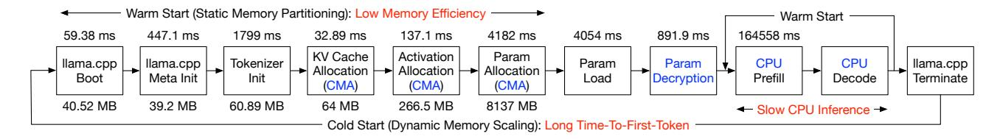
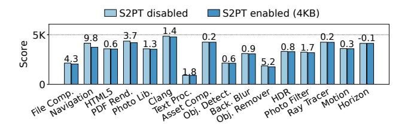
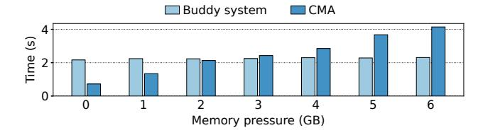
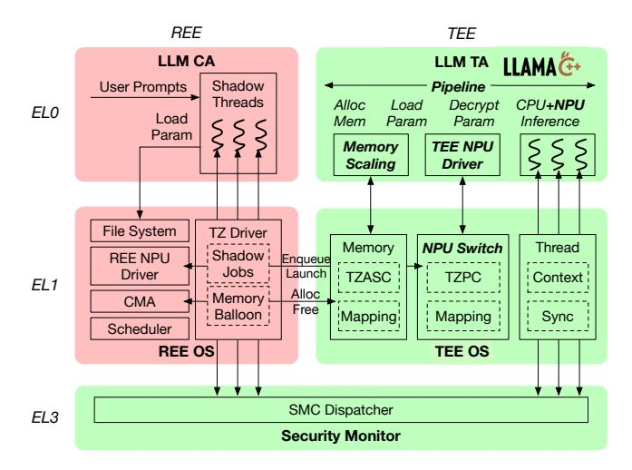

# 2 Background and Motivation

## 2.1 Confidentiality of On-Device LLMs

Modern mobile applications can automatically incorporate user data into LLM prompts to generate personalized responses [\[4\]](#page-13-0). Instead of using cloud systems, there is a growing trend to run LLM inference on mobile devices [\[29,](#page-14-12) [85,](#page-16-2) [88\]](#page-16-3), as it eliminates the network latency of querying cloud services and keeps users' private data on their devices.

However, storing LLM parameters on mobile devices introduces the risk of leaking the proprietary model to untrusted users, as mobile devices are prone to jailbreaking attacks. Model leakage can result in significant financial losses for the model provider, as the development of such models may cost millions of dollars [\[77\]](#page-16-0). Additionally, the leakage could severely undermine the model provider's advantage in the highly competitive LLM market [\[5\]](#page-13-4).

According to the prior study [\[77\]](#page-16-0), most mobile applications leave their on-device models completely unprotected, while others only encrypt model files but still allow attackers to extract plaintext model parameters from memory.

Figure 1. A strawman workflow of LLM inference in TEE ([§7](#page-10-0) testbed, 8-bit Llama-3-8B, 512-token prompt). Time and memory usage for each step are shown above and below each box. Red texts: challenges. Blue texts: overheads related to TEE protection.

## 2.2 Arm TrustZone

Our work uses Arm TrustZone [\[25\]](#page-14-1), a widely deployed hardware isolation mechanism on mobile devices, to protect LLMs. TrustZone separates hardware resources into a Rich Execution Environment (REE) and a Trusted Execution Environment (TEE). The TEE hosts security-critical trusted applications (TAs) and a minimal TEE OS, while the REE runs untrusted applications and a full-fledged OS like Linux.

TrustZone divides the CPU into a secure state and a nonsecure state. Software can switch CPU states by calling a security monitor running in EL3 using a Secure Monitor Call (smc) instruction. To enforce memory isolation, a TrustZone Address Space Controller (TZASC) protects eight contiguous physical memory regions as secure memory, which cannot be accessed by non-secure CPUs. Peripheral devices are also classified as secure devices and non-secure devices. A Trust-Zone Protection Controller (TZPC) prohibits any MMIO access to secure devices from non-secure CPUs. The TZASC controls the DMA permission of each device, only allowing secure devices to access secure memory. Moreover, Trust-Zone directs interrupts from secure devices to the TEE OS with an extension in the generic interrupt controller (GIC).

TrustZone can only protect contiguous physical memory, but contiguous memory allocation at runtime is challenging due to fragmentation [\[57\]](#page-15-3). Therefore, existing TEEs typically reserve secure memory at system boot. The Linux kernel provides a Contiguous Memory Allocator (CMA) [\[1\]](#page-13-3), which reserves a physical memory region. The buddy system can allocate pages from this region, but only movable pages can be placed in it. To preserve contiguity, CMA migrates movable pages out of the region as follows: the kernel allocates a new destination page outside CMA, unmaps the old page, copies its data to the new page, updates the page table mapping, and releases the old page for CMA allocation.

## 2.3 Challenges of LLM Inference in TEE

As illustrated in Figure [1,](#page-2-0) running LLM efficiently in TEE faces the following two challenges.

Challenge #1: The dilemma between memory efficiency and fast inference. Traditional TEEs [\[15\]](#page-14-2) statically partition memory as secure and non-secure at system boot. However, the LLM requires a large amount of memory for parameters, KV cache, activation, and other data (8.4GB in

Figure [1\)](#page-2-0). Using a large secure memory will result in memory shortage in REE as mobile devices are typically resource constrained.

Therefore, the secure memory should be dynamically scaled up and down as the LLM inference starts and completes. However, when scaling up secure memory, a naive "cold start" workflow (Figure [1\)](#page-2-0) for restarting LLM Trusted Application (TA) will incur high overhead on LLM TTFT. This overhead includes the following parts: (1) The inference framework initializes, parses model metadata and creates the tokenizer (2.3s). (2) The TEE allocates memory from REE. Due to the limitation of TZASC, it must allocate contiguous physical memory using Linux CMA, causing high memory migration overhead if the CMA region is occupied (up to 4.2s for 8GB parameters). (3) The system loads LLM parameters from the flash storage. Since the file system is accessible to the untrusted REE applications and OS, the model files must be encrypted, resulting in decryption overhead during loading (0.9s for 8GB parameters). The total cold start overhead is 11.6s in Figure [1.](#page-2-0)

Thus, a mechanism is needed to minimize the overhead on TTFT caused by dynamic scaling of secure memory.

Challenge #2: The lack of efficient and secure NPU time-sharing between REE and TEE. NPUs are widely deployed on mobile devices to support applications such as object detection, OCR, and photo refinement [\[19\]](#page-14-3). Since these applications typically run in the REE, the NPU is statically configured as a non-secure device at boot time. However, this design significantly hinders LLM performance in the TEE. As shown in Figure [1,](#page-2-0) the LLM prefill using CPU takes 164s. Prior work has shown that using the Qualcomm NPU [\[20\]](#page-14-13) can increase LLM prefill speed by 7.3× compared to the optimal CPU implementation [\[85\]](#page-16-2). Our evaluation also shows that the Rockchip NPU provides 12.5× and 1.3× optimizations on the prefill and decoding speed of Llama-3-8B, respectively.

It is intuitive to share the NPU between REE and TEE by deploying one driver in each world. The NPU can be switched between the two worlds by detaching it from one driver and attaching it to another driver. However, this approach has two limitations: (1) The detach-attach incurs substantial switching overhead as it requires full driver reinitialization. The detach-attach of a Rockchip NPU with the Linux driver takes 32ms. The overhead mainly stems from control plane

Performance Compatibility **End-to-end Security** Memory Scaling Approach Overall No Model Modification Accelerator Usage **Quantization Support** Shielding the entire model1 X No Obfuscation-based TSLP2 \* \* \* \* REE only X V X X V × × × × X X X REE only TSOP [75] TEESlice [97 \* \* REE only × TEE-REE sharing StrongBox [33] TEE only SecDeep [66] TZ-LLM (ours) TEE-REE sharing

Table 1. Comparison of existing TEE-based model protection approaches with TZ-LLM.

operations, including NPU power/frequency configuration and interaction with the Linux device framework. (2) Deploying the full-fledged NPU driver, which highly depends on the REE OS, in the TEE bloats the TCB. The Linux driver for Rockchip NPU relies on several Linux subsystems, like device, memory, interrupt, and power management, and the total code base is estimated to be over 60K LoC.

Thus, a mechanism for NPU time-sharing between REE and TEE is needed to reduce NPU world switching overhead and minimize the additional TCB in TEE.

#### 2.4 Existing Approaches Studies

2.4.1 TEE-based Model Protection. As shown in Table 1, extensive prior work has explored protecting on-device models with TEEs such as Arm TrustZone and Intel SGX. Some work [42, 47, 51, 55, 61, 90] shields the entire model within an accelerator-absent TEE to protect all model parameters and the inference framework. Although these approaches offer end-to-end security guarantees, they only use CPU for inference and incur significant overhead. Consequently, a line of work seeks to mitigate this overhead.

TEE-Shielded LLM Partition (TSLP). TSLP solutions partition models and offload a part of the parameters to REE accelerators for computation. Some TSLP approaches [63, 73, 76, 81, 96] enhance security by obfuscating the offloaded parameters. However, TSQP [75] points out that these approaches are incompatible with quantization, while quantization significantly reduces memory footprint and is well-suited for mobile devices [86, 87]. TSQP enables quantization through quantization-aware model training. Nonetheless, model stealing attacks using public pretrained models can compromise the security of these obfuscation-based TSLP solutions [97]. TEESlice [97] counters this threat with privacy-aware model training, offloading only privacy-irrelevant parameters to REE accelerators. However, it requires model modification, and it still leaves part of the parameters outside the TEE, failing to provide end-to-end security guarantees. In addition, these solutions also incur extra data copying between the REE and TEE, as well as additional computation for deobfuscation or privacy-related parameters.

**Accelerator-enabled TEE.** Other work attempts to enable accelerators within the TEE. StrongBox [33] builds a GPU TEE with TrustZone by deploying the a single GPU driver

in the REE for both secure and non-secure jobs. While it supports page-grained secure memory protection with S2PT, it reserves a static secure memory region and resorts to TZASC for DMA protection, which is not memory efficient. Moreover, it does not safeguard the integrity of the inference framework in the REE, thus lacking end-to-end security guarantees. SecDeep [66] statically configures accelerators as TrustZone secure devices, which restricts the REE functionalities. These approaches also incur frequent encryption and decryption overhead when data is swapped between secure and non-secure memory during inference.

In conclusion, existing TEE-based model protection systems fail to meet performance, security, and compatibility requirements simultaneously, primarily because they lacks REE-TEE accelerator time-sharing or dynamic secure memory scaling for effcient model inference inside the TEE.

**2.4.2 Elastic Secure Memory Protection.** Previous work uses Stage-2 Page Tables (S2PT) for memory protection at page granularity [33, 46, 48]. Specifically, they run the untrusted OS and applications inside a VM and unmap the secure memory pages from the S2PT. Although this design could support elastic secure memory scaling without the overhead of contiguous memory allocation, we conduct preliminary experiments on the testbed in §7 to demonstrate why we choose not to adopt it.

**S2PT** incurs continuous overhead on REE applications, while the overhead of CMA allocation is transient. The CPU running REE applications must perform a two-dimensional page table walk for each TLB miss [31, 41, 93]. Although using 2MB or 1GB huge pages in the S2PT reduces overhead, most mappings fall back to 4KB granularity after allocating memory for the LLM due to memory fragmentation. Figure 2 shows that stage-2 translation with 4KB mappings can incur a maximum overhead of 9.8% on Geekbench applications [7], and the average overhead is 2.0%.

Although stage-2 translation can be disabled to avoid the overhead when the LLM is idle, this disables memory protection, requiring all secure memory to be cleaned. To mitigate model loading overhead, parameters can be cached in S2PT-protected memory, at the cost of *continuous* overhead on REE applications.

&lt;sup>1 Shielding the entire model [42, 47, 51, 55, 61, 90]. 2 Obfuscation-based TSLP [63, 73, 76, 81, 96].

**Figure 2.** Geekbench scores with S2PT enabled or disabled. The texts are the overheads caused by S2PT (%).

In contrast, while migrating pages from the CMA region also imposes overhead on REE applications, the overhead is *transient* and only exists at the beginning of LLM inference. **CMA allocation overhead is small under low memory pressure, and can be hidden under high memory pressure.** We evaluate the time for allocating 8GB memory for 8-bit Llama-3-8B using CMA and buddy system (4KB), respectively. To assess the overhead of page migration, we use stress-ng [23], which maps a portion of memory and generates pressure by running multiple sophisticated memory testing algorithms on the mapped region. Figure 3 shows the results.

**Figure 3.** Memory allocation time for Llama-3-8B (8GB) using buddy system or CMA, at different memory pressures.

Under high memory pressure, the CMA allocation throughput is 1.9GB/s, which is similar to the I/O throughput of sequential reads on our platform (2GB/s). Moreover, by using multi-threading, the CMA allocation throughput can reach 3.8GB/s (4 threads). Therefore, we can hide the allocation overhead under the latency of reading the model file.

**S2PT protection cannot prevent DMA attacks.** S2PT does not control DMA permissions. To prevent DMA attacks on S2PT-protected secure memory, a privileged monitor like the EL3 monitor must intercept every IOMMU configuration operation and unmap the secure memory from I/O page tables [48], or intercept every MMIO operation and verify the DMA addresses [46]. Both designs introduce monitoring overhead on REE and extend the privileged TCB.

#### 3 Overview

#### 3.1 Threat Model

Attack vectors. We consider an attacker attempting to steal on-device LLM parameters, or intermediate inference results that may help model theft, such as activations and KV cache. The attacker might extract parameters by directly accessing memory/flash or exploiting peripheral devices to initiate malicious DMA requests. Attackers may also try to induce the inference framework to exfiltrate model parameters, by exploiting TEE-REE interfaces for Iago attacks (e.g., breaking the integrity of secure NPU jobs). Physical attacks on memory confidentiality are not considered because TrustZone does not enforce memory encryption, and it can be addressed with future hardware [10]. Side-channel and cryptographic attacks fall outside our scope as they are orthogonal to our concern and can be defended with complementary techniques. Denial-of-service (DoS) attacks are also out-of-scope as they do not compromise model confidentiality.

Trusted computing base (TCB). We trust the TEE OS, the TEE NPU driver, and the inference framework (LLM TA). Arm TrustZone hardware, EL3 monitor, and NPU hardware are also trusted. The integrity of these components can be guaranteed with secure boot. Other components within the TEE, such as other TAs and other secure devices, are not trusted. All components in the REE are excluded from the TCB, including the REE OS, the full-fledged REE NPU driver, REE applications, and non-secure peripheral devices.

## 3.2 System Architecture

**Figure 4.** TZ-LLM architecture, S/N: secure/non-secure.

We propose TZ-LLM, a system for protecting on-device LLMs using Arm TrustZone. As shown in Figure 4, TZ-LLM runs the LLM inference framework (e.g. llama.cpp) as a TA, which can be invoked by a client application (CA) in the REE through the TrustZone (TZ) driver in the REE OS (Linux).

The TZ driver also enables interactions between the TEE OS and the CA, Linux CMA, and REE NPU driver to delegate model loading, memory scaling, and NPU job scheduling.

Our design assumes a mobile platform with a hardware platform supporting Arm TrustZone and a software platform consisting of a REE OS with a TEE OS. These assumptions are generally applicable across mobile devices.

Addressing challenge #1: Elastic memory scaling with pipelined restoration. The LLM TA can extend or release secure memory using interfaces provided by the TEE OS. When extending the secure memory, the TEE OS asks the TZ driver to allocate memory from Linux CMA (memory ballooning) and protects it by configuring TZASC. The extended memory can be released with a reverse process.

To mitigate the parameter restoration overhead (allocation, I/O, and decryption) on LLM TTFT (Figure [1\)](#page-2-0), TZ-LLM runs these processes in parallel with LLM inference. The insight for this design is the determinism of the memory access pattern of LLMs. Specifically, the computation graph of the LLM is a DAG, in which each node represents an operator like matrix multiplication, and the inference framework schedules the operator in the topological order of the DAG. Each operator only uses a portion of LLM parameters, e.g., operators in LLM layer 1 only use parameters of layer 1. Therefore, when handling one operator, the inference framework can accurately know which parameters will be accessed next and prefetch these parameters in parallel.

If an LLM operator is ready, but the parameters have not been restored, or the hardware is busy, the operator will be blocked, leading to pipeline bubbles. TZ-LLM designs two techniques to minimize such bubbles ([§4.1\)](#page-5-0). First, the pipeline is scheduled using a priority-based and preemptive mechanism that prioritizes the most urgent task in the pipeline that may lead to a bubble. Second, the LLM TA uses a partial caching mechanism that gradually releases memory based on the REE memory pressure after the inference is done, and the parameters remaining in memory can be used by the next inference without restoration.

With partial parameter caching, the TA must ensure that the cached secure memory is contiguous. Fortunately, it is optimal to cache the parameters used early during inference, so that the secure memory is released in the reverse topological order of the DAG. This first-in-last-out allocationdeallocation pattern aligns well with the contiguity requirement. We design an "extend and shrink" secure memory management interface based on this pattern ([§4.2\)](#page-7-0).

Addressing challenge #2: TEE-REE NPU time-sharing with control-data separation. The LLM TA can issue secure NPU jobs with a TEE NPU driver. The TEE and the REE multiplex the NPU with time-sharing. An REE application can run NPU jobs during LLM inference.

For secure and efficient TEE-REE NPU time-sharing, we observe that the workflow of an NPU job (data plane), including setup, launching, and completion, forms a small and self-contained closure. The functionality and security of this workflow does not depend on the control plane state of the full-fledged NPU driver, such as scheduling or power management. This property allows TZ-LLM to use a co-driver design ([§4.3\)](#page-7-1) by integrating only the tiny data plane of the NPU driver into the TEE, which cooperates with the control plane in the REE NPU driver. Therefore, most control plane code and dependencies can be tailored from the TEE driver and the NPU can switch between the two worlds without reinitializing the control plane. The REE driver manages the unified scheduling of both secure and non-secure NPU jobs, delegating secure jobs to the TEE driver. The TEE driver protects the confidentiality and integrity of the secure jobs based on TrustZone hardware configuration and security checks.

Other techniques for efficient inference. As shown in Figure [1,](#page-2-0) the initialization of framework, model metadata and tokenizer also takes a long time. We mitigate this overhead by saving a checkpoint of the initialized state in flash and restoring it on each inference request. The KV cache and activation allocation overhead is not mitigated because it is minor compared with the inference time.

In addition to NPU, on-device LLM inference also requires CPU multi-threading for acceleration, but traditional TEEs provide only one thread for each TA. TZ-LLM allows the TA to create multiple threads and schedules them using the REE scheduler. Specifically, each TA thread is paired with a shadow thread in the CA. When a shadow thread is activated, it uses smc to start or resume the corresponding TA thread. For security, the contexts of TA threads and the synchronization primitives are managed by the TEE OS.

The file system is managed by the REE, and the LLM TA delegates I/O requests to the CA with smc when loading parameters from the flash. To avoid blocking the CPU, the CA issues asynchronous I/O (aio) requests to the file system.

