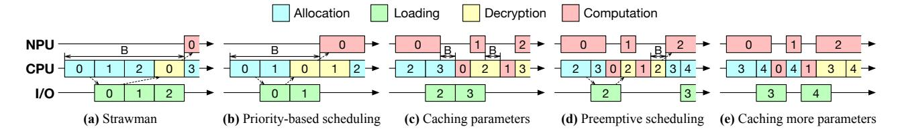
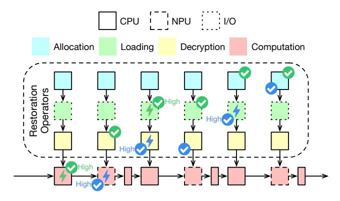
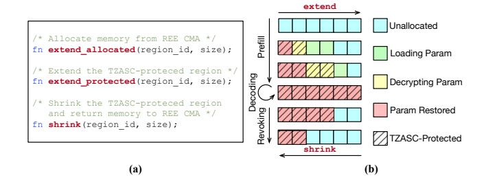
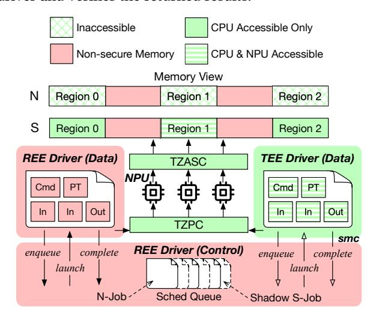

# 4 Detailed Design

## 4.1 Pipelined Parameter Restoration

To accelerate the cold start of LLM TA, TZ-LLM adopts a pipeline mechanism that overlaps the parameter restoration operations with the prefill-stage computation of the LLM.

Restoration operators. As shown in Figure [6,](#page-6-0) with parameter restoration, the LLM computation graph is extended by inserting three restoration operators before a prefill-stage computation operator, representing the memory allocation, parameter loading (flash I/O), and parameter decryption for restoring the parameters used by the computation operator.

The computation and restoration operators run on three types of hardware: CPU, NPU, and I/O engine. Contiguous

**Figure 5.** Pipelined restoration timelines. The figure shows the effect of different techniques for reducing bubbles. B: bubble. The number in each box denotes the index of the computation operator that the operator belongs to. The indices follow the topological order of the computation graph. The dashed arrows denote the dependencies of operators, which cause bubbles.

memory allocation (memory migration) and parameter decryption run on CPUs. Some computation operators, such as layer normalization and self-attention, run on CPUs, while others, such as matrix multiplication, run on the NPU. Parameter loading is performed by the I/O engine.

**Pipeline scheduling problem.** There may be multiple restoration or computation operators ready for the same hardware at the same time. For example, in Figure 6, the green checkmarks indicate that there are four operators ready for the CPUs and two operators ready for the I/O engine. The scheduling problem is to determine the execution order of the operators to minimize the TTFT. For the scheduling of the I/O engine and the NPU, it is intuitive that the best policy is to schedule the loading (I/O) and computation operators in the topological order of the computation graph. Therefore, the main problem is the scheduling of CPU operators.

**Figure 6.** Pipeline scheduling examples. The arrows denote the dependencies of operators. The green and blue marks denote two different scheduling points. The checkmark denotes that the operator is ready. The lightning symbol denotes that the operator is scheduled (highest priority).

**Priority-based pipeline scheduling.** It is hard to find an optimal scheduling policy for CPU operators because the scheduling goal depends on the pipeline critical path, which varies across different models, prompts, and hardware. There are three potential critical paths: (1) loading (I/O) operators,

(2) CPU operators, including allocation, decryption, and computation, and (3) computation operators, including CPU and NPU computation. If loading operators are the critical path, the scheduler should prioritize allocation operators to reduce bubbles on the loading path. If computation operators are the critical path, the scheduler should prioritize computation operators and make restoration operators complete early enough to prevent computation stalls. If CPU operators are the critical path, the scheduler should keep the CPU busy, reducing bubbles caused by waiting for I/O or NPU.

In practice, we observe that the critical path is usually CPU operators or computation operators, instead of loading operators. To meet the scheduling goals of these two common critical paths, TZ-LLM uses a greedy policy that schedules the CPU computation operator if it's ready, or schedules the restoration operator related to the earliest computation operator if no CPU computation operator is ready. This aligns well with the two scheduling goals because (1) it reduces computation stalls by prioritizing computation operators and earlier restoration operators, and (2) it enables CPU computation operators to be ready for scheduling early, thereby keeping the CPU busy. The evaluation shows that the performance of this policy is close to the optimal (§7.2.1).

The scheduler maintains a priority queue of ready operators and executes them according to the priority rule. As shown in Figure 5a and Figure 5b, the scheduler prioritizes decryption operator 0 over allocation operator 2, reducing the bubble before NPU computation operator 0.

**Preemptive pipeline scheduling.** We find that priority-based scheduling without preemption still suffers from bubbles due to the misalignment of operator execution times. As shown in Figure 5c, CPU computation operator 0 is blocked by allocation operator 3, resulting in a bubble. We eliminate such bubbles with preemptive scheduling, by dividing allocation and decryption operators into smaller micro-operators and introducing preemption points between them. As shown in Figure 5d, allocation operator 3 is preempted as soon as CPU computation operator 0 becomes ready.

**Partial parameter caching.** As shown in Figure 5b, the pipeline has a bubble at the beginning that waits for the first parameter tensor, regardless of the scheduling policy. To eliminate this bubble, TZ-LLM keeps some secure memory

unrevoked after inference to partially cache the plaintext parameters. With this mechanism, the next inference can resume from the computation stage of the cached parameters, avoiding full restoration. As shown in Figure [5c](#page-6-1), by caching parameters of operators 0∼1, the initial bubble is eliminated.

Sometimes TZ-LLM needs to cache more parameters, as the bottleneck of the prefill stage may shift to restoration operators when the computation time is short. For example, computation operator 2 in Figure [5d](#page-6-1) is blocked by decryption operator 2, and this bubble can be eliminated by caching parameters of operators 0∼2 (Figure [5e](#page-6-1)).

It is optimal to cache the parameters used by early computation operators as the later parameters can be restored in parallel with the early computation. To this end, TZ-LLM lazily releases secure memory in the reverse topological order of the computation graph according to the REE memory pressure. The LLM TA provides an interface to the REE OS to revoke secure memory to the REE.

Limitation. A limitation of TZ-LLM is that it may deliver suboptimal performance on non-deterministic workloads. For example, it prefetches all experts in a Mixture of Experts (MoE) model or all layers in an early-exit transformer, including parameters not used in the current inference. The cost of this additional prefetching can be amortized by future inferences that do utilize these parameters.

## 4.2 Pipeline-Aware Secure Memory Management

The limitation of TZASC mandates that secure memory remain contiguous during scaling. Fortunately, the memory allocation-deallocation pattern of pipelined restoration allows us to design secure memory management interfaces that effectively satisfy this requirement.

Allocation patterns and memory layouts. The LLM TA uses four types of data: LLM parameters, KV cache, activations, and others (libraries, metadata, etc.). TZ-LLM places these data in two contiguous TZASC regions.

One TZASC region is used for LLM parameters. With partial parameter caching ([§4.1\)](#page-5-0), LLM parameters are progressively loaded during pipelined restoration and progressively released in the reverse order of allocation after inference. As shown in Figure [7b](#page-7-2), this first-in-last-out allocationdeallocation pattern ensures that the in-memory parameters are always stored contiguously.

Another TZASC region is used for KV cache, activations, and other data. The KV cache is initialized to the prompt size during the prefill stage, grows with the number of generated tokens during the decoding stage, and is completely released after inference. The activations and other data are fixed-size buffers allocated at inference start and released at inference completion, so that they can be placed before the KV cache without breaking the contiguity of the TZASC region.

Secure memory management interfaces. Based on the allocation patterns and memory layouts, the TEE OS provides

Figure 7. (a) Secure memory management interfaces, (b) memory layout of the CMA region for model parameters.

"extend and shrink" interfaces to the LLM TA for scaling TZASC regions up and down, as shown in Figure [7a](#page-7-2).

Each TZASC region is associated with a CMA region in the REE. When extending the secure memory, the TA first calls extend\_allocated. Then, the TEE OS asks the TZ driver to allocate memory blocks from the CMA region. To ensure the contiguity of the entire allocated memory, CMA allocates new memory blocks adjacent to the previously allocated blocks. The TEE OS verifies this requirement when it receives the allocated memory address from the TZ driver. After allocation, the TA calls extend\_protected. The TEE OS then extends the end of the TZASC region to protect the newly allocated memory, and maps the new memory into the TA's address space. When revoking secure memory, the TA calls shrink to release memory from the end of the TZASC region. The TEE OS unmaps memory from the TA's address space, shrinks the TZASC region and asks the TZ driver to release memory to the CMA. The TEE OS clears all sensitive data before releasing the memory.

The separation of extend\_allocated and extend\_protected is designed to eliminate the need for I/O bounce buffers during parameter loading (flash I/O). As shown in Figure [7b](#page-7-2), after calling extend\_allocated, the REE file system can directly load encrypted parameters into the unprotected allocated memory, instead of a bounce buffer. After loading, the new memory is protected with extend\_protected and the parameters are decrypted. This design reduces memory consumption and avoids additional copying overhead.

Minimizing TEE OS modification. The "extend and shrink" interfaces introduce only minor modifications to the TEE OS. In contrast, if the LLM TA is allowed to allocate/deallocate secure memory in an arbitrary order, the TZASC region will become fragmented and the TEE OS needs to defragment the region upon revocation. TZ-LLM leverages the allocation patterns to avoid this complexity.

## 4.3 TEE-REE NPU Time-Sharing

Inspired by the outsource-and-verify principle [\[98\]](#page-17-5), which delegates complex operations to an untrusted component while verifying their outcomes, TZ-LLM adopts a co-driver design to enable NPU time-sharing between the REE and the TEE, as shown in Figure [8.](#page-8-0) Specifically, a full-fledged NPU driver and a small data plane NPU driver are deployed in the REE and the TEE, respectively, cooperating to manage secure and non-secure NPU jobs. The TEE data plane driver outsources control plane operations to the untrusted REE driver and verifies the returned results.

Figure 8. TEE-REE NPU time-sharing, S: secure, N: nonsecure, cmd: register commands, PT: I/O page table, in/out: input/output buffers, region: TZASC region.

The goals of the co-driver design are to: (1) separate the NPU driver into isolated domains, (2) provide an isolated execution environment that ensures the confidentiality and integrity of secure NPU jobs, (3) enable NPU time sharing for secure and non-secure NPU jobs with minimal overhead, and (4) minimize the additional TCB introduced to the TEE. Separating control and data planes. The data plane of the NPU driver performs the following steps for each NPU job: (1) it initializes the execution context of the job, i.e., the memory for the I/O page table, register commands (the NPU job code), and input/output buffers; (2) it performs MMIO operations to launch the job by specifying the execution context; (3) it handles interrupts upon job completion. These steps form a minimal closure that should be integrated into the TEE driver, with the corresponding resources (memory, MMIO, and interrupts) isolated to preserve the confidentiality and integrity of secure NPU jobs.

The control plane of the NPU driver manages device configuration during initialization and power management before and after job execution. As shown in Figure [8,](#page-8-0) it also handles job scheduling, which interacts with the data plane through scheduling interfaces: (1) it enqueues the job into the scheduling queue; (2) it calls the data plane for launching when the job is scheduled; (3) it continues to schedule the next job upon completion of the current job. Since the control plane does not access the isolated resources during job execution, it can safely reside in the REE driver. The function

call interfaces between the REE control plane and the TEE data plane are replaced with smc.

Isolated execution environment. The TEE driver switches the NPU between non-secure and secure modes. In nonsecure mode, the NPU is prohibited from accessing secure memory. In secure mode, the NPU's MMIO region is accessible only to the TEE, its interrupts are routed to the TEE, and it is allowed to access secure memory. Secure jobs run in secure mode, and the execution contexts of secure jobs are stored in secure memory.

Specifically, the TEE driver performs the following steps when switching the NPU to secure mode. First, it updates the TZPC to isolate the MMIO region of the NPU from the REE and the GIC controller to route NPU interrupts to the TEE. Second, it waits for the ongoing non-secure NPU job, if any, to complete. Third, it sets the TZASC to grant the NPU access to secure memory. The order of these steps is critical to ensure that (1) no new non-secure NPU job can be launched during the sanity check of ongoing non-secure jobs, and (2) any previously launched non-secure NPU job is completed before the NPU is granted access to secure memory.

TEE-REE time-sharing. TZ-LLM reuses the NPU job scheduling mechanism in the REE driver to support NPU timesharing for secure and non-secure NPU jobs.

As shown in Figure [8,](#page-8-0) the REE driver is extended to maintain a unified scheduling queue for secure and non-secure NPU jobs. Each time the LLM TA issues a secure NPU job, the TEE driver issues a paired shadow job with an empty execution context to the REE driver. When a shadow job is scheduled, the REE driver proactively transfers NPU control to the TEE driver. The TEE driver then transitions the NPU into secure mode to create an isolated execution environment. To prevent arbitrary launch and replay attacks, the TEE driver ensures that the secure NPU job has been previously initialized but not yet issued. To prevent reordering attacks, the TEE driver assigns each job a monotonic sequence number before issuing it to the REE driver and verifies the number against the current execution sequence number when scheduled. After these checks, the TEE driver launches the secure NPU job and waits for its completion. Upon completion of the secure job (receipt of a secure interrupt), the TEE driver returns the NPU back to non-secure mode and informs the REE driver that the shadow job is complete. Finally, the REE driver discards the shadow job and schedules the next NPU job.

Minimal TCB. Despite the complexity of the REE NPU driver, TZ-LLM minimizes the additional TCB in TEE with two complementary approaches. First, TZ-LLM integrates only the tiny data plane closure into the TEE driver, while excluding control plane components such as job scheduling and dependencies on complex Linux subsystems like device, memory, interrupt, and power management.

Second, TZ-LLM deprivileges the TEE NPU driver to user mode, isolating potential vulnerabilities in the driver from affecting the existing TEE system. The TEE OS strictly confines the privileges of the user-mode NPU driver by enforcing two restrictions. First, the TEE OS only maps the MMIO region of the NPU into the NPU driver's address space, and thus the driver cannot access other secure devices. Second, the TEE OS only allows the NPU to access the execution contexts of secure NPU jobs. This is possible because the parameters, intermediate results, I/O page tables and register commands are placed in independent TZASC regions ([§4.2\)](#page-7-0). By configuring the TZASC, the TEE OS only allows the NPU to access these specific regions, while prohibiting NPU access to all other regions. This design follows the broader minimal TCB TEE philosophy [\[32,](#page-14-20) [60\]](#page-15-12), retaining only a minimal privileged security monitor for isolation while deprivileging functionality into user mode.

