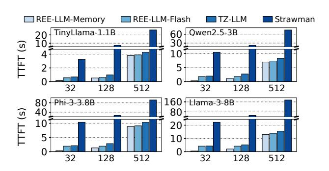
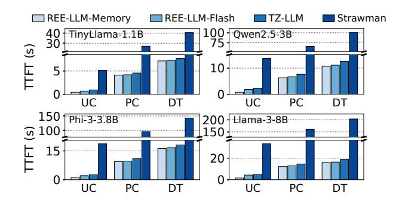
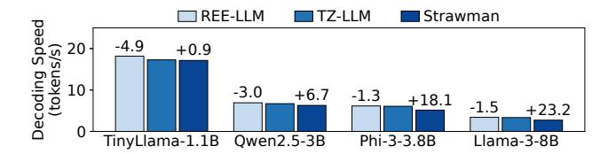
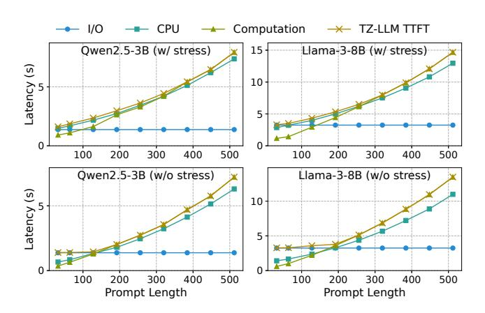
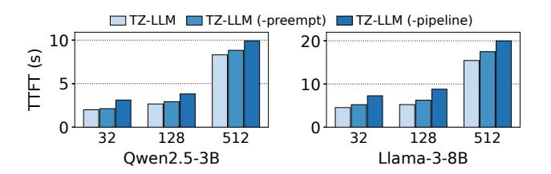
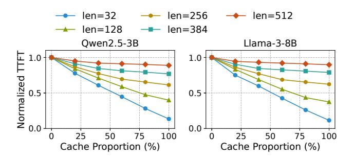
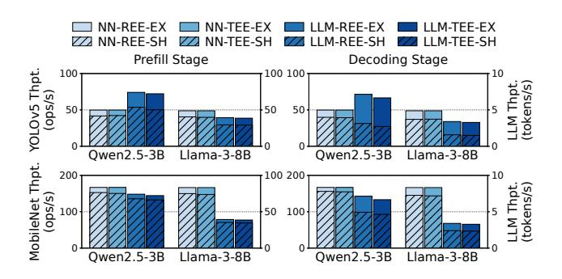

# 7 Performance Evaluation

In this section, we first evaluate the end-to-end performance of the LLM TA ([§7.1\)](#page-10-1) and analyze the optimization effect of pipelined restoration ([§7.2\)](#page-11-0). Then, we run the LLM TA in parallel with REE applications to evaluate the overhead of TEE-REE NPU time-sharing ([§7.3\)](#page-12-1) and the interference caused by CMA allocation ([§7.4\)](#page-13-7).

Testbed. The evaluation is conducted on an Orange Pi 5 Plus board [\[17\]](#page-14-10) (RK3588 CPU/NPU [\[21\]](#page-14-11)), equipped with four Cortex-A76 (2.4GHz) CPU cores and four Cortex-A55 (1.8GHz) CPU cores, 16GB of LPDDR4X RAM, an 1TB NVMe SSD (PCIe 3.0 x4), and an NPU with three cores and up to 6 TOPS of computation power.

Baselines. We compare TZ-LLM with the following baselines: (1) REE-LLM-Memory: The unmodified llama.cpp framework running in the REE, with all model parameters preloaded in memory. This baseline represents the theoretical best performance, but it is impractical due to memory inefficiency and lacks protection for parameters. (2) REE-LLM-Flash: The unmodified llama.cpp framework running in the REE, with model parameters loaded with pipelined restoration at inference start (buddy system allocation, no decryption). This baseline is practical but provides no protection for parameters. (3) Strawman: The "cold start" strawman in [§2.3,](#page-2-1) which performs cold start and CPU computation for each inference request. This baseline offers security guarantees and memory efficiency but lacks pipelined restoration and NPU support within the TEE.

Models and deployment. We evaluate TZ-LLM with four representative on-device LLMs: TinyLlama-1.1B[\[95\]](#page-17-1), Qwen2.5-3B[\[89\]](#page-16-4), Phi-3-3.8B[\[28\]](#page-14-8), and Llama-3-8B[\[12\]](#page-14-7). All models are 8-bit quantized, with parameter sizes of 1.0 GB, 3.3 GB, 3.7 GB, and 7.9 GB, respectively.

The LLM TA runs on the four Cortex-A76 CPU cores and all three NPU cores. For evaluations in [§7.1](#page-10-1) and [§7.2,](#page-11-0) we simulate the memory pressure in the REE with the stress-ng [\[23\]](#page-14-18) tool, to trigger memory migration during CMA allocation. To show the worst-case performance, the memory pressure is 13GB, 11GB, 10GB and 6GB for the four models, respectively. The stressing threads and LLM threads are pinned to different CPU cores to avoid interference.

Benchmarks. We use three benchmarks from prior work on on-device LLMs [\[85,](#page-16-2) [88\]](#page-16-3): UltraChat [\[36\]](#page-14-9) (multi-turn dialogues), PersonaChat [\[52\]](#page-15-2) (chat summarization tasks), and DroidTask [\[83\]](#page-16-5) (UI automation tasks).

## 7.1 End-to-End Performance

In this section, we evaluate the prefill and decoding performance of the LLM TA and explain the source of overhead or optimization compared with the baselines.

7.1.1 Prefill Performance. We evaluate TZ-LLM's endto-end prefill performance using both fixed-length prompts and real-world benchmarks.

TTFT under different prompt lengths. Figure [9](#page-10-2) presents the TTFT of the evaluated systems and models at prompt lengths of 32, 128 and 512 tokens.

Figure 9. TTFT of different models under different prompt lengths. The x-axis represents the prompt length.

Compared to the strawman baseline, TZ-LLM reduces the TTFT by 77.1%∼91.1% across all models and prompt lengths. This improvement stems from the pipelined parameter restoration mechanism, the NPU support in the TEE, and the checkpoint/restoration of the framework initial state (mentioned in [§3\)](#page-4-4). The NPU support accelerates prefill computation, reducing TTFT by up to 87.2%. Meanwhile, state checkpoint eliminates the framework initialization overhead, further reducing TTFT by up to 36.8%. Finally, the pipeline mechanism effectively hides the parameter restoration latency, further reducing TTFT by up to 40.6%.

Compared to the REE-LLM-Flash baseline, TZ-LLM incurs 2.5%∼22.3%, 22.2%∼55.3%, 10.2%∼15.2% overhead at prompt lengths of 32, 128, and 512, respectively. This overhead is mainly caused by CMA allocation (memory migration) and the parameter decryption during parameter restoration. The overhead is relatively small for short and long prompt lengths, but more pronounced for medium prompt lengths. For short prompt lengths, the TTFT is bounded by flash

I/O, allowing allocation and decryption to overlap with I/O operators. For long prompt lengths, the TTFT is dominated by CPU and NPU computation, enabling allocation and decryption to overlap with NPU execution. In contrast, for medium prompt lengths, the TTFT is driven by the sum of CPU computation, allocation, and decryption, resulting in only partial overlap of allocation and decryption with NPU execution and I/O operators. Other overheads of TZ-LLM, such as the communication between TEE/REE NPU drivers and decryption of the framework initial state, are minor compared with prefill computation time.

TZ-LLM incurs up to 8.5× overhead compared with the REE-LLM-Memory baseline, due to parameter restoration. However, TZ-LLM is more memory-efficient, and the overhead can be reduced with partial parameter caching (§7.2.3). Moreover, the overhead is only 13.0%~18.9% for the long prompts (512 tokens), as parameter restoration overhead is hidden under the computation time.

**Benchmark results.** Figure 10 shows the average TTFT of the evaluated systems and models on the three benchmarks.

**Figure 10.** Average TTFT on different real-world benchmarks, UC: UltraChat, PC: PersonaChat, DT: DroidTask.

For each pair of model and benchmark, we calculate the geometric mean of TZ-LLM's overhead/optimization across different prompts. TZ-LLM achieves 76.1%~90.9% TTFT reduction compared to the strawman baseline, while incurring 5.2%~28.3% slowdown compared to the REE-LLM-Flash baseline. Compared to the REE-LLM-Memory baseline, TZ-LLM incurs 2.5×~3.7× overhead on UltraChat and 8.1%~21.2% overhead on PersonaChat and DroidTask. The higher overhead on UltraChat is due to its shorter prompts, where parameter restoration dominates the inference time, but it can be mitigated via partial parameter caching (§7.2.3).

**7.1.2 Decoding Performance.** Figure 11 shows the decoding speed at a prompt length of 128 and an output length of 64. Results under other prompt and output lengths are similar and are omitted for brevity. The decoding speeds of REE-LLM-Memory and REE-LLM-Flash are the same, so we only show a single bar.

**Figure 11.** Token generation speeds during decoding for different models. The percentages shown above each bar represent TZ-LLM's relative performance improvement (+) or degradation (-) compared to the respective baseline.

The decoding speed of TZ-LLM shows a modest 0.9%~23.2% improvement over the strawman baseline, thanks to the NPU support in the TEE. In contrast to the more significant gains seen in the prefill stage, this relatively small improvement can be attributed to the single-batch computation pattern of decoding (processing one token in each iteration), which cannot fully utilize the computation power of the NPU. Compared to the REE-LLM baseline, TZ-LLM experiences a 1.3%~4.9% slowdown in decoding speed. This overhead originates from the communication between the TEE and REE NPU drivers for NPU multiplexing (§4.3). The overhead is smaller for larger models because the NPU computation time is longer.

#### 7.2 Effect of Pipelined Restoration

In this section, we comprehensively evaluate the pipelined restoration mechanism in TZ-LLM. First, we evaluate the effectiveness of our pipeline scheduling policy (§7.2.1). Then, we analyze how preemptive scheduling (§7.2.2) and partial parameter caching (§7.2.3) reduce the TTFT.

**Figure 12.** The latency of each critical path and the TTFT of TZ-LLM under different models and prompt lengths, with 20% LLM parameters cached. stress: memory stress. I/O: the total latency of all loading (I/O) operators. CPU: the total latency of CPU computation, allocation, and decryption. Computation: the total latency of CPU and NPU computation.

**7.2.1** Scheduling Policy Effectiveness. To evaluate the effectiveness of our priority-based pipeline scheduling policy, we analyze the latency of the three potential critical paths of the pipeline mentioned in §4.1. The maximum latency of them is the theoretical lower bound on TTFT for any scheduling policy. We configure the experiments with 20% of the parameters cached to eliminate initial pipeline bubbles, which is independent of the scheduling policy. Since our scheduling policy favors the scenario with the critical path of CPU or computation operators, we also evaluate the scenario with the critical path of I/O operators by eliminating memory stress (eliminating CPU memory migration overhead) to analyze the worst case of our policy.

Figure 12 shows that TZ-LLM incurs 0.01%~9.9% overhead compared to the theoretical lower bound when memory stress is enabled. When disabling memory stress, the overhead increases to a modest 10.4%. Therefore, our scheduling policy performs close to the optimal one.

**7.2.2** Effect of Preemptive Scheduling. Figure 13 shows the effect of preemptive pipeline scheduling on reducing the TTFT. Compared with TZ-LLM without pipelined restoration, the pipeline without preemption reduces the TTFT by up to 31.7%. By enabling preemption on allocation and decryption operators, TZ-LLM eliminates the pipeline bubbles caused by misalignment of operator execution times, further reducing the TTFT by up to 16.2%.

**Figure 13.** The effect of preemptive pipeline scheduling under different prompt lengths and models.

**7.2.3** Effect of Partial Parameter Caching. To assess the effect of partial parameter caching, we vary the proportion of cached parameters from 0% to 100%. Figure 14 illustrates the TTFT of various models across different prompt lengths and cache proportions.

As more parameters are cached, the TTFT decreases approximately linearly up to a threshold. After this threshold, the benefit of additional caching diminishes as the restoration overhead is effectively hidden beneath the computation. This threshold is primarily determined by the NPU computation time, which depends on the model and prompt length. Besides the current mechanism that adjusts the cache size based on REE memory pressure, TZ-LLM can also determine a cache size by identifying the threshold with profiling.

**Figure 14.** The TTFT of TZ-LLM under different cache proportions. For each model and prompt length, the TTFT is normalized by the TTFT of the 0% cache setup.

## 7.3 NPU Time-Sharing Performance

We evaluate the NPU time-sharing performance of TZ-LLM by concurrently running mainstream neural network (NN) applications that use the NPU alongside LLM inference. The two evaluated NN applications are YOLOv5 [27] for object detection and MobileNet [49] for image classification. We choose two LLM models with small or large model sizes and use a prompt with 512 tokens. The throughputs of the NN applications and the LLMs are displayed in Figure 15.

**Figure 15.** The throughputs of NN applications (left y-axis) and LLMs (right y-axis) with NPU time-sharing. REE: REE-LLM-Memory, TEE: TZ-LLM (100% cached), EX: NN application and LLM run exclusively, SH: NN application and LLM run concurrently with a shared NPU.

As expected, when the NN application and the LLM run concurrently (-SH), the throughputs of both sides are lower compared with their counterparts under exclusive running (-EX), due to NPU multiplexing. Compared with NPU timesharing within the REE (-REE), the TEE-REE NPU timesharing mechanism (-TEE) introduces a small additional overhead, with NN applications and LLMs experiencing only up to 3.8% and 3.0% extra slowdown, respectively.

To quantify the overhead of TEE-REE NPU time-sharing, we measure the time spent on (1) *smc* switches for shadow job scheduling, (2) TZASC and TZPC configuration, and (3) GIC configuration. The total time-sharing overhead accounts

for  $1.6\% \sim 2.7\%$  and  $2.3\% \sim 5.7\%$  of the TTFT and decoding time across all evaluated setups.

