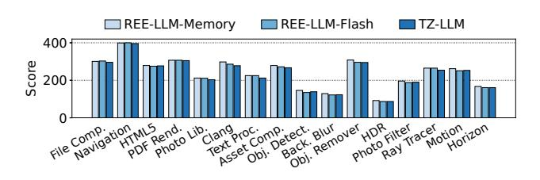

# 7.4 Interference Between CMA and REE Applications

The performance of REE applications may be affected by memory migration during CMA allocation. We evaluate this overhead by concurrently running Geekbench [7] with LLM inference. To show the worst-case overhead, we configure TZ-LLM and REE-LLM-Flash to run the prefill stage, revoke all memory, and then restart the prefill stage. The REE-LLM-Memory baseline only repeats the prefill stage. The benchmark threads and LLM inference threads are pinned to different CPU cores. The results are shown in Figure 16.

**Figure 16.** Geekbench scores when running concurrently with LLM prefill stage (Llama-3-8B, 512-token prompt).

Compared to the REE-LLM-Memory and REE-LLM-Flash baselines, the Geekbench scores under TZ-LLM show a degradation of up to 6.7% and 5.8%, respectively. This overhead is comparable to that introduced by S2PT (Figure 2). However, unlike S2PT, the overhead from CMA allocation occurs *only during the prefill stage* and is negligible during the decoding stage or when inference is not running.

#### 8 Other Related Work

On-device LLM inference. On-device LLM inference has garnered significant attention recently [86, 87]. Some prior work runs the LLM with limited memory by swapping parameters between the memory and the flash during inference [29, 88]. Combining TZ-LLM with these parameter offloading techniques is considered future work. Currently, TZ-LLM keeps parameters in memory during decoding. Some prior systems [85, 88] use on-device NPUs to speed up LLMs. TZ-LLM supports NPU acceleration in the TEE.

Some work reduces the parameter sizes of LLMs with quantization, knowledge distillation, or weight pruning [11, 35, 39, 40, 43, 44, 64, 67, 68, 91]. However, even with reduced parameter sizes, dynamic secure memory scaling is still needed for memory efficiency.

**Model confidentiality protection.** Some prior work protects models with cryptographic techniques like homomorphic encryption [58, 70] and multi-party computation [37, 82]. However, they incur significant performance degradation, particularly on resource-constrained mobile devices.

Some systems [71, 78] run LLM inference in confidential virtual machines (CVMs) [3, 9, 10, 14], but CVM hardware is not currently available on mobile devices.

Outsource-and-verify principle. Prior work [98] applies the outsource-and-verify principle to the USB driver, delegating complex USB bus functions to the untrusted OS while verifying their results. TZ-LLM adopts this design principle and addresses the specific challenges of the NPU driver, namely partitioning it into isolated domains and enabling efficient interaction between them. On the one hand, by examining the workflow of the NPU driver, TZ-LLM partitions the driver into two isolated domains: the control plane and the data plane. On the other hand, TZ-LLM develops efficient methods for the trusted data plane to verify the outcomes of the untrusted control plane.

TEEs with accelerators. Some prior work extends TEE protection boundary to accelerators in the cloud [14, 30, 50, 53, 56, 69, 74, 79, 80, 84, 99] or on end devices [33, 38, 66]. StrongBox [33] utilizes the EL3 monitor to protect secure GPU jobs, which extends the highly privileged TCB. TZ-LLM supports NPU in TEE with minimal security impact. sNPU [38] supports fine-grained and dynamic TEE-REE NPU space-sharing, but it requires hardware modifications.

#### 9 Conclusion

TZ-LLM is a novel system designed for protecting on-device LLMs with Arm TrustZone. It satisfies LLM performance, memory efficiency, and security requirements using elastic secure memory scaling with pipelined restoration and TEE-REE NPU time-sharing with control-data separation.

## Acknowledgments

We sincerely thank our shepherd Hyungon Moon and the anonymous reviewers, whose reviews, feedback, and suggestions have significantly strengthened our work. This research was supported in part by National Natural Science Foundation of China (No. 62432010), CCF-Huawei Populus Grove Fund, and the Fundamental Research Funds for the Central Universities. Corresponding author: Jinyu Gu (gujinyu@sjtu.edu.cn).

#### References

- [1] A deep dive into CMA. https://lwn.net/Articles/486301/.
- [2] About the TZC-400. https://developer.arm.com/documentation/ ddi0504/c/introduction/about-the-tzc-400.
- [3] AMD Secure Encrypted Virtualization (SEV). https://www.amd.com/ en/developer/sev.html.
- [4] Apple Intelligence. https://www.apple.com/apple-intelligence/.
- [5] Chatbot Arena. https://lmarena.ai.
- [6] Galaxy AI. https://www.samsung.com/us/galaxy-ai/.
- [7] Geekbench. https://www.geekbench.com.
- [8] HarmonyOS. https://www.harmonyos.com/en/.
-  [9] Intel Trust Domain Extensions (Intel TDX). https://www. intel.com/content/www/us/en/developer/tools/trust-domainextensions/overview.html.

- [10] Introducing Arm Confidential Compute Architecture. [https://](https://developer.arm.com/documentation/den0125/400/Overview) [developer.arm.com/documentation/den0125/400/Overview](https://developer.arm.com/documentation/den0125/400/Overview).
- [11] K-Quants. <https://github.com/ggml-org/llama.cpp/pull/1684>.
- [12] Llama 3. [https://github.com/meta-llama/llama3/blob/main/MODEL\\_](https://github.com/meta-llama/llama3/blob/main/MODEL_CARD.md) [CARD.md](https://github.com/meta-llama/llama3/blob/main/MODEL_CARD.md).
- [13] LLM inference in C/C++. <https://github.com/ggerganov/llama.cpp>.
- [14] NVIDIA Confidential Computing. [https://images.nvidia.cn/aem-dam/](https://images.nvidia.cn/aem-dam/en-zz/Solutions/data-center/HCC-Whitepaper-v1.0.pdf) [en-zz/Solutions/data-center/HCC-Whitepaper-v1.0.pdf](https://images.nvidia.cn/aem-dam/en-zz/Solutions/data-center/HCC-Whitepaper-v1.0.pdf).
- [15] OP-TEE Documentation. [https://optee.readthedocs.io/en/latest/index.](https://optee.readthedocs.io/en/latest/index.html) [html](https://optee.readthedocs.io/en/latest/index.html).
- [16] OpenHarmony. <https://gitee.com/openharmony>.
- [17] Orange Pi 5 Plus (32GB). [http://www.orangepi.org/html/](http://www.orangepi.org/html/hardWare/computerAndMicrocontrollers/details/Orange-Pi-5-plus-32GB.html) [hardWare/computerAndMicrocontrollers/details/Orange-Pi-5](http://www.orangepi.org/html/hardWare/computerAndMicrocontrollers/details/Orange-Pi-5-plus-32GB.html) [plus-32GB.html](http://www.orangepi.org/html/hardWare/computerAndMicrocontrollers/details/Orange-Pi-5-plus-32GB.html).
- [18] QTI MSM NPU driver. [https://android.googlesource.com/kernel/msm/](https://android.googlesource.com/kernel/msm/+/60319ac47b3d30c81413fb0ebb9a21085a9a0be0/drivers/media/platform/msm/npu/) [+/60319ac47b3d30c81413fb0ebb9a21085a9a0be0/drivers/media/](https://android.googlesource.com/kernel/msm/+/60319ac47b3d30c81413fb0ebb9a21085a9a0be0/drivers/media/platform/msm/npu/) [platform/msm/npu/](https://android.googlesource.com/kernel/msm/+/60319ac47b3d30c81413fb0ebb9a21085a9a0be0/drivers/media/platform/msm/npu/).
- [19] Qualcomm AI Hub. <https://aihub.qualcomm.com/mobile/models>.
- [20] Qualcomm Hexagon NPU. [https://www.qualcomm.com/products/](https://www.qualcomm.com/products/technology/processors/hexagon) [technology/processors/hexagon](https://www.qualcomm.com/products/technology/processors/hexagon).
- [21] RK3588. [https://www.rock-chips.com/a/en/products/RK35\\_Series/](https://www.rock-chips.com/a/en/products/RK35_Series/2022/0926/1660.html) [2022/0926/1660.html](https://www.rock-chips.com/a/en/products/RK35_Series/2022/0926/1660.html).
- [22] rknpu-driver. [https://github.com/airockchip/rknn-llm/tree/main/](https://github.com/airockchip/rknn-llm/tree/main/rknpu-driver) [rknpu-driver](https://github.com/airockchip/rknn-llm/tree/main/rknpu-driver).
- [23] stress-ng (stress next generation). [https://github.com/ColinIanKing/](https://github.com/ColinIanKing/stress-ng) [stress-ng](https://github.com/ColinIanKing/stress-ng).
- [24] TLS/SSL and crypto library. <https://github.com/openssl/openssl>.
- [25] TrustZone for Cortex-A. [https://www.arm.com/technologies/](https://www.arm.com/technologies/trustzone-for-cortex-a) [trustzone-for-cortex-a](https://www.arm.com/technologies/trustzone-for-cortex-a).
- [26] Voice Assistant Celia - HUAWEI Global. [https://consumer.huawei.](https://consumer.huawei.com/en/emui/celia/) [com/en/emui/celia/](https://consumer.huawei.com/en/emui/celia/).
- [27] YOLOv5: A state-of-the-art real-time object detection system. [https:](https://docs.ultralytics.com) [//docs.ultralytics.com](https://docs.ultralytics.com).
- [28] Marah I Abdin, Sam Ade Jacobs, Ammar Ahmad Awan, Jyoti Aneja, Ahmed Awadallah, Hany Awadalla, Nguyen Bach, Amit Bahree, Arash Bakhtiari, Harkirat S. Behl, Alon Benhaim, Misha Bilenko, Johan Bjorck, Sébastien Bubeck, Martin Cai, Caio César Teodoro Mendes, Weizhu Chen, Vishrav Chaudhary, Parul Chopra, Allie Del Giorno, Gustavo de Rosa, Matthew Dixon, Ronen Eldan, Dan Iter, Amit Garg, Abhishek Goswami, Suriya Gunasekar, Emman Haider, Junheng Hao, Russell J. Hewett, Jamie Huynh, Mojan Javaheripi, Xin Jin, Piero Kauffmann, Nikos Karampatziakis, Dongwoo Kim, Mahoud Khademi, Lev Kurilenko, James R. Lee, Yin Tat Lee, Yuanzhi Li, Chen Liang, Weishung Liu, Eric Lin, Zeqi Lin, Piyush Madan, Arindam Mitra, Hardik Modi, Anh Nguyen, Brandon Norick, Barun Patra, Daniel Perez-Becker, Thomas Portet, Reid Pryzant, Heyang Qin, Marko Radmilac, Corby Rosset, Sambudha Roy, Olatunji Ruwase, Olli Saarikivi, Amin Saied, Adil Salim, Michael Santacroce, Shital Shah, Ning Shang, Hiteshi Sharma, Xia Song, Masahiro Tanaka, Xin Wang, Rachel Ward, Guanhua Wang, Philipp Witte, Michael Wyatt, Can Xu, Jiahang Xu, Sonali Yadav, Fan Yang, Ziyi Yang, Donghan Yu, Chengruidong Zhang, Cyril Zhang, Jianwen Zhang, Li Lyna Zhang, Yi Zhang, Yue Zhang, Yunan Zhang, and Xiren Zhou. Phi-3 technical report: A highly capable language model locally on your phone. CoRR, abs/2404.14219, 2024.
- [29] Keivan Alizadeh, Seyed-Iman Mirzadeh, Dmitry Belenko, S. Khatamifard, Minsik Cho, Carlo C. del Mundo, Mohammad Rastegari, and Mehrdad Farajtabar. LLM in a flash: Efficient large language model inference with limited memory. In Lun-Wei Ku, Andre Martins, and Vivek Srikumar, editors, Proceedings of the 62nd Annual Meeting of the Association for Computational Linguistics (Volume 1: Long Papers), ACL 2024, Bangkok, Thailand, August 11-16, 2024, pages 12562–12584. Association for Computational Linguistics, 2024.
- [30] Raad Bahmani, Ferdinand Brasser, Ghada Dessouky, Patrick Jauernig, Matthias Klimmek, Ahmad-Reza Sadeghi, and Emmanuel Stapf. CURE:

- A security architecture with customizable and resilient enclaves. In Michael D. Bailey and Rachel Greenstadt, editors, 30th USENIX Security Symposium, USENIX Security 2021, August 11-13, 2021, pages 1073–1090. USENIX Association, 2021.
- [31] Shai Bergman, Mark Silberstein, Takahiro Shinagawa, Peter R. Pietzuch, and Lluís Vilanova. Translation pass-through for near-native paging performance in vms. In Julia Lawall and Dan Williams, editors, Proceedings of the 2023 USENIX Annual Technical Conference, USENIX ATC 2023, Boston, MA, USA, July 10-12, 2023, pages 753–768. USENIX Association, 2023.
- [32] Victor Costan, Ilia Lebedev, and Srinivas Devadas. Sanctum: Minimal hardware extensions for strong software isolation. In 25th USENIX Security Symposium (USENIX Security 16), pages 857–874, 2016.
- [33] Yunjie Deng, Chenxu Wang, Shunchang Yu, Shiqing Liu, Zhenyu Ning, Kevin Leach, Jin Li, Shoumeng Yan, Zhengyu He, Jiannong Cao, and Fengwei Zhang. Strongbox: A GPU TEE on arm endpoints. In Heng Yin, Angelos Stavrou, Cas Cremers, and Elaine Shi, editors, Proceedings of the 2022 ACM SIGSAC Conference on Computer and Communications Security, CCS 2022, Los Angeles, CA, USA, November 7-11, 2022, pages 769–783. ACM, 2022.
- [34] Ghada Dessouky, Tommaso Frassetto, and Ahmad-Reza Sadeghi. Hybcache: Hybrid side-channel-resilient caches for trusted execution environments. In Srdjan Capkun and Franziska Roesner, editors, 29th USENIX Security Symposium, USENIX Security 2020, August 12-14, 2020, pages 451–468. USENIX Association, 2020.
- [35] Tim Dettmers, Mike Lewis, Younes Belkada, and Luke Zettlemoyer. Gpt3.int8(): 8-bit matrix multiplication for transformers at scale. In Sanmi Koyejo, S. Mohamed, A. Agarwal, Danielle Belgrave, K. Cho, and A. Oh, editors, Advances in Neural Information Processing Systems 35: Annual Conference on Neural Information Processing Systems 2022, NeurIPS 2022, New Orleans, LA, USA, November 28 - December 9, 2022, 2022.
- [36] Ning Ding, Yulin Chen, Bokai Xu, Yujia Qin, Zhi Zheng, Shengding Hu, Zhiyuan Liu, Maosong Sun, and Bowen Zhou. Enhancing chat language models by scaling high-quality instructional conversations, 2023.
- [37] Ye Dong, Wen jie Lu, Yancheng Zheng, Haoqi Wu, Derun Zhao, Jin Tan, Zhicong Huang, Cheng Hong, Tao Wei, and Wenguang Chen. Puma: Secure inference of llama-7b in five minutes, 2023.
- [38] Erhu Feng, Dahu Feng, Dong Du, Yubin Xia, and Haibo Chen. snpu: Trusted execution environments on integrated npus. In 51st ACM/IEEE Annual International Symposium on Computer Architecture, ISCA 2024, Buenos Aires, Argentina, June 29 - July 3, 2024, pages 708–723. IEEE, 2024.
- [39] Elias Frantar and Dan Alistarh. Sparsegpt: Massive language models can be accurately pruned in one-shot. In Andreas Krause, Emma Brunskill, Kyunghyun Cho, Barbara Engelhardt, Sivan Sabato, and Jonathan Scarlett, editors, International Conference on Machine Learning, ICML 2023, 23-29 July 2023, Honolulu, Hawaii, USA, volume 202 of Proceedings of Machine Learning Research, pages 10323–10337. PMLR, 2023.
- [40] Elias Frantar, Saleh Ashkboos, Torsten Hoefler, and Dan Alistarh. GPTQ: accurate post-training quantization for generative pre-trained transformers. CoRR, abs/2210.17323, 2022.
- [41] Jayneel Gandhi, Mark D. Hill, and Michael M. Swift. Agile paging: Exceeding the best of nested and shadow paging. In 43rd ACM/IEEE Annual International Symposium on Computer Architecture, ISCA 2016, Seoul, South Korea, June 18-22, 2016, pages 707–718. IEEE Computer Society, 2016.
- [42] Karan Grover, Shruti Tople, Shweta Shinde, Ranjita Bhagwan, and Ramachandran Ramjee. Privado: Practical and secure dnn inference with enclaves. arXiv preprint arXiv:1810.00602, 2018.
- [43] Yuxian Gu, Li Dong, Furu Wei, and Minlie Huang. Minillm: Knowledge distillation of large language models. In The Twelfth International Conference on Learning Representations, ICLR 2024, Vienna, Austria,

- May 7-11, 2024. OpenReview.net, 2024.
- [44] Hui Guan, Shaoshan Liu, Xiaolong Ma, Wei Niu, Bin Ren, Xipeng Shen, Yanzhi Wang, and Pu Zhao. Cocopie: enabling real-time AI on off-the-shelf mobile devices via compression-compilation co-design. Commun. ACM, 64(6):62–68, 2021.
- [45] Roberto Guanciale, Hamed Nemati, Christoph Baumann, and Mads Dam. Cache storage channels: Alias-driven attacks and verified countermeasures. In IEEE Symposium on Security and Privacy, SP 2016, San Jose, CA, USA, May 22-26, 2016, pages 38–55. IEEE Computer Society, 2016.
- [46] Seung-Kyun Han and Jinsoo Jang. Mytee: Own the trusted execution environment on embedded devices. In 30th Annual Network and Distributed System Security Symposium, NDSS 2023, San Diego, California, USA, February 27 - March 3, 2023. The Internet Society, 2023.
- [47] Lucjan Hanzlik, Yang Zhang, Kathrin Grosse, Ahmed Salem, Maximilian Augustin, Michael Backes, and Mario Fritz. Mlcapsule: Guarded offline deployment of machine learning as a service. In IEEE Conference on Computer Vision and Pattern Recognition Workshops, CVPR Workshops 2021, virtual, June 19-25, 2021, pages 3300–3309. Computer Vision Foundation / IEEE, 2021.
- [48] Alexander Van't Hof and Jason Nieh. Blackbox: A container security monitor for protecting containers on untrusted operating systems. In Marcos K. Aguilera and Hakim Weatherspoon, editors, 16th USENIX Symposium on Operating Systems Design and Implementation, OSDI 2022, Carlsbad, CA, USA, July 11-13, 2022, pages 683–700. USENIX Association, 2022.
- [49] Andrew G. Howard, Menglong Zhu, Bo Chen, Dmitry Kalenichenko, Weijun Wang, Tobias Weyand, Marco Andreetto, and Hartwig Adam. Mobilenets: Efficient convolutional neural networks for mobile vision applications. CoRR, abs/1704.04861, 2017.
- [50] Tyler Hunt, Zhipeng Jia, Vance Miller, Ariel Szekely, Yige Hu, Christopher J. Rossbach, and Emmett Witchel. Telekine: Secure computing with cloud gpus. In Ranjita Bhagwan and George Porter, editors, 17th USENIX Symposium on Networked Systems Design and Implementation, NSDI 2020, Santa Clara, CA, USA, February 25-27, 2020, pages 817–833. USENIX Association, 2020.
- [51] Md Shihabul Islam, Mahmoud Zamani, Chung Hwan Kim, Latifur Khan, and Kevin W. Hamlen. Confidential execution of deep learning inference at the untrusted edge with ARM trustzone. In Mohamed Shehab, Maribel Fernández, and Ninghui Li, editors, Proceedings of the Thirteenth ACM Conference on Data and Application Security and Privacy, CODASPY 2023, Charlotte, NC, USA, April 24-26, 2023, pages 153–164. ACM, 2023.
- [52] Pegah Jandaghi, XiangHai Sheng, Xinyi Bai, Jay Pujara, and Hakim Sidahmed. Faithful persona-based conversational dataset generation with large language models, 2023.
- [53] Insu Jang, Adrian Tang, Taehoon Kim, Simha Sethumadhavan, and Jaehyuk Huh. Heterogeneous isolated execution for commodity gpus. In Iris Bahar, Maurice Herlihy, Emmett Witchel, and Alvin R. Lebeck, editors, Proceedings of the Twenty-Fourth International Conference on Architectural Support for Programming Languages and Operating Systems, ASPLOS 2019, Providence, RI, USA, April 13-17, 2019, pages 455–468. ACM, 2019.
- [54] Jinkyu Jeong, Hwanju Kim, Jeaho Hwang, Joonwon Lee, and Seungryoul Maeng. Daac: device-reserved memory as an eviction-based file cache. In Ahmed Jerraya, Luca P. Carloni, Vincent John Mooney III, and Rodric M. Rabbah, editors, Proceedings of the 15th International Conference on Compilers, Architecture, and Synthesis for Embedded Systems, CASES 2012, part of the Eighth Embedded Systems Week, ESWeek 2012, Tampere, Finland, October 7-12, 2012, pages 191–200. ACM, 2012.
- [55] Zhaolong Jian, Xu Liu, Qiankun Dong, Longkai Cheng, Xueshuo Xie, and Tao Li. Smartzone: Runtime support for secure and efficient ondevice inference on arm trustzone. IEEE Transactions on Computers, 2025.

- [56] Jianyu Jiang, Ji Qi, Tianxiang Shen, Xusheng Chen, Shixiong Zhao, Sen Wang, Li Chen, Gong Zhang, Xiapu Luo, and Heming Cui. CRONUS: fault-isolated, secure and high-performance heterogeneous computing for trusted execution environment. In 55th IEEE/ACM International Symposium on Microarchitecture, MICRO 2022, Chicago, IL, USA, October 1-5, 2022, pages 124–143. IEEE, 2022.
- [57] Mark S. Johnstone and Paul R. Wilson. The memory fragmentation problem: Solved? In Simon L. Peyton Jones and Richard E. Jones, editors, International Symposium on Memory Management, ISMM '98, Vancouver, British Columbia, Canada, 17-19 October, 1998, Conference Proceedings, pages 26–36. ACM, 1998.
- [58] Chiraag Juvekar, Vinod Vaikuntanathan, and Anantha P. Chandrakasan. GAZELLE: A low latency framework for secure neural network inference. In William Enck and Adrienne Porter Felt, editors, 27th USENIX Security Symposium, USENIX Security 2018, Baltimore, MD, USA, August 15-17, 2018, pages 1651–1669. USENIX Association, 2018.
- [59] Vladimir Kiriansky, Ilia A. Lebedev, Saman P. Amarasinghe, Srinivas Devadas, and Joel S. Emer. DAWG: A defense against cache timing attacks in speculative execution processors. In 51st Annual IEEE/ACM International Symposium on Microarchitecture, MICRO 2018, Fukuoka, Japan, October 20-24, 2018, pages 974–987. IEEE Computer Society, 2018.
- [60] Dayeol Lee, David Kohlbrenner, Shweta Shinde, Krste Asanović, and Dawn Song. Keystone: An open framework for architecting trusted execution environments. In Proceedings of the Fifteenth European Conference on Computer Systems, pages 1–16, 2020.
- [61] Taegyeong Lee, Zhiqi Lin, Saumay Pushp, Caihua Li, Yunxin Liu, Youngki Lee, Fengyuan Xu, Chenren Xu, Lintao Zhang, and Junehwa Song. Occlumency: Privacy-preserving remote deep-learning inference using SGX. In Stephen A. Brewster, Geraldine Fitzpatrick, Anna L. Cox, and Vassilis Kostakos, editors, The 25th Annual International Conference on Mobile Computing and Networking, MobiCom 2019, Los Cabos, Mexico, October 21-25, 2019, pages 46:1–46:17. ACM, 2019.
- [62] Dingji Li, Zeyu Mi, Yubin Xia, Binyu Zang, Haibo Chen, and Haibing Guan. Twinvisor: Hardware-isolated confidential virtual machines for ARM. In Robbert van Renesse and Nickolai Zeldovich, editors, SOSP '21: ACM SIGOPS 28th Symposium on Operating Systems Principles, Virtual Event / Koblenz, Germany, October 26-29, 2021, pages 638–654. ACM, 2021.
- [63] Qinfeng Li, Zhiqiang Shen, Zhenghan Qin, Yangfan Xie, Xuhong Zhang, Tianyu Du, Sheng Cheng, Xun Wang, and Jianwei Yin. Translinkguard: safeguarding transformer models against model stealing in edge deployment. In Proceedings of the 32nd ACM International Conference on Multimedia, pages 3479–3488, 2024.
- [64] Ji Lin, Jiaming Tang, Haotian Tang, Shang Yang, Wei-Ming Chen, Wei-Chen Wang, Guangxuan Xiao, Xingyu Dang, Chuang Gan, and Song Han. AWQ: activation-aware weight quantization for on-device LLM compression and acceleration. In Phillip B. Gibbons, Gennady Pekhimenko, and Christopher De Sa, editors, Proceedings of the Seventh Annual Conference on Machine Learning and Systems, MLSys 2024, Santa Clara, CA, USA, May 13-16, 2024. mlsys.org, 2024.
- [65] Moritz Lipp, Daniel Gruss, Raphael Spreitzer, Clémentine Maurice, and Stefan Mangard. Armageddon: Cache attacks on mobile devices. In Thorsten Holz and Stefan Savage, editors, 25th USENIX Security Symposium, USENIX Security 16, Austin, TX, USA, August 10-12, 2016, pages 549–564. USENIX Association, 2016.
- [66] Renju Liu, Luis Garcia, Zaoxing Liu, Botong Ou, and Mani B. Srivastava. Secdeep: Secure and performant on-device deep learning inference framework for mobile and iot devices. In IoTDI '21: International Conference on Internet-of-Things Design and Implementation, Virtual Event / Charlottesville, VA, USA, May 18-21, 2021, pages 67–79. ACM, 2021.

- [67] Shuming Ma, Hongyu Wang, Lingxiao Ma, Lei Wang, Wenhui Wang, Shaohan Huang, Li Dong, Ruiping Wang, Jilong Xue, and Furu Wei. The era of 1-bit llms: All large language models are in 1.58 bits. CoRR, abs/2402.17764, 2024.
- [68] Xinyin Ma, Gongfan Fang, and Xinchao Wang. Llm-pruner: On the structural pruning of large language models. In Alice Oh, Tristan Naumann, Amir Globerson, Kate Saenko, Moritz Hardt, and Sergey Levine, editors, Advances in Neural Information Processing Systems 36: Annual Conference on Neural Information Processing Systems 2023, NeurIPS 2023, New Orleans, LA, USA, December 10 - 16, 2023, 2023.
- [69] Haohui Mai, Jiacheng Zhao, Hongren Zheng, Yiyang Zhao, Zibin Liu, Mingyu Gao, Cong Wang, Huimin Cui, Xiaobing Feng, and Christos Kozyrakis. Honeycomb: Secure and efficient GPU executions via static validation. In Roxana Geambasu and Ed Nightingale, editors, 17th USENIX Symposium on Operating Systems Design and Implementation, OSDI 2023, Boston, MA, USA, July 10-12, 2023, pages 155–172. USENIX Association, 2023.
- [70] Pratyush Mishra, Ryan Lehmkuhl, Akshayaram Srinivasan, Wenting Zheng, and Raluca Ada Popa. Delphi: A cryptographic inference service for neural networks. In 29th USENIX Security Symposium (USENIX Security 20), pages 2505–2522. USENIX Association, August 2020.
- [71] Apoorve Mohan, Mengmei Ye, Hubertus Franke, Mudhakar Srivatsa, Zhuoran Liu, and Nelson Mimura Gonzalez. Securing ai inference in the cloud: Is cpu-gpu confidential computing ready? In 2024 IEEE 17th International Conference on Cloud Computing (CLOUD), pages 164–175, 2024.
- [72] Seongjae Park, Minchan Kim, and Heon Y. Yeom. GCMA: guaranteed contiguous memory allocator. IEEE Trans. Computers, 68(3):390–401, 2019.
- [73] Tianxiang Shen, Ji Qi, Jianyu Jiang, Xian Wang, Siyuan Wen, Xusheng Chen, Shixiong Zhao, Sen Wang, Li Chen, Xiapu Luo, Fengwei Zhang, and Heming Cui. SOTER: guarding black-box inference for general neural networks at the edge. In Jiri Schindler and Noa Zilberman, editors, Proceedings of the 2022 USENIX Annual Technical Conference, USENIX ATC 2022, Carlsbad, CA, USA, July 11-13, 2022, pages 723–738. USENIX Association, 2022.
- [74] Supraja Sridhara, Andrin Bertschi, Benedict Schlüter, Mark Kuhne, Fabio Aliberti, and Shweta Shinde. ACAI: extending arm confidential computing architecture protection from cpus to accelerators. CoRR, abs/2305.15986, 2023.
- [75] Yu Sun, Gaojian Xiong, Jianhua Liu, Zheng Liu, and Jian Cui. Tsqp: Safeguarding real-time inference for quantization neural networks on edge devices. In 2025 IEEE Symposium on Security and Privacy (SP), pages 2114–2132. IEEE, 2025.
- [76] Zhichuang Sun, Ruimin Sun, Changming Liu, Amrita Roy Chowdhury, Long Lu, and Somesh Jha. Shadownet: A secure and efficient on-device model inference system for convolutional neural networks. In 2023 IEEE Symposium on Security and Privacy (SP), pages 1596–1612. IEEE, 2023.
- [77] Zhichuang Sun, Ruimin Sun, Long Lu, and Alan Mislove. Mind your weight(s): A large-scale study on insufficient machine learning model protection in mobile apps. In Michael D. Bailey and Rachel Greenstadt, editors, 30th USENIX Security Symposium, USENIX Security 2021, August 11-13, 2021, pages 1955–1972. USENIX Association, 2021.
- [78] Yifan Tan, Cheng Tan, Zeyu Mi, and Haibo Chen. Pipellm: Fast and confidential large language model services with speculative pipelined encryption. arXiv preprint arXiv:2411.03357, 2024.
- [79] Stavros Volos, Kapil Vaswani, and Rodrigo Bruno. Graviton: Trusted execution environments on gpus. In Andrea C. Arpaci-Dusseau and Geoff Voelker, editors, 13th USENIX Symposium on Operating Systems Design and Implementation, OSDI 2018, Carlsbad, CA, USA, October 8-10, 2018, pages 681–696. USENIX Association, 2018.

- [80] Chenxu Wang, Fengwei Zhang, Yunjie Deng, Kevin Leach, Jiannong Cao, Zhenyu Ning, Shoumeng Yan, and Zhengyu He. CAGE: complementing arm CCA with GPU extensions. In 31st Annual Network and Distributed System Security Symposium, NDSS 2024, San Diego, California, USA, February 26 - March 1, 2024. The Internet Society, 2024.
- [81] Pengli Wang, Bingyou Dong, Yifeng Cai, Zheng Zhang, Junlin Liu, Huanran Xue, Ye Wu, Yao Zhang, and Ziqi Zhang. Game of arrows: On the ({In-) Security} of weight obfuscation for {On-Device} {TEE-Shielded} {LLM} partition algorithms. In 34th USENIX Security Symposium (USENIX Security 25), pages 279–298, 2025.
- [82] Yongqin Wang, G. Edward Suh, Wenjie Xiong, Benjamin Lefaudeux, Brian Knott, Murali Annavaram, and Hsien-Hsin S. Lee. Characterization of mpc-based private inference for transformer-based models. In 2022 IEEE International Symposium on Performance Analysis of Systems and Software (ISPASS), pages 187–197, 2022.
- [83] Hao Wen, Yuanchun Li, Guohong Liu, Shanhui Zhao, Tao Yu, Toby Jia-Jun Li, Shiqi Jiang, Yunhao Liu, Yaqin Zhang, and Yunxin Liu. Autodroid: Llm-powered task automation in android. In Weisong Shi, Deepak Ganesan, and Nicholas D. Lane, editors, Proceedings of the 30th Annual International Conference on Mobile Computing and Networking, ACM MobiCom 2024, Washington D.C., DC, USA, November 18-22, 2024, pages 543–557. ACM, 2024.
- [84] Xiaolong Wu, Dave Jing Tian, and Chung Hwan Kim. Building GPU tees using CPU secure enclaves with gevisor. In Proceedings of the 2023 ACM Symposium on Cloud Computing, SoCC 2023, Santa Cruz, CA, USA, 30 October 2023 - 1 November 2023, pages 249–264. ACM, 2023.
- [85] Daliang Xu, Hao Zhang, Liming Yang, Ruiqi Liu, Gang Huang, Mengwei Xu, and Xuanzhe Liu. Fast on-device LLM inference with npus. In Lieven Eeckhout, Georgios Smaragdakis, Kaitai Liang, Adrian Sampson, Martha A. Kim, and Christopher J. Rossbach, editors, Proceedings of the 30th ACM International Conference on Architectural Support for Programming Languages and Operating Systems, Volume 1, ASPLOS 2025, Rotterdam, The Netherlands, 30 March 2025 - 3 April 2025, pages 445–462. ACM, 2025.
- [86] Jiajun Xu, Zhiyuan Li, Wei Chen, Qun Wang, Xin Gao, Qi Cai, and Ziyuan Ling. On-device language models: A comprehensive review. CoRR, abs/2409.00088, 2024.
- [87] Mengwei Xu, Wangsong Yin, Dongqi Cai, Rongjie Yi, Daliang Xu, Qipeng Wang, Bingyang Wu, Yihao Zhao, Chen Yang, Shihe Wang, Qiyang Zhang, Zhenyan Lu, Li Zhang, Shangguang Wang, Yuanchun Li, Yunxin Liu, Xin Jin, and Xuanzhe Liu. A survey of resource-efficient LLM and multimodal foundation models. CoRR, abs/2401.08092, 2024.
- [88] Zhenliang Xue, Yixin Song, Zeyu Mi, Le Chen, Yubin Xia, and Haibo Chen. Powerinfer-2: Fast large language model inference on a smartphone. CoRR, abs/2406.06282, 2024.
- [89] An Yang, Baosong Yang, Beichen Zhang, Binyuan Hui, Bo Zheng, Bowen Yu, Chengyuan Li, Dayiheng Liu, Fei Huang, Haoran Wei, Huan Lin, Jian Yang, Jianhong Tu, Jianwei Zhang, Jianxin Yang, Jiaxi Yang, Jingren Zhou, Junyang Lin, Kai Dang, Keming Lu, Keqin Bao, Kexin Yang, Le Yu, Mei Li, Mingfeng Xue, Pei Zhang, Qin Zhu, Rui Men, Runji Lin, Tianhao Li, Tingyu Xia, Xingzhang Ren, Xuancheng Ren, Yang Fan, Yang Su, Yichang Zhang, Yu Wan, Yuqiong Liu, Zeyu Cui, Zhenru Zhang, and Zihan Qiu. Qwen2.5 technical report. CoRR, abs/2412.15115, 2024.
- [90] Mengda Yang, Wenzhe Yi, Juan Wang, Hongxin Hu, Xiaoyang Xu, and Ziang Li. Penetralium: Privacy-preserving and memory-efficient neural network inference at the edge. Future Generation Computer Systems, 156:30–41, 2024.
- [91] Zhewei Yao, Reza Yazdani Aminabadi, Minjia Zhang, Xiaoxia Wu, Conglong Li, and Yuxiong He. Zeroquant: Efficient and affordable post-training quantization for large-scale transformers. In Sanmi Koyejo, S. Mohamed, A. Agarwal, Danielle Belgrave, K. Cho, and A. Oh, editors, Advances in Neural Information Processing Systems 35: Annual

- Conference on Neural Information Processing Systems 2022, NeurIPS 2022, New Orleans, LA, USA, November 28 - December 9, 2022, 2022.
- [92] Salessawi Ferede Yitbarek, Misiker Tadesse Aga, Reetuparna Das, and Todd M. Austin. Cold boot attacks are still hot: Security analysis of memory scramblers in modern processors. In 2017 IEEE International Symposium on High Performance Computer Architecture, HPCA 2017, Austin, TX, USA, February 4-8, 2017, pages 313–324. IEEE Computer Society, 2017.
- [93] Jiyuan Zhang, Weiwei Jia, Siyuan Chai, Peizhe Liu, Jongyul Kim, and Tianyin Xu. Direct memory translation for virtualized clouds. In Rajiv Gupta, Nael B. Abu-Ghazaleh, Madan Musuvathi, and Dan Tsafrir, editors, Proceedings of the 29th ACM International Conference on Architectural Support for Programming Languages and Operating Systems, Volume 2, ASPLOS 2024, La Jolla, CA, USA, 27 April 2024- 1 May 2024, pages 287–304. ACM, 2024.
- [94] Ning Zhang, Kun Sun, Deborah Shands, Wenjing Lou, and Y. Thomas Hou. Truspy: Cache side-channel information leakage from the secure world on ARM devices. IACR Cryptol. ePrint Arch., page 980, 2016.
- [95] Peiyuan Zhang, Guangtao Zeng, Tianduo Wang, and Wei Lu. Tinyllama: An open-source small language model, 2024.
- [96] Zheng Zhang, Na Wang, Ziqi Zhang, Yao Zhang, Tianyi Zhang, Jianwei Liu, and Ye Wu. Groupcover: a secure, efficient and scalable inference framework for on-device model protection based on tees. In Forty-first international conference on machine learning, 2024.
- [97] Ziqi Zhang, Chen Gong, Yifeng Cai, Yuanyuan Yuan, Bingyan Liu, Ding Li, Yao Guo, and Xiangqun Chen. No privacy left outside: On the (in-) security of tee-shielded dnn partition for on-device ml. In 2024 IEEE Symposium on Security and Privacy (SP), pages 3327–3345. IEEE, 2024.
- [98] Zongwei Zhou, Miao Yu, and Virgil D Gligor. Dancing with giants: Wimpy kernels for on-demand isolated i/o. In 2014 IEEE symposium on security and privacy, pages 308–323. IEEE, 2014.
- [99] Jianping Zhu, Rui Hou, XiaoFeng Wang, Wenhao Wang, Jiangfeng Cao, Boyan Zhao, Zhongpu Wang, Yuhui Zhang, Jiameng Ying, Lixin Zhang, and Dan Meng. Enabling rack-scale confidential computing using heterogeneous trusted execution environment. In 2020 IEEE Symposium on Security and Privacy, SP 2020, San Francisco, CA, USA, May 18-21, 2020, pages 1450–1465. IEEE, 2020.

