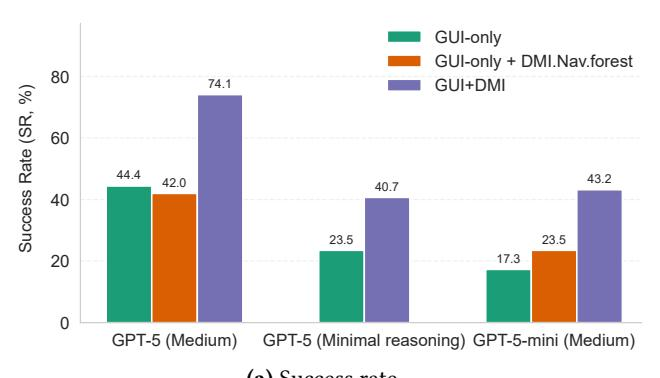
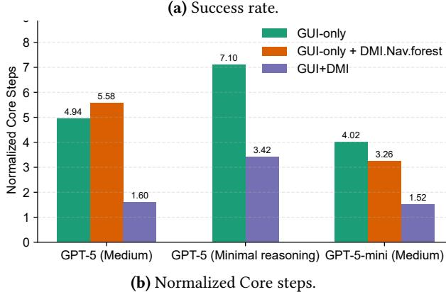
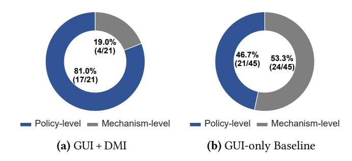

# 5.2 Offline Phase: UI Navigation Modeling Cost

Modeled graphs: We build the UNG with the prototype modeler and then transform it into a path-unambiguous forest. In the raw modeled graphs, Excel/PowerPoint/Word each exceeds 4K controls. To control context cost, we extract a core topology from the forest: Excel ≈ 2K, Word ≈ 1K, and PowerPoint ≈ 1K controls. Word and Excel take a forest; PowerPoint's core topology is a single tree. No nested references exist among shared subtrees.

Cost: Automated modeling per application takes < 3 hours. Some manual setup is required (see [§ 4.1\)](#page-7-0). We assume the operator has reasonable app proficiency (e.g., can identify controls that jump to external applications or drastically reshape the UI, either a priori or by observing the modeling execution). Average manual effort is around 1.5 person-days per application. The resulting model is version-specific but reusable across machines for the same application build.

#### 5.3 Online Phase: End-to-end Performance

Terminology: Reasoning denotes the configured reasoning effect; SR is the average success rate. Step denotes the average number of LLM calls (i.e., round trips). Time is the

Table 3. Results across interfaces and models.

| Interface | Knowledge  | Model  | Reasoning | SR                    | Steps | Time(s) |
|-----------|------------|--------|-----------|-----------------------|-------|---------|
| GUI-only  | /          | GPT-5  | Medium    | 44.4%                 | 8.16  | 392     |
| GUI-only  | Nav.forest | GPT-5  | Medium    | 42.0%                 | 8.41  | 353     |
| GUI+DMI   | Nav.forest | GPT-5  | Medium    | 74.1%                 | 4.61  | 239     |
|           |            |        |           |                       |       |         |
| GUI-only  | /          | GPT-5  | Minimal   | 23.5%                 | 8.42  | 251     |
| GUI+DMI   | Nav.forest | GPT-5  | Minimal   | $\boldsymbol{40.7\%}$ | 5.52  | 140     |
|           |            |        |           |                       |       |         |
| GUI-only  | /          | 5-mini | Medium    | 17.3%                 | 7.14  | 171     |
| GUI-only  | Nav.forest | 5-mini | Medium    | 23.5%                 | 6.32  | 150     |
| GUI+DMI   | Nav.forest | 5-mini | Medium    | 43.2%                 | 4.43  | 167     |

average completion time. All metrics are calculated on successful cases only (Table 3). We also report normalized steps (Figure 5b), which are calculated based on the intersection of tasks successfully solved by all compared methods (GUI Baseline, GUI+DMI, and Ablation).

**Settings:** We compare three settings: (1) GPT-5, reasoning mode (core setting); (2) GPT-5, minimal reasoning; and (3) GPT-5-mini, reasoning mode.

**Overall improvement:** In the core setting, DMI yields substantial improvements over the baseline: raising success from 44.4% to 74.1% (1.67×), cutting steps from 8.16 to 4.61 (-43.5%), and reducing completion time by 39%. Under minimal reasoning, success improves from 23.5% to 40.7%, steps drop from 8.42 to 5.52, and time declines from 251s to 140s. With GPT-5-mini, DMI yields an absolute +25.9% success gain (2.5× over GUI-only) and 38% fewer steps; average time is comparable (171s baseline vs 167s DMI) because we report only successful runs, and GUI-only primarily succeeds on shorter/easier cases. Table 3 shows the overall results evaluated on the full set.

When normalized to the **intersection** of tasks solved by all methods (GUI-only, GUI+DMI, and Ablation), DMI demonstrates even greater efficiency gains. On this common subset, DMI reduces the normalized steps from 7.94 (GUI-only) and 8.58 (Ablation) to 4.60 (GUI+DMI) under the GPT-5 (medium reasoning) setting. This further confirms that DMI significantly reduces the interaction overhead (see Figure 5b). It is also important to note that tasks solved without DMI (GUI-only) **remain solvable** with DMI (GUI+DMI) in our evaluation.

One-shot task completion: In the core setting, with DMI, over 61% of successful trials are completed in 4 steps. The architecture of the UFO-2 framework features a multi-agent design where a HostAgent orchestrates the overall workflow while specialized AppAgents manage tasks for individual applications. UFO-2's workflow incurs a fixed 3-step overhead. These 4 steps correspond to: (1) HostAgent decomposes the user task by application and opens/activates the target app. (2) APPAgent executes the delegated subtask. (3) APPAgent

**Figure 5.** Visualization of performance evaluation. Core steps refer to the steps without the fixed 3-step agent framework overhead (see § 5.3 One-shot task completion). Normalization refers to the intersection of tasks that all methods solve.

verifies the result and decides on handoff. (4) HostAgent verifies overall task completion. Thus, for single-app tasks, DMI enables the LLM to complete the core user intent in a single LLM call. Although the baseline supports action sequences, it is constrained to currently visible controls and cannot plan over controls that are not yet exposed. Declarative DMI permits global planning, which cuts the number of LLM calls substantially, as depicted in Figure 5b.

#### 5.4 Overhead

Token cost: Compared with the baseline, DMI introduces additional context tokens. Over 80% of this overhead comes from the navigation forest; the remainder stems from the DMI usage prompt and the truncated DataItem payloads returned by get\_texts(). Empirically, each control contributes 15 tokens on average (measured under the o200k\_base encoding). The core topologies add approximately 30K (Excel), 15K (Word), and 15K (PowerPoint) tokens. While this increases per-call context, modern LLMs provide ample windows (e.g., GPT-5 400K, o3 200K, Claude Sonnet 4 200K). More importantly, DMI reduces interaction rounds substantially, resulting in total token usage per task being lower than the baseline in the core scenario.

**Per-step latency:** With the small model, per-call latency is higher, but overall task completion time drops because DMI requires fewer steps. Per-call latency with DMI is similar to the baseline for large models in both reasoning and non-reasoning modes.

#### 5.5 Ablation Study

To determine whether DMI's performance gains stem from its declarative interface or simply from providing a static knowledge base, we conducted an ablation study on both large and small models, as shown in Table 3 and Figure 5.

For the baseline UFO2-as, we provided the DMI navigation forest in the prompt while disabling the declarative interface. This configuration yields no significant change in performance (SR 42% vs. 44% baseline; Steps 8.41 vs. 8.16, Normalized Steps 8.58 vs. 7.94), indicating that the declarative interface, not the static knowledge, is the primary source of DMI's effectiveness. In contrast, the less capable GPT-5mini model shows a modest improvement when given the forest alone (SR 23.5% vs. 17.3% baseline; Steps 6.32 vs. 7.14; Normalized Steps 6.26 vs. 7.02). This suggests that supplementary topology knowledge can be helpful for models with less general-purpose knowledge. Crucially, however, the full DMI setting produced much larger gains (SR 43.2%; Steps 4.43; Normalized Steps 4.52), confirming that the interface design is the dominant performance driver. The average time is slightly lower as the baseline succeeds on short/easy cases.

#### 5.6 Failure Analysis

We analyze failures in the core setting and compare distributions between DMI and a GUI-only baseline (see Figure 6). The analysis combines execution results with a chain-ofthought summary returned by the LLM.

GUI+DMI (policy-centric failures): The dominant causes are: ambiguous task descriptions (42.9%); misinterpretation of control semantics (28.6%; e.g., Word's "subscript" control in "Find and Replace" dialog applies to the whole Edit field rather than the selected range; Excel's rule of "conditional formatting" applies to all cells in the selected region, including blank cells); weak visual-semantic understanding (14.3%); misunderstanding of subtle task semantics (9.5%); and topology/modeling inaccuracies (4.8%, see § 6 (In)accurate navigation topology).

Under the proposed method, errors concentrate at the policy level, specifically in task-semantic misunderstandings (52.4%) and misperception of control functionality (28.6%). This shift indicates that the declarative interface largely removes the mechanism-induced failures (navigation and interaction), leaving errors primarily in semantic understanding and planning, validating the intended decoupling.

**GUI-only baseline (mechanism-dominated failures):** The baseline shows many mechanism failures: control localization and navigation errors (14/45), and composite-interaction

**Figure 6.** Failure-cause distribution (Policy/Mechanism) for DMI (GUI+DMI) and GUI-only baseline.

errors (7/45). It also shows additional task-semantic errors and misperception of control functionality (6/45). A further 18 failures overlap with the policy-centric categories above. Because the LLM must split attention between policy and mechanism, more semantic mistakes appear. We observed similar errors in the ablation experiment, reinforcing that coupling policy with mechanism leads to avoidable mistakes.

**Summary:** The failure analysis pinpoints why DMI works: it cuts out mechanism-related errors (navigation and composite interaction) and re-centers policy, where LLMs are comparatively strong. Compared to GUI, DMI aligns better with LLM capabilities, substantially reducing reliance on precise vision and high-frequency interactions.

#### 5.7 Lessons Learned

We discuss lessons learned when developing suitable declarative interfaces for LLMs. The following elements are necessary for DMI to achieve high success rates and efficiency.

Global unique identifier: A critical lesson is the need for applications to expose globally unique identifiers for controls. Although UIA recommends AutomationId, its global uniqueness is not enforced. As a result, current control identification methods like XPath are not reliable.

**Rich control descriptions:** Comprehensive and explicit descriptions in accessibility metadata are crucial for effective computer-use agents. For example, Excel's Name Box should explicitly state that pressing Enter is required to commit input. Future work can augment the textual navigation topology with descriptions synthesized from documentation or curated by LLMs.

**Explicit navigation-node access:** Our visit interface filters non-leaf (navigation) nodes, ensuring the interface takes over all navigation. If a task truly requires accessing a navigation node, the LLM can fall back to GUI operations. One alternative is to add an enforced parameter to controlaccess commands, allowing the caller to bypass filtering.

## 6 Discussion and Limitations

Completeness of DMI primitives: The mechanism of GUI-use can be reduced to two parts: (1) making the target control visible on the screen, and (2) interacting with the control. DMI leverages the determinism of GUI navigation and abstracts control interactions into state representation to simplify complexity. It is important to note that DMI cannot simplify all complex interactions. For example, tasks like freely drawing a shape (e.g., canvas) or position-precise manipulation (e.g., figure adjustment) are inherently dependent on fine-grained, non-standard position-related operations. Such tasks are difficult to express in a stateful manner and cannot be easily simplified using a declarative approach.

Together, DMI and GUI form a fast-path/slow-path design. DMI is the fast path used by default; GUI is the slow-path fallback, invoked whenever (i) the needed interaction is outside DMI's coverage (e.g., freehand drawing) or (ii) execution hits exceptions/unexpected UI states (e.g., error pop-ups), ensuring functional completeness and recovery.

Generalization to other OSes: Our current implementation uses the Windows UI Automation (UIA) framework. We find that similar accessibility-based frameworks exist across OSes. macOS provides NSAccessibility that supports traversing and invoking UI elements across applications. Its role-subrole hierarchies and associated attributes/actions map naturally to UIA control patterns. Ubuntu exposes application widgets via AT-SPI2 [\[5\]](#page-12-4). This mechanism also provides callable interfaces (e.g., Action, Value, Text, Selection) functionally equivalent to UIA control patterns. Android AccessibilityService and AccessibilityNodeInfo provide comparable control pattern functionality.

Generalization to new applications: Extending DMI to new applications necessitates constructing an applicationspecific UNG to enable the access declaration based on navigation topology. As detailed in [§ 4.1,](#page-7-0) this involves manual configuration to facilitate the topology modeling.

Unsupported GUI applications: DMI is built atop Windows UI Automation (UIA), which also benefits many modern applications such as Google Chrome and Visual Studio Code. However, UIA does not cover all Windows applications. Legacy applications from the Windows XP era often lack UIA support. Real-time applications like video games and specialized graphics software often bypass standard UI widgets and may not expose accessible UIA trees, falling outside our methodology's scope.

(In)accurate navigation topology: Task success depends critically on accurate navigation topology modeling. Our prototype infers edges by comparing accessible trees before and after a click action, but cannot capture all dependencies. For example, in Word's "Find and Replace" dialog, entering special text (e.g., +1, +2, +3) into the "Rich Edit" control

dynamically renames the "Next" button to "Go To". Depthfirst search exploration may miss such conditional changes, and without stable application identifiers, name changes break element matching. When topology is incomplete, LLMs can fall back to GUI-based imperative primitives, but may still fail due to poor visual localization of LLMs.

Handling dynamic controls: Applications might be driven by a dynamic UI that resists comprehensive pre-modeling. A canonical example is the Web browser. The main challenge of adapting DMI to Web browsers is the high volatility of Web controls—DOM structures and element attributes frequently change due to dynamic content rendering and continuous updates. This complicates navigation abstraction (access declaration) compared to relatively stable desktop applications. Handling dynamic controls is a challenging and promising direction for future work. Nevertheless, DMI's state and observation declarations target UI controls interaction (e.g., set a scrollbar position, checkbox state, text in edit\_box), and thus can smoothly adapt to browsers.

## 7 Related Work

GUI-based large action models: UI-TARS [\[32\]](#page-13-3), OS-ATLAS [\[43\]](#page-14-8), Aguvis [\[45\]](#page-14-9), and UGround [\[11\]](#page-12-1) train specialized large action models to navigate human-oriented GUI better. In contrast, DMI redesigns the interface to be LLM-friendly, eliminating the need for model training or fine-tuning.

Skill-based approaches: AppAgentX [\[17\]](#page-13-22) encapsulates UI sequences as skills. However, its reliance on visual element matching introduces a fundamental fragility. Similarly, AXIS [\[20\]](#page-13-6) translates UI traces into application API calls, but its robustness is contingent upon the availability and stability of those APIs. In contrast, our accessibility-based interfaces offer a more robust approach. It operates without the need for app-specific APIs. Furthermore, our approach enables the composition of complex skills using declarative primitives, circumventing the need to rely on low-level UI sequences.

GUI ripping: Several studies in GUI testing model the application's structure to generate test cases. GUITAR [\[22\]](#page-13-19) abstracts GUIs into event-flow graphs and synthesizes test cases from the model. Exploration strategies range from DFS to randomized search; platform-specific analogues include Android's monkey tool [\[35\]](#page-13-23). Broadly, some approaches [\[39,](#page-13-24) [41\]](#page-13-25) model abstract state transitions, while others model reachability among GUI controls [\[24,](#page-13-20) [42\]](#page-13-17). The key difference is how we treat path ambiguity at scale. Early Win32 GUI-TAR [\[22\]](#page-13-19) expands multi-source graphs into multiple trees by cloning subgraphs to ensure unique paths; whereas modern, large UIs trigger exponential node growth. We instead introduce a cost-aware path disambiguation that yields a forest (namely, a main tree and shared subtrees) with controlled size.

Graph-based methods: AutoDroid-v1/v2 [\[41,](#page-13-25) [42\]](#page-13-17) constructs UI/Element transition graphs and fine-tunes an ondevice language model (LM) with sampled training data, which enables the LM to generate action sequences even when controls are not currently visible. However, this approach remains fundamentally imperative; the LM must plan both the high-level policy and the low-level mechanism, requiring it to enumerate fine-grained, step-by-step navigation sequences (e.g., tap(a) -> tap(b) -> tap(c)). When the LM's predicted next control is not found, the reachable path closest to that control is picked. However, this approach suffers from path ambiguity. For example, a single control labeled "Color" could correspond to different semantic functions (e.g., font color, outline color, or underline color). The greedy method does not reliably resolve such ambiguity. This poses a significant risk of incorrect functionality. In contrast, DMI provides unambiguous control access.

Novel system interfaces: There is a long history of efforts to design new system interfaces. Commutative interfaces [\[9\]](#page-12-8) enhance OS multi-core scalability. SLO-aware interface [\[12\]](#page-12-9) achieves millisecond tail tolerance. [\[16,](#page-13-26) [21\]](#page-13-27) proposes performance interfaces for systems. Moreover, [\[36\]](#page-13-28) examines modern Linux APIs' usage and compatibility, providing insights for new system interface design.

Other related work: SWE-agent [\[46\]](#page-14-10) defines Agent-Computer Interface (ACI) to enhance software engineering. Agent S [\[3\]](#page-12-10) proposes another ACI utilizing Accessibility APIs to label on-screen controls (similar to our baseline [\[51\]](#page-14-3)). Agent S2 [\[4\]](#page-12-11) introduces the Mixture-of-Grounding that equips the LLM with specialized tools to enhance CUAs. SeeClick [\[7\]](#page-12-12) uses large vision-language models to locate controls.

## 8 Conclusion

OSes have long evolved interfaces to serve different users from command-line interface (CLI) for experts to GUI for general users. LLM-powered agents are a fundamentally new class of OS users with distinct characteristics (large contextmemory, reasoning) and constraints (weak visual capability, latency, token costs, imperfect instruction-following) that existing OS interfaces do not consider or address. As a result, LLMs underperform with GUI.

DMI addresses this gap by applying core systems principles (declarative over imperative, separating policy from mechanism, fast-path/slow-path) to build LLM-friendly OS interfaces.

