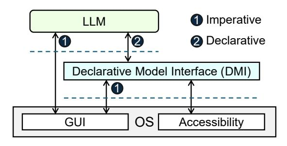
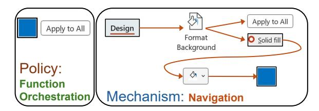
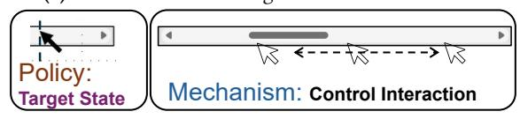
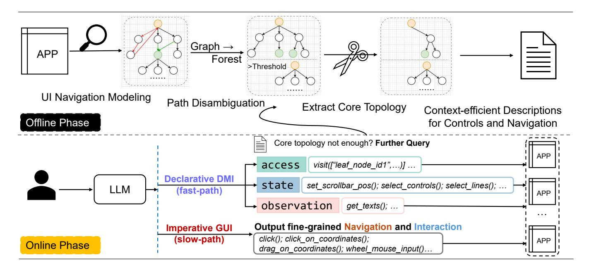
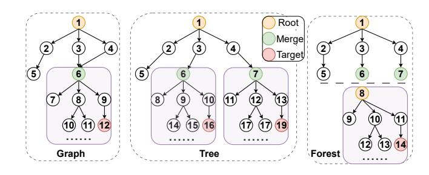

# From Imperative to Declarative: Towards LLM-friendly OS Interfaces for Boosted Computer-Use Agents

Yuan Wang\*<sup>†</sup> Mingyu Li\*<sup>†</sup> Haibo Chen\*<sup>†</sup>
\*Key Laboratory of System Software (Chinese Academy of Sciences)
<sup>†</sup>Institute of Software Chinese Academy of Sciences
<sup>‡</sup>Shanghai Jiao Tong University
<sup>†</sup>University of Chinese Academy of Sciences

#### **Abstract**

Computer-use agents (CUAs) powered by large language models (LLMs) have emerged as a promising approach to automating computer tasks, yet they struggle with the existing human-oriented OS interfaces—graphical user interfaces (GUIs). GUIs force LLMs to decompose high-level goals into lengthy, error-prone sequences of fine-grained actions, resulting in low success rates and an excessive number of LLM calls.

We propose Declarative Model Interface (DMI), an abstraction that transforms existing GUIs into three declarative primitives: access, state, and observation, thereby providing novel OS interfaces tailored for LLM agents. Our key idea is policy-mechanism separation: LLMs focus on high-level semantic planning (policy) while DMI handles low-level navigation and interaction (mechanism). DMI does not require modifying the application source code or relying on application programming interfaces (APIs).

We evaluate DMI with Microsoft Office Suite (Word, PowerPoint, Excel) on Windows. Integrating DMI into a leading GUI-based agent baseline improves task success rates by 67% and reduces interaction steps by 43.5%. Notably, DMI completes over 61% of successful tasks with a single LLM call.

*CCS Concepts:* • Software and its engineering  $\rightarrow$  Operating systems; • Computing methodologies  $\rightarrow$  *Machine learning approaches*; Intelligent agents.

**Keywords:** OS abstraction, Interface design, LLM-friendly OS interfaces

#### **ACM Reference Format:**

Yuan Wang\*<sup>†</sup> Mingyu Li\*<sup>†</sup> Haibo Chen\*<sup>†</sup> . 2026. From Imperative to Declarative: Towards LLM-friendly OS Interfaces for Boosted Computer-Use Agents. In 21st European Conference on Computer Systems (EUROSYS '26), April 27–30, 2026, Edinburgh, Scotland


This work is licensed under a Creative Commons Attribution 4.0 International License.

EUROSYS '26, Edinburgh, Scotland Uk
© 2026 Copyright held by the owner/author(s).
ACM ISBN 979-8-4007-2212-7/2026/04
https://doi.org/10.1145/3767295.3803576

*Uk.* ACM, New York, NY, USA, 15 pages. https://doi.org/10.1145/3767295.3803576

#### 1 Introduction

Computer-use agents (CUAs) powered by large language models (LLMs) demonstrate remarkable potential in automating complex workflows, creating unprecedented opportunities for productivity enhancement. Recent breakthroughs have catalyzed intense interest across both industry and academia [1, 11, 13, 18, 25, 26, 32, 37, 44, 48, 51]. To interact with applications running on computer systems, state-of-the-art CUAs primarily rely on two interfaces: application programming interfaces (APIs) and graphical user interfaces (GUIs).

Under the first paradigm, API-based approaches capitalize on the code-generation capabilities of LLMs to directly invoke application-specific APIs [19, 20, 33, 51]. While this approach typically yields higher success rates and requires fewer execution steps, it faces a critical limitation: many applications lack publicly available APIs, thereby restricting the approach's overall generality. On the other hand, GUI-based approaches [26, 32, 37, 51, 52] leverage LLMs (including multimodal LLMs) to perceive screen content, locate interface elements, and emulate human actions such as clicks and scrolls. This approach offers unparalleled generality since GUIs represent the dominant human-computer interface paradigm on modern desktop and mobile operating systems. However, it demands that LLMs generate lengthy, fine-grained action sequences to manipulate UI control elements (hereafter, controls), increasing LLM inference costs while compounding the risk of cascading failures [14, 20, 40, 47, 49].

Our investigation suggests that the need for complex action sequences in GUI use stems from the **imperative** nature of GUI design. First, unlike APIs with direct function calls, GUIs require navigating through spatial layouts to reveal hidden or off-screen controls. This forces the LLM to execute chains of **navigation** actions (e.g., navigating menus, tabs, and dropdowns) to make the control visible. Second, GUI controls require explicit **interaction** (e.g., a click) to trigger a function. Beyond simple clicks, many controls demand composite interactions. For instance, manipulating a scrollbar requires a coordinated sequence of actions: moving the cursor to the scrollbar, pressing the mouse button, dragging



**Figure 1.** Overview of the DMI abstraction layer. DMI is based on ubiquitous GUI and OS accessibility features [2, 5, 6]. *Declarative* specifies the intended state or outcome; *imperative* enumerates the actions that realize it. DMI abstraction provides novel **OS interfaces** tailored for LLM agents.

to a target position while holding the button, and finally releasing it.

This imperative paradigm creates an entanglement of two distinct aspects in GUI application use. The first is the orchestration of application functionality according to task semantics, which we term **policy**. The second is the process of using functional controls, which involves navigation and interaction, an aspect we refer to as **mechanism**.

In current GUIs, policy is tightly coupled with mechanism: users cannot directly invoke the function; they must perform the requisite navigation and interaction. This coupling poses a significant bottleneck for LLMs; it substantially increases task complexity, strains the LLM's spatial reasoning and visual processing, and necessitates a higher number of LLM invocations, inflating both token costs and latency.

This raises an essential research question: How should OSes evolve interfaces to serve a fundamentally new class of OS users (LLMs), instead of forcing them to mimic humans and use existing human-oriented interfaces (namely, GUIs) for which they are ill-suited?

Our key insight is that while LLMs struggle with fine-grained mechanisms, a substantial fraction of the interaction logic with GUI is deterministic and can be executed independently of the LLM. Based on this observation, we introduce Declarative Model Interface (DMI), an abstraction layer that transforms complex GUI navigation and interaction into three declarative primitives: access, state, and observation. By handling navigation and interaction deterministically, DMI decouples policy from mechanism—a separation of concerns that shifts the LLM's role from "orchestrate both high-level functions and low-level UI actions" to "orchestrate only the semantic, non-deterministic aspects of the task."

Unlike imperative GUI interaction, declarative DMI allows and requires the LLM to specify the desired outcome directly, rather than emitting concrete actions to realize the outcome. Using DMI's declarative primitives, the LLM can express the intended result for a control: the control is to be "accessed" or "set to a target state", or to have its information "observed

and retrieved". DMI then executes the necessary steps to achieve that result. This procedure is fully transparent to the LLM. Such a design meets our goal: to let the LLM abstract away from concrete GUI operations, and eventually focus on semantic planning for the user's task.

There are several challenges to be addressed to realize DMI. First, the controls' navigation relationships are typically implicit within the applications, which obstructs navigation abstraction. Second, a control's functionality is path-dependent. Take Microsoft Word as an example: accessing a standard color control via the Font, Outline, or Underline path can yield different semantics. Enforcing path uniqueness through duplication (i.e., cloning the merge node and its substructure) can cause an exponential blow-up in an already large application node set, which in turn highlights another major issue: LLM context is limited and costly. DMI design must account for invocation cost. Additionally, the ideal interface should provide a stable abstraction: this requires DMI to handle the non-determinism of GUI execution robustly. Finally, an LLM-friendly DMI must also consider the caller's (the LLM's) imperfect instruction-following. For example, while we explicitly instruct the LLM to output target function controls only, the LLM may still output navigation paths.

We present an end-to-end solution to these challenges. Specifically, we model controls' navigation relationships and transform the resulting graph into a path-unambiguous topology (§ 3.2). We introduce an LLM-context-friendly representation of controls and navigation, and design an ondemand querying mechanism to balance context cost, function coverage, and efficiency (§ 3.3). DMI is designed with an "LLM-as-user" assumption; to mitigate imperfect instruction-following, we apply filtering to ensure DMI entirely takes over the navigation process. To provide a stable declarative abstraction, DMI incorporates robustness mechanisms to handle instability in executing UI action sequences (§ 3.4). We enforce a strict separation between control access and complex interactions to relieve the tension between accuracy and efficiency (§ 3.4, § 3.5).

We validate DMI through a set of case studies against Microsoft Word, Excel, and PowerPoint. These applications cover a diverse range of real-world scenarios, including text editing, spreadsheet manipulation, and graphics processing. Our evaluation with the OSWorld-W [44] dataset shows that DMI outperforms UFO-2 [51], the leading GUI-based baseline, by increasing the absolute task success rate by 29.6% (67% relative improvement), reducing interaction steps by 43.5%, and decreasing completion time by 39%. Regarding failure cases, the UFO-2 baseline exhibits numerous failures related to the mechanism, such as errors in visual recognition, fine-grained interaction, and navigation. In contrast, with DMI, over 80.9% of failures are policy-related (e.g., LLM semantic misunderstandings), rather than mechanism-related. These results demonstrate the effectiveness of declarative interfaces as LLM-friendly interaction paradigms.

In this paper, we make the following contributions:

- We identify that human-oriented OS interfaces (i.e., GUIs) pose challenges for LLM-driven CUAs, a fundamentally new class of OS users with distinct characteristics and constraints.
- We introduce DMI, an abstraction that decouples policy from mechanism by reducing complex GUI operations to declarative primitives, enabling LLMs to focus on semantic planning. DMI provides LLM-friendly OS interfaces.
- We conduct an extensive evaluation showing that DMI significantly improves LLM task success rates and efficiency compared to state-of-the-art GUI-based approaches.

## 2 From Imperative to Declarative

#### 2.1 Human-centric Design: A Hurdle for LLMs

We first examine the paradox of GUIs: why the humancentric OS interface design, which is intuitive for humans, creates significant obstacles for LLMs.

Mismatch #1: Procedural navigation. GUI applications expose functionality in a step-by-step manner: controls are hierarchically organized behind menus, tabs, and dialog boxes. This design deliberately narrows the set of available choices at each step, decomposing control localization into low-cognitive-load decisions [30], while favoring visual recognition over memory-based recall [34]. The design assumes users (i) struggle with large decision spaces due to limited working-memory capacity, (ii) have poor exact syntax recall (e.g., command names, argument order), but (iii) excel at visual recognition. These assumptions do not hold for LLMs. LLMs can leverage a much larger context window (e.g., GPT-5, 400K tokens) and reliably produce grammarconstrained, structured outputs [27, 38], but they have comparatively weaker visual perception [15, 23, 50]. Given a global view, whether from trained knowledge or task-specific documentation in the prompt, an LLM can directly identify the appropriate control and generate structured invocations [28]. However, an imperative GUI requires LLMs to first produce navigation sequences that make the target controls visible. This increases the length of action chains and introduces systemic fragility, where any planning or execution error can cascade into complete task failure.

Mismatch #2: Iterative interaction. Many GUI controls rely on iterative interaction. For example, text selection involves repeated cursor movements to establish start and end positions. This design enforces high-frequency "observe—act" loops that transform challenging, high-precision outputs (exact coordinates) into manageable visual judgments ("is the current state acceptable?"). This assumes (i) frequent "observe—act" loops incur minimal cost, and (ii) perception is effortless and accurate. Neither assumption holds for LLMs. LLM inference latency makes frequent closed-loop control prohibitively expensive: while humans perform 3–5 mouse

<span id="page-2-1"></span>Table 1. Task examples of imperative GUI vs. declarative DMI.

| Task | GUI                                                                                                                                                                                                                                                                  | DMI                             |
|------|----------------------------------------------------------------------------------------------------------------------------------------------------------------------------------------------------------------------------------------------------------------------|---------------------------------|
| 1    | $\begin{split} & \text{click("Design")} \rightarrow \text{click("Format Background")} \\ & \rightarrow \text{click("Solid fill")} \rightarrow \text{click("Fill Color")} \\ & \rightarrow \text{click("Blue")} \rightarrow \text{click("Apply to All")} \end{split}$ | visit(["Blue", "Apply to All"]) |
| 2    | iterative interaction (drag and drop)                                                                                                                                                                                                                                | set_scrollbar_pos(80%)          |

<span id="page-2-0"></span>

(a) Task 1: make the background blue on all slides.



(b) Task 2: show the area close to the end.

Figure 2. Policy-Mechanism coupling in GUI use.

adjustments per second with real-time feedback, LLM inference requires 10–120+ seconds per round-trip [8, 10]. In addition, LLMs exhibit limited visual acuity, making precise UI understanding unreliable [15, 23, 50].

### 2.2 Insights

Insight #1: Policy-mechanism decoupling. When using GUI applications, policy (function orchestration) becomes tightly coupled with the mechanism (control navigation and interaction). Figure 2 and Table 1 illustrate this coupling through two real-world examples. Since human-centered GUIs misalign with LLM capabilities, LLMs perform poorly on mechanism-level tasks. In Task 1, invoking "Blue" requires emitting a precise five-step navigation sequence; any single misstep could invalidate the plan. In Task 2, the LLM must perform the iterative drag-observe cycle on the scrollbar and rely on visual feedback, while the LLM is prone to misperceiving on-screen positions. Additionally, many LLM calls increase latency. However, much of this mechanism is **deterministic** and can be resolved algorithmically without LLM involvement. Rather than forcing LLMs to plan fragile navigation sequences and complex interactions, we propose offloading deterministically solvable mechanisms to an abstraction layer, thus enabling LLMs to focus on nondeterministic, policy-level decisions that require semantic reasoning.

**Insight #2: Deterministic navigation.** Given a target control, computing an access path and navigating to it becomes a deterministic problem. Once an application is released, its control transitions form a finite state machine [42], with

control reachability and dependencies modeled as a directed graph where nodes represent controls. While controls may be accessible through multiple paths, removing back-edges and duplicate nodes with their successors yields a tree structure, producing a unique path identifiable from the control's identifier alone. This approach eliminates navigation dependencies from GUI use and compresses lengthy action chains. The LLM needs only to declare the target control rather than specify the concrete navigation sequence, removing responsibility for path correctness from the model.

Insight #3: Finite interaction operations. While controls exhibit diverse behaviors, Windows UI Automation (UIA) categorizes them into finite sets: 41 control types (e.g., Button, ListItem, Edit) and 34 control patterns (e.g., TextPattern, ScrollPattern, SelectionPattern) [\[29\]](#page-13-18). These universals enable us to abstract low-level, fine-grained interactions into state and result declarations such as set\_scrollbar\_pos (x\_percent, y\_percent) or select\_lines(start\_index, end\_index). With these wrapped primitives, LLMs only need to specify the desired control state, eliminating requirements for precise visual-coordinate reasoning or high-frequency interaction.

## 2.3 LLM-friendly Paradigm: Declarative Interfaces

Decoupling policy (what to do) from mechanism (how to do it) allows for a shift from an imperative to a declarative interface paradigm. In this paradigm, an interface user (in this case, an LLM) can specify a desired state rather than planning and executing a long sequence of imperative actions. For example, the LLM could simply declare its desired outcome, such as "set the scrollbar position to 50%", or "access the Apply to All control". The interface then handles the complex, low-level execution, regardless of the control's current state or visibility on the screen. [Figure 2](#page-2-0) illustrates this paradigm shift.

Declarative interfaces are well-suited for LLMs for two main reasons. First, this approach shifts interaction from state-based "observe-act" loops to target state setting. This is crucial because it eliminates the dependency on the LLM's relatively weaker precise visual perception and minimizes the need for high-frequency, real-time operations. Instead of constantly analyzing the screen to decide the next step, the LLM simply states the end goal. Second, by hiding the lowlevel, fine-grained details of interaction, this paradigm distills tasks down to their semantic reasoning, which enables LLMs to focus on their strengths: understanding high-level intent and emitting well-formed, grammar-constrained outputs.

#### 2.4 Challenges

To realize the shift from imperative to declarative interaction, we need to address the following challenges:

Challenge #1: Navigation path ambiguity. Declarative control access requires explicit application navigation pathways, but these relationships exist implicitly and are not exposed as explicit data structures. Even with deterministic UI topology, path ambiguity exists: cycles and merge nodes in the navigation graph prevent mapping controls to unique access paths.

Cycles: Loops (e.g., A → B → A) may yield infinite traversal sequences.

Merge nodes: Controls may be reachable via multiple paths (e.g., A → C and B → C).

Identical controls can enact different functions depending on path-related context. For instance, in Word's color picker, a color cell is reachable via "Font Color," "Outline Color," or "Underline Color"; the chosen path determines which property is modified.

Challenge #2: Limited LLM context windows. Navigation topology should be converted to textual prompts for LLM comprehension. However, modern applications expose numerous controls (>5,000 in Microsoft Office), making full topology prohibitively expensive for LLMs. An ideal interface should enable LLMs to accurately identify required controls without overwhelming their context windows.

Challenge #3: Inaccurate long-horizon planning. Since the navigation topology is deterministic, the LLM can plan multiple commands in a single call, even when target controls are not currently visible. However, this makes subsequent commands contingent on earlier correctness: unexpected intermediate outcomes can invalidate subsequent steps and cascade into task errors.

Additionally, real-world UI interaction is inherently unstable; for example, control name variations can break element identification.

## 3 The DMI Design

## <span id="page-3-0"></span>3.1 Overview

The GUI mechanism includes control navigation and interaction. DMI abstracts navigation as access declaration, and abstracts interaction as state and observation declarations.

- Access declaration: Given a control identifier, DMI deterministically navigates from any current state to that control and performs a primitive interaction (e.g., click).
- State declaration: Given a desired control end state (e.g., scrollbar position; selection state for a control or for text), DMI transitions the control from any current state to the target state, abstracting away compound interactions such as drag and keyboard–mouse coordination.
- Observation declaration: Given an information request (e.g., a control's text content), DMI returns structured data rather than relying on pixel-level recognition, without requiring compound interactions to reveal hidden content (e.g., expanding a table item).

<span id="page-4-1"></span>

Figure 3. DMI Workflow: Offline Modeling and Online Execution. DMI has three declarative primitives: Access, State, and Observation.

**Interfaces:** DMI provides two categories of interfaces. The visit interface is designed to take over navigation and realize *access* declaration. Additionally, DMI presents a set of interaction-related interfaces to support *state* and *observation* declaration. These interfaces simplify complex interactions such as scrolling, selection, and text manipulation into direct state setting and structured information retrieval.

**Workflow:** The workflow of DMI is shown in Figure 3. First, navigation relationships among controls are modeled as a graph, which is further translated into a path-unambiguous forest containing a main tree and shared subtrees. Next, this forest topology is converted into context-efficient textual representations with query-on-demand mechanisms to reduce token overhead. Finally, LLM is provided with the declarative interface to use intended controls.

**Outline:** § 3.2 introduces the navigation topology addressing path ambiguity (Challenge #1). § 3.3 presents context-efficient descriptions for managing the LLM context window (Challenge #2). § 3.4 and § 3.5 detail interface design for robust and efficient execution (Challenges #3).

#### <span id="page-4-0"></span>3.2 Path-Unambiguous Navigation Topology

This section presents the application navigation modeling and how to construct the path-unambiguous topology.

**Navigation modeling:** Inspired by prior work [22, 24], we build an automated prototype to model UI navigation relationships, with modest human intervention (detailed in § 4.1). The result is a UI Navigation Graph (UNG): nodes are UI controls and directed edges denote "click" interaction.

<span id="page-4-2"></span>

**Figure 4.** Navigation Topology. To access the bottom-right node along node 4, imperative GUI navigation relies on graph and requires the explicit path  $\langle 1, 4, 6, 9, 12 \rangle$ . With declaration, only  $\langle 19 \rangle$  is required by tree, while the number of nodes explodes. For forest, the path required is  $\langle 7, 14 \rangle$ .

UNG is a directed graph  $\mathcal{G}=(\mathcal{V},\mathcal{E})$  where each node  $v\in\mathcal{V}$  corresponds to a UI control exposed by the accessibility API, and each edge captures **click**-induced reachability between controls. In UNG, we only model control-to-control transition relationships; we do not include keyboard-shortcut actions as transition edges, since their effects are typically achievable via equivalent click operations.

From directed graph to forest: To ensure unambiguous control access by declaring the control ID, UNG must be transformed into an *ambiguity-free* topology. We define path ambiguity-free as follows: for any given control, a unique access path can be determined within its connected topology. The resulting structure is a forest, comprising a main tree and a set of shared subtrees. This transformation involves two critical steps. First, we decycle the graph to a DAG. This process begins by removing cycles from the single-source

UNG to produce a single-source DAG. This is achieved by identifying and removing back-edges that form the cycles.

The next step is to solve path disambiguation by turning the DAG into a forest, which focuses on handling merge nodes in the DAG (nodes with multiple incoming edges). A naive approach would be to convert a merge node into a single tree by cloning the node and its entire descendant substructure for every incoming edge. While this guarantees unique paths, it causes an exponential node blow-up. For complex applications (e.g., Microsoft Office), the resulting description significantly increases the context size, which exceeds the available context window of the LLM (400K tokens, GPT-5) in our experiment. As discussed, simply deleting in-edges to enforce uniqueness is not an option, because different paths to the same GUI control can carry distinct semantics.

We designed a cost-based selective externalization algorithm to balance output-path length and total node count by transforming the single-source DAG into a forest. This bottom-up algorithm processes nodes in reverse topological order. For each merge node, it estimates the rooted substructure size and cloning cost—additional nodes from duplicating the substructure along all incoming edges. When this cost exceeds a configurable threshold, the node and descendants are externalized as a shared subtree, with incoming edges redirected to new reference nodes for indirect access. Otherwise, the substructure is cloned along each edge. This approach ensures linear node growth. In practice, the LLM specifies only a target control ID (see [Figure 4\)](#page-4-2) and reference IDs (typically one) for controls in shared subtrees. The executor then deterministically resolves navigation with reduced context overhead and bounded topology size while preserving semantic correctness and avoiding path ambiguity.

## <span id="page-5-0"></span>3.3 Context-Efficient Descriptions for Controls and Navigation

This section explains how DMI converts the navigation topology into a textual format optimized for LLMs.

Strawman: A straightforward approach would discard navigation controls and abstract functional controls (the leaf nodes of the topology) into a flattened, API-like list of endpoints. However, this approach sacrifices critical semantic information. Many UI controls share generic names (e.g., "Color," "Settings," or "OK" buttons), and a flattened list introduces ambiguity that increases the risk of incorrect LLM selections. To resolve this ambiguity within a flat structure, one would need to encode the navigation path or its semantic meaning into each leaf node's description. This leads to massive data redundancy, as sibling nodes would share identical ancestor path information.

Compressed, hierarchical description: We encode the navigation hierarchy as compact, structured text. We retain the non-leaf nodes (navigation controls) as an integral part of each control's description. A control is thus described by a combination of its own properties and its hierarchical path. This keeps the organization of functionality explicit, allowing the LLM to disambiguate by full path, perform precise semantic reasoning, and avoid the duplication that a flattened representation would impose. DMI relies on a shared subtree entry map to connect the main tree and shared subtrees. This map records each reference node and the root of the subtree it targets. With this map and topology, the LLM can use ref\_id when locating controls within shared subtrees, ensuring a unique and correct navigation.

Query on demand: To conserve costly LLM context windows, we adopt a layered retrieval strategy based on the observation that most tasks require only partial navigation topology. First, DMI by default provides a limited-depth core (e.g., six levels) instead of the complete forest, excluding large enumerations (font lists) and manually identified nodes. While pruning rules are currently manual, future versions could leverage LLM assistance for automation. Second, when the pruned core lacks required structure, the LLM requests additional content via further\_query commands supporting two modes: (a) targeted branch queries expanding substructures beneath specified nodes, and (b) global queries retrieving the complete forest. This design minimizes initial context load for routine tasks while enabling access to additional structures through targeted expansion or complete forest retrieval when necessary.

## <span id="page-5-1"></span>3.4 Access Declaration: The **visit** Interface

For access declaration, the visit interface enables callers to directly access target controls via identifiers rather than navigation sequences. The visit interface also encompasses fundamental interactions such as clicks to improve efficiency and minimize cascading visit command calls.

Interface specification: visit accepts an array of structured commands and executes them sequentially in a single call. Specifically, it supports four categories of commands:

• Control access: Navigate to the target control and perform a primitive interaction (i.e., click).

```
Target in the main tree:
```

```
{"id": "<target_id>"}
Target in a shared subtree:
  {"id": "<target_id>",
  "entry_ref_id": ["<ref_id>", "..."]}
```

• Access-and-input text: Access an Edit type control and input text:

```
{"id": "<target_id>", "text": "<text>"}
```

• Shortcut keys (auxiliary): Issue a keyboard shortcut when a GUI click is insufficient (e.g., pressing ENTER to commit an edit):

```
{"shortcut_key": "<key_combination>"}
```

• FurtherQuery: Request additional topology when the default core topology is insufficient. This command is exclusive and cannot be mixed with other commands in the same call. "-1" refers to fetching the entire forest.

<span id="page-6-2"></span>{"further\_query": ["<node\_id>", "..."]}

Balancing efficiency and accuracy: We address the efficiencyaccuracy tension in visit through three approaches. First, visit bundles "navigation" and "primitive interaction" (e.g., click) into the atomic control-access command and supports multiple commands per call (e.g., visit([command1, command2])), enabling the LLM to execute several functions in one turn. Second, visit excludes complex interactions (i.e., actions supported by state declaration). When subsequent steps require composite interactions, DMI requires the LLM to stop emitting further visit commands. This forces the LLM to observe (e.g., verify the newly revealed dynamic controls after setting the scroll bar) before re-planning based on the actual UI state. DMI disallows mixing visit interface with other interfaces in the same turn to enforce this. An exception is access-and-input-text. We specifically include this command in the visit interface, which overlaps with state declaration, because the outcome of an "edit" action is limited and highly predictable, and therefore is unnecessary to observe the execution result. This design improves efficiency by allowing the execution of edit commands with other control-access commands in a single turn, without a forced stop to observe. Third, visit supports shortcut commands for essential keyboard functions (e.g., pressing ENTER to commit text in an edit field). We instruct the LLM to use this judiciously.

Handling unstable UI interaction: We design several techniques to enhance the robustness of the executor. First, we employ a fuzzy control matcher that combines control type, ancestor hierarchy, and name similarity when exact matching fails due to name variations or UIA's lack of guaranteed unique identifiers. Second, we provide structured error feedback that explicitly describes control states and context to guide subsequent planning, e.g., when a target control is located but disabled. Finally, we use a failure retry mechanism for GUI controls that may load slowly, retrying when deterministically expected controls are absent after interactions. We exclude shortcut-key operations to prevent unintended side effects from repeated executions, e.g., pressing Enter twice.

Handling improper LLM instruction-following: Despite explicit instructions to output only target control identifiers, LLMs sometimes include navigational nodes. We address this by trusting the LLM's intended destination while ignoring its navigation process. The key insight is that functional nodes are topology leaves, while navigational nodes are non-leaves. We filter out non-leaf nodes, allowing the executor to retain only commands targeting functional nodes

<span id="page-6-1"></span>Table 2. state declaration and observation declaration interfaces. UIA defines 34 control patterns in total. These interfaces are extensible. For example, set\_texts builds on TextPattern, set\_toggle\_state builds on TogglePattern, and set\_expanded/set\_collapsed builds on ExpandCollapsePattern.

| Interface                | Control Pattern Description |                                                         |
|--------------------------|-----------------------------|---------------------------------------------------------|
| set_scrollbar_pos Scroll |                             | Set scrollbar position to x%                            |
| select_lines             | Text                        | Select one (or contiguous) line(s)                      |
| select_paragraphs Text   |                             | Select one paragraph or a<br>contiguous paragraph range |
| select_controls          | Select                      | Single or multi-select controls                         |
| get_texts                | Text&Value                  | Retrieve a control's text                               |

and handle navigation independently. This provides fault tolerance regardless of whether the LLM outputs navigational steps. Shortcut-key commands following filtered commands are also removed to maintain consistency.

## <span id="page-6-0"></span>3.5 State and Observation Declaration: Interaction-related Interfaces

Triggering a control's functionality requires interacting with it. Beyond basic interactions (e.g., clicks), controls may require complex interactions involving coordinated keyboard and mouse actions (e.g., multi-select controls). Under the UIA framework, a control describes its available functionality through a finite set of control patterns (e.g., TextPattern, ScrollPattern, SelectionPattern). We leverage these control patterns and corresponding UIA interfaces to encapsulate control interactions, thereby providing a new layer of abstraction. In this way, we realize state declaration and observation declaration (see [§ 3.1\)](#page-3-0).

state and observation declarations reduce dependency on precise visual perception and simplify complex interaction. For example, an Excel cell's full content may not be fully visible and would require several clicks to reveal. DMI ships with a set of pre-wrapped, high-value, and complex interactions, and can be customized to add additional UIA control patterns accordingly (see [Table 2\)](#page-6-1).

Supporting precise perception by default: When DMI interacts with applications, controls may expose dynamic data that cannot be modeled offline. We adopt a "passive + active" design for get\_texts(). Specifically, before each LLM call, get\_texts() is invoked in passive mode on all DataItem controls, and a truncated, structured result is forwarded into the prompt. The passive mode reduces fine-grained visual parsing and saves round-trip, and items with empty values are coalesced for brevity. In cases where truncated results are insufficient, LLMs can call get\_texts() in active mode to retrieve the full content. The operation is implemented on UIA TextPattern and ValuePattern and generalizes to non-DataItem controls.

### Separating control access and complex interactions:

Control identifiers are used by interaction-related interfaces. However, to prevent mixing with visit interface within the same turn and preserve accuracy (see [3.4\)](#page-6-2), the use of static IDs from the navigation topology is explicitly prohibited by interaction-related interfaces. Instead, those interfaces can only operate on controls specified by their label from the current screen's accessibility tree.

