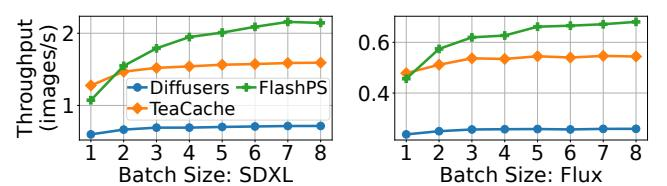

# 6 Evaluation

We evaluate FlashPS's performance in terms of serving efficiency and image quality. We first compare FlashPS's endto-end serving performance with strong baselines and then evaluate the effectiveness of FlashPS's designs, respectively. Evaluation highlights include:

- FlashPS achieves efficient serving performance while maintaining image quality, reducing request serving latency by 14.7× compared with state-of-the-art baselines ([§6.2\)](#page-9-0).
- FlashPS's mask-aware image editing effectively leverages the sparsity from the mask, achieving empirical results consistent with the theoretical analysis in Table [1](#page-5-1) ([§6.3\)](#page-11-2).
- FlashPS's continuous batching design effectively reduce the queuing times, reducing requests' P95 tail latency by up to 29%, compared with the static batching and strawman continuous batching solution. ([§6.4\)](#page-11-0).
- FlashPS's load balance scheduling can decrease the tail request latency by up to 26% compared to baselines ([§6.5\)](#page-11-1).
- FlashPS incurs negligible system overheads ([§6.6\)](#page-12-0).

#### 6.1 Experimental Setup

Models and serving configurations. We use SD2.1 [\[48\]](#page-14-7), SDXL [\[58\]](#page-14-0) and Flux [\[34\]](#page-13-19) in our evaluation. For SD2.1, we serve it with NVIDIA A10 GPUs. For SDXL and Flux, we serve it on NVIDIA H800 GPUs. For each model, we use the default settings to generate images, including the denoising steps and image resolutions, for the best image quality.

Performance metrics Our evaluation mainly concerns two metrics, serving latency and image quality. For serving latency, we primarily measure the end-to-end request latency. For image quality, we use the following quantitative metrics that are widely adopted [\[6,](#page-13-13) [15,](#page-13-5) [16,](#page-13-0) [35,](#page-13-11) [38,](#page-13-9) [45,](#page-14-5) [58\]](#page-14-0).

• CLIP [\[25,](#page-13-32) [47\]](#page-14-13) score evaluates the alignment between generated images and their corresponding text prompts. A higher CLIP score indicates better alignment (↑).

- Fréchet Inception Distance (FID) score [\[26\]](#page-13-33) calculates the difference between two image sets, which correlates with human visual quality perception [\[6,](#page-13-13) [38\]](#page-13-9). A low FID score means that two image sets are similar (↓).
- Structural Similarity Index Measure (SSIM) score [\[56\]](#page-14-14) measures the similarity between two images, with a focus on the structural information in images. A higher SSIM score suggests a greater similarity between the images (↑).

Baselines. We consider the following baselines.

- Diffusers [\[19,](#page-13-14) [52\]](#page-14-3) is a standard baseline. It uses static batching [\[9,](#page-13-15) [19\]](#page-13-14) and does not have a load balance policy.
- FISEdit [\[60\]](#page-14-2) accelerates image editing leveraging the sparsity introduced by the mask. However, it only works with SD2.1 and does not support batching and load balance.
- TeaCache [\[40\]](#page-13-12) accelerates image generation by caching and reusing intermediate activations to skip computations during the denoising process. Although it can be applied to various diffusion models, it suffers from a latency-quality tradeoff. We configure TeaCache to minimize its inference latency while ensuring acceptable image quality.

Note that, we implement static batching [\[9\]](#page-13-15) and requestlevel load balancing for these baselines. The advantages of FlashPS's continuous batching and load balancing will be demonstrated through microbenchmarks in [§6.4](#page-11-0) and [§6.5.](#page-11-1)

Workloads. To evaluate online serving efficiency, we generated request traffic following Poisson processes with varying request per second (RPS), which is widely used in simulating invocations to model serving system [\[14,](#page-13-23) [49,](#page-14-15) [63\]](#page-14-10). For each request, we set its mask ratio following the distributions in Fig. [3,](#page-2-3) which are collected from production traces. To evaluate the quality of the generated images from each baseline, we include three benchmarks that contain image editing tasks using masks of arbitrary shapes. We elaborate the results in Table [2.](#page-11-3)

#### 6.2 End-to-end performance

Online serving efficiency. We evaluate the online serving performance on a machine equipped with 8 GPUs, allocating one GPU per worker. For SD2.1, we use A10 GPUs, while H800 GPUs are used for SDXL and Flux, as FISEdit is not compatible with NVIDIA Hopper architecture GPUs. Each baseline is evaluated under varying RPS to shown a spectrum of performance. The maximum batch size is set to 4 for SD2.1 workers, and 8 for SDXL and Flux. For each request, we measured its end-to-end serving latency. As shown in Fig. [12,](#page-10-1) FlashPS consistently outperforms existing systems across all scenarios, reducing the average latency by up to 14.7× compared to Diffusers, 4× compared to FISEdit, and 6× compared to TeaCache. In the rightmost plot of Fig. [12,](#page-10-1) we present the normalized queuing times for each setting when = 3. Compared to the three baselines, FlashPS significantly reduces queuing overhead, thanks to its effective

Figure 12. End-to-End request serving performance. Rightmost: Queuing times of requests.

**Figure 13.** Examples of images generated by each baseline. All images are edited following the guidance of irregularly shaped masks. Dashed rectangles are used as visualization bounding boxes to highlight the major masked areas.

Figure 14. Engine serving performance.

continuous batching strategy (§4.3), leading to more stable serving latencies as RPS increases. Diffusers suffers from prolonged model inference latency and substantial queueing overhead because it does not leverage the sparsity introduced by the mask and relies on a static batching policy [9] to handle requests. FISEDIT, on the other hand, does not support batch serving requests with different mask ratios, meaning most requests must be executed one at a time on a worker. Consequently, requests experience long queuing times, which further exacerbate serving latency. While Tea-Cache accelerates model inference, its lack of continuous batching results in considerable queuing overhead.

With the *mask-aware* load balance design (§4.4), FlashPS also excels regarding tail latency. At *RPS* = 3, FlashPS reduces the P95 request latency by 88%, 71%, and 60% compared to Diffusers, FISEDIT, and TeaCache, respectively.

**Serving engine performance.** We next evaluate the throughput of each baseline's serving engine under varying batch

sizes in Fig. 14. SD2.1 on A10 is omitted because FISEDIT causes GPU OOM errors when the batch size exceeds 2. Thanks to *mask-aware inference*, FLASHPS achieves up to 3× higher throughput than baselines for batch sizes of 2 or larger, featuring a sustained growth in throughput as the batch size increases, whereas the throughput of other baselines plateaus much earlier with marginal batching effects.

Notably, FlashPS achieves lower throughput than Tea-CACHE without batching (i.e., with a batch size of 1). This is due to limited GPU streaming multiprocessor (SM) utilization in FLASHPS, as mask-guided selection significantly reduces the number of tokens involved in computation. In contrast, TeaCache engages all tokens, fully saturating the SMs even without batching. However, this reduction in token count enhances the effectiveness of batching, necessitating the adoption of continuous batching strategies (§4.3) and helping FlashPS regain its performance advantage in practical serving scenarios where batch sizes are typically large. Image quality. We next evaluate the image quality generated by DIFFUSERS, FISEDIT, and TEACACHE, using DIF-FUSERS as the baseline for generating standard-quality images. Using three benchmarks, we compare the image quality across these systems and present the results in Table 2. Note that these three benchmarks have different inherent characteristics. For example, VITON-HD [15] is a reference-based texture transfer task, transferring an image of cloth onto an image of model, as shown in Fig. 1. Therefore, it is considerably more constrained and deterministic for image generation than other prompt-based creative inpainting benchmarks, such as InstructPix2Pix [13] and PIE-Bench [31].

1) Quantitative evaluation. CLIP scores assess the alignment between generated images and their corresponding textual prompts [44]. On the benchmarks of SD2.1 [48] and Flux [34], FlashPS outperforms FISEDIT and TeaCache, exhibiting better alignment and rivaling Diffusers 's standard-quality. For the SDXL benchmark, where input conditions are images (as depicted in Fig. 1), CLIP scores are not applicable.

FID and SSIM scores measure the similarity between the generated images and the standard images ("ground truth"). Therefore, we use the images generated by Diffusers as the ground truth, as it represents the standard for diffusion model serving systems. In Table 2, FlashPS outperforms both FISEDIT and TeaCache, demonstrating its ability to

| Model/Dataset        | System         | CLIP(↑) | FID (↓) | SSIM (↑) |
|----------------------|----------------|---------|---------|----------|
| SD2.1/               | Diffusers      | 31.4    | -       | -        |
|                      | FISEDIT        | 31.4    | 50.2    | 0.80     |
| InstructPix2Pix [13] | FLASHPS (ours) | 31.8    | 19.9    | 0.92     |
| SDXL/                | Diffusers      | -       | -       | -        |
|                      | ТеаСасне       | -       | 5.4     | 0.97     |
| VITON-HD [15]        | FLASHPS (ours) | -       | 3.4     | 0.99     |
| Flux/                | Diffusers      | 30.9    | -       | -        |
|                      | ТеаСасне       | 30.8    | 77.8    | 0.80     |
| PIE-Bench [31]       | FLASHPS (ours) | 30.9    | 64.8    | 0.88     |

**Table 2.** Quantitative evaluation on image quality.

**Figure 15.** Latency of *mask-aware* image editing with varying mask ratios. **Left**: Kernel level; **Right**: Image level.

generate images highly similar to those generated by DIFFUSERS. Notably, FLASHPS achieves SSIM scores as high as 0.99, reflecting near-perfect similarity to the images generated by DIFFUSERS, where the highest possible SSIM score is 1.0. Fig. 13 presents real examples generated by each baseline, where images generated by DIFFUSERS and FLASHPS are visually highly similar, while FISEDIT and TEACACHE fail to match the details of DIFFUSERS.

2) Qualitative evaluation. We also conducted a user study involving 50 human participants to compare the quality of generated images based on human visual perception. We compare FISEDIT and TEACACHE with FLASHPS, respectively. The participants are mainly university students. Inspired by Chatbot Arena [65], we built an online arena that randomly presents a pair of two images, offering four options: both images are acceptable, neither is acceptable, image 1 is acceptable, or image 2 is acceptable. Participants select an option based on both the degree of image alignment with the standard images and their subjective aesthetic preferences. We collected over 1,000 data points. The findings show that FLASHPS significantly outperforms FISEDIT and TEACACHE, with 2.0× and 1.63× higher acceptance rate, respectively.

#### 6.3 Mask-Aware Image Editing

We next evaluate the effectiveness of our *mask-aware* image editing (§3.1, §4.2), which leverages the mask to reduce the computations associated with the unmasked tokens.

**Kernel-level performance.** We evaluate the kernel execution latency under varying mask ratios in Flux. We choose kernels of attention computation and linear computation, the two dominant computations in a transformer block. In Fig. 15-Left, the latency of kernel execution scales linearly with the mask ratio, consistent with the analysis in Table 1.

**Figure 16. Left**: Tail Request (Req.) latency and inference (Inf.) latency using different batching strategies; **Right**: Tail request latency using different load balance policies.

Image-level performance. We next evaluate the latency of editing an image under different mask ratios using different models. In Fig. 15-Right, the latencies of editing an image scale linearly with the mask ratio, consistent with the analysis in Table 1. When the mask ratio is 0.2, FlashPS accelerates the inference with SD2.1/SDXL/Flux by 1.3/2.2/1.9×, by overlapping inference computation with cache loading.

#### 6.4 Continuous Batching

We next evaluate the benefits of FlashPS's continuous batching (§4.3). We compare the serving performance of a Flux worker with a max batch size of 8 if it adopts static batching [9], naive continuous batching (strawman), and FlashPS's disaggregated continuous batching, respectively, while other settings are the same. We measure its performance in terms of P95 tail request latency, using a RPS of 0.5. Fig. 16-Left illustrates that static batching and naive continuous batching can extend the latency by 35% and 40%, respectively. Though requests' inference latency with static batching and FLASHPS's continuous batching are similar, static batching degrades because it can incur long queuing latency, where a new arrived requests cannot join in the running batch until the execution of the running batch completes. Naive continuous batching degrades due to the cumulative interruptions caused by CPUintensive operations during denoising computations. The median and P95 interruption times for requests are 6 and 8, respectively. Each interruption incurs an average latency overhead of 0.36s, which increases both the inference latency and the overall request latency of each request.

#### 6.5 Optimizations for Load Balance

We now evaluate FLASHPS's design for load balance. We compare our *mask-aware* method with two baselines: request-granularity load balance and token-granularity load balance. Essentially, these two methods assign requests solely based on computational load, where request-granularity load balance aims to balance the number of requests assigned to each worker, while token-granularity load balance seeks to balance the number of masked tokens assigned to each worker. To assess their performance, we implement each method within FLASHPS's scheduler and measure their performance in terms of request tail latency. As shown in Fig. 16-Right, under low request traffic (RPS=0.25) for each worker, the scheduling performances of these methods are comparable,

because the overall load on the system is manageable, allowing each method to effectively distribute requests without significant contention or resource saturation. However, with higher request traffic (RPS=0.5) per worker, the performance of the baseline methods degrades, leading to an increase in tail latency by up to 35%. This degradation occurs because, at higher traffic levels, the baseline load balancing approaches fail to account for the varying computational and cache-loading demands of requests with different mask ratios. Consequently, they may lead to uneven distributions of work among workers, causing some workers overloaded while others remain underutilized.

#### 6.6 System Overhead

In this part, we analyze the system overhead associated with FlashPS when processing a request, identifying three primary sources. First, when a request arrives at the scheduler, the scheduler will assess the worker status, make a scheduling decision, and route the request to the appropriate worker, incurring an average overhead of 0.6 ms. Second, while enabling continuous batching, FlashPS will incur overhead to organize requests' inputs into a batch for denoising computation. At each denoising step, the batching operation takes 1.2ms on average. Third, when a worker completes the denoising computations for a request, it should serialize the resulting latent and send it to another process for postprocessing. The average overhead for serialization is 1.1 ms, while communication adds an additional 1.3 ms.

Takeways. The overhead incurred by FlashPS is on the millisecond scale, which is negligible compared to the overall request processing latency, typically measured in seconds.

