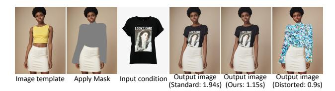
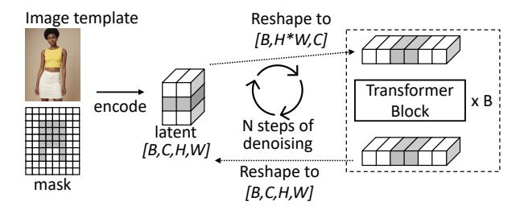
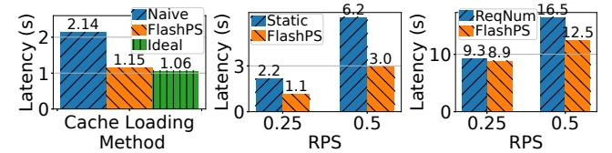

# FLASHPS: Efficient Generative Image Editing with Mask-aware Caching and Scheduling

Xiaoxiao Jiang\*1, Suyi Li\*#1, Lingyun Yang1, Tianyu Feng1, Zhipeng Di2, Weiyi Lu2, Guoxuan Zhu2, Xiu Lin2, Kan Liu2, Yinghao Yu2, Tao Lan2, Guodong Yang2, Lin Qu2, Liping Zhang2, Wei Wang1

1Hong Kong University of Science and Technology, 2Alibaba Group

#### **Abstract**

Generative image editing using diffusion models has become a prevalent application in today's AI cloud services. In production environments, image editing typically involves a mask that specifies the regions of an image template to be edited. The use of mask provides direct control over the editing process and introduces sparsity in the model inference. In this paper, we present FLASHPS, a system that efficiently serves image editing requests. The key insight behind FLASHPS is that image editing only modifies the masked regions of image templates, while preserving the original content in the unmasked areas. Driven by this insight, FlashPS judiciously skips redundant computations associated with the unmask areas by reusing cached intermediate activations from previous inferences. To mitigate the high cache loading overhead, FlashPS employs a bubble-free pipeline scheme that overlaps computation with cache loading. Additionally, to reduce queuing latency in online serving while improving the GPU utilization, FLASHPS proposes a novel continuous batching strategy for diffusion model serving, allowing newly arrived requests to join the running batch in just one step of denoising computation, without waiting for the entire batch to complete. As heterogenous masks induce imbalanced load, FLASHPS also develops a load balancing strategy that takes into account the loads of both computation and cache loading. Collectively, FLASHPS outperforms state-of-the-art diffusion serving systems for image editing, achieving up to 3× higher throughput and reducing average request latency by up to 14.7× while ensuring image quality.

CCS Concepts: • Computer systems organization  $\rightarrow$  Cloud computing; • Computing methodologies  $\rightarrow$  Computer vision.

**Keywords:** Generative Image Editing; Model Serving

#### **ACM Reference Format:**

Xiaoxiao Jiang\*1, Suyi Li\*#1, Lingyun Yang1, Tianyu Feng1, Zhipeng Di2, Weiyi Lu2, Guoxuan Zhu2, Xiu Lin2, Kan Liu2, Yinghao Yu2,

This work is licensed under a Creative Commons Attribution 4.0 International License.

EUROSYS '26, April 27–30, 2026, Edinburgh, Scotland Uk
© 2026 Copyright held by the owner/author(s).
ACM ISBN 979-8-4007-2212-7/26/04
https://doi.org/10.1145/3767295.3769379

Tao Lan2, Guodong Yang2, Lin Qu2, Liping Zhang2, Wei Wang1. 2026. FLASHPS: Efficient Generative Image Editing with Maskaware Caching and Scheduling. In *European Conference on Computer Systems (EUROSYS '26)*, *April 27–30, 2026, Edinburgh, Scotland Uk.* ACM, New York, NY, USA, 17 pages. https://doi.org/10.1145/3767295.3769379

#### 1 Introduction

Diffusion models are making significant strides in generative AI art, enabling the creation of high-quality, contextually accurate images. One of the daily-use image generation tasks is image editing, which modifies specific regions of an existing image template to achieve a desired outcome [16, 29, 41]. Image editing has a wide range of applications, from personal use to professional Photoshop [3, 5], and has fostered various use cases, such as virtual try-on [15, 58], face swapping [54], and image retouching [10]. Due to its wide applicability, image editing has matured into a service offered to users by Adobe and Midjourney [4, 42]. In a recent public diffusion model serving trace [38], 70% of requests require image editing service to edit or retouch an image. Similarly, in our production system, we collect a two-week trace that documents a large-scale image editing service using 20k GPU cards to generate 34 million images.

Typically, users employ a mask alongside other input conditions, such as textual prompts and images, to edit an image template. The use of a mask provides direct control, enabling users to precisely specify a region of arbitrary shape that they wish to modify while leaving the surrounding areas *untouched* [15, 16, 29, 32, 41]. As illustrated in Fig. 1, the mask acts as a guide in the image editing process and is particularly favored by production services that demand accurate editing. Notably, even if some image editing systems do not explicitly require users to provide masks, they will generate one based on other inputs, such as textual prompts, to facilitate the editing of a specific area in an image [10, 60].

Despite the remarkable efficacy of image editing, serving their requests is challenging. In existing systems, the computational complexity of editing an image is roughly equivalent to that of generating an entirely new image [35, 38, 40, 52]. This is because a diffusion model should model the relationships among all the images pixels in both the masked and

\*Equal contribution.

#Corresponding author: Suyi Li (slida@cse.ust.hk)

Figure 1. A virtual try-on example of image editing using a SDXL model on H800. FlashPS achieves a model inference speedup of 1.7× and ensures image quality. The Rightmost image: Naively disregarding unmasked regions in image editing will distort the output image.

unmasked regions to generate an image, using the attention mechanism [\[51\]](#page-14-4): naively disregarding the unmasked region to paint the masked region solely can distort the output image, as shown in Fig. [1.](#page-1-0) Consequently, the requests will suffer from the high computational load of diffusion models, resulting in high inference latency and low serving throughput [\[6,](#page-13-13) [35,](#page-13-11) [38\]](#page-13-9). For example, generating a 1024×1024 image with the SDXL model [\[45\]](#page-14-5) requires 676T FLOPs [\[35\]](#page-13-11), saturating a high-end GPU like A100 [\[38\]](#page-13-9). To address this challenge, existing approaches suggest leveraging multiple GPUs to accelerate the diffusion model inference [\[35,](#page-13-11) [38\]](#page-13-9) or reusing intermediate activations in the inference process to skip computations during inference [\[6,](#page-13-13) [40,](#page-13-12) [60\]](#page-14-2). However, employing multiple GPUs can negatively impact throughput, as existing work [\[35\]](#page-13-11) achieves only a 2.8× speedup using 8× more GPUs. Worse, blindly skipping computation can degrade image quality [\[38\]](#page-13-9), which we will show in [§6.2.](#page-9-0)

In addition to the high computational load, there has been limited attention given to the batching and routing of requests within diffusion model serving systems, resulting in a significant optimization gap. Existing systems [\[19,](#page-13-14) [35,](#page-13-11) [38\]](#page-13-9) typically employ a static batching policy [\[9\]](#page-13-15), where the running batch size remains fixed until its inference completes. As a result, requests that arrive while the model is executing inference cannot be processed until the current execution concludes, leading to prolonged queuing times. Moreover, blindly applying optimized strategies, such as continuous batching [\[33,](#page-13-16) [59\]](#page-14-6), to image editing serving systems can yield suboptimal performance. Additionally, image editing requests vary in the size of utilized mask, as demonstrated by our characterization studies ([§2.2\)](#page-2-0), and this heterogeneity should be considered by the request routing algorithm.

In this paper, we introduce FlashPS, an efficient serving system for generative image editing services. The key idea behind FlashPS is to avoid redundant computations in image editing by leveraging the guidance of the mask. As illustrated in Fig. [1,](#page-1-0) image editing modifies only the masked regions of the image, while preserving the original content in the unmasked areas. Following this insight, FlashPS accelerates the inference by caching and reusing the intermediate activations of the unmasked areas. Accelerating inference for requests further facilitates optimizations that enhance

serving efficiency at the cluster scale, as the computation load of each request is reduced and multiple requests can be served in a batch. In this context, FlashPS adapts the continuous batching strategy [\[33,](#page-13-16) [59\]](#page-14-6) to diffusion model serving and schedules requests judiciously to balance the load across multiple worker replicas. Following the design strategies, FlashPS addresses three key technical challenges.

First, FlashPS accelerates image editing by reducing the computational workload associated with unmasked regions, focusing computation precisely on the masked regions. FlashPS achieves this through mask-aware image editing, which reuses the activations from previous requests to provide global context and pixel interactions for the current request. In [§2.2](#page-2-0) and [§3.1,](#page-4-0) we demonstrate the applicability of this approach to common image editing tasks by characterizing production workloads.

While reusing pre-computed activations can accelerate computation, caching them on the GPU is impractical due to their large size, often on the order of GiB. Therefore, FlashPS stores the activations in host memory and employs a pipeline loading scheme, which overlaps cache loading for unmasked tokens with computation for masked tokens. However, the latency of computation and loading can vary significantly due to the wide range of mask sizes used ([§2.2\)](#page-2-0), which can cause bubbles in a naive pipeline loading scheme, negatively impacting the inference latency. To tackle the challenge, we formulate the pipeline optimization as a dynamic programming problem to squeeze bubbles out and minimize inference latency ([§4.2\)](#page-6-0).

Second, FlashPS improves serving efficiency using a novel continuous batching mechanism [\[33,](#page-13-16) [59\]](#page-14-6), marking its first application in diffusion model serving. Compared to full image generation, the adoption of mask-aware acceleration significantly reduces the computational load per request and thus magnifies the performance gain of batching by 1.29× with a batch size of 4, creating opportunities to leverage batching for higher throughput. We observe that diffusion model computation features an iterative denoising process, where an image is generated through multiple denoising steps, e.g., 50 [\[6,](#page-13-13) [35,](#page-13-11) [38,](#page-13-9) [52\]](#page-14-3). Driven by this observation, we adapted the continuous batching design—originating from large language model (LLM) serving [\[33,](#page-13-16) [59\]](#page-14-6)—for image editing tasks, where completed requests immediately exit from the running batch after each denoising step and new requests can join the running batch in just one denoising step, without waiting for the entire batch inference to complete. However, since diffusion model serving consists of both CPUintensive image processing operations and GPU-intensive computations, naively applying continuous batching will interleave them [\[7,](#page-13-17) [37\]](#page-13-18), leading to suboptimal serving performance ([§6.4\)](#page-11-0). To tackle this challenge, FlashPS proposes a disaggregation method that separates CPU-intensive image processing from GPU-intensive denoising computation by

**Figure 2.** A simplified illustration of diffusion model inference. A darker cells/cuboid means it is masked.

distributing them to different processes, thereby preventing CPU operations from interfering with GPU computations.

Third, FlashPS incorporates a load balancing strategy to prevent hotspots within the cluster. Our workload characterization (§2.2) reveals that the masks used in image editing requests differ in size vastly, which can introduce load imbalances among worker replicas if using *mask-aware* acceleration for image editing. Simply dispatching requests uniformly across worker replicas—such as balancing based on the number of requests assigned to each server—is ineffective. To tackle the load imbalance, FlashPS proposes a *mask-aware* load balancing strategy that takes mask size into account to assess a worker's load. In specific, we develop regression models, fitted with the offline data, to estimate the latency of computing and cache loading, thus enabling informed request routing decisions.

Putting it together, we prototype FlashPS on top of HuggingFace Diffusers [52] and evaluate it using real-world masks sampled from production traces. Our evaluation incorporates three diffusion models that have different computational intensities, i.e., SD2.1 [48], SDXL [45], and Flux [34]. We set up NVIDIA A10 and H800 GPUs to evaluate FlashPS and other baselines. Evaluation results show that FlashPS outperforms the state-of-the-arts diffusion model serving systems, including Diffusers [52], FISEdit [60], and TeaCache [40] achieving up to 3× higher throughput and reducing average serving latency by up to 14.7× while ensuring image quality.

#### 2 Background and Motivations

#### 2.1 A Primer on Image Editing

Generative image editing with diffusion models is gaining popularity and has led to various applications such as virtual try-on [58], face swapping [54], and image retouching [10, 12]. This process usually starts with an existing image—an *image template*—in which users mask a specific area for editing. Fig. 1 illustrates a virtual try-on example [58], where users overlay clothing items onto model images to show how the garments would appear on them.

In Fig. 2, we illustrate a simplified image editing process. Initially, the template image and the mask in pixel space are encoded into latent space. A diffusion model then uses the latent for N steps of denoising computation, producing

**Figure 3.** Mask ratio distributions of our traces (**Left**) and public trace [38] (**Right**).

a final latent that is decoded into the output image. Key components of diffusion models [20, 34, 45] are multiple transformer blocks\*, which primarily perform attention and feed-forward computations [51]. During a step of denoising computation, a latent of shape (B, C, H, W) is reshaped to  $(B, H \times W, C)$  to pass through transformer blocks. This means the transformer receives input with a batch size of B, token length of  $H \times W$ , and hidden dimension of C. The attention mechanism in the transformer blocks captures contextual relationships among pixels to generate high-quality and contextually accurate images. While Fig. 2 illustrates the process of a UNet-based model, i.e., SDXL [45], diffusion transformer (DiT) models [20, 34] follow a similar approach.

#### 2.2 Characterizing Image Editing Workloads

In this section, we characterize the generative image editing workloads using production traces.

**Prevalence.** Image editing services are crucial and pose real-world challenges [4, 42], as evidenced by a recent public trace of image generation [38], where 70% of requests involve image editing services for tasks like image restoration [12], virtual try-on [15, 58] and image inpainting [29]. Additionally, we collected a 14-day workload trace in January 2025, logging a large-scale production image editing service that utilized 20k GPU cards, generating more than 34M images. This service supports face-swap and virtual try-on applications during a nationwide public entertainment event, representing a high-traffic and realistic workload.

The need for masks. Masks play a crucial role in all image editing requests across both traces [15, 16, 29, 32, 38]. While image editing services typically allow users to provide their own masks, these masks can also be automatically generated when users do not specify them [10, 12]. For instance, in the image restoration task from the existing trace [38], which involves repainting hands or faces in newly generated images to correct distortions and enhance details, masks are automatically created using external tools like Adetailer [10, 12] to delineate the editing regions.

Masks differ in sizes and are generally small. We analyze the *mask ratios*—the proportion of masked area to total image area—in the traces [38]. As shown in Fig. 3, the average mask ratios are relatively small: 0.11 in our traces and 0.19 in the public trace. This indicates that editing regions

\*For UNet-based models, e.g., SDXL [58], transformer computations account for 82%; diffusion transformer (DiT) models are a stack of transformers.

**Figure 4. Left**: Inference latency of a request using different cache loading methods. **Middle**: Queuing times undergone by requests with static batching [9] and FLASHPS's continuous batching under different request traffic. **Right**: P95 tail latency of requests with naive load balance and FLASHPS's *mask-aware* load balance. **RPS**: request per second.

are typically limited in size. We observe similar trends in another popular benchmark for virtual try-on [15], with an average mask ratio of 0.35. While the average is small, individual ratios exhibit a significant variation—meaning, the computation loads for requests can be vastly different, particularly if the editing inference process is *mask-aware* as the computation can vary substantially with the specific masks.

Reusability of the templates. Image editing tasks in the traces reveal that most requests involve modifying either existing image templates or newly generated images. In our trace, only 970 templates were utilized among the 34 million generated images, with each template being reused an average of 35,000 times. Similarly, the public trace [38] shows that image restoration is immediately applied upon generating a new image. This observation suggests that for an image template to be edited, the intermediate activations of each pixel have likely been generated before and are available for reuse if possible. In §3.1, we will analyze the activations associated with pixels generated by different image editing requests that target the same image template and discuss the feasibility of reusing these activations.

#### 2.3 Opportunities and Challenges

Our characterization studies highlight the widespread use of masks in image editing. Notably, for an image template, the masked regions are typically small, and the activations of the unmasked pixels are available from previous requests. Driven by this observation, we propose the key insight that reusing activations associated with the pixels in the common unmasked regions can substantially reduce computational load. Specifically, activations can be cached for reuse. When a request edits an image template, the activations of the unmasked regions can be reused instead of recomputed, thereby accelerating inference. However, enabling mask awareness in the serving system poses significant challenges.

**C1:** High cache loading overheads. The primary goal of an image editing serving system is to achieve low serving latency for real-time user interaction [6, 38]. Given that the size of cached activations for an image template is on the order of GiB, storing them on GPU HBM is impractical. While

host memory (DRAM) provides a feasible alternative, it incurs significant cache loading overhead. As shown in Fig. 4-Left, naively performing sequential loading of activations from DRAM to HBM and executing inference can increase inference latency by 102% for a SDXL model running on a H800 using PCIe Gen5 [58], compared with the ideal scenario where loading overhead is eliminated. FlashPS achieves performance comparable to the ideal case with its *bubble-free* pipeline scheme, which effectively overlaps cache loading and computation (§4.2).

C2: Long queuing delay. Using cached activations instead of recomputing significantly reduces computational load: a single editing request can no longer saturate a GPU [35, 38]. This enables a unique opportunity to batch serving multiple requests for enhanced throughput and GPU utilization. However, naive static batching [9] in existing diffusion model serving systems [19, 35, 38] can result in 2× longer average queuing delays compared with FlashPS's batching strategy, as shown in Fig. 4-Middle, where we deploy a Flux model on H800. This is because static batching does not allow new arrived requests to join the running batch on a worker until the inference of the running batch concludes. Further, directly applying existing continuous batching strategies [33, 59] yields suboptimal performance, increasing the tail latency by 40%, which we will elaborate in §4.3 and §6.4.

**C3: Load imbalance.** Our characterization studies show that masks vary in size, leading to a load imbalance problem among worker replicas if enabling *mask-aware* image editing inference (§4.2). Fig. 4-Right illustrates an experiment using Flux models on H800 GPUs, where a naive request-level load balancing strategy that uniformly assigns requests to workers is ineffective, increasing the P95 latency by 32%. This highlights the need for a *mask-aware* request scheduler that accounts for the impacts of mask size on image editing computations to route requests.

#### 2.4 Inefficiencies of Existing Works

In this part, we briefly describe existing diffusion model serving systems and discuss why they cannot address the above challenges. Existing diffusion model serving systems are mask-agnostic and produce edited images through fullimage generation [52]. Consequently, they suffer from long inference latency due to the high computational load of the involved diffusion models [6, 35, 38]. While there have been tailored inference optimizations for diffusion models, such as leveraging multiple GPUs [35] for parallel model inference or reusing intermediate activations in the inference to skip computations [6, 40], these optimizations target general image generation tasks and overlook the guidance of masks in image editing. Naively applying these techniques can negatively impact serving throughput and image quality. For example, DistriFusion [35] achieves a 2.8× speedup using 8× more GPUs. Although skipping computations can reduce

inference latency without requiring more GPUs, we show that this method can degrade image quality in image editing tasks (§6.2). Previous work also exploits sparse computation to accelerate diffusion model inference for image editing by only computing the activations for the masked region using specifically designed sparse kernels. However, this method only applies to small-sized model, i.e., SD2.1 [48] and cannot serve requests with different mask ratios in a batch, leading to degraded serving performance (§6.2).

In addition, existing systems primarily optimize diffusion model inference on a single server and often adopt a constant batch size of 1 due to the heavy computational load of the diffusion models [6, 35, 38, 52]. Due to its limited batching benefits [38], static batching strategy is employed [9, 19], which can result in long queueing times and increase the tail latency of request serving by 35% (C2) when a server handles multiple requests in a batch. Besides, none of these systems addresses the issue of load imbalance (C3).

## 3 Mask-Aware Image Editing

