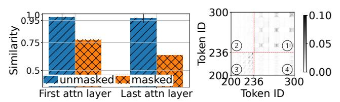
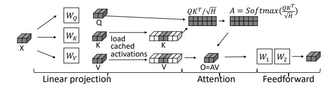

# <span id="page-4-0"></span>3.1 Key Insight

As discussed in §2.4, existing diffusion model serving systems perform full-image regeneration to edit an image, and thus suffer from high computational load. To address the limitation, an efficient serving system should exploit sparsity introduced by the masks to accelerate image generation without compromising image quality.

Following this insight, we propose a *mask-aware* serving system, which selectively reduces the computational load associated with the unmasked regions in an image template to accelerate the image editing process. As discussed in §2.1, pixels in an image are mapped as tokens for transformer block computation. Leveraging the mask, we can categorize the tokens as *masked tokens* and *unmasked tokens*, allowing us to precisely differentiate their computations in the transformer blocks. For an image template, its pixels corresponding to the unmasked tokens are supposed to be untouched. Intuitively, intermediate activations generated during inference computation that are associated with these unmasked tokens can be cached and reused in subsequent requests that edit the same template, thereby eliminating the need for re-computation.

**How does it work in FlashPS?** In Fig. 5, we show the main computation operators in a transformer block and compare the standard computation flow with that of FlashPS.

Tokens in transformer blocks are discrete, and their computations are generally independent, except during the attention computation [51], where the computations of  $\mathbf{Q}\mathbf{K}^T$  and softmax(·) introduce inter-token dependencies, i.e., the computation results rely on the values of multiple tokens. Other computations, including linear projection, feedforward, LayerNorm [11], GeLU activation, and dropout, are token-wise, meaning that the computation of each token occurs independently of the others. Consequently, for these

<span id="page-4-1"></span>

**Figure 5.** Main computations in a transformer block. A darker cell/cuboid means it contains more information about the masked tokens. We omit LayerNorm [11], GeLU, and dropout for simplicity, which will not affect the results.

<span id="page-4-2"></span>

**Figure 6.** Token activations and attention scores in a SDXL model. **Left**: Cosine similarity of activations. **Right**: Zoomedin visualization of attention scores. Tokens with ID 200-236 are masked and with ID 237-300 are unmasked.

token-wise operations, we can precisely differentiate the computations of the masked tokens and the unmasked tokens, with no assumption of the shape of masks.

Mask-aware attention. Fig. 5-Top illustrates the standard computation process of a transformer block. We start with an input  $X \in \mathbb{R}^{B \times L \times H}$ , where B is the batch size, L is the token length, and H is the hidden dimension. Some tokens within X are masked. First, a linear projection maps X into Q, K, V, using the weight matrices W<sub>Q</sub>, W<sub>K</sub>, W<sub>V</sub>, respectively. As the linear projection computation is token-wise, the computations for masked and unmasked tokens are independent. Subsequently, the scaled matrix multiplication  $\mathbf{O}\mathbf{K}^{\mathrm{T}}/\sqrt{H}$  combines **O** and **K**, during which the values of masked and unmasked tokens are multiplied according to the rule of matrix multiplication. This results in some entries in the resulting matrix being derived from both masked and unmasked tokens (indicated by lighter gray cells). Then, the softmax function is applied row-wise to  $QK^T/\sqrt{H}$ , producing A, where all elements in A will be derived based on the value of masked tokens. While the subsequent computations O = AV and feedforward are token-wise, the activations in the output Y corresponding to the unmasked tokens are indirectly affected by the values of the masked tokens.

However, we observe that the activations corresponding to unmasked tokens in Y exhibit high similarity across different requests (those lighter gray cuboids in Y in Fig. 5-Top). This can be interpretable as the unmasked tokens are supposed to be untouched during image editing. To verify this,

<span id="page-5-0"></span>

Figure 7. An alternative approach of caching K and V.

we collect the activations from matrix Y and calculate the average cosine similarities between corresponding masked and unmasked tokens, as shown in Fig. 6-Left. The results confirm that the activations for unmasked tokens in Y are indeed highly similar across different images. Additionally, in Fig. 6-Right, we further visualize the attention score matrix (A in Fig. 5) and observe that masked tokens primarily attend to other masked tokens (③), while unmasked tokens predominantly attend to other unmasked tokens (①). Masked and unmasked tokens attend to each other significantly less (② and ④), which aligns with the findings in [58].

Driven by the observation, we propose to reduce the computational load associated with unmasked tokens by reusing cached activations, as illustrated in Fig. 5-Bottom. Given X with some tokens masked, we extract the matrix of masked tokens, project it into Q, and compute an Y matrix exclusively for the masked tokens, while replenishing cached activations for the unmasked tokens. Although reusing cached activations may slightly alter the image generation process, analysis in Fig. 6 supports the feasibility of the approach. Further, our evaluation in §6.2 shows that the images generated using cached activations are visually indistinguishable from those produced through the original computation.

The method of selecting masked tokens is analogous to the decoding process in large language model inference, where the prediction of the next token utilizes the Q matrix of only the newly generated token along with the K and V matrices of all present tokens.

Alternative approaches. While our approach in Fig. 5-Bottom utilizes cached activations on Y, an alternative strategy is to apply cached activations on K and V instead, as illustrated in Fig. 7. This approach is analogous to the well-known concept of KV-cache in LLM serving [33, 46], a technique that helps speed up LLM decoding process by reusing cached K and V activations, instead of recomputing them from scratch, making text generation much faster and more efficient. However, this approach doubles the sizes of the cached activations while offering only marginal advantages compared to the approach in Fig. 5-Bottom. With a mask ratio of 20%, caching K and V reduces the latency by 10% compared to caching Y, from 2.27s to 2.06s.

#### 3.2 Analysis of Speedup and Caching Overhead

In this part, we mathematically analyze the speedup and caching overhead associated with the approach in Fig. 5-Bottom, as summarized in Table 1. We focus primarily on

<span id="page-5-1"></span>

|                 | Ori. FLOP  | Acc. FLOP   | Speedup       | Cache Shape              |  |
|-----------------|------------|-------------|---------------|--------------------------|--|
| $(XW_1)W_2$     | $O(BLH^2)$ | $O(BmLH^2)$ | $\frac{1}{m}$ | $(B, (1-m) \times L, H)$ |  |
| XW              | $O(BLH^2)$ | $O(BmLH^2)$ | $\frac{1}{m}$ | $(B, (1-m) \times L, H)$ |  |
| $QK^T/\sqrt{H}$ | $O(BL^2H)$ | $O(BmL^2H)$ | $\frac{1}{m}$ | $(B, (1-m) \times L, H)$ |  |

**Table 1.** Analysis of the speedup and cache sizes. Without loss of generality, we define an input  $\mathbf{X} \in \mathbb{R}^{B \times L \times H}$ ; a mask ratio  $m \leq 1$ ; two layers in feedforward computation  $\mathbf{W}_1 \in \mathbb{R}^{H \times 4H}$  and  $\mathbf{W}_2 \in \mathbb{R}^{4H \times H}$ ;  $(\mathbf{X}\mathbf{W}_1)\mathbf{W}_2$  denotes feed-forward;  $\mathbf{X}\mathbf{W}$  denotes linear projection;  $\mathbf{Q}\mathbf{K}^T/\sqrt{H}$  denotes the scaled dot-product attention.

<span id="page-5-2"></span>

Figure 8. An overall architecture of FLASHPS.

the computations involved in the feedforward and the linear projection and attention score computations of the attention mechanism. As indicated in Table 1, the computational and caching overhead of mask-aware image editing is predominantly determined by the batch size B and the mask ratio m, since the values of L and H typically remain constant for a given diffusion model.

The serving batch size B within a worker is determined by how a scheduler routes requests across workers and how a worker handles requests in a batch, while the mask ratio m is input-dependent and varies significantly (§2.2). Consequently, challenges of batch serving and request routing emerge in an image editing serving system (C2 and C3).

#### 4 FLASHPS System Design

This section presents FlashPS, an efficient serving system with the *mask-aware* image editing approach (§3.1). Within a worker, FlashPS accelerates the inference of image editing by reusing the pre-computed activations to avoid the redundant computation for the unmasked region. Besides, it firstly adapts continuous batching to diffusion model serving to minimize the queueing times of requests. At the cluster scale, FlashPS features a mask-aware request routing strategy for balancing the workload across workers.

#### 4.1 System Overview

Fig. 8 illustrates the system architecture, which consists of a cluster of worker replicas and a scheduler.

**Workflow.** As shown in Fig. 8, new requests first arrive at the scheduler (①), which uses the mask-aware scheduling algorithm described in §4.4 to route them to the appropriate

<span id="page-6-1"></span>

**Figure 9. Top**: Naive caching loading. **Middle**: Strawman pipeline loading. **Bottom**: Bubble-free pipeline loading.

workers (②). Employing a continuous batching strategy detailed in §4.3, the worker fetches requests from the request queue (③) for the diffusion model (④) to process, wherein the model interacts with the cache engine to speed up image generation through caching, as explained in §4.2. Finally, the output images are returned to the users (⑤).

#### <span id="page-6-0"></span>4.2 Efficient Image Editing with Caching

Following the design approach in §3.1, we implement an efficient image editing with caching in the FlashPS's worker replicas. Though reusing cached activations can reduce the computational load, the storage and loading of the cached activations pose significant challenges. First, the size of cached activations of a template image is large, reaching up to 2.6 GiB for a SDXL model [58]. As the number of image templates can be large, storing all activations in the limited high-bandwidth memory (HBM) of GPUs is impractical. To address this challenge, FlashPS utilizes host memory and disk storage for cached activations storage. However, loading cached activations from slow medium to HBM can result in high loading overhead. This overhead becomes more significant when the mask ratio is smaller and the size of cached activations gets larger (§2.2).

Strawman solutions to loading cached activations. Naively loading cached activations from slower mediums to HBM can block the computation and cause a waste of computational resources, since the computation stream relies on the cached activations to execute the mask-aware image editing inference computation, as shown in Fig. 9-Top. This overhead becomes more significant for the smaller mask ratios §2.2.

To eliminate this overhead, a strawman solution is to employ a block-wise pipeline loading scheme to mitigate the impact. The main idea is to overlap the loading of the cached activations for unmasked tokens with the inference computation of the masked tokens. In particular, the diffusion model comprises a sequence of transformer blocks, where one transformer's input depends on its precedent's output. Therefore, we cache the activations at the granularity of transformer blocks. As shown in Fig. 9-Middle, it first loads the cached activations of the first block. Starting from loading the second block, the pipeline is built: while loading the  $i^{th}$  block, the computation stream can concurrently execute the computation of the  $(i-1)^{th}$  block.

However, bubbles will exist in the pipeline. First, before initiating the computation of the first block, the cached activations for this block must be prepared in the HBM. The cache load stream first issues the loading of cached activations for the first block into the HBM. Only after this is complete can the computation stream start processing the first block. As a result, a bubble forms due to the loading of the first block by the cache load stream. Second, when the mask ratio is small, the latency for loading a block can exceed its computation latency. In such cases, bubbles will appear between the computations of two adjacent blocks, as shown in Fig. 9-Middle.

Bubble-free pipeline. FLASHPS eliminates the pipeline bubbles by selectively using cached activations for transformer blocks within a diffusion model, as illustrated in Fig. 9-Bottom. For blocks that do not use cached activations, FLASHPS computes all tokens—both masked and unmasked without distinguishing between them, thereby avoiding the loading latency associated with cached activations. For example, in Fig. 9-Bottom, only the activations of Block<sub>2</sub> are loaded, while  $Block_0$  and  $Block_1$  do not use cached activations. To determine which blocks should use cached activations, we formulate a dynamic programming (DP) problem aimed at minimizing inference latency, as described in Algo. 1. The complexity of the DP algorithm is O(N), where N is the number of transformer blocks in the diffusion model, typically on the order of tens. Therefore, the overhead of solving Algo. 1 is negligible.

#### **Algorithm 1:** DP for pipeline loading

<span id="page-6-2"></span>**Input:** N: the number of transformer blocks in a diffusion model;  $C_{\mathbf{w}}^{m}$ : the block's computation latency of mask ratio m with cached activations;  $C_{\mathbf{w}/o}$ : the block's computation latency without any cached activations;  $L^{m}$ : the loading latency of the block of mask ratio m.

Output: useCache: a list to indicate whether to use cached activations for each block; pipeline\_latency: the minimal inference latency of the pipeline.

```
// Initialize computation & loading time, caching decisions
1 \ comp \leftarrow [0]^{N+1}, load \leftarrow [0]^{N+1}, useCache \leftarrow [0]^{N}
2 for i \in \{1, 2, ..., N\} do
          \mathbf{if} \, \max(load_{i-1} + L^m, comp_{i-1}) + C^m_{w.} \leq comp_{i-1} + C_{w/o}
3
            then
               load_i \leftarrow load_{i-1} + L^m
 4
                comp_i \leftarrow \max(load_{i-1} + L^m, comp_{i-1}) + C_{w.}^m
 5
               useCache[i-1] \leftarrow True  \triangleright Load cached activations
          else
               load_i \leftarrow load_{i-1}
                comp_i \leftarrow comp_{i-1} + C_{w/o}
                useCache_{i-1} \leftarrow False \quad \triangleright Compute
11 pipeline\_latency \leftarrow comp_N
```

Algo. 1 can also be applied in the case where the mask ratio is large, which means the computation latency for a block with cached activations exceeds the latency of loading those cached activations. In this case, the inference process becomes computation-bound, and bubbles may appear in the cache load stream. Despite these bubbles, FlashPS does not eliminate them, as all masked tokens must be processed to ensure image quality.

Hierarchical storage for activations As we will show in Fig. [14,](#page-10-0) the serving throughput of a diffusion model serving engine plateaus at a small batch size of 8, which is typically configured as the engine's maximum batch size [\[14\]](#page-13-23). Consequently, storing the activations for inflight requests in the running batch usually requires tens of GiBs of host memory, which is negligible compared to the TiB-scale host memory capacities of modern GPU servers [\[1,](#page-13-24) [2\]](#page-13-25). For instance, a machine with 2 TiB of host memory [\[2\]](#page-13-25) can store up to 787 copies of the activations for the image template used in Fig. [1,](#page-1-0) providing a sufficiently large cache to accommodate activations of image templates ([§2.2\)](#page-2-0).

Despite the capacity of host memory, FlashPS also supports storing cached activations on distributed storage systems or local disks, significantly expanding the storage available for caching activations. However, the I/O speed of these secondary storage media is on the order of GiB/s, much slower than the tens of GiB/s bandwidth provided by host memory [\[38\]](#page-13-9). To utilize the distributed storage system effectively, FlashPS evicts cold activations from host memory to secondary storage based on an LRU (least-recently-used) policy. When a request arrives, if its required activations are not in host memory, FlashPS begins loading them from secondary storage into host memory. This process can run concurrently while the request is queuing, following a stateof-the-practice approach used in KV cache management for LLMs [\[22\]](#page-13-26). In [§6.2,](#page-9-0) our evaluation shows that requests often experience a few seconds of queuing time, which is sufficient for loading activations from secondary storage. For instance, loading the cached activations of the image template in Fig. [1](#page-1-0) from disk takes 6.4 seconds.

## <span id="page-7-0"></span>4.3 Continuous Batching

Leveraging the masks in image editing, FlashPS significantly reduces the computational load per request, which can magnify the performance gain of batching by 1.29× on a Flux model, compared with full-image regeneration. However, existing diffusion model serving systems often neglect the advantages of batching [\[35,](#page-13-11) [38\]](#page-13-9). Consequently, these systems typically adopt a simplistic static batching approach [\[9,](#page-13-15) [19\]](#page-13-14), which maintains a fixed running batch size until the running batch completes, leading to extended queuing times and low GPU utilization.

We observe that diffusion models employ an iterative denoising process ([§2.1\)](#page-2-4), where a latent undergoes multiple denoising steps before being decoded into the final output image. The iterative nature of this denoising process is akin to the iterative decoding in LLMs. Drawing on this parallel,

<span id="page-7-1"></span>

Figure 10. Top: A strawman continuous batching. Bottom: Adapted continuous batching in FlashPS. Pre.: preprocessing; D.: denoising; Post.: postprocessing.

FlashPS adapts the continuous batching strategy to diffusion model serving. Typically, an image generation request is processed through a sequence of steps: one-step preprocessing, multi-step denoising computations, and one-step postprocessing. In diffusion model serving, continuous batching is applied at the step level. This means that once a request completes all steps of computation, it is immediately removed from the running batch; new requests can join the batch in just one step, without waiting for the entire batch inference to complete.

Strawman solution. A strawman continuous batching is illustrated in Fig. [10-](#page-7-1)Top, where preprocessing and postprocessing can frequently disrupt the denoising computations [\[7,](#page-13-17) [37\]](#page-13-18), cumulatively affecting request serving. In Fig. [10-](#page-7-1)Top, the serving of request 1 is interrupted by the preprocessing of the request 2 and 3. In diffusion model serving, the preprocessing and postprocessing are CPU-intensive tasks that involve substantial serialization and deserialization computations for images. While the overhead of these operations might be negligible when considered individually, their cumulative impact can significantly increase request serving latency. As demonstrated in [§6.4,](#page-11-0) our microbenchmark evaluation shows that requests can be interrupted up to 8 times, resulting in a 40% increase in P95 request serving latency.

Disaggregation. To address the issue, FlashPS disaggregates the preprocessing/postprocessing from the iterative denoising computation by distributing them across different process, as shown in Fig. [10-](#page-7-1)Bottom. The main process is dedicated to GPU-intensive denoising computations, while CPU-intensive preprocessing and postprocessing tasks are offloaded to independent processes. Consequently, the main process will not be interrupted, reducing the tail latency (P95) of request serving by 29% in evaluation ([§6.4\)](#page-11-0).

Comparison with LLM's continuous batching. The main difference of continuous batching in diffusion model serving and LLM serving results from the inherent model differences. LLM's continuous batching cannot be directly

<span id="page-8-1"></span>

Figure 11. Visualization of the models to estimate computation latency. **Left**: SDXL on H800. **Right**: Flux on H800.

applied due to the pre-/post-processing steps in image generation, which are absent in LLM serving. These extra operations from new requests disrupt all ongoing requests, creating a cumulative effect as shown in Fig. 10-Top, where Req1 experiences two disruptions.

#### <span id="page-8-0"></span>4.4 Mask-Aware Scheduler

Our characterization studies (§2.2) show that masks vary significantly in size. Therefore, naively scheduling requests across worker replicas, such as using the First-Fit bin-packing algorithm [14], will naturally introduce load imbalances for workers. This issue of load imbalance is also prevalent in LLM serving, where previous research often employs load balancing strategies that assess worker load based on the number of assigned requests or the number of tokens in those requests [46, 50]. However, these methods fail to accurately gauge the load on a worker in FlashPS, resulting in 35% increase in request tail latency (P95) in §6.5.

Estimate a worker's load. Based on the design outlined in §4.2 and §4.3, each worker in FlashPS will handle multiple requests in a batch, which involves *computing* the masked regions for images and *loading* cached activations. As shown in Table 1, the computational load and cache loading are largely determined by the mask ratio of requests. Given the wide variation in mask ratios (§2.2), simple load balancing at the request or token granularity will overlook the impact of mask ratio, failing to accurately reflect the computation and cache loading latencies, which can degrade cluster-level serving performance.

To address the challenge, FLASHPS employs linear regression models to estimate computation latency and cache loading latency based on the mask ratios for a batch of requests. This approach helps evaluate the load on a worker replica. Linear models are chosen because both the computational load and cache sizes scale linearly with the mask ratio (Table 1). These regression models can be fitted using offline data. In Fig. 11, we visualize the models used to estimate the computation latency for a batch of requests. Each request has different mask ratios. Following Table 1, for a batch of requests, we compute FLOPs of the inference computation based on their mask ratios, which are mapped to inference latency by the regression models. Our models can accurately fit the data, achieving a high coefficient of determination ( $R^2$ ) of 0.99, suggesting the models can predict performance almost perfectly:  $R^2$ =1 indicates a perfect fit. The parameters of the regression models vary with diffusion models and GPUs.

Load balance across worker replicas. Achieving optimal load balance across worker replicas requires prior knowledge of request details, such as arrival times and mask ratios. With this information, an optimal load balance schedule could theoretically be available by employing bin packing algorithms to evenly distribute the load among worker replicas. However, this assumption is unrealistic in online model serving, where request arrival patterns are bursty [23, 63] and mask ratios vary widely (§2.2). Additionally, online migration of requests among worker replicas for load balance [57] is impractical in image editing serving due to the significant data communication overhead of large latents, as well as image serialization and deserialization overheads, which can take 20% of the inference latency of editing an image.

To address these challenges, we utilize the established regression models to develop a greedy mask-aware scheduling algorithm that dynamically assigns new requests across worker replicas (Algo. 2). The scheduler selects the worker replica with the minimum estimated load to handle each new request. It keeps track of the runtime status of worker replicas, such as the slack in their running batches. Upon receiving a new request, the scheduler identifies candidate workers and calculates a cost score for each one. This cost score estimates the load in terms of serving latency on a worker candidate if the new request were allocated to it, derived from extending Algo 1, where the  $C_w^m$ ,  $C_{w/o}$  and  $L^m$ of transformer blocks are estimated using the developed regression models. The scheduler then assigns the request to the worker candidate with the lowest cost score, ensuring effective load distribution. In §6.5, we evaluate our maskaware load balance scheduler, which decreases tail request latency by up to 26%, compared to baselines. Additionally, in §6.6, we demonstrate that the load balance scheduler incurs negligible overhead relative to request serving latency.

#### **Algorithm 2:** Mask-Aware Scheduling Policy

```
Input: Workers: a cluster of worker replicas; R: a newly coming
          request; Comp(\cdot), Load(\cdot): lienar regression models for
           Computation and Cache loading; dp(batch, Comp(\cdot)),
          Load(\cdot)): a function that extends Algo. 1 to return a
          pipeline and execution latency.
1 Function CalcCost(req, worker):
2
        new_batch \leftarrow worker.running_batch + req
        results \leftarrow dp(new_batch, Comp(\cdot), Load(\cdot)))
       return results.pipeline_latency
5 while True do
        Request R arrives
        // Find candidate workers with slack in its running batch
7
        candidates ← available workers
        for worker \in candidates do
8
            worker.cost \leftarrow CalcCost(R, worker)
        best \leftarrow min(candidates, key=lambda \ x: \ x.cost)
10
       best.serve(R)
```

