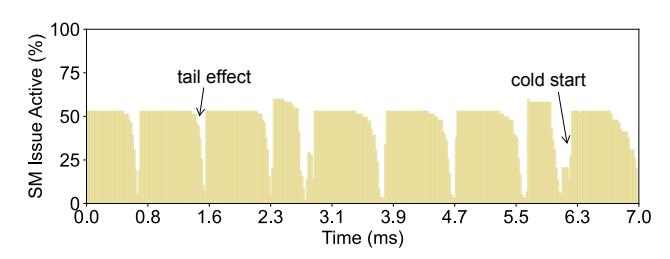

# Keywords

Deep Learning Compiler, Model Serving System, High Performance Computing

### ACM Reference Format:

Yikang Zhang, Junlong Chen, Wei Wang, Jia Liu, Nan Hu, and Haipeng Dai. 2026. Automated End-to-End Model Serving with Cooperative Compilation and Scheduling. In European Conference on Computer Systems (EUROSYS '26), April 27–30, 2026, Edinburgh, Scotland UK. ACM, New York, NY, USA, [16](#page-15-0) pages. [https://doi.org/10.1145/3767295.](https://doi.org/10.1145/3767295.3769392) [3769392](https://doi.org/10.1145/3767295.3769392)

∗Haipeng Dai is the corresponding author.

[This work is licensed under a Creative Commons Attribution 4.0 Interna](https://creativecommons.org/licenses/by/4.0)[tional License.](https://creativecommons.org/licenses/by/4.0)

EUROSYS '26, Edinburgh, Scotland UK © 2026 Copyright held by the owner/author(s). ACM ISBN 979-8-4007-2212-7/26/04 <https://doi.org/10.1145/3767295.3769392>

Figure 1: Active cycles of the A100 GPU [\[20\]](#page-14-0) during the inference of ResNet-50 with TVM [\[32\]](#page-14-1).

