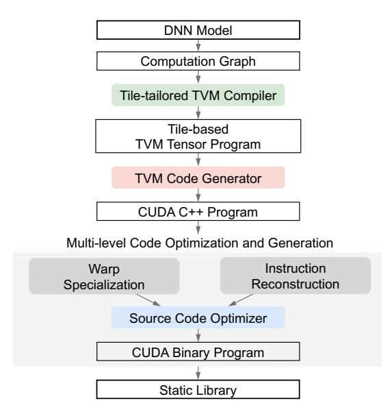

# 4.2 Generating Kernels

After the partition of graphs and operators, the compiler generates micro kernels, a collection of code candidates with different trade-offs between ILP, TLP, and intensity, for every micro operator. For a shepherd operator, the compiler first produces kernels for its composed operators and then produces a shepherd kernel to manage these kernels. The key designs and compilation of kernels are listed below.

Kernel structure. Most high-performance DNN kernels adopt a two-phase design: (1) a compute phase, where mainloop warps and data copy warps collaborate on tensors, and (2) a write-back phase, where mainloop warps transfer the computed values from register file to global memory. The compiler allocates 4 fixed warps for mainloop and 4 for shared→register data copy. As the GPU scheduler always distributes each set of 4 consecutive warps to 4 SMSPs of a SM [\[33\]](#page-14-23), the mainloop warps and data copy warps share the same SMSP for improved TLP.

Data copy. High-performance DNN kernels necessarily leverage shared memory for computations on subsets of larger data, following the algorithmic pattern: copy tile data from global memory to shared memory, perform some onchip computations on it, and eventually copy it back to global memory. The compiler automates the data copy process of global→shared, shared↔register, and register→global.

First we consider the data copy from global memory to shared memory. The compiler implements two key techniques: asynchronous copy and warp specialization. Asynchronous copy transfers data from global memory to shared memory, with its cost amortized across participated warps spread on 4 SMSPs. Furthermore, post-Ampere architectures [\[9\]](#page-14-10) can benefit from hardware acceleration. However, reusing the same warps for both mainloop and data copy results in only partial asynchrony because instruction execution remains synchronized between compute and memory operations. This is solved by warp specialization which uses 4

Figure 6: Infera compiler stack. It takes an ONNX model as input and produces binaries.

dedicated warps to copy data from global memory to shared memory. The compiler uses pipeline to synchronize between mainloop warps and data copy warps, whose stage number is set to 2, 3, or 4. Additionally, the compiler generates the data copy code and the mainloop warp code separately due to their differing register usage.

Next, we consider the data copy between shared memory and register file. For shared memory, the compiler adopts padding techniques to address the bank conflict [\[32\]](#page-14-1). For register file, the PTX compiler ptxas uses delicate register allocation to eliminate the conflict.

Finally, we consider the data copy from register file to memory. In the write-back phase, the warps directly copy data from register file to global memory. The compiler insert \_\_threadfence() after the memory operations to ensure global memory consistency at system (host+device) level. Prior to the write-back phase, a data layout transformation phase can be fused and implemented in shared memory. Cooperative group synchronization thread\_group.sync() is inserted between the data layout transformation phase and the write-back phase to synchronize threads and ensure thread-block-level consistency.

All memory operations are implemented with wide data types (e.g., STG.128) to minimize memory instructions and alleviate issue unit pressure.

Tile size. Determining the data tile size of kernels [\[1\]](#page-14-17) dictates the granularity of data transfer across multiple memory hierarchies. Similarly, constructing a micro kernel inherently introduces the notion of grid tile size, which specifies the volume of data processed in global memory. Roller [\[61\]](#page-15-9) proves that considering only this factor is sufficient to produce highperformance kernels. Moreover, we find that varying tile size enables striking a balance between ILP, TLP, and intensity. Below, we show how the tile size is determined to achieve this balance.

The compiler employs a top-down strategy to decide the tile size at all memory levels. Note that to ensure theoretical TLP, the amount of resources occupied by each warp should not exceed 1/4 of every memory level. At register file level, the compiler sets the 32-bit register usage limit per thread to 64, 96, or 128. This configuration implements the trade-off between TLP and the other two metrics. Then, the compiler calculate various tile sizes considering the trade-off between spatial axes and reduction axes [\[32\]](#page-14-1), which implements the trade-off between ILP and intensity. At shared memory level, the compiler set memory usage limit per thread block with several size configurations as 48 KiB, 80 KiB, 112 KiB, or 144 KiB. The spatial axis tile size is determined by multiplying the thread spatial tile size by the thread count of the thread block, while the reduction axis tile size is automatically constrained by the shared memory usage limit. At global memory level, the spatial axis tile size is calculated by multiplying the thread block spatial tile size by the thread block number of the grid, with a fixed grid size of 64. The reduction axis tile size at this level are parameterized as kernel arguments. These configurations align with the prevailing numerical standards of modern GPUs for ensuring hardware compatibility.

Instruction scheduling. ILP depends on both resource control discussed above and instruction pattern. To precisely control ILP, we should operate directly on machine-level assembly code instead of writing high-level code and compiling them with NVIDIA compilers nvcc or ptxas. However, the low-level CUDA kernel code is complex and closed-sourced, making the direct generation of assembly or binary code difficult and error-prone.

We introduce a novel technique called "cut and patch" to tackle it. The workflow involves extracting the on-chip computation code segments from CUDA kernels of SASS format, modifying it, and reinserting the optimized version. First, the CUDA compiler transforms a program of CUDA C++ to a binary file and disassemble it with dsass [\[7\]](#page-14-24). During the process, all optimizations of nvcc are turned off to avoid unexpected optimizations such as instruction aggregation and loop unrolling which disrupt our carefully constructed trade-offs. Next, the compiler cuts out the mainloop program for on-chip computation from the compiled program. The extracted code segment is then applied with the list scheduling algorithm [\[36\]](#page-14-25) to minimize total stall cycles. Additionally, the compiler adds yield flags every 64 instructions [\[16\]](#page-14-26) to balance warp progress, preventing any single warp from advancing too far ahead and getting stuck at barriers.

Compilation. The construction of kernels is totally based

Figure 7: Infera inference server pipeline. It accepts heterogeneous user jobs and provides end-to-end inference service. Red blocks are jobs, blue blocks are tasks, and green blocks are kernels.

on static analysis, without performance estimation or GPU profiling. The compilation of different kernels can be fully parallelized and achieve acceleration proportional to the allocated CPU resources.

