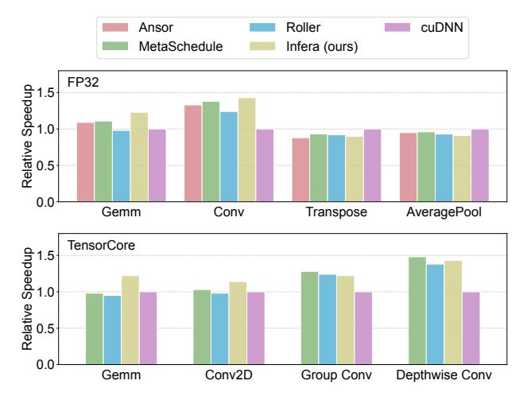
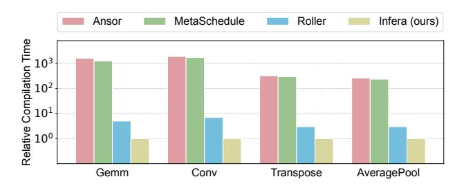
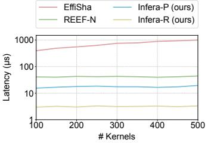

# 5.4 Execute Tasks

In each scheduling cycle, the task executor executes the VTB

generated at the cycle's beginning. In this section, we first elaborate on how to execute a VTB and then discuss the preemption of running tasks.

Three-stage task execution. For higher throughput, the task execution employs a three-stage pipeline, with each stage dynamically adapting its execution rate to maintain optimal GPU throughput. First, TEU selects some appropriate kernels from the tasks in the VTB for colocation on the GPU. Next, these kernels are fused at warp level into a single kernel, which is launched to be executed by the GPU. This ensures the SM-level spatial sharing of the selected kernels, which brings high GPU pipeline throughput based on the analysis in § 2.2.

Stage I: selects kernels from a VTB (SelectKernels(VTB), Alg1:L5). The selected kernels are expected to be fused and thus executed concurrently on the GPU.

Selecting optimal kernels for execution is non-trivial due to the two challenges: (1) excessively large optimization space where any computable data block can be processed by any applicable kernel, and (2) numerous optimization objectives (e.g., GPU throughput, data parallelism) and various constraints (e.g., data dependencies, kernel fusibility). To address this, we propose a two-step kernel selection methodology: first selecting data blocks then determining kernels.

In the first step, the kernel selector decides the candidate data blocks, with the objective of optimizing data asynchrony. The dependency relationship of data blocks in DNNs is isomorphic to a directed acyclic graph (DAG), where nodes represent data blocks labeled as "completed", "pending", or "running", and edges indicate data dependencies. This graph is built during the compilation of DNNs through static analysis of the computation graph. During inference, only data blocks free of dependencies (i.e., nodes with zero in-degree) can be computed. Once a data block is completed or nearcompleted, the dependencies on it are satisfied, marked in the DAG by changing the status of the node's outgoing edges. To enhance data asynchrony, we aim to maximize the asynchronous wavefront which is defined as the expected number of mutually independent data blocks available for future execution, denoted as G(u). A key insight is the transitive relationship between connected nodes: the release of a parent node reduces the dependency count of its children, implying that the children's expected asynchrony gain propagates uniformly across all parent nodes. Consequently, we have

$$G(u) = \left(\sum_{v \in \Gamma^{+}(u)} \frac{G(v) + 2}{d^{-}(v)}\right) - 1,$$
 (5)

where  $\Gamma^+(u)$  denotes the out-neighbors of node u and  $d^-(v)$  represents the in-degree of node v. To avoid favoring long chains, recursion terminates at a specific depth with G(v) = -1. Accordingly, the data blocks with the highest G(u) values

are selected as candidates. The overhead of computing G(u) is low because it is majorly computed at compile time and dynamically adjusted for affected nodes at inference time.

In the second step, the kernel selector chooses appropriate kernels for the data blocks, with the objective of minimizing execution time. According to the analysis in § 2, we reformalize the optimization as

$$\min \frac{\#inst}{IPC}, \quad \text{s.t.} \quad TLP \ge 4. \tag{6}$$

We first address the  $TLP \geq 4$  constraint. Theoretical TLP is guaranteed through careful management of register file and shared memory usage (§ 4.2), while achieved TLP optimization employs dynamic grid tile size decision at inference time, which increases the number of threads when occupancy is low. Next, *#inst* can be precisely determined via static analysis of the kernel. Finally, we estimate IPC through comprehensive hazard analysis. For data hazard, we collect the stall cycles and running cycles; for structure hazard, we calculate the density of instructions of different types and the hardware bandwidth. We pass them into an online-learned super lightweight regression model which outputs the IPC. Thereby, we are able to select the appropriate kernels for fuse via Eq. (6).

Stage II: fuse selected kernels (FuseKernels(Kset), Alg1:L6). Given several primitive kernels in CUDA binary format, we fuse them horizontally at warp level.

We adopt a unified function signature \_\_global\_\_ void kernel(void\* args), where args points to a global memory area containing all required data including the original kernel arguments and each thread's special registers. The core mechanism involves generating a prologue to enable each thread to retrieve its designated data (including special registers and arguments) and subsequently branch to the corresponding code segment.

Here are some implementation details. (1) Each kernel's special registers such as %tid are substituted with general purpose registers, which are further restored at the prologue phase. (2) Each kernel has its own shared memory resources defined by \_\_shared\_\_, including arrays and asynchronous copy shared objects pipeline\_shared\_state. Shared space is indexed by the physical-level base plus index addressing, where the base is omitted in SASS code and dynamically generated at runtime. Therefore, the fuser adds appropriate offsets to shared memory access instructions to partition the large shared space for each original kernel. (3) Barrier resources used for synchronization BAR. SYNC are reorganized as thread organization changes. (4) Some flags are inserted to the fused kernel, including a preemption flag for preemption signal delivery, a locking flag for holding kernels until the conditions are met, and a progress flag for the indication of execution progress.

To improve efficiency, the kernel fusion happens at the CUDA binary code level to minimize latency and adopts a thread pool design to maximize throughput.

Stage III: launch a fused kernel (LaunchKernel (K), Alg1:L7). The kernel launcher features a multi-level pipeline to launch fused kernels.

At the host side, the fused kernels are first enqueued in Host Kernel Queue (HKQ) upon generation by kernel fusers. Each kernel is composed of program binary code, arguments, and launch configurations. HKQ is a priority queue where kernels are sorted according to their launch timestamps determined by the kernel selector. Kernels transferred to HKQ are marked as "on device" and reside until completion.

Kernels in HKQ are sequentially copied to a device-side kernel buffer named Device Kernel Queue (DKQ). To make kernels executable, their code needs to be copied to a specific device kernel execution area. However, the official kernel copy function cuModuleLoad incurs global host-device synchronization and therefore cannot be called at inference time. To address it, we preserve several placeholder kernels and overlay the kernel code onto these kernel slots via driver-level modifications [21]. Specifically, TEU first copies kernel code to device-side kernel slots and kernel arguments to global memory, and then add the kernel pointer, the argument pointer, and the kernel launch configurations to DKQ. In addition, it maintains a pool in host memory to retain fused kernel files for potential reuse.

To minimize latency and interference as much as possible, all kernel-related data transfer is implemented with GDRCopy functions gdr\_copy\_to\_mapping [15], which bypasses DMA engines for low delays (<100 ns for small data payloads and  $<5\,\mu s$  for typical kernel size).

At the device side, there runs a persistent kernel named "daemon kernel" for taking over the kernels in DKQ. The daemon kernel leverages the CUDA Dynamic Parallelism (CDP) technique to launch kernels directly at the device side with cudaLaunchDevice [9]. Fire-and-forget launches are immediately scheduled by GPUs for execution without any dependency on the completion of previously launched grids. This interface is much faster without stream tracking overhead. In addition, it maintains a double-ended queue in shared memory for low-latency kernel fetching.

At kernels' completion, the daemon kernel is notified to perform error checking cudaGetLastError. The daemon thread throws an error and notifies the host task scheduler once the kernel exits unsuccessfully.

In contrast to conventional approaches that pushes kernels to host-side streams, our method of launching kernels favors ultra-low latency ( $<10\,\mu s$ ) and avoids the HoL problem [44] by not using hardware queues.

**Preemption.** The task execution process is divided into host-side and device-side operations, both of which should

respond to preemption.

The kernel selector stops selecting kernels while the kernel fuser keeps enqueuing fused kernels into HKQ. Meanwhile, the host-side kernel launcher (1) suspends HKQ-to-DKQ transfers and (2) saves all the kernels in HKQ (marked as "off-device"), while the device-side daemon (1) saves all the kernels in DKQ and (2) saves all the kernels in shared memory. The kernel launcher and the daemon kernel are then restored to their initial state. In-flight kernels can detect preemption signals and terminate promptly, while those failing to terminate in time pose no harm to the system due to the idempotent execution of DNN kernels.

New context execution and previous context saving can be conducted simultaneously since they do not share the same kernel launch channel.

### 6 Evaluation

#### 6.1 Kernel Generation

Infera's core is implemented as a kernel-space module in C++ ( $\sim$ 17 k LoC). To minimize interference and ensure low latency, latency-sensitive threads (e.g., fuse kernels) are assigned real-time scheduling or pinned to isolated CPU cores (e.g., select kernels) with interrupts disabled, while the GPU daemon kernel exclusively occupies an entire SM core. Infera compiler builds on TVM 0.16.0 [5], whereas Infera inference server is developed from scratch.

We evaluate Infera's performance across various work-loads, setups, and metrics to answer the following questions:

- Can Infera compiler generate efficient kernels compared to existing DL compilers/libraries? (§ 6.1).
- How does Infera inference server provide model serving compared to existing DL serving systems? (§ 6.2)

Evaluations are performed on a server with an Intel(R) Xeon(R) Gold 6330 CPU, 512 GB of RAM, and an NVIDIA A100-PCIE-40GB GPU, running Linux 6.1.0 and CUDA 12.0.

Methodology. The Infera compiler, although designed for the whole inference system with static coupling property, can still produce efficient kernels as a standalone module. We evaluate the compiler's performance against other kernel compilers: Ansor [59], Roller [61], MetaSchedule [47], and cuDNN [10]. Ansor and MetaSchedule are the representatives of tuning-based compilers, Roller reduces search time by concentrating on tile size search and evaluating programs via a hardware performance model, and cuDNN is a hand-optimized library which is widely used in popular frameworks such as PyTorch [45].

We select several classic operators [22] for evaluation: Gemm, Conv2D (as well as its variants), Transpose, and AveragePool. The first two are compute bound while the other two are memory bound. All operators are medium-sized which run for several milliseconds.

Figure 9: Performance of operators generated by various kernel compilers on NVIDIA GPUs, evaluated separately on floating-point units and tensor units.

Figure 10: Search/compilation time of various kernel compilers on NVIDIA GPUs.

We let search-based compilers (i.e., Ansor, Roller, and MetaSchedule) run long enough until convergence for each test case, select the optimal configurations for cuDNN, and take the best programs from Infera's generated kernels.

**Kernel performance.** We first examine the quality of kernels produced by the Infera compiler in Fig. 9. The Infera compiler demonstrates superior or competitive results compared with other compilers/libraries, which is at least 5% better than the others on average. It supports TensorCore by generating dedicated load and compute instructions [50]. The performance gain is attributed to the meticulous kernel optimization, particularly the introduction of instruction scheduling and warp specialization (§ 4).

**Compilation time.** We then check the compilation/tuning speed of the kernel compilers. Specifically, we measure the elapsed CPU time in Fig. 10, which reflects the consumed CPU resource. Due to a long-time search process, Ansor and MetaSchedule take 2 to 3 orders of magnitude more time than Roller and Infera. Although Roller avoids running programs on real hardware, it relies on a performance model to evaluate the quality of programs, which results in Infera saving 66% to 86% more time compared to it.

| Model [13]        | # Layer | Size   |
|-------------------|---------|--------|
| BERT [12]         | 14      | 110 M  |
| ViT [23]          | 37      | 428 M  |
| Inception [25]    | 19      | 23.9 M |
| DenseNet [24]     | 98      | 20.2 M |
| EfficientNet [26] | 41      | 48.3 M |
| LSTM [14]         | 13      | 113 M  |

Table 2: Summary of models used to evaluate Infera.

#### 6.2 DNN Inference

**Methodology.** To validate the serving ability of Infera, we evaluate the end-to-end job inference performance of different model serving systems including Stream [9], MPS [18], Triton [51], Paella [44], and Infera (ours). Stream and MPS are the two classic implementations of running multiple models, Triton is a universal inference platform proposed by NVIDIA, and Paella is designed for minimizing inference latency while improving throughput. TVM is the inference backend for Stream and MPS.

The DNN models used in our evaluation are listed in Table 2. For fairness, the first three networks (i.e., Bert, ViT, and Inception) are compute bound while the other three (i.e., DenseNet, EfficientNet, and LSTM) are memory bound.

The request inter-arrival pattern follows a uniform distribution or a lognormal distribution which can be bursty ( $\sigma = 2$ ) or less bursty ( $\sigma = 1.5$ ). Models are evaluated under single (Fig. 11 (a)–(f)) and mixed (Fig. 11 (g)–(l)) settings. The requests are sustained long enough to ensure system stability and measurement accuracy.

**Job performance.** The results in Fig. 11 indicate that Infera outperforms all baselines. For single-model inference, it achieves a speedup of  $1.14\times$  to  $1.40\times$ , with an average of  $1.28\times$ ; for multi-model inference, it is at least  $1.6\times$  faster in (g) uniform requests for uniform models and up to  $3.5\times$  faster in (l) lognormal requests for lognormal models. Infera performs exceptionally well with nonuniform models and bursty requests because of its holistic task/kernel scheduling algorithm with careful implementation (§ 5.4). Though it introduces slight latency increases from the GCFS scheduling algorithm, the remains acceptable and manageable through system setting adjustments.

**GPU utilization.** To gain insight into how Infera excels, we take a look at the GPU runtime state and check whether the throughput improvement aligns with our performance analysis (§ 2.2 and § 2.3) and system design (§ 2.4).

Fig. 12 shows the GPU stall analysis during the inference of Fig. 11 (l). Stall cycle (%) represents the proportion of the cycles where no instruction can be issued relative to all active cycles [19], with all warps counted. "Scoreboard" refers to instructions waiting for unproduced data, whereas "throttle" happens when the units needed by the instructions are busy.

Figure 11: End-to-end inference latency vs. inference request rate of various model serving systems under different workload patterns. The request rate can be steady or bursty, and the distribution of requested models can be uniform or non-uniform.

The two metrics of Infera are significantly lower thanks to the ILP-optimized kernel (§ 4.2) and the inference-aware kernel selection (§ 5.4). Although other frameworks (e.g., Stream and MPS) are able to benefit from multiple-model inference, the improvement is not guaranteed due to their inability to control the GPU's inner scheduler.

**Preemption.** To observe how fast Infera responds to preemption, we simulate the preemption at inference time and record the task switch latency in Fig. 13, comparing it with EffiSha [30] and REEF-N [37]. EffiSha is a wait-based preemption approach which waits for the completion of in-flight kernels, while REEF-N is a reset-based approach that terminates kernels immediately. As Infera is able to save runtime context, we measure the preemption of new incoming tasks (Infera-P) and the preemption of in-system tasks (i.e., context restore Infera-R) separately.

Infera-P responds faster than REEF-N by approximately 2.5× and EffiSha by more than an order of magnitude. This is primarily because EffiSha has to passively wait for the completion of running kernels and the eviction of massive kernels in host and device queues, while REEF-N is able to proactively kill all running kernels but cannot clean the ker-

nels in CUDA queues. In contrast, Infera-P can suspend or kill all kernels everywhere in the system due to its dynamic parallelism implementation of kernel launch. Its preemption latency involves (1) The CPU signals the GPU kernels to terminate (<5 µs, several bytes transferred from the host memory to the device memory); (2) The GPU daemon saves the execution context to the GPU global memory (<3 µs, tens of bytes saved from the shared memory to the global memory); (3) The CPU loads a new context to the GPU (<10 μs, tens of bytes copied from the host memory to the device memory). The three operations can run in parallel, resulting in end-to-end preemption latency of  $\sim 10 \,\mu s$ . Consequently, EffiSha experiences a linear increase in preemption latency with the number of kernels, while REEF-N and Infera-P maintain constant latency due to their reset-based design [37]. Finally, the preemption speed of in-system existing tasks is ultra fast ( $\sim$ 5 µs) compared to the others due to the simple and rapid restoration of the old context (§ 5.4).

**Overhead.** To ensure usability, we need to measure the overhead brought by the inference server.

At host side, the primary overhead of CPU comes from kernel fusion, while host memory is mainly used for manag-

Figure 12: GPU runtime state of various model serv- Figure 13: Latency of pre- Figure 14: Overhead on CPU ing systems at inference time.

empting inference tasks.

and host memory.

ing tasks and preserving kernels. We plot the usage as the request rate increases in Fig. 14, which corresponds to the inference process in Fig. 11 (l). CPU core and host memory usage rise nearly linearly with increasing request rate, peaking at 13% CPU usage and 600 MiB of memory usage before reaching maximum throughput.

At device side, The daemon kernel monopolizes an SM core, resulting in an overhead of less than 1/#SM. The memory allocated for Infera is mainly used for DKQ composed of kernel pointers and kernel arguments, which is negligible compared to DNN weights and intermediate tensors.

## **Related Work**

Some works strongly inspire or relate to this paper, which are listed below.

Auto-generating kernels. While hand optimizations is often high-performance but laborious, generating kernels automatically is more flexible with competent performance. Ansor [59] designed a search-based strategy to fine-tune the performance of tensor programs. TIRAMISU [28] introduced a polyhedral compiler with a scheduling language to generate high-performance programs. Roller [61] significantly saves search time by reducing the search space to tile size and leveraging a program performance model.

**Serving Models.** Serving DL models aims at providing end-to-end inference service for users. Irina [54] proposed batching, stacking, and preemption strategies for inference jobs in order to schedule unpredictable workloads more flexibly. Paella [44] abstracts scheduling from GPU to enable precise kernel execution order. To improve GPU utilization while satisfying real-time requirements, Orion [49] schedules best effort tasks and high priority tasks at the granularity of individual operators, while ElasticRoom [41] introduces the co-design of resource-constrained compiling and strong priority scheduling.

**Spatial-sharing GPUs.** Spatial Sharing can be either implemented as spatial partition or spatial colocation. Spatial partition split the hardware into isolated parts and allocate different kernels to different partitions. LIBSMCTRL [29] sets enabled TPCs for NVIDIA GPU kernels by modifying their task metadata at launch time. Spatial colocation makes kernels co-exist on GPUs which is essentially a dynamic partition of warp slots. CUDA Stream [9] and NVIDIA Multi-Process Service (MPS) [18] both allow multiple kernels to run concurrently on GPUs but there is no guarantee.

**Utilizing GPUs.** Instruction scheduling optimize the kernel structure to achieve better utilization of various hardware units. TwinKernels [35] better distributes the burst of memory requests through static instruction scheduling and kernel horizonal fusion. Task scheduling manages the running of kernels to fully utilize GPUs. TQ [31] proposed a task-based dynamic load-balancing solution for GPUs through the design of a task queue scheme. RebalancedKernel [34] effectively balances the utilization of hardware through fusing kernels from different tasks at work group level.

#### Conclusion

We propose an automated end-to-end model serving system to holistically and efficiently handle DL workloads, by a cooperative design of compilers and schedulers. We hope this work can provide new insights for DL compilation and inference, and encourage more in-depth discoveries and designs.

## Acknowledgments

We are grateful to the anonymous reviewers, the program committee, and our shepherd Călin Iorgulescu, for their continuous concern and constructive feedback on this paper.

This work was supported in part by the National Key R&D Program of China under Grant No. 2023YFB4502400, in part by the National Natural Science Foundation of China under Grant 62272223, U22A2031, 61872178, in part by the New Generation Information Technology Innovation Project 2023 (2023IT196), in part by the Fundamental Research Funds for the Central Universities under Grant No. 2024300349, in part by the Collaborative Innovation Center of Novel Software Technology and Industrialization, Nanjing University, and in part by the Jiangsu High-level Innovation and Entrepreneurship (Shuangchuang) Program.

