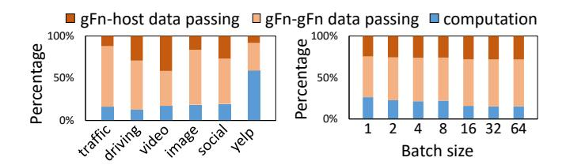

# 2.2 Data Passing in Serverless Inference Workflow

Compared to traditional CPU-centric function orchestration [20, 21, 26], serverless inference workflows introduce a new challenge—managing data exchanges across heterogeneous functions. These workflows involve *GPU functions* (gFns) executing ML models and *CPU functions* (cFns) handling data processing, with three distinct function interaction patterns: cFn-cFn, gFn-gFn, and gFn-host, which includes gFn-cFn or gFn-to-host-storage. Optimizing these interactions demands a purpose-built serverless data plane.

Existing serverless systems rely on external storage (e.g., remote services like AWS S3 [1] or intra-node solutions like Redis [20, 21, 26] and shared memory [16, 25, 49]) to facilitate data passing between stateless functions—an approach we call host-centric data passing. For GPU functions, however, this forces all intermediate data through host memory via PCIe links—a design ill-suited to GPU workflows. As shown in Fig. 2(a), each gFn-gFn transfer requires two PCIe copies (GPU to host to GPU).

**Figure 3.** Performance analysis of host-centric data passing approach: (a) Breaking down of overall latency. (b) Breaking down of latency for *Traffic* workflow with various batch sizes. Each bar is broken into three parts: the latencies of gFn-host data passing (top), gFn-gFn data passing (middle), and computation (bottom)

**Table 1.** Limitations of GPU-side storage using existing GPU communication libraries

|               | Data locality | Bandwidth  | Efficient tem- |
|---------------|---------------|------------|----------------|
|               |               | harvesting | porary storage |
| NCCL/UCX      | ×             | ×          | ×              |
| NVSHMEM       | ×             | ×          | ×              |
| DeepPlan [15] | ×             | ×          | ×              |
| GROUTER       | ✓             | ✓          | ✓              |

To quantify this overhead, we deploy real-world inference workflows on INFless [48], a state-of-the-art serverless inference system, using a DGX-V100 cluster with host-memory sharing [49]. As Fig. 3 illustrates, data passing accounts for 92% of end-to-end latency: 63% from gFn-gFn transfers and 29% from gFn-host interactions (see §6 for details). The PCIe-bound copies between GPUs and host memory dominate this cost, while cFn-cFn transfers via shared host memory incur negligible overhead. These results underscore the urgent need for a GPU-native data plane to eliminate host-induced bottlenecks.

