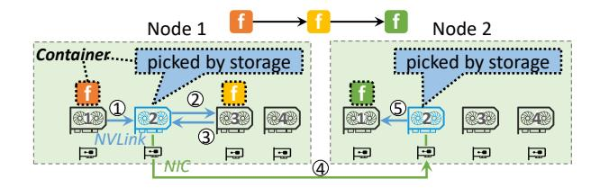
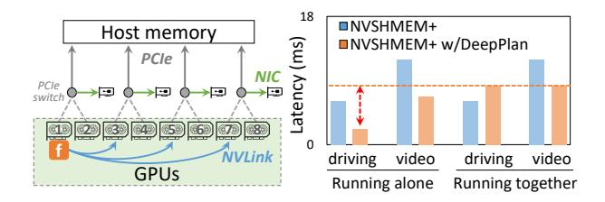
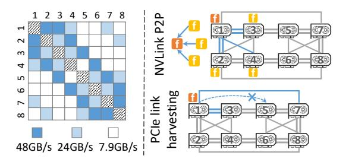
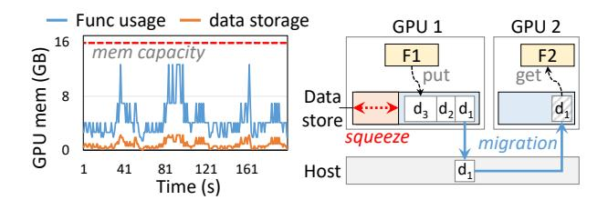

# 3 Challenges

A simple fix to host-centric data passing is to replace the host-side storage with a GPU-side storage using modern GPU communication libraries, such as NCCL [27], NVSH-MEM [32], and UCX [41]. While these libraries enable fast, direct GPU-to-GPU communication via high-speed interconnects like NVLink and *GPUDirect RDMA* (GDR) [31], their design assumptions (i.e., collective or point-to-point communication across long-running serverful processes) are not aligned with the serverless environments, leading to many limitations as summarized in Table 1.

To demonstrate these problems, we augment INFless [48], a SOTA serverless inference system, with NVSHMEM to create NVSHMEM+, a prototype implementing GPU-side storage. Using this setup, we expose fundamental challenges in adapting GPU communication libraries to serverless workflows: redundant data copies (§3.1), bandwidth underutilization (§3.2), and inefficient memory management (§3.3).

**Figure 4.** GPU data passing in serverless inference with NVSHMEM

**Figure 5.** (a) Parallel PCIe and NIC transfers for function on GPU1. (b) Comparison of gFn-host data transfer overhead when running inference workflows alone and together.

## 3.1 Challenge #1: Redundant Data Copies

In serverless inference, GPU functions and data storage are deployed as decoupled services running in isolated containers, making them unable to identify their own physical location (e.g., GPU device ID). This opacity stems from two factors. First, GPU virtualization, where functions perceive virtualized device IDs (e.g., a function on physical GPU3 sees it as GPU0). Second, address mapping limitations in GPU *Inter-Process Communication* (IPC), which underpins GPU communication libraries like NVSHMEM. When a storage container retrieves GPU memory addresses via cudaPointerGetAttributes(), it resolves them to its own local GPU device rather than the physical GPU where the source function is located.

Without knowledge of function placement, the storage cannot provide data locality but blindly selects GPUs to store intermediate data. This results in unnecessary relay copies instead of direct transfers. Fig. 4 illustrates a chain workflow where three functions exchange data across GPUs and nodes: the first two functions (GPU1 and GPU3 on Node 1) relay data through GPU2, requiring two copies (GPU1 to GPU2 and to GPU3) instead of a direct NVLink transfer; the last two functions (GPU3 on Node 1 and GPU5 on Node 2) force data through two remote GPUs—because GPU functions can only interact with local storage on the same node—tripling copies versus a single GDR transfer. In total, NVSHMEM+incurs 3 more data copies than the optimum scheme. This inefficiency grows rapidly with workflow complexity, as each hop introduces PCIe or NIC bandwidth contention.

**Figure 6.** The asymmetric GPU topology. (a) Point-to-point bandwidth of different GPU pairs in a DGX-V100 GPU server. (b) Bandwidth constraints in asymmetric GPU topology.

## 3.2 Challenge #2: Underutilized Link Bandwidth

In serverless inference, functions are encapsulated in containers [28], typically limiting their access to a single GPU. Also, existing GPU communication libraries only use the transfer link dedicated to the local GPU (e.g., a single PCIe link, NIC, or NVLink connection), failing to exploit node-and cluster-wide bandwidth. By contrast, modern GPU interconnects enable bandwidth harvesting—borrowing idle links from peer GPUs for parallel transfers by three means: Parallel PCIe transfers. Existing libraries transfer data to host memory exclusively via local GPU PCIe link, which is usually a bottleneck. As shown in Fig. 3, gFn-host transfers contribute 29% of end-to-end latency. By contrast, routing data via NVLink to peer GPUs and leveraging their PCIe links in parallel (Fig. 5) can achieve 2–4× higher aggregate bandwidth.

Parallel NIC transfers. Instead of confining cross-node transfers to the nearest NIC of the local GPU—the current practice—forwarding data via NVLink to other GPUs and utilizing their NICs in parallel (Fig. 5) enables multi-path transmission, effectively enhancing inter-node throughput. Parallel NVLink transfers. While existing libraries use only direct NVLink paths for point-to-point transfers, the mesh topology of NVLink allows routing through intermediate GPUs to exploit parallel links. For example, a two-hop transfer across three GPUs can utilize twice the NVLink bandwidth of a single direct path.

However, realizing these optimizations in serverless systems requires two key innovations. First, bandwidth partitioning to prevent contention among concurrent functions sharing links. Second, topology-aware path selection to identify optimal parallel routes across functions.

**3.2.1 Bandwidth partitioning.** Harvesting transfer links from peer GPUs in multi-tenant environments can induce bandwidth contention. To demonstrate this, we evaluate two workflows from the benchmarking suite we collect (Fig. 12): the *driving* and *video* workflows. To enable concurrent PCIe transfers, we augment NVSHMEM+ with parallel data loading techniques from DeepPlan [15] (termed NVSHMEM+ w/

DeepPlan). We first run the two workflows alone. As illustrated in Fig. 5(b), transferring data over parallel PCIe links significantly reduces the gFn-host latency for both workflows. We next run the two workflows together in the same node: we observe significant interference that increases the gFn-host latency of the driving workflow by 3.65× compared to running alone (orange bars). This degradation occurs because the collocated video workflow is I/O-intensive, grabbing most PCIe bandwidth as its multiple functions load video chunks simultaneously. Therefore, effective bandwidth harvesting requires judicious partitioning of global GPU links (e.g., PCIe links, NICs) to ensure high throughput without contention-induced latency spikes.

3.2.2 Topology-aware path selection. Effective parallel transfer paths require careful planning to align with the underlying GPU topology. Notably, GPUs sharing a PCIe switch (Fig. 5 (a)) connect to host memory via a single PCIe link. Selecting multiple such GPUs for parallel transfers likely induces link contention and should be avoided. In addition, NVLink topologies can be asymmetric. Cost-effective servers like DGX-V100 (Fig. 6(a)) exhibit uneven NVLink bandwidth: 28% of GPU pairs (e.g., GPU1–GPU4) achieve only half the expected bandwidth, while 42% lack direct NVLink (e.g., GPU1–GPU5) and must rely on slower PCIe links. Such configurations are prevalent in production environments [46].

While existing libraries [5, 36, 44] optimize collective communication in asymmetric topologies, no optimization is made for point-to-point transfers. This limitation creates bottlenecks when upstream/downstream functions are placed on weakly connected GPUs (Fig. 6(b))—a common scenario in workflows with fan-in/fan-out patterns. Weak connectivity also undermines PCIe harvesting: if GPU1 borrows PCIe link from GPU5 without a direct NVLink, data must traverse the PCIe bus of GPU1 twice (GPU1 to host and to GPU5), congesting its local PCIe bandwidth and degrading gFn-host transfer performance.

#### 3.3 Challenge #3: Inefficient Memory Management

Serverless functions rely on external storage for indirect data exchange, where intermediate data is temporarily held until consumed by downstream functions. Fig. 7(a) shows the GPU memory usage of the *driving* workflow in our benchmarking suite with simulated requests sampled from the Azure trace [39] on a DGX-V100 server (16 GB per GPU). While GPU memory is often underutilized in serverless inference—due to on-demand function provisioning and small batch size ( $\leq 128$ ) [53]—efficient memory management remains critical.

However, existing GPU memory management for serverless inference results in two inefficiencies. (1) *Excessive memory reservation.* To minimize allocation overhead, existing systems pre-reserve GPU memory for storage. However, methods like those in [12, 34] impose no usage constraints but rely on manual reclamation, leading to memory bloat.

**Figure 7.** (a) Available idle GPU memory in a serverless inference system under Azure Function trace. (b) Forced data eviction when available GPU memory diminishes.

Our experiments reveal GPU storage consumes 4× more memory than actual demand, a significant waste. (2) *Suboptimal data eviction*. During traffic spikes or data accumulation, GPU memory quickly exhausts, forcing eviction of intermediate data to host memory (Fig. 7(b)). As a result, downstream functions have to retrieve data from host memory, incurring significant gFn-host transfer overhead. Furthermore, traditional eviction polices (e.g., LRU) are designed for intra-program access patterns (e.g., DNN training) without considering function scheduling. Under these policies, data scheduled for imminent use can be mistakenly evicted.

