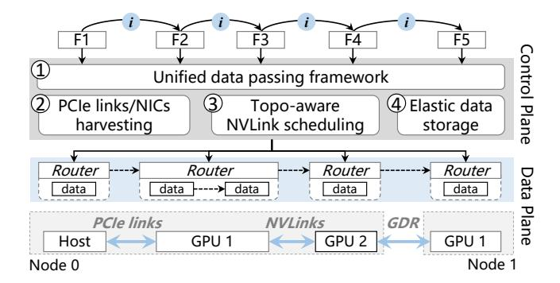
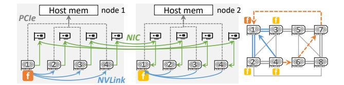
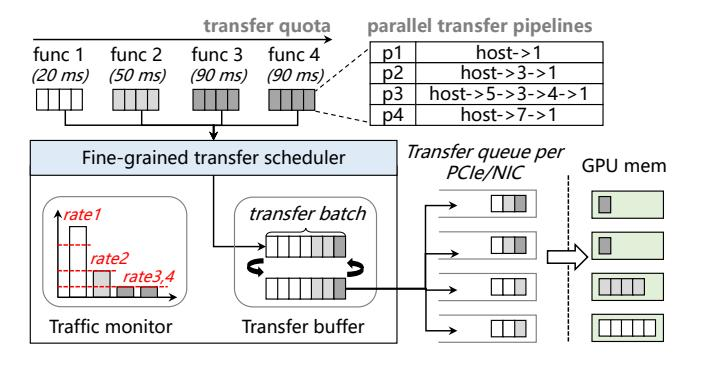
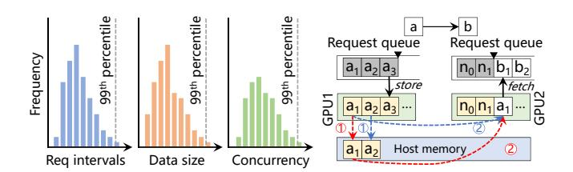

# 4 GROUTER System Design

In this section, we present GROUTER, a *GPU-centric* data plane system designed for efficient data exchange in serverless inference workflows. We start with a system overview followed by the detailed descriptions of its key components.

## 4.1 Design Overview

Fig. 8 illustrates an architecture overview of GROUTER, which comprises four key components: (1) Unified data passing framework. GROUTER provides a unified put/get API that abstracts heterogeneous data-passing patterns (e.g., gFn-gFn, gFn-host). Under the hood, it dynamically tracks function placement (physical GPU/CPU locations) and server topology (i.e., the connectivity of NVLinks, PCIe links, and NICs) to orchestrate transfers. (2) Efficient parallel data transfers. To fully utilize cluster-wide transfer bandwidth, GROUTER enables multi-path data transfers by partitioning and allocating idle GPU links (including NVLinks, PCIe links, and NICs), aggregating available bandwidth while preventing contention among concurrent functions. (3) Topology-aware transfer scheduling. For asymmetric GPU topologies, GROUTER judiciously selects route GPUs with optimal NVLink connectivity to target GPUs running inference functions. It further exploits idle parallel NVLink paths to accelerate point-to-point data transfers. (4) Elastic data storage. GROUTER dynamically scales GPU memory allocation in storage by monitoring realtime storage demands and memory pressure. When storage space becomes limited, it evicts low-priority data to host memory or remote idle GPUs while keeping critical data (e.g., for upcoming high-priority functions) on local GPUs to reduce performance penalties from host memory evictions.

<span id="page-5-0"></span>

Figure 8. GROUTER system overview

## 4.2 Unified Data Passing Framework

#### 4.2.1 Locality-aware transfers and library interface.

To avoid unnecessary data transfers across remote GPUs, GROUTER detects function placement and caches data locally on the same GPU. It offers two simple data-passing APIs—Put() for storing data and Get() for retrieving it—similar to cloud storage services like AWS S3 [1]. When Put() is called by a function, GROUTER identifies its resident GPU, allocates local GPU memory to store the data, and returns a globally unique identifier. This identifier can then be passed to downstream functions. When a function calls Get(), GROUTER locates the data using the identifier and selects an appropriate GPU transfer method based on the placement of the downstream function. As a result, each piece of data is transferred only once across GPUs during data exchange between GPU functions.

4.2.2 Heterogeneous GPU data-passing patterns. Since the required data of a GPU function may reside in different locations (e.g., host memory, other GPUs, or remote nodes), GROUTER supports three data-passing patterns. (1) Intranode gFn-gFn transfer. When the function and data reside on different GPUs within a node, GROUTER allocates memory on the GPU of functions, maps the address into the address space of function via CUDA IPC [29], and then leverages NVLink to transfer data into the mapped address. In case that the function and data reside on the same GPU, GROUTER shares the address of data with function directly, enabling zero-copy data access. For asymmetric topologies, it exploits parallel NVLink paths to maximize throughput (§4.3.3). (2) Cross-node gFn-gFn transfer. For functions and data on separate nodes, GROUTER first allocates memory on the GPU of the function and maps the address into function, then employs GPUDirect RDMA (GDR) to directly write data into that address over the network. It further exploits idle NICs (if any) to accelerate transfer (§4.3.3). (3) gFn-host transfer. When data resides in host memory, GROUTER stages it to the target GPU via parallel PCIe links (§4.3.3), then maps it into the address space of the function.

<span id="page-5-1"></span>

**Figure 9.** (a) Parallel data transfer for cross-node gFn-gFn transfer. (b) Parallel gFn-gFn data transfer on asymmetric GPU topology.

To transparently manage GPU/host memory and crossnode storage, GROUTER uses globally unified data identifiers. It maintains mappings between data identifiers, memory addresses, and data locations (node ID and GPU device ID). For scalability, each node maintains a local mapping table, while a centralized scheduler holds a global table. Lookups and updates are first served by the local table, falling back to the global table only on misses.

#### 4.3 Efficient Parallel Data Transfers

- **4.3.1 Parallel transfer strategies.** GROUTER maximizes bandwidth utilization by orchestrating multi-path transfers with strategies tailored to each data-passing pattern, leveraging idle PCIe, NIC, and NVLink resources across the cluster.
- gFn-host. For host-bound data, GROUTER distributes transfers across idle PCIe links from route GPUs. As shown in Fig. 5(a), data from GPU1 is first routed via NVLink to peer GPUs (GPU3, GPU5, and GPU7), which concurrently stage it to host memory through their PCIe links. To avoid contention, GPUs sharing a PCIe switch (e.g., GPU2) are excluded as route GPUs, as they share a single PCIe link to host memory.
- Cross-node gFn-gFn. For cross-node transfers, GROUTER harnesses idle NICs from multiple GPUs. As illustrated in Fig. 9(a), data from GPU1 (node 1) is split and routed via NVLink to local route GPUs (GPU2−GPU4). These GPUs then transmit chunks in parallel using their dedicated NICs, targeting corresponding GPUs on the remote node (e.g., GPU2→GPU2 on node 2) to minimize NUMA latency. The data is finally aggregated on the destination GPU (GPU1, node 2) via NVLink.
- *Intra-node gFn-gFn.* GROUTER exploits indirect NVLink paths for intra-node transfers. In Fig. 9(b), data from GPU4 is split and routed through two parallel paths (GPU4→GPU1 and GPU4→GPU6→GPU7→GPU1), utilizing idle NVLinks to bypass congested direct connections.

To coordinate these strategies, GROUTER splits data into small chunks (2 MB by default) and precomputes a parallel transfer plan. Chunks are pipelined across GPU streams, with synchronization primitives ensuring in-order delivery.

To fully utilize cluster bandwidth and accommodate the underlying GPU topology, GROUTER incorporates two key mechanisms. First, fine-grained bandwidth harvesting (§4.3.2)

<span id="page-6-2"></span>

Figure 10. SLO-aware PCIe data transfer scheduling

to avoid contention among concurrent functions sharing the same link—primarily for parallel PCIe and NIC transfers. Second, topology-aware transfer scheduling (§4.3.3) to identify optimal parallel paths based on GPU topology—primarily for parallel NVLink transfers.

<span id="page-6-1"></span>**4.3.2 Fined-grained bandwidth harvesting.** For PCIe and NIC transfers, where bandwidth is the main bottleneck, GROUTER aggregates available bandwidth and applies finegrained partitioning to efficiently allocate it among concurrent functions. Fig. 10 shows the process of transfer scheduling in GROUTER. First, data from each function is divided into smaller chunks to enable fine-grained transfer control. GROUTER allocates bandwidth to meet the *Service Level Objective* (SLO) of each function and proportionally schedules data chunk transfers. Consistent with prior inference systems [7, 53], the SLO is defined as 1.5–2× the average execution time of each inference service, based on measurements from 10 runs.

**Transfer rate control.** GROUTER first calculates the minimum required transfer rate  $Rate_{least}$  for each function based on its SLO and data size, representing the minimum bandwidth necessary to meet the SLO of each function. Let  $L_{slo}$  denote the SLO, and  $L_{infer}$  denote its inference computation latency. The  $Rate_{least}$  is defined as  $data\_size/(L_{slo}-L_{infer})$ . Given that DNN inference execution exhibits a highly predictable pattern [4, 7, 47, 54], offline profiling can effectively guide transfer control to meet the latency SLOs for each functions.

GROUTER monitors the transfer rate of the data block from each function in real time to ensure it remains above  $Rate_{least}$ . GROUTER then calculates the idle transfer rate (i.e., bandwidth)  $Rate_{idle}$ , which reflects the remaining bandwidth after meeting the minimum bandwidth requirements of all functions. Let  $BW_{all}$  denote the total bandwidth in the GPU server, we have  $Rate_{idle} = BW_{all} - \sum_{i=0}^{all\_funcs} Rate_{least}^i$ . GROUTER allocates this idle bandwidth to the function with

## Algorithm 1: Contention-aware paths selection

```
Input: Func_id func; Source GPU g_s; Destination GPU g_d; The
           real-time global bandwidth usage matrix BW_{n\times n}, The
           topology matrix Topo_{nxn}
   Output: The available parallel transfer paths Paths
   while path == null do
        path \leftarrow \text{next\_shortest\_path}(BW_{nxn}, g_s, g_d);
2
        if all edges in path is idle then
             Paths \leftarrow path;
             Update(BW_{nxn}, path, func);
        if BW_{out}(q_s) == 0 \cup BW_{in}(q_d) == 0 then
8 if BW_{out}(g_s) \neq 0 \cap BW_{in}(g_d) \neq 0 then
9
        while path == null do
             path \leftarrow \text{next\_busy\_path}(BW_{nxn}, g_s, g_d);
10
             bandwidth_balancing(path, func, BW_{nxn});
11
             Paths \leftarrow path;
12
              if BW_{out}(g_s) == 0 \cup BW_{in}(g_d) == 0 then
13
                  break;
15 return Paths;
```

the tightest SLO, enabling latency-sensitive functions to complete their data transfers first without impacting other functions.

Batched data transfer. Since initiated data chunk transfers cannot be interrupted, launching all transfers simultaneously would block newly arrived functions from acquiring bandwidth. Conversely, transferring individual chunks incurs excessive connection setup overhead. GROUTER balances these tradeoffs with *batched transfers*, grouping chunks into batches (default: 5 chunks per batch). This allows new functions to inject their chunks into subsequent batches, ensuring fair bandwidth preemption while amortizing pertransfer costs. To further optimize PCIe transfers, GROUTER maintains a circular pinned memory buffer shared across functions. By reusing this fixed buffer for multiple batches, the system minimizes pinned memory allocation overhead and reduces cache bloat.

<span id="page-6-0"></span>**4.3.3 Topology-aware transfer scheduling.** To optimize parallel NVLink transfers in asymmetric topologies, GROUTER employs a *topology-aware* path selection algorithm that maximizes point-to-point bandwidth for weakly connected GPU pairs by exploiting multiple NVLink paths, while avoiding path overlap to prevent contention.

Once the function placement of a workflow is finalized (function scheduler is described in §??), GROUTER prioritizes direct NVLink paths between GPUs. If these paths are already occupied by other functions (as part of indirect routes), GROUTER reassigns those functions to alternative routes (i.e., prioritizing direct path over an indirect route). Then, GROUTER searches for available free NVLink paths for each inter-GPU data transfer in the serverless inference workflow, starting with the GPU pair having the least residual

<span id="page-6-3"></span><sup>&</sup>lt;sup>1</sup>In serverless inference, functions running DNN models share GPU devices in a time-multiplexed manner [47, 50], leading to minimum interference with one another.

bandwidth. GROUTER maintains a bandwidth usage matrix BW(g,b), where g represents GPUs and b is the available bandwidth between them. GROUTER continuously monitors and updates global bandwidth usage in real-time on this matrix, which is used to guide path selection.

As shown in Algorithm 1, the selection process involves: GROUTER first searches for free paths to avoid contention with other functions (lines 1-7). When a free path is found, the bandwidth usage matrix BW(q, b) is updated. The bandwidth occupied by the path determined by the NVLink with the smallest bandwidth along the path, denoted as  $b_{min}(path)$ . Thus, the update to BW(g, b) subtracts  $b_{min}(path)$  from the free bandwidth of each GPU pair on the path. If all free paths are exhausted and the outgoing bandwidth of  $q_s$  and incoming bandwidth of  $g_d$  are not saturated, GROUTER searches busy paths to see if bandwidth can be balanced between the current function and the one occupying the path (lines 8-14). GROUTER compares the total bandwidth used by the running function and the current function, and checks whether the running function can switch to another path. If it is available, the busy path is assigned to the current function. Because a GPU server usually has 4-8 GPUs, after using path pruning and other loop-free path search acceleration, the overhead of path selection is less than 10us in our experiments.

Parallel NVLink transfers use the same pipelined method as in PCIe/NICs transfers. However, to accommodate heterogeneous NVLink bandwidth (24 GB/s or 48 GB/s per link), GROUTER dynamically sizes data chunks proportionally to the capacity of each path. For example, a 48 GB/s link receives twice the chunk size of a 24 GB/s link, ensuring balanced utilization and minimizing transfer tail latency.

## 4.4 Elastic GPU Data Storage

We design elastic GPU data storage to reduce GPU memory usage and adapt to changes of available GPU memory. GROUTER dynamically scales storage size based on actual demand and migrates data when memory pressure arises.

**4.4.1 GPU storage scaling.** Temporary GPU memory allocation incurs significant overhead, as native GPU allocations (e.g., cudaMalloc() and cudaFree()) incur millisecondlevel delays. To address this, existing memory management systems [2, 12, 34] maintain pre-allocated memory blocks as a reusable pool. However, these pooling mechanisms are typically static. For example, in PyTorch [34], users must manually reclaim memory pools, which releases all reserved blocks at once. Therefore, applying static memory pooling to GPU storage results in excessive memory usage from idle reserved memory.

Our key idea is to enable GPU storage to scale the memory pool dynamically based on actual demand. However, estimating the required size is difficult because intermediate data sizes vary with function inputs, batch sizes, and request loads. GROUTER adopts a memory pre-warming strategy

<span id="page-7-0"></span>

**Figure 11.** (a) Histogram policy characterizing both request arrivals (blue), intermediate data size (orange), and data accumulation (green) of each function. (b) Illustration of the inefficiency of LRU-based data migration (red line) vs. queue-aware data migration (blue line).

inspired by function pre-warming [39, 48] in serverless systems, which tracks request intervals  $(R_{window} = Interval^{99th})$  to estimate how long functions stay active in memory. Beyond this, GROUTER also monitors intermediate data sizes  $(R_{size} = Data_size^{99th})$  and the degree of data accumulation  $(R_{con} = Concurrency^{99th})$  in GPU storage, as shown in Fig. 11(a). After each function execution, memory reservation is calculated as  $Data_size = R_{size} \cdot R_{con}$ . If no new requests arrive within the reservation window, the reserved memory is reclaimed. The total memory pool size is given by  $MemPool_size = \sum_{func} Data_size \cdot 1_{\{R_{window} \cap t \neq \emptyset\}}$ , where  $1_A$  is an indicator function of events that returns 1 if event A is true and 0 otherwise. To handle bursty requests, GROUTER maintains a minimum memory pool (e.g., 300 MB) in idle periods, when GPU memory is sufficient.

**4.4.2 Proactive data migration.** When GPU memory pressure increases, available memory for storage becomes limited, requiring intermediate data to be evicted to reduce GPU storage usage. However, migrating data to host memory forces downstream functions to fetch it with additional latency. An effective migration strategy is thus critical. Existing approaches [6, 17, 33] typically adopt an LRU strategy, which evicts the least recently accessed data. However, LRU ignores function scheduling and often migrates data that will soon be accessed. For instance, as shown by the red line in Fig. 11 (b), the LRU strategy tends to evict the output data of function  $a_1$  first, ignoring that  $b_1$  (the downstream function of  $a_1$ ) is enqueued earlier, forcing  $b_1$  to reload data from host memory and introducing additional delays. To address this, GROUTER uses a request queue-aware migration strategy that prioritizes evicting data needed by functions at the tail of the queue, ensuring that data required by imminent function invocations remains in GPU storage. As shown by the blue line in Fig. 11(b), the output data of function  $a_2$  is migrated before the output of  $a_1$ .

Furthermore, GROUTER promptly removes intermediate data that is no longer needed and proactively restores previously migrated data when sufficient GPU memory becomes available. For instance, after the output of  $a_1$  is processed,

the output of  $a_2$  is reloaded into GPU memory. This proactive migration approach ensures upcoming functions can access data locally, minimizing performance degradation under fluctuating available GPU memory. GROUTER triggers data migration and restoration automatically based on available GPU memory, maintaining storage usage within a fixed threshold (50% of free memory in our experiments) to avoid contention with function execution while maximizing GPU memory utilization.

