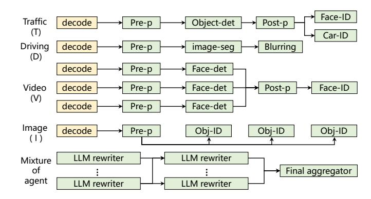
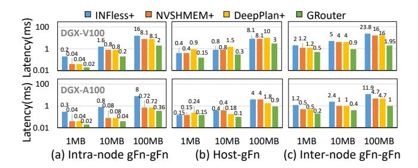
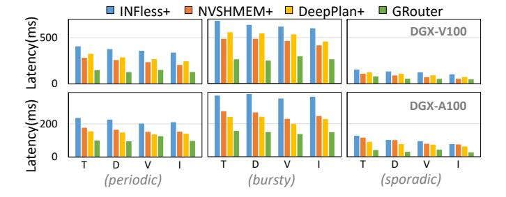
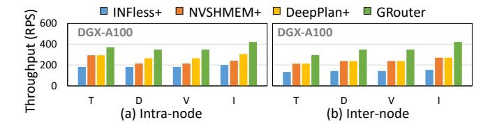
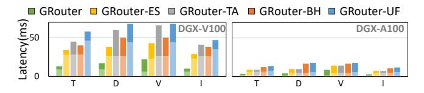
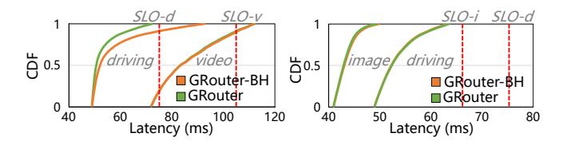
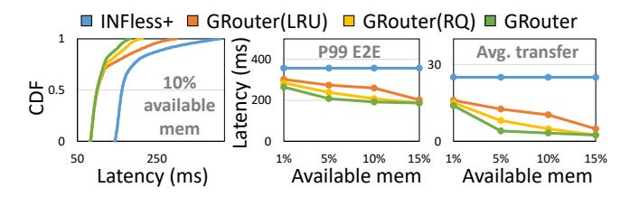
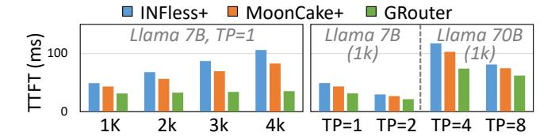
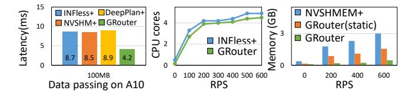

# 5 Implementation

GROUTER is built on INFless [48], a state-of-the-art serverless inference system. It comprises 5K lines of C++ code. Each function runs in a container with on-demand CPU and GPU allocation [28].

**Data storage**. GROUTER mounts a shared memory region to each function for efficient data and message exchange. On the host side, it attaches a host volume to each function. On the GPU side, it maintains an elastic memory pool on each GPU for data storage. When a function stores or retrieves data, GROUTER allocates memory from the local pool and maps it into the address space of functions using CUDA IPC [29]. Each GPU runs an I/O thread to reclaim unused memory and migrate data between GPU and host memory based on available storage space.

**Data transfer management.** GROUTER launches a daemon thread on each GPU to manage data transfers from functions. Each thread uses multiple GPU streams to enable parallel transfers in different directions and coordinates with other threads based on pre-planned pipeline paths. Most parallel transfer paths, such as PCIe links and NIC routes, are fixed and can be pre-generated during GROUTER initialization, allowing real-time requests to use them directly.

**Function scheduling**. For function scheduling in GPU clusters, GROUTER adopts a hierarchical control plane. Most data transfers and scheduling decisions are handled by local control plane within a node, while the global plane is invoked only for infrequent cross-node coordination, thereby minimizing inter-node transfers and scheduling overhead. Within a GPU node, GROUTER employs the MAPA strategy [36] maximize the utilization of GPU interconnects across functions. To further mitigate the performance impact of cold starts, GROUTER pre-warms necessary functions and models, similar to the approach used in SHEPHERD [53].

## 6 Evaluation

**Setup.** We evaluate GROUTER using two AWS GPU testbeds. *Testbed 1* (DGX-V100) uses p3.16xlarge instances, each containing 8 NVIDIA V100 GPUs connected via NVLinks, a Xeon E5-2686 v4 CPU (32 vCPUs), 244 GB of memory, and 4×100 Gbps NICs. *Testbed 2* (DGX-A100) uses p4d.24xlarge instances, each having 8 NVIDIA A100 GPUs connected via

**Figure 12.** Real-world inference workflows composed of GPU functions (green) and CPU functions (yellow). They are organized into four typical patterns: condition, sequence, fan-in, and fan-out.

NVSwitch, a Xeon Plati. 8275CL CPU, 1152 GB of memory, and 8×200 Gbps NICs.

**Real-world inference workflows.** We conduct experiments using six inference workflows collected from the latest studies, as detailed below and in Fig. 12. All pre-processing and post-processing are performed on the GPU using NVIDIA CV-CUDA [30]. The input datasets are from Adainf [40].

- Traffic (T). Following Boggard [3], we implement a traffic monitoring workflow which first detects objects using the Yolo-det model, and then performs feature recognition on pedestrian and vehicle sub-images using ResNet models.
- Driving (D). Following Adainf [40], we implement a road segmentation workflow for auto-driving. The process involves denoising the image, applying a semantic segmentation model, and outputting a colored image.
- Video (V). Following Aquatope [55], we implement a video processing workflow that runs a face detection model on video chunks in parallel, followed by a recognition model to identify a specified actor.
- Image (I). Following Cocktail [11], we implement an image classification workflow that first denoises the image, then applies multiple classification models simultaneously, and aggregates the results to improve accuracy.
- Mixture of Agent (MoA). Following MoA [45], we implement a layered agent workflow wherein each layer comprises multiple LLM agents. Each agent takes all the outputs from agents in the previous layer as auxiliary information in generating its response.

Baselines. We compare GROUTER to the following baselines:

- *INFless+*. This baseline represents a *host-centric* design that extends INFless [48]—a state-of-the-art serverless inference system—by incorporating a host-side shared-memory storage layer for efficient inter-function communication. We denote this approach as INFless+.
- NVSHMEM+. This baseline adopts NVSHMEM [32] to enable GPU-side storage layer (randomly assigned to one

GPU per data object). With NVSHMEM, GPU functions can directly store and retrieve intermediate data through a shared GPU memory space, bypassing host memory. We refer to this approach as NVSHMEM+.

• DeepPlan+. This baseline further enhances NVSHMEM+ by integrating PCIe optimizations from DeepPlan, which enables parallel data transfers across all available PCIe links in a GPU node. We refer to this approach as DeepPlan+. Note that parallel PCIe transfers are handled by the storage service, as other GPUs' PCIe are invisible to functions.

**Workloads.** We simulate the invocation of inference workflows using production traces from Azure Function [39], following the methodology of prior serverless inference systems [23, 48, 53]. The traces exhibit three characteristic request arrival patterns: sporadic, periodic, and bursty.

## 6.1 Data Passing Performance

We first evaluate the data passing latency between two functions under various scenarios. Fig. 13 illustrates the data passing latency between functions under varying data volumes. The latency measures the time elapsed between the upstream function sending the data and the downstream function receiving it.

Intra-node gFn-gFn. When GPU functions are colocated within the same node (Fig. 13(a)), GROUTER achieves the lowest data passing overhead, reducing latency by 95%, 75%, and 75% compared to INFless+, NVSHMEM+, and DeepPlan+, respectively. INFless+ uses host memory for data exchange, leading to large overhead. NVSHMEM+ lacks awareness of function locations, leading to extra data copies with a remote GPU. DeepPlan+ optimizes gFn-host transfers but neglects gFn-gFn transfers. GROUTER detects function placement and stores data on the local GPU to eliminate redundant data copies. It further accelerates data transfer on DGX-V100 server by leveraging parallel NVLinks.

Host-gFn. For data passing between GPU functions and host memory (Fig. 13(b)), GROUTER uses the global PCIe links, reducing latency by 63%, 63%, and 75% compared to NFless+, NVSHMEM+, and DeepPlan+, respectively. INFless+ and NVSHMEM+ only use the PCIe link of the local GPU, leading to long delays. DeepPlan+ also uses parallel PCIe links, but it lacks topology awareness, leading to worse performance than NVSHMEM+ on asymmetric topologies (DGX-V100), as it selects route GPUs with limited NVLink connectivity to the current GPU, causing PCIe bandwidth congestion. Moreover, since functions have limited access to GPU resources, only the external storage can see the all PCIe links and underlying topology. The storage service of DeepPlan+, however, cannot detect function placement, resulting in redundant data copies-for instance, data is first pulled to a remote GPU, then copied to the GPU device of the target function.

Figure 13. Comparison of the data passing latency

**Figure 14.** Comparison of the end-to-end latency

Figure 15. Comparison of the maximum throughput

**Inter-node gFn-gFn**. For GPU functions distributed across different nodes (Fig. 13(c)), GROUTER reduces data passing latency by 91%, 87%, and 87% compared to INFless+, NVSH-MEM+, and DeepPlan+, respectively. INFless+ incurs high overhead by routing data through host memory. Both NVSH-MEM+ and DeepPlan+ use only a single NIC for cross-node data transfers. In contrast, GROUTER enables locality-aware data transfer between GPUs across nodes without redundant data copies and leverages multiple NICs for parallel transfers.

## 6.2 Performance under Real-world Workloads

We next evaluate GROUTER using real-world inference workflows and production traces from Azure Function [39]. We scale the traces to ensure effective resource utilization, aligning with prior studies [55].

End-to-end latency. Fig. 14 shows the P99 latency across various applications under different production workloads. On DGX-V100 servers, GROUTER reduces latency by 61%, 48%, and 54% compared to INFless+, NVSHMEM+, and Deep-Plan+, respectively. DeepPlan+ performs worse than NVSH-MEM+ due to its lack of NVLink connectivity awareness. On DGX-A100 servers, GROUTER reduces latency by 53%, 36%, and 30% compared to INFless+, NVSHMEM+, and DeepPlan+.

**Figure 16.** The average data passing latency when disenabling each optimization in GROUTER one by one

**Figure 17.** The effectiveness of fine-grained bandwidth harvesting in GROUTER

Compared to NVSHMEM+, GROUTER aggregates available bandwidth and eliminates redundant data transfers. It also optimizes GPU storage by keeping high-priority data (for upcoming functions) in GPU memory, avoiding costly host-memory fetches.

**Throughput**. Fig. 15 shows the maximum throughput of these inference workflows within the same node and across different nodes. When functions are colocated within the same node, GROUTER surpasses INFless+, NVSHMEM+, and DeepPlan+ by 2.1×, 1.74×, and 1.37×, respectively, by locality-aware GPU data transfer and efficiently leveraging parallel NVLink and PCIe links. For functions distributed across nodes, GROUTER outperforms INFless+, NVSHMEM+, and DeepPlan+ by 2.73×, 1.55×, and 1.39×, respectively, through direct inter-node GPU data transfers and utilization of multiple NICs.

## 6.3 Performance of Components in GROUTER

We next evaluate the effectiveness of each design in GROUTER. **Ablation study.** We incrementally disable optimizations in GROUTER to assess their impact on data passing latency, including *elastic storage* (ES), *topology-aware scheduling* (TA), *GPU bandwidth harvesting* (BH), and *the unified data passing framework* (UF). Fig. 16 presents the average data passing latency under a bursty workload. On DGX-V100 servers, disabling all optimizations (rightmost bar) increases latency by 1.57×-1.82× compared to GROUTER, with ES, TA, and UF having the greatest effects. On DGX-A100 servers, latency increases 1.30×-1.61× when all optimizations are removed, with ES and BH having the greatest impact.

**Bandwidth partitioning.** To demonstrate the effectiveness of the fine-grained *bandwidth harvesting* (BH) in achieving performance isolation between concurrent functions, we conduct mixed workload experiments using two workflow pairs on DGX-V100 servers. Following GPUlet [7], the

**Figure 18.** (a) Latency under 10% available GPU memory. (b) End-to-end latency under different available memory ratios. (c) Average gFn-gFn data passing latency.

SLO for each workflow is set to 1.5× its independent execution time. We compare GROUTER with GROUTER-BH, which employs PCIe bandwidth sharing as in DeepPlan+. Both workflows run under bursty workload, consistent with previous experiments. Fig. 17(a) presents the results for a highcontention case where the latency-critical driving workflow is paired with a transfer-intensive video workflow, which involves multiple functions loading video chunks simultaneously. Without bandwidth partitioning, the latency of driving workflow is increased due to interference from the video workflow. In contrast, GROUTER controls PCIe bandwidth usage by the video workflow, allowing more bandwidth for the driving workflow. This reduces driving workflow latency by 32% and improves Service Level Objective (SLO) compliance. Fig. 17(b) shows results for a low-contention scenario, where driving workflow is paired with image workflow. In this case, GROUTER and GROUTER-BH performes identically, indicating that GROUTER introduces minimal overhead in transfer scheduling.

**Elasticity of GPU storage.** To evaluate the efficiency of the GPU storage of GROUTER, we measure latency under limited available memory and compare it with INFless+, LRU (used by NVSHMEM+), and a request queue-aware approach (RO) without proactive data migration. Fig. 18(a) shows the endto-end latency distribution under a bursty workload with GPU storage limited to 10% of the GPU memory. Compared to INFless+, LRU, and RQ, GROUTER reduces tail latency by 46%, 27%, and 7%, respectively. RQ prioritizes keeping data accessed earlier by downstream functions in GPU memory, while GROUTER further reduces latency through proactive data migration compared to RQ. As shown in Fig. 18(b), further tests under different memory availability ratios show that even with only 1% available memory, GROUTER reduces end-to-end latency by 24%, 14%, and 9%, respectively. Fig. 18(c) shows the average data passing latency. Compared to INFless, LRU, and RQ, GROUTER reduces delays by 83%, 72%, and 49%, respectively. These results demonstrate that GPU storage management in GROUTER and proactive data migration efficiently utilize available GPU memory and maintain performance under memory constraints. Despite severe memory constraints (1%), parallel PCIe transfers in GROUTER mitigate the overhead of fetching data from host memory.

**Figure 19.** (a) TTFT under different input lengths. (b) TTFT under different models and *tensor parallelism* (TP).

**Figure 20.** (a) Data passing latency in 4xA10 GPU server. (b) Comparison of CPU overhead. (c) Comparison of GPU memory overhead.

## 6.4 Performance under Emerging LLM Applications

We evaluate the performance of GROUTER in Large Language Model (LLM) workflows, using the Mixture-of-Agent [45] (MoA) as an example. In this multi-stage workflow, multiple LLMs optimize answers from the previous stage to improve quality, passing the Key-Value Cache (KV cache) of the prompt and response among stages to avoid recomputation. Different stages are deployed on separate 8×H800 GPU nodes, with GPUs connected via 200 GB/s NVLink and nodes connected by 200 Gbps networks. Due to the specialized management of the KV cache, we select Mooncake [35]—a state-of-the-art KV cache system—as the baseline and implement it on the serverless system, referred to as Mooncake+. Following DroidSpeak [24], we report The First Token Time (TFTT) of the receiver LLM.

Fig. 19(a) shows the TTFT for different input lengths. For a 4K input length, GROUTER reduces TFTT by 66% and 57% compared to INFless+ and Mooncake+, respectively. Fig. 19(b) further shows that GROUTER reduces TFTT by 36% and 28% under various models and *Tensor Parallelism* (TP) settings, respectively. INFless+ transfers the KV cache to host memory, incurring high overhead. Mooncake incurs extra copies due to lack of function placement awareness and utilization of single NIC. In contrast, GROUTER avoids redundant copies and uses multiple NICs. As TP increases, Mooncake begins using multiple NICs, narrowing the advantage of GROUTER. At TP=8, the advantage of GROUTER mainly comes from locality-aware data transfers without extra copies.

## 6.5 Applicability and System Overhead

**Testbed without NVLink.** Fig. 20(a) shows the data passing latency between GPU functions on 4×10 GPU servers (without NVLink). GROUTER reduces latency by 51% compared to

INFless+, NVSHMEM+, and DeepPlan+. NVSHMEM+ performs similarly to INFless+ due to lack of function placement awareness, leading to two peer-to-peer GPU data copies via PCIe. In contrast, GROUTER only requires one copy as it can detect the location of functions. Therefore, GROUTER proves to be highly effective in testbeds even without NVLink.

CPU overhead. We evaluate the system overhead in GROUTER. Fig. 20(b) shows that the CPU resources used by GROUTER are similar to those of the state-of-the-art serverless inference system, INFless+. While the control plane of GROUTER introduces additional tasks, such as monitoring GPU link usage and memory pressure, these operations are performed periodically or triggered only by new requests or data, resulting in negligible CPU overhead.

**GPU memory overhead**. Fig. 20(c) shows that GROUTER uses the least GPU memory. In NVSHMEM, symmetric memory allocation [32] leads to significant waste, as all processes allocate and release GPU memory simultaneously. The static memory pooling method also lacks awareness of storage needs, causing over-pooling. In contrast, GROUTER dynamically scales storage space based on actual requirements.

#### 7 Discussion and Related Work

Threat Model of GROUTER. GROUTER provides a unified data storage service for functions while placing a strong emphasis on data security, even in the presence of shared resources such as transfer buffers and data storage. To achieve this, GROUTER enforces two key forms of isolation: (1) Address isolation. In GROUTER, both data storage and transmission buffers are allocated in containers that are isolated from the function itself, each with its own separate address space (e.g., a dedicated CUDA context). Functions can only access GPU storage through pre-mapped addresses (e.g., via CUDA IPC with enforced alignment). Moreover, transmission buffers are never mapped into a function's address space, preventing any direct access by the function. These isolation mechanisms ensure that functions cannot reach data outside their designated boundaries, thereby mitigating the risk of leakage through out-of-bounds accesses. (2) Access control. Data items are exchanged across functions using data IDs, which introduces the potential risk of ID leakage or attacks. To address this, GROUTER authenticates the requesting function using both function\_ID and workflow\_ID on every access, ensuring that only authorized functions can read or manipulate specific data items. To minimize overhead, GROUTER employs a hierarchical control plane: IDs and metadata are synchronized to the local node at invocation time, avoiding frequent cross-node lookups during execution.

In addition to these mechanisms, GROUTER provides a security level comparable to the latest serverless platforms [19, 20, 48] across functions. Each function operates within its own independent container, with isolated host memory, NIC buffers, and GPU runtime contexts (separate CUDA contexts

with private GPU address spaces). For workloads requiring even stronger guarantees, GROUTER can also support microVMs [49].

GPU sharing supports in GROUTER. Existing GPU-enabled serverless systems typically employ GPU sharing to maximize resource utilization, including temporal sharing (e.g., DGSF [9] and FaaSwap [50]) and spatial-sharing (e.g., Stream-Box [47] and Llama [37]). While GROUTER adopts a temporalsharing model, its optimizations are orthogonal to GPU sharing strategies. In fact, spatial GPU sharing inevitably incurs more serious bandwidth and memory contention, which makes optimizations in GROUTER—transfer bandwidth partitioning and GPU storage management—even more critical. Multi-GPU communication. Existing GPU communication libraries [5, 18, 27, 36, 38] leverage high-speed GPU interconnects for collective communication such as allReduces. Some multi-GPU inference systems also utilize these interconnects to transfer embeddings (e.g., UGache [42]) or KV caches (e.g., MoonCake [35]) for recommendation and LLM workloads. However, these systems are not designed for serverless environments, resulting in redundant data copies and limiting each GPU to utilize only its own bandwidth resources (e.g., a single PCIe, NVLink, or NIC). In contrast, GROUTER aggregates available bandwidth across GPUs via multi-path transfers. Unlike collective communication methods that coordinate bandwidth globally, GROUTER can dynamically aggregate global bandwidth resources for GPU functions running on a single GPU.

GPU memory management. Existing methods focus on pooling memory and unifying multi-level memory. GM-lake [12] uses CUDA virtual memory to reduce fragmentation in memory pooling, while CUDA UVM [33], HUVM [6], and DeepUM [17] address GPU memory limits by swapping data between GPU and host memory. However, these methods lack elastic memory management and awareness of request scheduling, which can lead to large memory occupation and suboptimal data eviction. In contrast, GROUTER dynamically scales GPU storage on demand and migrates data when memory pressure arises.

Serverless workflow optimizations. Current research primarily focuses on traditional CPU-based workflows. Systems such as Pheromone [49] and Unum [22] optimize function composition, while Dataflower [21] and Fuyao [23] improve data transfer in host memory, Nightcore [16] minimizes runtime redundancy, and FaasFlow [20] enhances function scheduling. Although these methods are orthogonal to GROUTER, none addresses the need for efficient GPU data transfer in serverless inference workflows. In contrast, GROUTER fully utilizes available GPU transfer links and memory across GPU cluster.

## 8 Conclusions

In this paper, we present GROUTER, a *GPU-centric* serverless data plane that efficiently transfers data between heterogeneous CPU and GPU functions for ML inference through three key innovations. First, a unified GPU memory storage enabling direct GPU-to-GPU data exchange via topology-aware transfers. Second, multi-link bandwidth harvesting that aggregates PCIe and NVLink interconnects for parallel data movement. Third, elastic memory management adapting to dynamic workload demands. Evaluations show that GROUTER reduces data passing latency by up to 87% and improves throughput by up to 1.74× compared to state-of-the-art GPU communication libraries.

