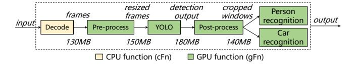
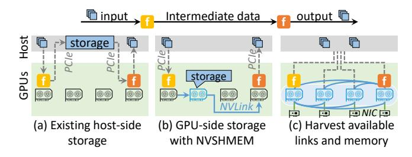

# CCS Concepts: • Computer systems organization $\rightarrow$ Cloud computing.

#### **ACM Reference Format:**

Hao Wu, Yaochen Liu, Minchen Yu, Qizhen Weng, Junxiao Deng, Yue Yu, Hao Fan, Song Wu, Wei Wang, and Hai Jin. 2026. Efficient Data Passing for Serverless Inference Workflows: A GPU-Centric Approach. In *European Conference on Computer Systems (EUROSYS '26), April 27–30, 2026, Edinburgh, Scotland Uk.* ACM, New York, NY, USA, 15 pages. https://doi.org/10.1145/3767295.3769336

## 1 Introduction

1Work done during an internship at HKUST and TeleAI.

This work is licensed under a Creative Commons Attribution-NonCommercial-NoDerivatives 4.0 International License.

EUROSYS '26, Edinburgh, Scotland UK

© 2026 Copyright held by the owner/author(s).

ACM ISBN 979-8-4007-2212-7/26/04

https://doi.org/10.1145/3767295.3769336

**Figure 1.** A serverless workflow for traffic monitoring

The rapid advances of *Machine Learning* (ML) and its wide-spread adoption have driven a growing demand for scalable, cost-effective ML inference services in the cloud [7, 13, 15, 53]. Serverless computing has emerged as a promising paradigm for inference serving. It enables users to deploy ML models as stateless functions while offloading resource provisioning and scaling to the cloud platform [4, 19, 37, 47, 48, 50, 52]. It is also economically attractive as users are only billed for the resources consumed during actual function execution. This pay-per-use billing makes serverless inference particularly suitable for workloads with intermittent or unpredictable traffic patterns [10, 50, 51].

Cloud-based inference services typically comprise complex workflows that orchestrate GPU-accelerated ML model executions alongside CPU-based data processing operations [3, 8, 11, 14]. Fig. 1 illustrates a real-world traffic monitoring application [40], where video frames are first decoded and preprocessed, followed by object detection using a YOLO model; cropped images of pedestrians and vehicles are then routed to specialized recognition models for behavior and type analysis. These components—running in loosely coupled GPU and CPU functions—are stitched together into a unified serverless inference workflow.

Unlike traditional CPU-based function workflows [21, 26, 49], serverless inference involves a mix of *GPU functions* (gFns) and *CPU functions* (cFns), where data exchanges can occur between CPU functions (cFn-cFn), GPU functions (gFn-gFn), or between GPU functions and the host system (gFn-host)—in the latter case, GPU functions interact with CPU functions running in the host or *Input and Output* (I/O) via the host-side in-memory store. Developing an efficient

**Figure 2.** Three data passing approaches for serverless inference system: Host-centric (latest), GPU-enabled (integrated with NVSHMEM), and GPU-centric (our method)

serverless data plane to streamline these exchanges is therefore crucial for accelerating end-to-end inference workflows.

Existing serverless systems employ a host-centric approach for data exchange between functions [20, 21, 23, 26, 49, 50], where intermediate data is stored in an external storage—deployed on the local or a remote host—before being consumed by downstream functions. However, as illustrated in Fig. 2(a), this approach creates an elongated data path with frequent data copies between GPU devices and the host, introducing significant delays in end-to-end workflow execution (up to 92% in our experiment).

To avoid moving data through the slow host-side storage, modern GPU communication libraries, such as NCCL [27], UCX [43], and NVSHMEM [32], provide support for direct communications across GPUs via high-speed interconnects such as NVLink or *GPU Direct RDMA* (GDR) [31]. These libraries enable a GPU-side storage solution to accelerate data exchange. For instance, with NVSHMEM, GPU functions can directly store and retrieve intermediate data within a shared GPU memory space, bypassing host memory (Fig. 2(b)).

However, this approach fails to achieve optimal performance because existing GPU communication libraries are not designed for serverless environments, resulting in three major limitations. (1) Redundant data copies. In serverless inference, GPU storage is typically deployed as a decoupled service from function execution, rendering it agnostic to function placement. Without knowledge of where functions are instantiated, the storage cannot prioritize data locality. This forces intermediate data to traverse non-local paths, incurring unnecessary duplication. As shown in Fig. 2(b), the output data of the upstream function is first copied to a GPU store on a remote device and then transferred again to the GPU where the downstream function is located—doubling data movement overhead. (2) Inefficient bandwidth utilization. GPU clusters employ heterogeneous interconnects: highbandwidth NVLinks and lower-bandwidth PCIe links within servers, and Network Interface Cards (NICs) across servers. An efficient serverless data plane should leverage these asymmetric links for concurrent data transfers, aggregating available bandwidth between GPU functions. However, existing

GPU libraries restrict point-to-point communication to a single path (e.g., NVLink-only), leaving multi-link bandwidth harvesting untapped. (3) Lack of elastic memory management. During inference workflow execution, intermediate data must be temporarily stored in GPU memory. While serverless systems inherently exhibit dynamic workloads and on-demand function provisioning—which often leave idle GPU memory available—this availability changes unpredictably. Elastic GPU memory management, capable of dynamically scaling allocations in response to runtime demands, is thus critical. Yet, existing GPU libraries lack this capability, resulting in memory contention and performance degradation during traffic spikes.

To address these challenges, we propose GROUTER, a GPUcentric data plane system designed for efficient data exchange in serverless inference workflows. Unlike conventional hostcentric approaches, GROUTER explicitly leverages knowledge of GPU topology and function placement to orchestrate concurrent data transfers across multiple links (e.g., NVLink, PCIe links, and NICs), aggregating available bandwidth and memory resources across the GPU cluster. The design of GROUTER comprises four key components. (1) Unified data passing framework. GROUTER introduces a programming interface that abstracts heterogeneous data-passing patterns (e.g., gFn-gFn, gFn-host). Internally, it dynamically detects function placement and underlying GPU server topology to enable transparent, locality-aware data transfers and storage management, eliminating redundant copies. (2) Finegrained bandwidth harvesting. To fully utilize cluster bandwidth, GROUTER enables multi-path data transfers by partitioning and allocating idle GPU links (including NVLinks, PCIe links, and NICs), aggregating available bandwidth while preventing resource contention among concurrent functions. (3) Topology-aware transfer scheduling. For asymmetric GPU topologies, GROUTER strategically selects assist GPUs with optimal NVLink connectivity to target GPUs running inference functions. It further exploits idle parallel NVLink paths for point-to-point data transfers, achieving near-peak throughput. (4) Elastic data storage. GROUTER dynamically scales GPU memory allocations by monitoring real-time storage demands and memory pressure. When a GPU device has no enough memory to hold all storage data, it migrates low-priority data to other idle GPUs or host memory while retaining critical data (e.g., for upcoming high-priority functions) in GPU memory, minimizing performance penalties from host memory evictions.

We implement GROUTER as an extension to INFless [48], a state-of-the-art serverless inference system, utilizing low-level GPU *Inter-Process Communication* (IPC) mechanism for direct data transfers between functions and GPU storage. Our evaluation benchmarks GROUTER against two baselines: conventional host-centric serverless systems and NVSHMEM-enhanced systems optimized for GPU communication. Using real-world inference workflows and production request

traces from Azure cloud [39], we show that GROUTER reduces data transfer overhead by up to 65% and achieves 11× higher throughput than the best-performing baseline. We also demonstrate the scalability and effectiveness of GROUTER in LLM inference applications and large clusters.

