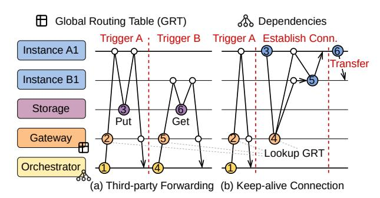

# **1 Introduction**

Workflow refers to a sequence of tasks executed in a specific order to solve complex problems. In fields such as scientific computing, big data, and artificial intelligence, workflows like Pegasus [\[1\]](#page-13-0), MapReduce [\[2\]](#page-13-1), and Pytorch graph[[3](#page-13-2)] have been widely adopted. In recent years, *serverless workflows*, which orchestrate stateless functions without the need for server management, have also gained significant attention in production[[4–](#page-13-3)[7\]](#page-13-4). Studies indicate that > 31% of serverless applications currently utilize *serverless workflows* [\[4\]](#page-13-3).

However, unlike traditional workflows, which follow a single-layer abstraction, *serverless workflows* feature a twolayer abstraction model due to the auto-scaling nature: (1) *Function-level* defines workflows **offline** as directed acyclic graphs (DAGs) and ensures that the execution order of functions aligns with the predefined logic. (2) *Instance-level* identifies the specific instances of functions involved *during runtime* and ensures that data transfer is completed.

Therefore, data transmission between functions relies on a storage service and a two-layer control mechanism, where the orchestrator coordinates *inter-function* invocation and the gateway handles*inter-instance* communication.This process involves a total of six steps (Figure [2\(](#page-1-0)a)), resulting in communication latency that far exceeds computation time, reaching >20× in the case of *Social Network* [[8\]](#page-13-5).

The inefficiency of data transmission process primarily arises from two sources: (1) *Slow inter-function routing*, i.e., the significant overhead involved in resolving downstream functions at the orchestrator and locating their instances through the gateway; (2) *Slow inter-instance transmission*, i.e., the significant time associated with transferring data between dependent functions. To accelerate data transmission, existing work generally falls into two categories: (1) Offloading the resolution of downstream functions from the orchestrator to local instances (Figure [1\(](#page-1-1)b), Unum [\[9\]](#page-13-6)), thereby accelerating the routing process. However, this method does

**Figure 1.** Schematic overview of serverless workflow management.

not improve the efficiency of looking up instance at the gateway. (2) Maintaining connections between instances with frequent communication to accelerate data transmission (Figure 1(c), FUYAO [10]). However, *keep-alive connection* is only effective for frequent invocations, whereas, in the real world, most workflows (e.g., 80% in Azure durable functions [6]) are sparsely invoked. Therefore, no existing system can efficiently support both *inter-function routing* and *inter-instance communication* for serverless workflows.

For *inter-function routing*, the inefficiency mainly stems from the centralized orchestrator and gateway. This "intermediary intervention" introduces performance bottlenecks and incurs additional network communication overhead. To improve routing efficiency, both function resolution and instance lookup should be offloaded to local instances.

For *inter-instance transmission*, low efficiency is primarily due to the stateless nature of functions, which prevents them from directly locating each other. Therefore, intermediate data is transferred via *third-party forwarding*. Specifically, function *A* stores intermediate data in a third-party storage service, and function *B* subsequently retrieves the data from that service. This "*instance-level* intermediary intervention" potentially accounts for up to 95% of overall latency [7, 11–14]. To improve transmission efficiency, a natural solution is to publish the address of each instance and allow instances to proactively establish direct connections.

Establishing direct connections through the **Global Routing Table** (GRT) incurs 10-100 milliseconds overhead [10]. Moreover, it may lead to low resource efficiency due to the "binding scaling" problem, i.e., downstream instances must synchronize scaling with upstream instances to prevent potential overload [15]. To address these issues, we argue for splitting *GRT* into multiple **Local Routing Tables** (LRTs), thereby enabling local instances to perform autonomous routing and achieve 1-hop transmission.

**Figure 2.** The data transmission process of *third-party forwarding* and *keep-alive connection*.

However, LRT-based routing introduces new challenges: (1) Correctness of routing decisions: In fan-in scenarios, parallel upstream functions must independently route results to the same downstream instance without global coordination. To address this, we employ consistent hashing routing algorithm, which enables globally consistent routing decisions based on local views. Additionally, an exploration mode is introduced to handle routing faults caused by inconsistencies between LRTs. (2) Performance overhead of LRTs synchronization: Workflows may exhibit high fan-in degrees (e.g., several hundreds [6]) and experience burst workloads (e.g., 33,000× within one minute [16, 17]). Hence, the overhead of synchronizing LRTs can be non-negligible. We adopt a dual-layer architecture comprising local routing controllers and a *centralized coordinator* to efficiently synchronize *LRTs*. Moreover, a partition policy is employed to enable rapid updates of LRTs with minimal overhead.

We propose **iRoute** 1, a novel routing solution for *server-less workflows* that addresses the inefficiency of inter-function communication. **iRoute** leverages *LRTs* to enable local instances to autonomously locate dependent instances and establish direct connections, achieving sub-millisecond data transfer latency while preserving high resource efficiency.

Our Contributions can be summarized as follows:

- We analyze the performance and scalability issues of intermediate data transfer in *GRT*-based methods, including third-party forwarding and keep-alive connection.
- We propose iRoute, a comprehensive LRT-based solution that enables 1-hop transfer across all scenarios (even for workflows with sparse invocations) without compromising on scalability. It achieves both low transmission latency and high resource efficiency.
- Experimental results on diverse serverless workflows demonstrate that **iRoute** can outperform the state-of-the-art by up to 27.3 × in latency and offer 6.7 × throughput.

