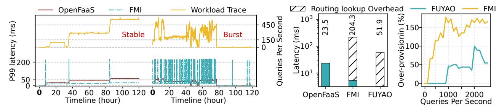
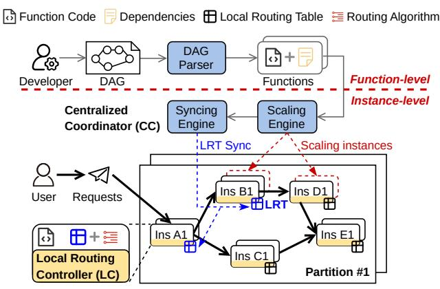

# **2.1 Intermediate Data Transfer Costs**

Due to the lack of location awareness between stateless functions, existing intermediate data transfer relies on the *gateway* and external storage, i.e., *third-party forwarding*. As illustrated in Figure [2\(](#page-1-0)a), the orchestrator triggers Function A via the gateway ➊, which uses the GRT to locate an available instance (A1) ➋. A1 completes execution and stores the intermediate data in external storage ➌. The orchestrator then triggers Function B based on the dependencies➍➎, and B's instance retrieves the data from storage➏. The entire process consumes > 3.3 .

By maintaining a direct connection between function instances (i.e., *keep-alive connection*), we can bypass the overhead of request forwarding and *GRT* queries, achieving submillisecond latency via 1-hop data transfer [\[10](#page-13-7)]. *Keep-alive connection* requires routing lookups before the first 1-hop transfer: one for the orchestrator to specify function dependencies ➊➋, and another for exchanging function instances' addresses (e.g., IP address and port, named pipe) ➌➍➎, both via the gateway (Figure [2](#page-1-0)(b)). After exchanging addresses, they can establish a persistent direct connection to achieve 1-hop transfer ➏. This connection will be kept alive for a period of time for reuse by subsequent requests.

We evaluate the data transfer efficiency by deploying *Social Network* [[8\]](#page-13-5) on three existing platforms: (1) *FMI* (implementing *keep-alive connection* utilizing TCP); (2) *FUYAO* (implementing *keep-alive connection* using IPC (inter-process communication) and RDMA; and (3) *OpenFaaS* (implementing *third-party forwarding*). Experimental configurations are detailed in [§5.1,](#page-8-0) and all function instances are pre-warmed to eliminate the impact of cold starts. Prior studies [\[21–](#page-13-17)[23](#page-13-18)] have reduced cold start overheads to the millisecond or even sub-millisecond level. Moreover, as the frequency of workflow invocations increases, the reuse rate of warm instances also rises. For example, Durable Functions reports a median cold start rate of only 0.35% for workflows invoked ≥ 100 times per day[[6](#page-13-8)]. With cold start overhead minimized, routing and connection establishment become the dominant performance concern.

The Azure trace[[10,](#page-13-7) [16](#page-13-12), [24](#page-13-19)] offers a diverse range of invocation patterns, including periodic, sparse, and bursty workloads, effectively covering the typical access patterns of web services[[25](#page-14-0)[–27\]](#page-14-1). Thus, we choose it to evaluate the performance of *keep-alive connection* using two traces: a *stable* trace with few bursts, and a *burst* trace featuring frequent invocation spikes. (Figure [3\(](#page-3-0)a)). It can be observed that *FMI* can reduce the 99th percentile latency by 2.1× compared to *OpenFaaS* under stable trace with frequent invocations. However, *FMI* demonstrates significant performance fluctuations under burst trace, with latency even averaging 1.2× over *OpenFaaS*. This is primarily due to the frequent bursts of invocation leading to scale up and down of function instances, which involves the establishment and release of direct connections. As shown in Figure [3](#page-3-0)(b), *FMI* and *FUYAO* can experience 8.7× and 2.2× higher latency compared to *OpenFaaS* in the first request due to the substantial routing lookup overhead. Therefore, *keep-alive connection* in scenarios with frequent bursts struggles to amortize the routing lookup overhead through reusing the connection for subsequent requests. Unfortunately, workloads with frequent bursts are common in both public and private clouds[[16,](#page-13-12) [28](#page-14-2), [29](#page-14-3)].

Besides burst traffic, many *serverless workflows* are typically infrequently invoked. For example, those with an invocation frequency of < 100 times per day account for 80% in Durable Functions [\[6\]](#page-13-8). Under sparse invocations, maintaining connections results in resource wastage, while establishing a new connection for each request incurs high overhead (Figure [3](#page-3-0)(a)). Therefore, *keep-alive connection* is also not suitable in such scenarios.

**Observation I:** *Limited applicability: keep-alive connection can significantly reduce the overall latency under frequent invocations, yet it is unsuitable for scenarios with frequent bursts due to high routing lookup overhead.*

**Figure 3.** Performance analysis of *Social Network*. (a) The figure shows a dual-axis representation: the P99 latency of *Social Network* on the left and QPS across two workload traces on the right. (b) A breakdown of the first end-to-end latency, with shading indicating the routing lookup overhead. (c) The over-provisioning percentage quantifies the additional function instances allocated beyond the minimum required to meet demand. We present the over-provisioning percentages for both *FMI* and *FUYAO* across different queries per second (QPS).

## 2.2 Resource Provisioning Costs

Current serverless platforms make scaling decisions through a global engine based on the concurrency of functions. However, 1-hop transmission bypasses the global engine, preventing it from promptly detecting the concurrency level of each function, which renders the existing scaling mechanism ineffective. Therefore, *keep-alive connections* typically adopt *binding scaling*, wherein downstream functions scale concurrently with upstream functions, to mitigate potential high tail latency issues. Obviously, this scaling mechanism, which relies on resource over-provisioning, can result in inefficient resource utilization.

We measure the over-provisioning percentage of function instances of FMI and FUYAO under various QPSs, and illustrate the results in Figure 3(c). Due to usage of a static policy that pre-defines which function pairs should establish connections, FMI necessitates scaling the entire workflow when addressing high workloads. This approach completely compromises the fine-grained scalability of serverless computing, leading to a resource wastage of up to 177.8% under QPS = 900. Despite FUYAO maintaining partial scalability by enabling upstream functions to keep alive direct connections with multiple instances of the same downstream function concurrently, the binding scaling problem still leads to 50% resource over-provisioning under QPS = 1200.

**Observation II:** Resource over-provisioning: Keep-alive connection needs to maintain direct connections between upstream and downstream functions, which results in <u>binding scaling</u> of dependent functions when scaling, leading to low resource efficiency.

## 2.3 Implications

A *serverless workflow* system must possess the dual management capabilities at both the function and instance levels. The system should: 1) support the definition and orchestration of complex inter-function dependencies, and 2) reduce the overhead of intermediate data transmission.

**Table 1.** Comparison of Existing Systems: FN and INS denote Function-level and Instance-level; ✓ and ✗ denote whether the DAG structure or functionality is supported; 'C' and 'D' denote Centralized and Decentralized.

|     | System          | OpenFaaS | Unum     | FMI      | Fuyao    | iRoute   |
|-----|-----------------|----------|----------|----------|----------|----------|
| FN  | Fan-out pattern | V        | <b>✓</b> | <u> </u> | <b>✓</b> | <b>✓</b> |
|     | Fan-in pattern  | ×        | <b>✓</b> | <b>✓</b> | X        | <b>✓</b> |
|     | Architecture    | C        | D        | D        | D        | D        |
|     | Overhead        | High     | Low      | Low      | Low      | Low      |
| INS | Data transfer   | Forward  | Forward  | Direct   | Direct   | Direct   |
|     | Fault tolerance | ×        | <b>✓</b> | X        | X        | <b>✓</b> |
|     | Overhead        | High     | High     | Medium   | Medium   | Low      |

Although existing solutions [9, 10, 15] have made improvements in workflow management at both the function and instance levels (as shown in Table 1), they still fail to fully meet the needs of *serverless workflows*. At the function-level, *decentralized design* [9] offloads the process of resolving function dependencies to the local instance, avoiding high overhead. However, there remains significant latency in locating instances and inter-instance transmission. While *keepalive connection* methods [10, 15] can reduce transmission latency, they still have problems such as limited applicability (Observation I), resource over-provisioning (Observation II). Therefore, a *serverless workflow* system that can comprehensively address these challenges is still needed.

## 2.4 Design Goals

Our design aims to accelerate inter-function data transmission in *serverless workflows* by eliminating intermediary intervention overhead at both the *function-level* and *instance-level*. First, dependency resolution process should be offloaded to local function instances to enable efficient coordination of function execution. Next, local instances should be able to independently select available downstream instances to support invocation routing . Finally, local instances should be able to directly locate each other and establish direct connections, thereby enabling 1-hop inter-instance communication at all times.

Figure 4. The overall architecture of iRoute.

