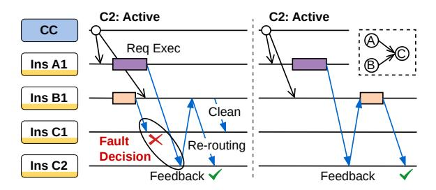
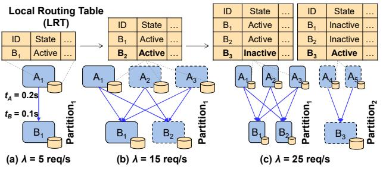

# 3 Design

#### 3.1 Overview

Figure 4 shows an overview of the architecture of iRoute, featuring a dual-layer structure composed of multiple Local Routing Controllers (LCs) and a Centralized Coordinator (CC). Unlike traditional centralized controllers, CC is only responsible for handling lightweight coordination tasks. It includes three main components: the DAG parser, the scaling engine, and the syncing engine. At the function level, the DAG parser is responsible for parsing the dependencies between functions in a workflow and distributing these dependencies to each function. At the instance level, each function instance is equipped with an LC acting as a sidecar. The LC maintains a Local Routing Table (LRT) that stores routing information for dependent instances and uses a routing algorithm to make routing decisions, enabling efficient 1-hop data transmission. During the execution of the workflow, the scaling engine makes scaling decisions based on the workloads, and the syncing engine then updates the LRTs at the LCs.

To ensure the correctness of routing decisions (**Challenge 1**), *LC* operates in two modes: *stable mode* and *exploration mode*. In the *stable mode*, *LC* employs routing algorithms based on calling patterns to determine the correct routing destination. In the *exploration mode*, *LC* further detects and resolves routing faults. When function scaling occurs, the *CC* instructs *LCs* to switch from *stable* to *exploration mode*. Upon completion of *LRT* synchronization, *LCs* will be informed to revert to the *stable mode*.

To reduce the synchronization overhead of *LRTs* (**Challenge 2**), **iRoute** divides the instances into multiple *partitions*, where intermediate data transfer is only allowed within the same partition. For example, the instances  $\{A_1, B_1, ...\}$  in Figure 4 belong to the same *partition* #1. When  $A_1$  completes, the  $LC_{A_1}$  takes over the responsibility of routing intermediate data. It first queries LRT to identify available instances of the function B (e.g.,  $B_1$  in *partition* #1), then employs the routing algorithm to select a destination and finally initiates 1-hop data transmission based on the destination's address

in *LRT*. When scaling out, the *scaling engine* creates a new instance and assigns it to a partition. The *syncing engine* then updates the relevant LRTs accordingly.

Note that, we only consider the direct invocation pattern where upstream functions can invoke downstream functions themselves for immediate processing. In the indirect invocation pattern, where downstream functions are triggered by external events such as storage, timers, or queues, it is generally unnecessary to establish direct connections between functions, since upstream functions cannot determine when or which downstream functions will be triggered.

## 3.2 Local Routing Controller

**3.2.1 LRT Design.** LRT stores the address information of downstream functions, allowing the LC to make routing decisions based on this information. Hence, the number of entries in the LRT equals the sum of downstream function instances. Each entry in LRT contains four fields: (1) *Instance ID* denotes the identifier of a downstream function instance. It is used for instance selection in routing algorithms; (2) Address denotes the IP address and port number used for accessing the instance; (3) State denotes the reachable state of a destination instance, which can be either active or inactive. It is set to active when the local instance and the destination instance belong to the same partition; (4) Tunnel denotes the transmission channel for accessing the instance. It could be IPC, Socket, or RDMA. IPC denotes the intra-node direct communication utilizing Linux FIFO. Socket denotes the inter-node direct communication based on socket objects. RDMA denotes the inter-node direct communication utilizing network acceleration devices.

Note that, for the same downstream function instance, the *LRTs* of upstream functions may store different *state* and *tunnel* information. For example in Figure 4, *LRTs* of function instances  $A_1$ - $A_2$  all store the *instance ID* and *address* of  $B_1$ - $B_3$ . Assuming that  $A_1$  and  $B_1$  are located on the same node, the *tunnel* in the *LRT* of  $A_1$  is set to *IPC*; otherwise, it is set to *socket*. Additionally, *state* is configured based on the partitions; thus, instances of B, which belong to the same partition as  $A_1$ , have their *state* set to *active*.

**3.2.2 Routing Algorithm.** Following the dependencies defined in a workflow, after an upstream function completes execution, its result is passed to the local LC. The LC then identifies downstream functions for this intermediate data. It filters out available downstream instances (i.e., state = active) from the LRT. Then, it employs a routing algorithm to choose a routing destination for each downstream function. After selecting the downstream instance, it routes intermediate data to the destination via the transmission channel indicated by the tunnel field in LRT.

For workflows with a static DAG structure, the calling pattern between dependent functions typically involves three types: *chain*  $(1 \rightarrow 1)$ , *fan-out*  $(1 \rightarrow n)$ , and *fan-in*  $(n \rightarrow 1)$ .

**Figure 5.** The interaction process between *CC* and *LC*.

The operational mechanisms of the routing algorithm under different patterns are as follows:

**Chain (**1 → 1**)**: there is a one-to-one dependency relationship between upstream and downstream functions. Since there is only one downstream function, the routing algorithm primarily addresses the load balancing of multiple instances of the downstream function. We evaluate several commonly used load balancing algorithms, including *Random*, *Consistent Hashing* and *Round Robin*. As shown in Figure [16](#page-11-0) in Section [5.5](#page-11-1), *Round Robin* achieves the best load balancing performance. Therefore, we adopt the *Round Robin* algorithm in our design.

**Fan-out (**1 → **)**: the intermediate data produced by an upstream function is simultaneously distributed to multiple downstream functions. In this case, the local *LC* considers it as a variation of chain, and sequentially invokes *Round Robin* algorithm for each downstream function.

**Fan-in (** → 1**)**: the intermediate data produced by multiple upstream functions converges to a single downstream function. In this case, the *LC* employs a *Consistent Hashing with Exploration Mode (CH-EM)* algorithm to ensure correct routing decisions. This algorithm maps downstream instances (i.e., *instance IDs*) in the *LRT* onto a hash ring, then maps the request's ID onto the hash ring and selects the nearest instance as the destination. Thus, although each function makes independent decisions, it still ensures that the intermediate data of the same request is routed to the same downstream instance.

When a workflow includes conditional logic (e.g., *Choice* in AWS Step Functions[[30](#page-14-4)]), its DAG evolves at runtime based on intermediate data or execution state. In such scenarios, *LRTs* must be retrieved from *CC* at runtime, incurring connection establishment overhead similar to that of *centralized orchestrator*. One possible solution is to pre-distribute *LRTs* containing the address information of all branch functions, enabling *LC* to select the appropriate routing target based on the conditional logic. We leave the exploration of this approach for future work.

**3.2.3 Fault-tolerant Routing.** In the *fan-in* communication pattern, when all *LRTs* of upstream functions are consistent, the *CH-EM* algorithm can ensure that the intermediate data from multiple upstream functions converges to the same destination. However, during the synchronization process (Figure [5](#page-5-0)), temporary inconsistencies in the *LRTs* of upstream functions may cause routing decision conflicts.

**Figure 6.** Exploration mode initiates feedback after detecting fault routing decisions.

In this case, the *CH-EM* algorithm employs the *exploration mode* to detect and fix fault routing decisions (Figure [6\)](#page-5-1).

The basic idea of *exploration mode* is the *check* and *rerouting* mechanism. Downstream *LCs* check the integrity of the received data and request the upstream instances to re-route any missing intermediate data. The *check* occurs upon receiving data from the critical path, typically the result from the upstream function that arrives the latest due to the longest execution time. The content to be checked is whether all upstream results have been received based on the dependency. If so, the function execution proceeds; otherwise, the re-routing mechanism is triggered for each missing function. As illustrated in Figure [6,](#page-5-1) *A->C* represents the critical path, thus the *LC* of 2 starts checking when receiving data from 1 . It deduces that a fault routing decision may have occurred due to the lack of data from *B*. Note that, we denote the path with the longest execution time as the critical path[[31\]](#page-14-5). Upon workflow submission, the *DAG parser* statically profiles parallel branches to determine the initial critical path, which is subsequently refined by the *CC* using collected function latencies (§[3.3.1\)](#page-6-0). Inaccurate critical path analysis can lead to unnecessary re-routing, incurring latency overhead of 1.9-11.1% as shown in Figure [13.](#page-11-2)

Due to the uncertainty of the required data's location, the *LC* identifies all instances of each missing function based on transmission channels, and sends re-routing request to them. If the upstream *LC* holds the required data, it will reroute it to the instance that sent the feedback (e.g., 2 ) and instruct the original destination (e.g., 1 ) to remove the previously routing data. Otherwise, the *LC* continues to monitor subsequent execution requests until it discovers the required data or receives confirmation from downstream that the data has been re-routed by another instance. To address all potential routing faults, as shown in Figure [5,](#page-5-0) the *CC* ensures that all *LCs* switch to *exploration mode* before initiating *LRTs* synchronization. Moreover, the upstream *LCs* need to temporarily buffer intermediate data for re-routing. To minimize the storage overhead, the *LC* utilizes both proactive release and expire mechanism to manage the lifetime of each buffer entry, which is detailed in [§3.2.4.](#page-6-1)

To ensure routing correctness during down scaling, an instance is removed only after all involved requests have

been fully processed. First, the *CC* updates the status of the instance to be released as *inactive* in the *GRT* and synchronizes with the *LRTs* of upstream dependent function instances. Then, upstream functions check the *inactive* status in *LRTs* and stop sending requests to the instance. Next, the *CC* notifies *LCs* of the instance to check and clear its local buffer. Once all local buffers are actively cleared, *LCs* inform the *CC*, which can then safely remove the instance from the *GRT* and release it.

**3.2.4 Fault-Tolerant Execution.** Current serverless platforms provide three execution semantics: *at-most-once*, *atleast-once* and *exactly-once* [\[32–](#page-14-6)[34](#page-14-7)]. *At-most-once* indicates that each invocation is attempted no more than once, without automatic retries upon failure. *At-least-once* achieves reliability by retrying failed invocations until completion, potentially leading to duplicate executions. *Exactly-once* ensures that each invocation produces a single definitive result that is delivered to downstream functions only once, even in the presence of failures or retries. **iRoute** supports all three semantics and adopts *at-most-once* as the default execution mode. Stronger guarantees (*at-least-once* and *exactly-once*) require explicit user configuration to enable retries upon execution failure.

However, offloading both *function-level* and *instance-level* management capabilities to local instances presents a key challenge for **iRoute** in maintaining execution semantics. First, function interactions in our system bypass the centralized gateway, which typically tracks execution status and retries failed invocations. Consequently, detecting failed function invocations becomes more challenging in our distributed architecture. Second, while 1-hop data transfer eliminates the interaction overhead with third-party storage, it also increases the risk of data loss. As a result, failed invocations may require re-executing the entire workflow to reproduce the lost data, leading to considerable overhead.

**iRoute** supports *at-most-once* semantics by executing each invocation no more than once and immediately aborting failed requests without retries. Specifically, when *LC* detects an execution anomaly or *CC* identifies an instance failure, the corresponding invocation is aborted and an error response is returned to the upstream caller.

**iRoute** leverages *data buffer* and *re-scheduling* mechanisms to provide *at-least-once* execution semantics. First, each *LC* temporarily buffers execution results and routing destinations, enabling downstream functions to be re-executed when necessary. Second, when an instance failure is detected, the *CC* notifies all upstream *LCs* within the same partition to check for potential failed invocations, i.e., buffer entries were routed to the crashed instance.The *re-scheduling* mechanism is then activated for these affected invocations. *LCs* employ *Round Robin* and *CH-EM* routing algorithms, as described in §[3.2.2](#page-4-1) and [§3.2.3](#page-5-2), to choose new destinations for

each entry. Finally, downstream *LCs* retrieve buffered data and re-execute corresponding invocations.

To prevent redundant re-executions, **iRoute** implements a proactive buffer release mechanism. This mechanism is based on the following key insight: once all downstream *LCs* have buffered and routed their execution results, the previous buffer entries are no longer necessary to enforce execution semantics. Additionally, each buffer entry is assigned a Time To Live (TTL), e.g., twice the duration of the downstream function, and expires once timeout occurs. However, even after expiration, the identity of the expired invocation is retained until proactive release, allowing for the recovery of lost data if needed.

For applications that require stricter execution semantics (e.g., payments), **iRoute** introduces a centralized buffer mechanism. While this approach incurs additional performance overhead, it guarantees *exactly-once* execution. In this model, *LCs* perform atomic operations on a third-party storage to buffer exactly one execution result for each function invocation[[9](#page-13-6)]. If the buffer is successfully written, the execution result is routed to downstream instances via 1-hop transfer. Otherwise, only the location of the existing buffer is transmitted. This ensures that downstream functions consistently receive the same input across multiple executions. Additionally, *LCs* check for the presence of buffer before execution. If it exists, the execution is skipped, and the buffer location is transferred directly to downstream functions.

Note that, the *exactly-once* guarantee may not apply to workflows with external side effects, e.g., transactions. This well-known issue are independent of the routing architecture. Therefore, orthogonal techniques, such as log-based approaches like Boki[[35\]](#page-14-8) and Halfmoon [\[36\]](#page-14-9), can be integrated with **iRoute** to enhance the execution semantics.

**3.2.5 Trust model.** After offloading the routing functionality from the global to local instances, *LC* is currently part of the trusted computing base (TCB). To mitigate security risks, **iRoute** restricts *LC* to read-only access to *GRT* and relies on periodically refreshed access credentials. If *LC* is to be removed from TCB, authentication mechanisms must be introduced between *LC* and *CC*, as well as among *LCs* themselves. Additionally, Byzantine fault tolerant protocols[[37,](#page-14-10) [38](#page-14-11)] can be integrated to further enhance security.

## **3.3 Centralized Coordinator**

In this section, we discuss how the *CC* collaborates with *LCs* to achieve function scaling and synchronization of *LRTs*, while addressing highly dynamic serverless workloads without compromising on scalability.

**3.3.1 Function Scaling.** Existing serverless platforms utilize a centralized controller to route each request, which records the concurrency of each function in real-time to make scaling decisions. For example, AWS Lambda provisions a separate instance for each concurrent request[[39\]](#page-14-12).

However, delegating the routing functionality to local sidecar bypasses centralized components for intermediate data transfer, rendering existing scaling policy ineffective. Therefore, **iRoute** redesigns the scaling mechanism through the collaboration of *CC* and *LCs*.

**Figure 7.** The function scaling decisions are determined based on the average requests per second  $\lambda$  and request duration t. And the instances are divided into multiple partitions to reduce the overhead of *LRTs* synchronization.

The scaling engine of CC makes scaling decisions for each function based on the workload metrics collected from each LC, including the average requests per second  $(\lambda)$  and request duration (t). Function scaling can be triggered in two scenarios: (1) LC detects that the local instance is overloaded; (2) the scaling engine periodically collects metrics and identifies instance redundancy. Specifically, a function instance is considered overloaded if the request per second exceed its processing capacity  $(\lambda > \frac{1}{t})$  or a given threshold  $(\lambda > \lambda_{th})$ , which is utilized to avoid transmission faults caused by excessive workloads. Similar to AWS Lambda [39], the scaling engine calculates the concurrency for each function as the expected number of instances for the current workload:

$$\alpha = \left\lceil \frac{\sum_{i=1}^{\alpha'} t_i}{\alpha'} \sum_{i=1}^{\alpha'} \lambda_i \right\rceil \tag{1}$$

where  $\lambda_i$  and  $t_i$  denotes the average arrival requests per second and request duration of the ith instance of the function, respectively. And  $\alpha'$  presents the number of existing instances. For example in Figure 7(b), the LC of  $A_1$  reports  $\lambda_{A_1}=15$  and  $t_{A_1}=0.2$ , and then the scaling engine calculates  $\alpha_A=3$ . Thus, it scales up instance  $A_2$  and  $A_3$ .

**3.3.2 LRT Synchronization.** The *syncing engine* of *CC* is responsible for distributing the routing information of newly scaled instances to all *LCs* of its dependent functions. However, simultaneously communicating with all *LCs*, which may refer to thousands of function instances, can incur significant synchronization overhead. Therefore, the *syncing engine* further partitions function instances, and reduces the synchronization overhead by firstly synchronizing only the *LRTs* of the partition containing the newly scaled instance. *LCs* can only select routing target from instances within the

