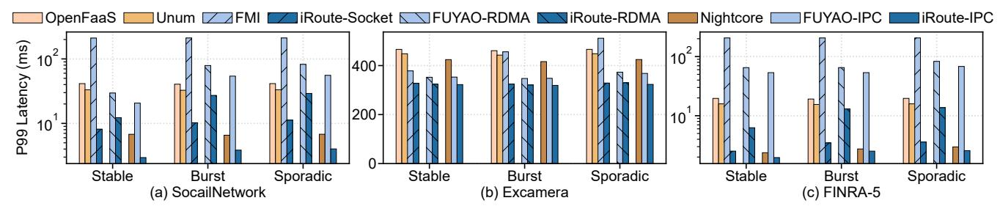
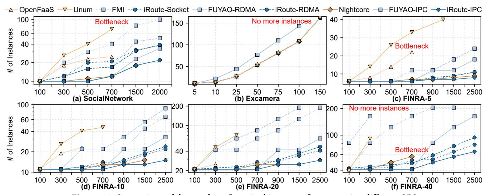
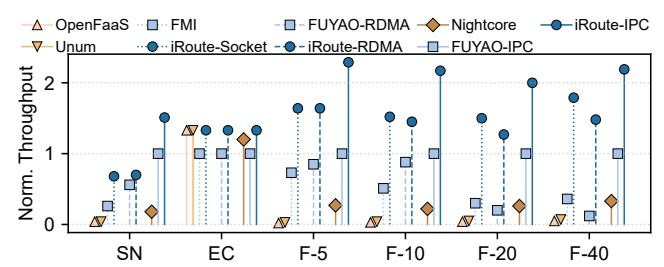

# 5.3 Benchmark Analysis

Next, we evaluate **iRoute** using three latency-sensitive workflows: Social Network, Excamera and FINRA-5 (i.e., fan-in=5). P99 latency: iRoute can reduce the P99 latency of applications by 1.1-81.8×. We use Azure traces [10, 16] to generate three production-like 120-hour workloads, with 10 minutes keep-alive duration for function instance. The P99 response latency of three benchmark applications under these workloads is recorded. As shown in Figure 10(a) and 10(c), in Social Network and FINRA-5, iRoute consistently outperforms all other systems in P99 latency. In the most extreme case (FINRA-5 in stable), iRoute-Socket outperforms FMI by up to 81.8×. The poor performance of FMI is primarily due to its need to synchronously scale all other functions and establish direct connections during scaling each function. OpenFaaS and Unum exhibit up to 7.8× and 6.3× higher latency than iRoute-Socket, respectively, mainly because they rely on third-party forwarding. Compared to Nightcore, FUYAO-IPC and FUYAO-RDMA, iRoute still reduces the P99 latency by up to 2.3×, 27.3× and 10.4×, respectively. Note that, **iRoute-RDMA** exhibits higher latency compared to **iRo**ute-Socket. This is mainly due to the frequent re-establishment of direct connections, with RDMA incurring a connection overhead 6.5× greater than that of socket. Furthermore, these applications transmit relatively small data (e.g., <1KB in FINRA), preventing performance benefits typically offered by RDMA. In Figure 10(b), Excamera in which function execution dominates the overall latency, shows less sensitivity to communication and connection overhead compared to other applications. Nevertheless, **iRoute** still achieves lower latency than OpenFaaS, Unum, FMI and FUYAO, with reductions of  $1.4\times$ ,  $1.3\times$ ,  $1.6\times$  and  $1.1\times$ , respectively.

Resource efficiency: iRoute can reduce the number of function instances by up to 6.5× while supporting the same throughput. As shown in Figure 11, across all experimental cases, iRoute requires fewer instances than *Open-FaaS*, *Unum*, *Nightcore*, *FMI*, *FUYAO-RDMA* and *FUYAO-IPC*, with average reductions of 1.6×, 2.6×, 1.1×, 2.3×, 1.8× and

**Figure 10.** The P99 latency under different production traces, including *Stable*, *Burst* and *Sporadic*.

**Figure 11.** Comparison of the number of required instances for supporting different QPS.

**Figure 12.** The maximum throughput of *Social Network* (SN), *Excamera* (EC) and *FINRA* (F) in local cluster.

1.4×, respectively. In *Social Network* (Figure [11\(](#page-10-1)a)), *Unum* requires the most number of instances, primarily due to the highest additional overhead for function execution, including the slowest socket-based *third-party forwarding* and connection overhead of directly invoking downstream functions. *FMI* necessitates the simultaneous scaling of all functions, leading to higher instance demand than *OpenFaaS* and *FUY-AO*. Since RDMA performs less efficiently than IPC for transmitting small data, *FUYAO-RDMA* requires more instances than *FUYAO-IPC*. As for **iRoute**, **iRoute-IPC** requires the fewest instances among its variants, owing to its minimal transmission overhead. In *Excamera* (Figure [11](#page-10-1)(b)), where the overall latency is dominated by function execution time,

the number of instances required is consistent across all systems except *FMI* and *FUYAO*. This is due to their *binding scaling* problem, i.e., downstream instances must scale synchronously with upstream instances to avoid potential overload. The comparison between *FINRA-5* (Figure [11\(](#page-10-1)c)) and *FINRA-40* (Figure [11\(](#page-10-1)f)) reveals that increasing the *fan-in* degree leads to a higher computational load and larger number of required instances for the same QPS. *OpenFaaS*, *Unum* and *Nightcore* also experience central bottlenecks earlier under higher*fan-in*. In *FINRA-40*, *FUYAO-RDMA*requires more frequent scaling to meet its memory allocation demands and encounters the *binding scaling* problem earlier, resulting in the highest instance requirements, even surpassing *Unum*. We further measure the maximum throughput each system can sustain on our local cluster. As shown in Figure [12,](#page-10-2) **iRoute** can support up to 100×, 80×, 10×, 5×, 11.8× and 2.3× throughput over *OpenFaaS*, *Unum*, *Nightcore*, *FMI*, *FUYAO-RDMA* and *FUYAO-IPC*, respectively.

