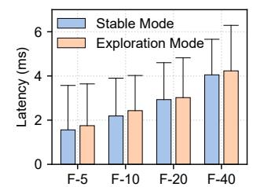
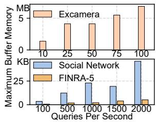
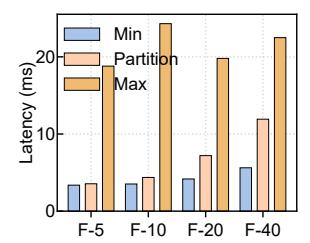

# **5.4 Fault Tolerance**

During *LRT* updates, **iRoute** enables fault-tolerant routing mechanism to re-route intermediate data and ensure execution correctness. When function execution fails, **iRoute** activates fault-tolerant execution to re-schedule and re-execute

**Figure 13.** Average and P99 latencies of *FINRA* (F) workflow under stable and exploration mode.

**Figure 14.** Maximum memory usage of buffered data in each *LC* for *at-least-once* execution semantics.

**Figure 15.** Latency distribution of fault-tolerant execution in Unum (left axis) and iRoute (right axis).

the failed request. In this section, we first evaluate the overhead of fault-tolerant routing by comparing latencies under *stable* and *exploration* modes. Next, we simulate different failure rates by injecting failure intervals of varying durations during application execution and assess the resulting overhead of fault-tolerant execution.

<u>Fault-tolerant routing:</u> Exploration mode leads to an increase in P99 latency by 1.9-11.1%. As shown in Figure 13, *exploration* mode results in a 7.7% increase in average latency compared to *stable mode* in *FINRA*. Moreover, as the *fan-in* degree increases, the P99 latency overhead rises from 1.9% to 11.1%, primarily due to the need for downstream functions to send re-routing requests to more upstream functions.

Fault-tolerant execution: Semantics guarantee results in an increase of 0.5-18 ms in average latency. As iRoute supports both exactly-once (EO) and at-least-once (ALO) semantics, and only Unum among the compared systems offers EO semantics, our comparison focuses on iRoute, Unum and a non-fault-tolerant baseline (No-FT). As illustrated in Figure 15, the fault injection rate ranges from 0% (i.e., no failures injected, but with data buffer overhead) to 50%. The results show that **iRoute-EO** and *Unum-EO* exhibit similar latency patterns under fault injection. Moreover, as the injection rate increases, response latency rises significantly for both systems. In contrast, **iRoute-ALO** which leverages local buffer to provide relaxed ALO semantics, experiences significantly lower latency overhead compared to EO. To further evaluate the impact of real-world failure patterns, we also inject failure following the trace from the BlueGene/L

**Figure 16.** Load balancing of routing algorithms. (a) The coefficient of variation (CoV). (b) The normalized latency.

supercomputer system (*BGL*) [52, 53], where each millisecond is mapped to whether a failure occurred in a 3-minute window of *BGL*. Under this workload, **iRoute** incurs minor fault-tolerance overhead, primarily because the failure rate in *BGL* is relatively low and approximately corresponds to fault injection of 7%.

## 5.5 Load Balancing

Delegating routing decisions to *LC* may compromise loadbalancing performance, since *LC* routes requests based on a local rather than a global view. Therefore, in this section we evaluate **iRoute**'s load-balancing performance. **iRoute** employs a hybrid routing strategy, which uses *Round Robin* (*RR*) for non *fan-in* functions and *Consistent Hashing* (*Hash*) for *fan-in* functions. We compare **iRoute** against several classic global routing algorithms: *Random*, *Hash*, and *RR*.

Load balancing: iRoute's routing can achieve load balancing performance comparable to that of global rout**ing.** As shown in Figure 16(a), we evaluate the load-balancing performance of three benchmarks under QPS of 2,000, 25 and 2,000, respectively. RR demonstrates the best performance, achieving a coefficient of variation (CoV) ranging from 0 to 0.0067. In contrast, Hash performs the worst, with a CoV reaching 0.144, primarily due to the non-uniform distribution of hash values on the hash ring. Thus, iRoute uses RR as the preferred algorithm. However, in fan-in patterns, RR becomes unsuitable because it may route results from multiple upstream functions to different downstream instances, compromising routing correctness. Therefore, iRoute employs *Hash* under *fan-in* to ensure that results from the same request are routed to a single downstream instance. Although **iRoute** exhibits higher CoV than RR and Random, its impact on end-to-end latency remains limited in workflows where fan-in functions have short execution times. As illustrated in Figure 16(b), the end-to-end latency of iRoute is only 0.3-6.8% higher than that of RR, This is mainly because fan-in functions in the three applications account for < 20% of the overall latency.

#### 5.6 Overheads

Then, we evaluate the overhead of **iRoute**.

**Figure 18.** LRTs synchronization overhead of *FINRA* (F) w/o (*Min* and *Max*) and with instance *Partition*.

Overhead breakdown: iRoute introduces only an average overhead of 35  $\mu s$  for LC. To illustrate the overhead of our design to support LC, we further break down iRoute's performance, and present the results of 2 no-op functions in Figure 17. "Baseline" only implements 1-hop transfer between function, similar to FUYAO. "Scaling" adds metrics collection of requests per second and request duration for collaborative scaling. "Fault" further supports at-least-once execution with local buffer. "Routing" increases the number of available downstream instances from 1 to 20 and utilizes CH-EM algorithm to select a destination for each request. Experimental results indicate that the three components result in an average additional overhead of 7, 12 and 16  $\mu s$ , respectively.

Synchronization overhead: Instance partition can reduce the overhead of LRTs synchronization by 1.9-5.6×. We measure the *LRTs* synchronization overhead in different scenarios using the *FINRA* application and present the results in Figure 18. As the number of function instances continues to increase, the cost of *LRTs* synchronization also significantly increases. For example, *FINRA-5* can have up to 184 upstream function instances in our local cluster (i.e., *Max*), which increases the synchronization overhead of *LRTs* by 5.5× compared to the minimum of 5 upstream instances, i.e., *Min*. With instance partition, the *CC* only needs to synchronize *LRTs* between a maximum of 11 instances each time, with a cost increase of only 5.3% compared to *Min*.

