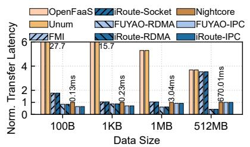

# 5.1 Methodology

**Experimental setup.** We evaluate **iRoute** on a 12-node cluster. Each node is configured as shown in Table 2. And these nodes are connected via 25 Gbps, full-bisection bandwidth Ethernet.

**Table 2.** Experimental cluster configurations

| Component        | Configuration                  |  |  |
|------------------|--------------------------------|--|--|
| CPU Device       | Intel Xeon Gold 6338 @ 2.00GHz |  |  |
| CPU Threads      | 128 cores (64 physical cores)  |  |  |
| Storage          | 256GB Memory with 2TB SSD      |  |  |
| Operating System | Ubuntu 22.04                   |  |  |

Benchmarks. We evaluate iRoute and the comparison systems using three typical benchmarks. Social Network is a latency-sensitive application from DeathstarBench [8] that creates post embedded with text, media, links and user tags. Excamera [46] is a video-processing application that encodes and processes chunks in parallel. And the function execution dominates the overall latency. Financial Industry Regulatory Authority (FINRA) is a financial application that validates trades based on trade and market data. It can be configured with varying widths (i.e., fan-in degree). Specifically, we implement four distinct variants of FINRA with widths of 5, 10, 20 and 40. We further use production trace from Azure Function [16] for evaluation, including the stable trace, burst trace and sporadic trace.

**Figure 8.** Latency of building direct connection

**Figure 9.** Comparison of data transmission latency under various data volumes

Comparison systems. We compare iRoute with state-of-the-art systems, including *OpenFaaS* [41], *Unum* [9], *Night-core* [47], *FMI* [15] and *FUAYO* [10]. Specifically, *OpenFaaS* uses a standalone orchestrator and basic *third-party forwarding* for workflow execution; *Unum* offloads *function-level* dependencies to local instance to avoid the interaction overhead with a standalone orchestrator; *Nightcore* employs IPC to speed up data transfer between functions within the same node; *FMI* implements *keep-alive connection* based on Socket; *FUYAO* also supports *keep-alive connection* with IPC and RDMA-based direct connections. To ensure fairness, each system is compared only with others that adopts the same communication channel, i.e., Socket, RDMA, or IPC. Moreover, all function instances are pre-warmed to eliminate the impact of cold starts.

**Metrics.** We evaluate the performance of **iRoute** using three metrics: (1) Latency (e.g., data transfer latency, end-to-end latency and overhead); (2) Throughput (i.e., QPS); (3) Resource provisioning (i.e., required number of instances to support various QPS). We conduct each test five times and report the average results.

## 5.2 Intermediate Data Transfer Latency

We first evaluate the intermediate data transfer latency between two functions.

Connection overhead: iRoute can establish direct connections within  $\leq 2.3$  ms. As shown in Figure 8, FMI and FUYAO require the exchange of instance address information through controller, leading to connection overhead of 5.4-100.7 ms. In contrast, iRoute only needs to retrieve destination addresses from LRT and avoids any interaction with a global controller, which reduces the connection time to 0.2-2.3 ms. In fact, iRoute can further eliminate the overhead of connection establishment when using UDP [48, 49]. For RDMA-based transmission, existing acceleration techniques such as KECORE [50] can be integrated into iRoute to further reduce overhead.

<u>Data transfer latency</u>: iRoute can reduce the transfer latency to 288 ms when transmitting 512MB of data. After the direct connection is established, iRoute, *FMI* and *FUYAO* all use the same 1-hop data-transfer mechanism, so

their communication latency differences are mainly determined by the transfer mode. Because FMI provides only a socket-based transmission while FUYAO supports both IPC and RDMA, we group FUYAO-RDMA with **iRoute-RDMA**, FU-YAO-IPC with **iRoute-IPC**, and FMI with **iRoute-Socket** for comparison. Figure 9 shows the latency for transmitting various data sizes. Compared to OpenFaaS and Nightcore which both rely on third-party forwarding, **iRoute** can transfer 512MB in 288 ms, representing a speedup of  $8.6 \times$  and  $2.3 \times$  over OpenFaaS and Nightcore, respectively. Among IPC, socket and RDMA, IPC offers the best performance when the data size  $\leq 1$ KB, while RDMA performs better when the data size  $\geq 1$ MB. This is primarily because IPC requires additional copying of large data into the shared memory [10, 51].

