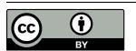

# Abstract

Lossless model compression holds tremendous promise for alleviating the memory and bandwidth bottlenecks in bitexact Large Language Model (LLM) serving. However, existing approaches often result in substantial inference slowdowns due to fundamental design mismatches with GPU architectures: at the kernel level, variable-length bitstreams produced by traditional entropy codecs break SIMT parallelism; at the system level, decoupled pipelines lead to redundant memory traffic. We present ZipServ, a lossless compression framework co-designed for efficient LLM inference. ZipServ introduces Tensor-Core-Aware Triple Bitmap Encoding (TCA-TBE), a novel fixed-length format that enables constant-time, parallel decoding, together with a fused decompression-GEMM (ZipGEMM) kernel that decompresses weights on-the-fly directly into Tensor Core registers. This "load-compressed, compute-decompressed" design eliminates intermediate buffers and maximizes compute intensity. Experiments show that ZipServ reduces the model size by up to 30%, achieves up to 2.21× kernel-level speedup over NVIDIA's cuBLAS, and expedites end-to-end inference by

[This work is licensed under a Creative Commons Attribution 4.0 Interna](https://creativecommons.org/licenses/by/4.0)[tional License.](https://creativecommons.org/licenses/by/4.0)

ASPLOS '26, Pittsburgh, PA, USA © 2026 Copyright held by the owner/author(s). ACM ISBN 979-8-4007-2359-9/2026/03 <https://doi.org/10.1145/3779212.3790250>

an average of 1.22× over vLLM. ZipServ is the first lossless compression system that provides both storage savings and substantial acceleration for LLM inference on GPUs.

