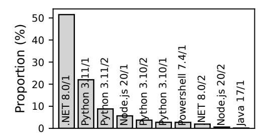
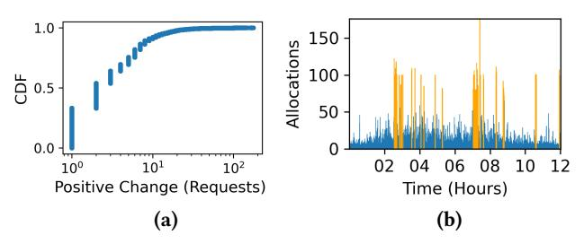
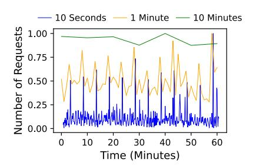

# 2 Workload Characterization

In this section, we !rst de!ne the production datasets we use in this work (Section 2.1). Then, Section 2.2 presents a detailed analysis of the workload characteristics. Finally, Section 2.3 analyzes the workload burstiness.

Figure 2. Proportion of the top 10 pools.

#### 2.1 Datasets

We collected our dataset from data centers in one region of the serverless platform. The collected data includes the containerallocation requests over 14 days between November 1, 2024 and November 14, 2024. The dataset includes two traces:

- Container-allocation trace:A time series of containerallocation requests. It includes the container ID, request timestamp with microsecond accuracy, the target runtime environment, the runtime version, and the container size (i.e., number of cores and amount of RAM). Our platform, o"ers a set of container sizes. Each size is identi!ed by runtime/core count and comes with a !xed amount of memory. The trace includes more than 2*.*2 million requests for 16 runtime environments.
- Container-lifecycle trace: For each container, the trace includes the duration, in microseconds, spent in each stage, namely, the creation, allocation, user workload, and deletion stages.

We plan to publicly release our dataset1. The dataset contains container-allocation requests, which is di"erent from other public datasets [11–14] that represent user function invocations, which do not directly translate to container allocations.

## 2.2 Statistical Features of the Workload

This section presents a comprehensive analysis of the statistical features of the container-allocation workload. We use the following notation to refer to pools in text: runtime/corecount. For example, "Python 3.11/1" refers to a pool for the Python 3.11 runtime with single-core containers.

Pool popularity. Figure 2 illustrates the popularity of different container pools based on the number of containerallocation requests. The workloads of the .NET 8.0/1 and Python 3.11/1 pools dominate the total workload of the platform, accounting for 75% of the total load. Python 3.11/2 and Node.js 20/1, see moderate usage, jointly accounting for around 15% of container allocations. The remaining 12 pools account for about 10% of the total workload. This signi!cant variation in the load across pools highlights that di"erent

Figure 3. The lifecycle of a container.

pools require di"erent amounts of assigned resources (i.e., di"erent pool sizes).

Requests arrival rate. Figure 4a shows the CDF of perminute container-allocation requests of di"erent pools. The workload volume varies signi!cantly across pools, with the .NET 8.0/1 and Python 3.11/1 pools exhibiting a long tail, with the 99.9th percentile (P99.9) reaching 500 requests per minute. In addition, the workloads of various pools exhibit signi!cant burstiness. The Python 3.11/1 pool has the most bursty workload, with a median of 17 requests per minute and a P99.9 of 530, which is 32 times the median. The .NET 8.0/1 pool shows a slightly lower burstiness, with a median of 48 requests per minute and a P99.9 of 460 requests. Notably, even low-tra#c pools experience sudden bursts; the P99.9 of per-minute requests of Python 3.10/2 is 14 times the median. This high level of burstiness complicates resource allocation, as underestimating these bursts can lead to resource underprovisioning, resulting in SLO violations.

Container lifecycle. Figure 3 shows the lifecycle of a container, which consists of !ve main stages: creation, ready, allocation, user workload, and deletion. The cycle begins with the creation stage, during which the platform allocates the required resources from a VM and bootstraps a container with the target runtime environment. Next, the container transitions to the ready state, in which it remains idle in a pre-warmed container pool. When a container-allocation request is triggered, the platform consumes the container from the pool, and the container transitions to the allocation stage. During the allocation stage, the platform injects user-speci!c code, dependencies, and con!gurations into the container. The container then transitions to the user workload stage, in which it processes user-de!ned function invocations. Once all function invocations are completed, the platform moves the container to the deletion state, in which the container is terminated, and its resources are released back to the VM pool for future use.

We focus on four container lifecycle stages that critically in\$uence resource allocation: creation, allocation, user workload, and deletion stages. The container-creation latency impacts the container pool size required to meet the SLO. A longer creation time means the platform requires a longer time to replenish the pool. As a result, a pool must be larger to account for allocation requests that arrive while the pool

1The dataset will be available at: h!ps://github.com/Azure/ AzurePublicDataset.

Figure 4. CDFs of (a) allocation requests per minute, (b–e) container lifecycle stage latencies, and (f) the overhead of container management for the top !ve container pools.

is being replenished. Similarly, the container-allocation latency, container-deletion latency, and user-workload latency impact the VM pool size. The deletion time determines when the resources of deleted containers become available to create new containers. The longer the allocation time and deletion time, the larger the VM pool needed to account for allocation requests arriving while resources are still reserved.

Figure 4b-e shows the CDF of the latency of the creation, allocation, deletion, and user workload stages for di"erent pools. The distributions of the creation (Figure 4b) and deletion (Figure 4d) stages exhibit similar patterns across various pools. The median and P99.9 container-creation latencies are approximately 1.1 seconds and 26 seconds, respectively, while the median and P99.9 container-deletion latencies are around 6 seconds and 50 seconds.In contrast, the container-allocation latency (Figure 4c) is dominated by loading user code and dependencies. As a result, it varies signi!cantly across pools. For instance, the median latencies of the .NET 8.0/1 and Python 3.11/1 pools are 1.48 seconds and 1.30 seconds, while the P99.9 latencies of the .NET 8.0/1 and Python 3.11/1 pools are 7.83 seconds and 22.49 seconds, respectively.

Figure 4e shows the CDF of user time across various pools. User time is the time spent running user workload. The .NET 8.0/1 pool has the shortest median user time at approximately 2 minutes, while Python 3.11/1 has the longest median user time of around 6 minutes. The median user times of the remaining pools fall between these two extremes. Despite these

relatively smallmedians, all pools exhibitlong-tailed user time distributions, with notable variation in the extent of these tails. Python runtimes exhibit the longest-running workloads, with the P99.9 durations extending to 23 hours. In contrast, Node.js 20/1 and .NET 8.0/1 have more bounded tails, with the P99.9 values around 2 hours.

To assess the e#ciency of the platform, Figure 4f reports the CDF of the overhead of various pools. The overhead is de!ned as the ratio of time spent in the creation, allocation, and deletion stages to the total lifetime of a container, which includes creation, allocation, deletion, and user workload durations.Approximately 90%of all containers have an overhead of around 11%, indicating high resource e#ciency. However, a few containers of each pool experience high overhead that can reach almost 100%, which may result from high creation, allocation, or deletion latencies or exceptionally short user workload durations.

Periodicity. Periodicity measures the presence of recurrent, periodic patterns in a time series, where \$uctuations in the data align with regular temporal intervals (e.g., hourly, daily, or weekly). For example, serving enterprise users might exhibit daily periodicity, with requests peaking during business hours and declining overnight.

To capture periodicity, we compute the autocorrelation of the time series. Formally, let = {1*,*2*,...,*} represent a time series of time units, where denotes the number of container-allocation requests in time unit . Autocorrelation

Table 1. Periodicity and spikiness of the workload of the top !ve container pools.

| Workload       | Periodicity (Daily) | Periodicity (Hourly) | Spikiness |
|----------------|------------------------|-------------------------|-----------|
| .NET 8.0/1     | 0.01                   | 0.01                    | 5.52      |
| Python 3.11/1  | 0.01                   | 0.02                    | 6.87      |
| Python 3.11/2  | 0.05                   | 0.03                    | 5.81      |
| Node.js 20.0/1 | 0.09                   | 0.08                    | 7.82      |
| Python 3.10/2  | 0.05                   | 0.03                    | 5.81      |

measures how closely current values resemble past values at various time intervals, known as lags (l), as in Equation 1 [15].

$$C(X,l) = \frac{1}{(n-1)\sigma^2} \sum_{t=1}^{n-l} (X_t - \mu)(X_{t+l} - \mu)$$
 (1)

The values of the periodicity metric are bounded between -1 and 1, where 1 indicates perfect positive periodicity, -1 indicates perfect negative periodicity, and 0 indicates no periodicity. Table 1 presents the hourly and daily periodicity for various pools. Most pools exhibit low hourly and daily periodicity, ranging between 0.01 and 0.09. Low periodicity values suggest that it is di#cult to forecast the workload, as we show in Section 3.

## 2.3 Burstiness Analysis

In this section, we perform a burstiness analysis to measure the role of bursts in determining the pool size to meet the SLO. A burst is a temporary and sudden change in the containerallocation demand during a short time period.

First, we measure the spikiness of various pools. Spikiness [15, 16] is a metric that measures the degree of \$uctuation in the workload over time. For example, the platform may receive a few container-allocation requests during periods of low demand, followed by an abrupt spike (e.g., up to a thousand requests) in the subsequent time unit. The spikiness is de!ned as in Equation 2.

Spikiness(X) = 
$$\frac{1}{\mu} \sqrt{\frac{1}{n-1} \sum_{t=1}^{n-1} (X_{t+1} - X_t)^2}$$
 (2)

Spikiness is calculated as the normalized root mean squared deviation between consecutive time units () and (+1), normalized by the mean () to ensure comparability across workloads with di"ering baselines. Table 1 presents the spikiness of di"erent pools using 1-second time intervals. As a baseline, the spikiness of a Poisson workload with the same average interarrival rate as our workload has a value of 1. From Table 1, we can see that the workload of most pools exhibits substantially higher spikiness than the Poisson workload, ranging between 5*.*5 and 7*.*8.

To better understand the burstiness of the workload, we analyze \$uctuations in the load over time. Speci!cally, we

Figure 5. Burstiness analysis: (a) The CDF of the load changes of the container allocation trace, and (b) Original trace with bursts highlighted in orange.

measure the positive changes in the load over a time window of 1 second. We slide two back-to-back windows on the container-allocation trace. At each time step, we measure the change in the load between the !rst window and the second window. The change in the load is computed as the di"erence between the number of requests in the !rst window and the number of requests in the second window. Figure 5a shows the CDF of the positive changes in the workload of the .NET 8.0/1 pool. We select the top 1% of the measured changes as bursts. The value of P99 of the positive change is 38 times larger than the median value of the positive change.

Role of bursts in meeting the SLO. To assess the role of bursts in meeting the target SLO, we measure the volume of the load in the bursts to the total volume of the workload. Figure 5b shows a sample 12-hour trace of the containerallocation trace of the .NET 8.0/1 pool with bursts highlighted in orange. The volume of the load in the top 1% of bursts is 8% of the total load. As a result, in order to meet any SLO higher than 92%, bursts above the P99 must be considered and carefully analyzed. Hence, bursts play a critical role in determining the pool size needed to meet the target SLO.

Predictability of bursts. We study if it is possible to predict the time and volume of future bursts using forecasting models (detailed in Section 3). We measure the periodicity of bursts for di"erent pools using Equation 1. The periodicity of the bursts of di"erent pools ranges between 0*.*03 and 0*.*06, indicating that bursts exhibit no periodicity, making them extremely hard to predict. We further measure the error of predicting bursts, as discussed in Section 3. Results show that the average error and the maximum error of predicting bursts are 107% and 1170%, indicating that forecasting models are poor at predicting bursts for any pool.

Workload summary.Our analysis reveals that the real containerallocation workload is highly bursty, lacks clear periodic patterns, and involves long-tailed resource creation latencies. These characteristics complicate pool sizing decisions: bursty demand leads to sudden spikes in resource needs, the absence of periodicity hinders prediction-based planning, and long creation times delay resource availability during spikes. Our

evaluation (Section 7) shows that reactive and predictive methods struggle to achieve high success rates without incurring excessive overprovisioning.

## 3 Forecasting Future Load

Forecasting methods can be used to predict future workload to proactively adjust the size of pre-warmed resource pools. To assess the viability of this idea, we employ state-of-the-art time series forecasting methods, including statistical, machine learning, and foundation models:

- Statistical models. We evaluate four statistical models: ARIMA [8], Theta [7], ETS [9], and a Naive model that repeats the value of the previous day.
- Machine learning models. We evaluate three machine learning (ML) models: PatchTST [6], a transformer-based model optimized for time series; Temporal Fusion Transformer (TFT) [5], which combines LSTM with a transformer layer, and DeepAR [4], a probabilistic autoregressive network based on LSTM architecture.
- Other models. We evaluate Chronos [17], a foundation model pre-trained on massive datasets, enabling zero-shot forecasting without task-specific fine-tuning. Additionally, we evaluate a Weighted Ensemble model, fitted using other top-performing predictors.

To train various forecasting models, we use AutoGluon [18], which is an open-source AutoML framework that provides a unified interface for different models and handles parameter tuning. The evaluation is conducted using a rolling forecasting approach over the trace. The training period is 7 days followed by a testing period of one day. The rolling window is advanced by one day at each step, ensuring that the entire test week is covered and that performance metrics reflect models' generalization capability across different temporal contexts.

We evaluate the forecasting models using the containerallocation trace of the .NET 8.0/1 pool, as it is the most popular pool (Figure 2). However, our findings generalize to other resource pools (Section 7). For training, we use a machine equipped with two Intel E5-2630 CPUs (each CPU has 16 cores or 32 threads running at 2.40 GHz), 128 GB RAM, and 480 GB SSD.

#### 3.1 Container-allocation Workload Predictability

We evaluate the forecasting models with four prediction intervals: 10 seconds, 1 minute, 10 minutes, and 1 hour. A prediction interval refers to the temporal resolution at which future values are forecasted. Formally, a prediction interval of  $\tau$  seconds implies that the model generates one predicted data point for every  $\tau$ -second interval. We use different prediction intervals to evaluate the capability of a model to capture patterns at different time resolutions. For training, we provide a time series where each data point corresponds to the total number of container allocations within an interval. The model generates

**Table 2.** Forecasting models performance evaluation with different prediction intervals.

| Model                | Interval         | Avg Error | Max Error | Bias   | Training Time (s) |  |  |  |
|----------------------|------------------|-----------|-----------|--------|-------------------|--|--|--|
| Statistical          |                  |           |           |        |                   |  |  |  |
| Naive                | 10 seconds       | 182%      | 2300%     | 1.3    | 6.0               |  |  |  |
|                      | 1 minute         | 46%       | 2900%     | 4.0    | 1.7               |  |  |  |
|                      | 10 minutes       | 25%       | 842%      | 40.8   | 1.4               |  |  |  |
|                      | 1 hour           | 18%       | 124%      | 245.0  | 1.4               |  |  |  |
| ETS                  | 10 seconds       | 123%      | 1246%     | -1.6   | 6.3               |  |  |  |
|                      | 1 minute         | 53%       | 4202%     | -16.9  | 1.9               |  |  |  |
|                      | 10 minutes       | 72%       | 638%      | 253.2  | 3.4               |  |  |  |
|                      | 1 hour           | 18%       | 82%       | 19.2   | 0.4               |  |  |  |
| Theta                | 10 seconds       | 173%      | 3630%     | 1.3    | 67.3              |  |  |  |
|                      | 1 minute         | 66%       | 5404%     | -1.9   | 22.9              |  |  |  |
|                      | 10 minutes       | 20%       | 758%      | -81.4  | 21.9              |  |  |  |
|                      | 1 hour           | 17%       | 87%       | -307.5 | 7.1               |  |  |  |
| ARIMA                | 10 seconds       | 130%      | 1268%     | -0.6   | 8.4               |  |  |  |
|                      | 1 minute         | 34%       | 3195%     | -3.3   | 2.4               |  |  |  |
| ANIMA                | 10 minutes       | 20%       | 763%      | -18.4  | 21.1              |  |  |  |
|                      | 1 hour           | 14%       | 76%       | 54.5   | 1.1               |  |  |  |
|                      | Machine Learning |           |           |        |                   |  |  |  |
| DeepAR               | 10 seconds       | 84%       | 1628%     | -3.26  | 3574.1            |  |  |  |
|                      | 1 minute         | 33%       | 2569%     | -6.9   | 743.1             |  |  |  |
|                      | 10 minutes       | 40%       | 579%      | -27.0  | 173.0             |  |  |  |
|                      | 1 hour           | 28%       | 124%      | -120.4 | 74.9              |  |  |  |
| TFT                  | 10 seconds       | 92%       | 889%      | -3.8   | 3597.9            |  |  |  |
|                      | 1 minute         | 38%       | 3082%     | 0.4    | 893.4             |  |  |  |
|                      | 10 minutes       | 27%       | 901%      | -22.2  | 347.1             |  |  |  |
|                      | 1 hour           | 31%       | 358%      | 209.5  | 159.1             |  |  |  |
| PatchTST             | 10 seconds       | 96%       | 1562%     | -1.9   | 1413.1            |  |  |  |
|                      | 1 minute         | 32%       | 2929%     | -3.4   | 194.7             |  |  |  |
|                      | 10 minutes       | 21%       | 714%      | -7.7   | 35.1              |  |  |  |
|                      | 1 hour           | 45%       | 167%      | 343.7  | 31.3              |  |  |  |
| Other Models         |                  |           |           |        |                   |  |  |  |
| Chronos              | 10 seconds       | 102%      | 2946%     | -3.7   | 7.6               |  |  |  |
|                      | 1 minute         | 31%       | 2326%     | -13.5  | 1.3               |  |  |  |
|                      | 10 minutes       | 19%       | 678%      | -39.8  | 1.0               |  |  |  |
|                      | 1 hour           | 15%       | 74%       | 77.2   | 1.4               |  |  |  |
| Weighted Ensemble | 10 seconds       | 99%       | 2946%     | -2.7   | 30.1              |  |  |  |
|                      | 1 minute         | 30%       | 2522%     | -6.5   | 19.0              |  |  |  |
|                      | 10 minutes       | 19%       | 731%      | -19.6  | 20.3              |  |  |  |
|                      | 1 hour           | 17%       | 131%      | 15.7   | 3.0               |  |  |  |

a time series where each point represents the predicted total load within an interval.

Table 2 reports the average and maximum prediction errors of various models for different prediction intervals. We use the mean absolute percentage error (MAPE [19]) as an error metric. MAPE provides an intuitive, scale-independent measure of forecast accuracy expressed as a percentage, making it easy to interpret. MAPE penalizes overprediction and underprediction of the same magnitude equally. MAPE is computed as shown in Equation 3, where  $A_t$  is the actual value,  $F_t$  is the forecast value, and n is the time series length.

MAPE = 
$$\frac{100}{n} \sum_{t=1}^{n} \left| \frac{A_t - F_t}{A_t} \right|$$
 (3)

Figure 6. One-hour training trace with di"erent prediction intervals.

Table 2 shows that the lowest average errors for the 10 second, 1-minute, 10-minute, and 1-hour intervals are 84%, 30%, 19%, and 14%, respectively. Table 2 indicates that forecasting models are incapable of accurately predicting !negrained long-term container-allocation workload because the container-allocation workload exhibits unpredictable, highintensity bursts. These bursts deviate sharply from regular temporal patterns, making them di#cult to capture with forecasting models.

Table 2 shows that using a smaller prediction interval signi!cantly increases the prediction error for all forecasting models because shorter intervals capture !ner-grained \$uctuations, making the training data more bursty and harder to model. Furthermore, the length of the prediction interval has a signi!cant impact on the shape of the trace, which directly impacts the forecasting accuracy. Figure 6 presents a normalized 1-hour training trace using 10-second, 1-minute, and 10-minute prediction intervals. As the prediction interval increases, the workload becomes signi!cantly smoother, suppressing abrupt and sharp bursts. The coe#cients of variation of the same trace with 10-second, 1-minute, and 10-minute intervals are 1*.*88, 0*.*32, and 0*.*05, respectively, illustrating the smoothing e"ect. This smoothing e"ect simpli!es the learning and prediction of the workload.

Bias. Table 2 reports the bias, which is the average di"erence between predicted values and actual values. A positive bias indicates that the model tends to overpredict, while a negative bias indicates that the model tends to underpredict. In the context of resource allocation, overprediction results in larger pools than needed, increasing operational costs. In contrast, underprediction leads to undersized pools, which can result in allocation failures and SLO violations.

Training cost. Table 2 reports the training time required to generate predictions for 1 day across di"erent models. The resultsindicate that shorter predictionintervals require substantially longer training times than larger intervals because they require !tting the models on larger training datasets. For example, the size of the training data for a 10-secondintervalis 60 times larger than that for a 10-minute interval. In addition, results show that ML-based models consistently exhibit longer training times than statistical models due to their increased complexity and reliance on iterative optimization algorithms. Summary. Our evaluation of forecasting models shows that they are not an e"ective solution for managing resource pools, as they fail to predict the workload with high accuracy. In Section 7, we further evaluate an oracle perfect predictor that provides exact future workload values. Even with perfect predictions, our results reveal a fundamental limitation of forecasting: it cannot predict bursts' temporal proprieties, leading to SLO violations. As a result, tuning current models or using more accurate models will not make forecasting a viable approach for resource pool management.

