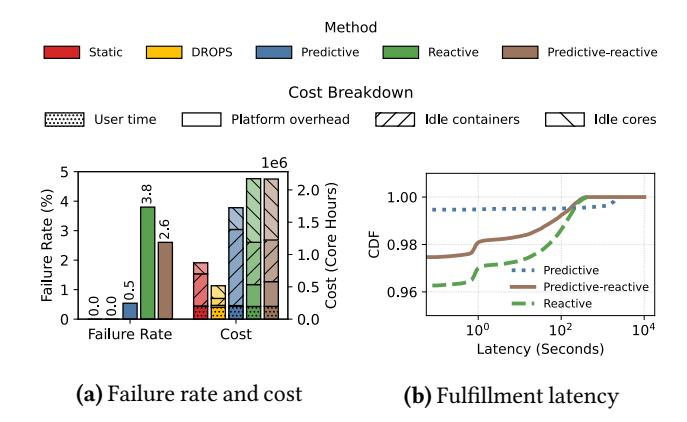
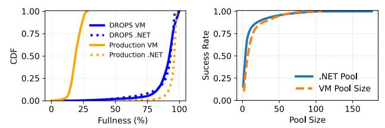
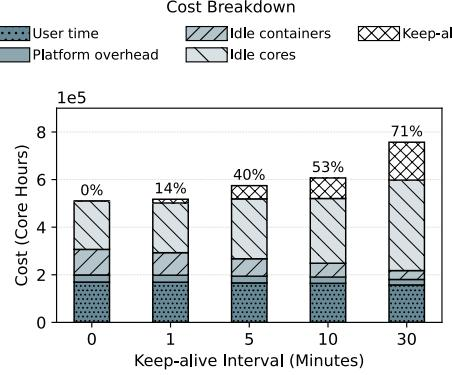

# 7 Evaluation

This section evaluates the performance of various pool sizing methods. Section 7.1 compares the failure rate, cost, and latency of various methods. Section 7.2 evaluates the performance of the forecasting-based methods with di"erent

prediction intervals. Section 7.3 presents a sensitivity analysis of the reactive method. Section 7.4 presents a sensitivity analysis of DROPS. Section 7.5 introduces the aggressive container creation optimization. Section 7.6 evaluates DROPS using traces from di"erent geographical regions.

Metrics. We use the following metrics in the evaluation:

- Failure rate. The failure rate is the ratio of failed requests to total requests. A failed request is a request that is not satis!ed immediately from the pre-warmed pool of containers. Note that no allocation request is rejected; every request is eventually ful!lled.
- Cost. We measure the total cost in core-hours that is required to serve the input container-allocation trace. We also provide a breakdown of the cost in various components, including the container pool, VM pool, platform overhead, and user workload cost. The container pool and VM pool costs represent the cost of maintaining idle containers and VMs, respectively.
- Latency.Thelatency of ful!lling a container-allocation request. This includes the time from when the request is received until a container is allocated to the request.

Alternatives. In addition to DROPS, we consider the following alternatives in our evaluation:

- Static method. The size of each container pool is static and set by an expert operator. For the VM pool, the platform employs a reactive scaling strategy based on the availability of idle CPU cores, which can be used to replenish container pools. When the number of idle cores drops below a low watermark, the platform increases the VM pool size, while if the number of idle cores exceeds a high watermark, the platform reduces the VM pool size. This alternative represents the approach used in production in the Azure Functions platform prior to DROPS. The low and high watermarks are set to 10% and 40% of the platform's total number of CPU cores.
- Predictive method. For each container pool, the bestperforming forecasting model is used to predict the future load. The predicted load is used to set the pool size at the beginning of each prediction interval. We evaluate three approaches to map the predicted load to a pool size: constant, Poisson, and concentrated load mapping approaches. The constant load approach assumes that the load is stationary (i.e., no burstiness). It measures the average arrival rate ( =/), and the pool size is set to meet this rate. In contrast, the concentrated load approach models an extreme busrtiness by assuming that the entire predicted load arrives at a single time point. The Poisson load approach lies between these two extremes; it assumes that request arrivals follow a Poisson distribution and determines the pool size using the cumulative distribution function (CDF) of the Poisson distribution [20].
- Reactivemethod.A reactive poolmanagementmethod is employed, using a multiplicative increase, additive

Figure 7. Performance of optimization methods. (a) Failure rate and cost. (b) Ful!llment latency (DROPS and the static alternative have a latency of zero).

decrease(MIAD [10]) control algorithm. The pool sizeis exponentially scaled up upon each container-allocation failure, and linearly decreased over time when no failures are observed. This method enables fast adaptation to sudden load bursts, avoids resource overprovisioning duringidle periods, and achieves stability by preventing oscillations in pool size.

• Predictive-reactive method. This alternative combines forecasting with the reactive method. At the beginning of each interval, the method predicts the future load in the next window and adjusts the pool size to meet the predicted load, assuming that all load arrives at a single point in time (i.e., concentrated load). Within an interval, the reactive method adjusts the pool size in response to allocation failures.

Workload. We use a 2-week trace from the production platform in our experiments. We use the !rst week for training and the second week for evaluation. The evaluation follows a rolling approach, where to optimize the pool sizes in a day, the preceding seven days are used as input. We conduct our experiments using a custom-built simulator that replicates the behavior of our serverless platform. We use simulation in our evaluation as it is infeasible to compare alternative approaches in the production environment. The simulator models all stages of the container and VM lifecycles, with delays at each stage sampled from real empirical distributions. The simulator supports di"erent pool optimization methods, replays the container-allocation trace, and collects various metrics, including failure rate, ful!llment latency, core utilization, pool utilization, and cost. We have validated that the simulator accurately emulates the production platform and faithfully replays input traces. The simulator is implemented in C#.The source code of the simulator and DROPS is available at https://github.com/UWASL/DROPS.

Figure 8. The Failure rate and the cost of di"erent prediction intervals using a perfect predictor.

## 7.1 Performance Comparison

Figure 7a shows the failure rate and the total cost of di"erent optimization methods when the target SLO is 100%. In Figure 7a, prediction-based methods use a 1-hour prediction interval as it has the best performance. Results show that DROPS and the static alternative are the only methods that achieve a 100% success rate, meeting the target SLO. However, DROPS reduces the total cost by 41% compared to the static alternative. The breakdown of the cost reveals a key di"erence between DROPS and the static approach used in production in the management of idle resources. DROPS reduces the cost of idle containers by 79% and increases the cost of idle cores by 13% (Figure 7a). DROPS is designed to set the container pools to the smallest size capable of meeting the SLO, while keeping the remaining idle cores unassigned to any container pool. This approach enables on-demand core-to-container allocation, leading to more e#cient and accurate allocation decisions. In contrast, the static approach maintains excessively oversized container pools, which require early allocation of cores to container pools. This may lead to suboptimal and ine#cient core-to-pool allocation decisions.

To further analyze the impact of this behavior, Figure 9 shows the CDF of the normalized fullness (i.e., the ratio of the number of resource elements in the pool to the size of the pool) of the VM and .NET 8.0/1 pools of DROPS and the static alternative. A 100% fullness means the pool is full, while a 0% fullness means the pool is empty. For the static alternative, the minimum fullness of the VM pool reaches 0% while the minimum fullness of the .NET pool is 55%. This indicates that the VM pool is fully consumed while many containers are idle, risking the occurrence of allocation failures despite the platform being overprovisioned. In contrast, in DROPS, the minimum fullness of both the .NET and VM pools is 0% while not leading to any allocation failures, indicating more e"ective core-to-container allocation decisions. Although the fullness of the .NET and VM pools of DROPS remains high for most of the time, the fact that it reaches 0% indicates that the used pool sizes are necessary to meet the SLO.

Figure 7a shows that the predictive method with a concentrated load mapping fails to meet the target SLO and incurs

Figure 9. CDF of the fullness of the .NET and VM pools. Figure 10. Pool size to SLO for the .NET and VM pools.

3*.*3↘ higher cost than DROPS. This method assumes that the load arrives in a single burst, leading to oversized pools and incurring higher costs. It also fails to meet the target SLO for two reasons. First, prediction errors can lead to inaccurate pool sizes. Second, this method does not account for the time needed to create new containers and VMs. Hence, requests that arrive while resources are being created may fail. Accounting for the creation latency is challenging as it exhibits long-tail distributions (Figure 4), and accounting only for the worst-case creation latency increases the cost signi!cantly.

The reactive method leads to the highest failure rate due to its inherent lagging nature; it scales the pool size only after observing a burst. However, because bursts in containerallocation workload are typically short and the creation latencies of containers and VMs are relatively longer, the newly created resources become available only after most of the burst's requests have already failed. The multiplicative increase in pool size under the reactive method leads to a substantial cost escalation, exceeding DROPS's cost by more than 4*.*2 times. Using prediction to augment the reactive method reduces the failure rate as the predicted load is used to adjust the pool size at the start of each interval.

Ful!llment latency. Figure 7b shows the ful!llment latency of container-allocation requests of various methods. DROPS and the static alternative have a latency of zero for all requests. Latencies greater than zero correspond to failed allocation requests. A request can fail due to either a container-allocation failure, which incurs a latency of hundreds of milliseconds to a few seconds, or a core-allocation failure, which incurs a latency in the range of minutes. The predictive, reactive, and predictive-reactive methods exhibit a sharp rise in latency at the tail of the distribution. This sharp rise is attributed to core-allocation failures.

## 7.2 Performance of the Predictive Method with Di"erent Prediction Intervals

Forecasting-based methods are ine"ective for pool sizing for two reasons. First, they are incapable of accurately predicting the load, particularly during burst periods (Table 2). Second, they generate a single value for each prediction interval. Mapping this single value to a pool size requires assumptions about the workload distribution (e.g., Poisson), which may fail to capture the burstiness in the load. To better illustrate this, we assume the existence of a hypothetical perfect predictor: a perfect forecasting model that can predict the true

Figure 11. The failure rate and cost of the reactive method when varying the scale-up and scale-down factors.

average load in each interval. This removes failures attributed to prediction errors.

Figure 8 presents the failure rates and costs of the predictive method under di"erent prediction intervals, using three load-to-pool-sizemapping approaches: constant, Poisson, and concentrated-load. Figure 8 shows that the predictive method fails to achieve a 100% success rate, even when a perfect predictor is used. The concentrated-load approach has the lowest failure rate and the highest cost due to pool oversizing. The constant-based approach leads to the highest failure rate as it does not account for any burstiness in the load. The Poisson approach achieves a lower failure rate compared to the constant approach while slightly increasing the cost, as it captures some level of burstiness.

Figure 8 shows that larger prediction intervals lead to a slightly higher failure rate for the constant and Poisson approaches. For the Poisson approach, using a prediction interval of 1 minute instead of 10 seconds increases the failure rate from 13*.*5% to 18%. Notably, the failure rate plateaus for larger intervals; both 10-minute and 1-hour intervals yield similar failure rates. This occurs because both apply a similar degree of smoothing, resulting in comparable pool size estimates.

#### 7.3 Sensitivity Analysis of the Reactive Method

The performance of the MIAD reactive method depends primarily on two parameters: the scale-up factor, which controls how quickly the pool size increases after allocation failures, and the scale-down factor, which controls how gradually it decreases during failure-free periods. Figure 11 shows how varying these factors a"ects the performance of the reactive method. As shown in Figure 11, increasing the scale-up factor reduces the failure rate but signi!cantly increases the total cost. For example, a scale-up factor of 2*.*5 lowers the failure rate by 1*.*4% while increasing the cost by 57%. Further increases in the scale-up factor are unlikely to bring much improvement to the failure rate as the creation latencies of containers and VMs become the limiting factor.

Figure 11 shows that increasing the scale-down factor reduces the total cost but leads to a higher failure rate. The scale-down factor controls the rate at which the container pool size is reduced (i.e., the number of deleted containers per second). Increasing the scale-down factor from 0.1 to 4.0

Figure 12. Performance of DROPS with di"erent SLOs.

raises the failure rate by 10% while reducing the total cost by 34%. However, aggressive scale-down (e.g., a factor of 4) introduces platform instability and increases overhead, as containers and VMs are deleted before they are e"ectively utilized. For instance, with a factor of 4, the overhead contribution to total cost is 31%, which is 3*.*1↘ and 1*.*7↘ larger than the cost of user workload and idle containers, respectively.

## 7.4 DROPS Sensitivity Analysis

Sensitivity to di"erent SLOs. DROPS provides a key advantage over other resource management methods by enabling precise pool sizing for a given SLO. DROPS constructs a statistical mapping that translates each pool size to its corresponding success rate. Figure 12a shows the failure rate and the cost of DROPS for di"erent SLOs. The results show that DROPS successfully maintains the failure rate below the target SLO. Notably, achieving a 95% success rate incurs a cost that is 30% lower than that required for a 99*.*9% success rate. This demonstrates that satisfying the highest percentiles of load comes at a signi!cantly higher cost compared to satisfying lower percentiles.

To further validate this, Figure 10 shows the pool-size-tosuccess-rate mapping for the VM and .NET 8.0/1 pools. The VM pool and .NET 8.0/1 pool sizes required to achieve a 99*.*9% success rate are 2*.*2↘ and 2*.*5↘ larger than the size required to achieve a 95% success rate. That is, achieving a 99*.*9% success rate requires doubling the amount of idle resources needed to achieve a 95% success rate.

Figure 12b shows the latency CDF for di"erent SLOs. The results show that the latency CDFs of various SLOs exhibit a long tail that reaches hundreds of seconds, which is attributed to core-allocation failures.

Sensitivity to keep-alive intervals. A keep-alive interval determines how long a container remains active after completing a function invocation and before being deleted. Di"erent serverless platforms adopt di"erent keep-alive intervals. For instance, AWS Lambda [2] and Google Cloud Run [3] keep containers active for a short period (typically several minutes) in order to mitigate cold starts.In contrast, in Azure Functions, containers are immediately deleted once they become idle, and their resources are recycled back to the VM pool.

Figure 13. The cost of DROPS under di"erent kep-alive intervals. The percentages annotated above each bar denote the fraction of container-allocation requests that are ful!lled using kept-alive containers.

A keep-aliveinterval directly a"ects the container-allocation trace. A longer keep-alive interval reduces the number of container-allocation requests, as future function invocations can reuse containers that are kept alive rather than triggering new allocation requests.

DROPS is inherently robust to di"erent keep-alive intervals because it relies on real traces of allocation and recycling events. Hence, DROPS can manage both con!gurations that recycle containers immediately and relaxed con!gurations with long keep-alive intervals that preserve containers for reuse.

Figure 13 shows the cost of DROPS using di"erent keepalive intervals. The percentages annotated above each bar denote the fraction of allocation requests that are ful!lled using kept-alive containers. DROPS has a 0% failure rate for di"erent keep-alive intervals. Increasing the keep-alive interval increases the ratio of requests that are served using kept-alive containers. For instance, with a 10-minute keepalive interval, 53% of the requests are served using kept-alive containers. However, using a keep-alive interval increases the total cost. For instance, a 10-minute keep-alive interval incurs 19% higher total cost compared to immediately deleting idle containers (zero keep-alive interval). The cost of keeping containers alive accounts for 9% and 14% of the total cost of the 5-minute and 10-minute intervals, respectively.

#### 7.5 Aggressive Container Creation Optimization

The VM pool maintains a number of idle cores at any time. The aggressive container creation optimization improves the success rate of allocation requests without incurring additional costs by utilizing the idle cores to create extra containers and expand the pools beyond their size limits. However, to avoid incurring additional costs, using cores to create extra containers does not lead to VM creation.

A critical aspect of this optimization is how to distribute the idle cores across container pools. To e"ectively achieve this, we distribute the idle cores across pools proportional to

Figure 14. DROPS performance with and without the aggressive container creation optimization with an SLO of 95%.

the pool size needed to achieve a 100% success rate. Thus, a pool with a bursty load will be assigned a larger number of extra containers than a pool with a lower burstiness.

The VM pool optimization process of DROPS (Section 5.3) assumes on-demand core-to-container allocation. That is, cores are consumed only to re!ll a container pool. However, the aggressive container creation optimization pre-allocates cores to container pools, reducing the number of idle cores in the VM pool. This may cause a starvation problem where one container pool may become empty, while other pools have extra idle containers. To address this, DROPS redistributes the idle cores across container pools periodically.

Figure 14 shows the failure rate and the cost of DROPS with and without the aggressive container creation optimization with an SLO of 95%. This optimization reduces the total failure rate from 3*.*2% to 2*.*3% (25% improvement) without incurring additional costs. Figure 14b illustrates that the reduction in failure rate di"ers across pools. The per-pool improvement depends on the number of extra containers assigned to each pool and the volume of allocations that these containers can handle.

## 7.6 Performance Across Geographic Regions

This section evaluates DROPS using traces from four Azure regions to verify that DROPS is capable of managing workloads with di"erent characteristics. Figure 15 compares DROPS to the static approach that was previously used in the production environment using 1-month traces from four regions: EastUS, EastUS2, WestUS2, and NorthEurope. Across all regions, both DROPS and the static approach achieve 0% failure rate. However, DROPS brings substantial cost reduction compared to the static approach, ranging from 57↑80%, which indicates that the pools in the static approach are oversized to achieve 0% failure rate.

