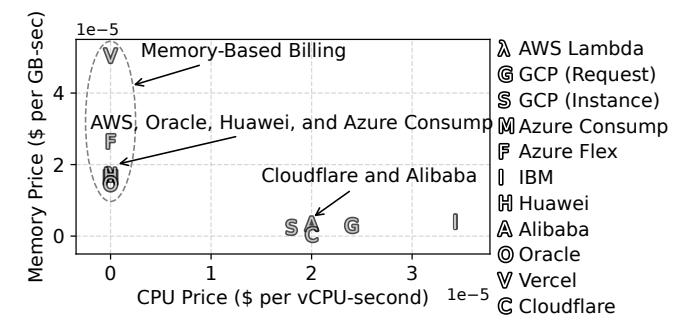

# Demystifying Serverless Costs on Public Platforms: Bridging Billing, Architecture, and OS Scheduling

Changyuan Lin University of British Columbia Yuanzhi Ma\* Johns Hopkins University Mohammad Shahrad University of British Columbia

### **Abstract**

Public cloud serverless platforms have attracted a large user base due to their high scalability, plug-and-play deployment model, and pay-per-use billing. However, compared to virtual machines and container hosting services, modern serverless offerings typically impose higher per-unit time and resource charges. Additionally, billing practices such as wall-clock time allocation-based billing, invocation fees, and usage rounding up can further increase costs.

This work, for the first time, holistically demystifies these costs by conducting an in-depth, top-down characterization and analysis from user-facing billing models, through request serving architectures, and down to operating system scheduling on major public serverless platforms. We quantify, for the first time, how current billing practices inflate billable resources up to 4.35× beyond actual consumption. Also, our analysis reveals previously unreported cost drivers, such as operational patterns of serving architectures that create overheads, details of resource allocation during keepalive periods, and OS scheduling granularity effects that directly impact both performance and billing. By tracing the sources of costs from billing models down to OS scheduling, we uncover the rationale behind today's expensive serverless billing model and practices and provide insights for designing performant and cost-effective serverless systems.

*CCS Concepts:* • Computer systems organization  $\rightarrow$  Cloud computing; • General and reference  $\rightarrow$  Measurement; • Software and its engineering  $\rightarrow$  Scheduling.

**Keywords:** Serverless Computing, Cloud Computing, Performance Measurements, Billing Models, OS Scheduling

#### **ACM Reference Format:**

Changyuan Lin, Yuanzhi Ma, and Mohammad Shahrad. 2026. Demystifying Serverless Costs on Public Platforms: Bridging Billing, Architecture, and OS Scheduling. In European Conference on Computer Systems (EUROSYS '26), April 27–30, 2026, Edinburgh, Scotland

\*Conducted the research while at The University of British Columbia.

This work is licensed under a Creative Commons Attribution 4.0 International License.

EUROSYS '26, Edinburgh, Scotland UK
© 2026 Copyright held by the owner/author(s).
ACM ISBN 979-8-4007-2212-7/26/04
https://doi.org/10.1145/3767295.3769374

*UK.* ACM, New York, NY, USA, 18 pages. https://doi.org/10.1145/3767295.3769374

### 1 Introduction

Serverless computing has become one of the mainstream cloud computing paradigms, enabling developers to quickly deploy scalable and event-driven applications on the cloud without needing to manage the underlying infrastructure [41, 50]. Major cloud providers offer serverless computing solutions, such as AWS Lambda [93], Google Cloud (GCP) Run functions [23], Azure Functions [12], IBM Cloud Code Engine [31], and Cloudflare Workers [33]. Serverless computing stands out as the purest existing pay-per-use cloud model, offering automated scaling—from zero to thousands of instances in seconds—and fine-grained billing. As a result, it is often advertised as cost-efficient [36, 43, 50, 92, 113].

The widely acknowledged benefits of serverless architectures—such as high scalability, fine-grained pay-per-use billing, freedom from infrastructure management, and seamless integration with other cloud services—are not without associated costs [44, 49, 110]. In terms of the per-unit resource price, serverless offerings are often priced higher than other cloud computing paradigms, such as virtual machines (VMs) and containers running on container hosting platforms. We demonstrate this by comparing the price of AWS Lambda functions, AWS EC2 VMs, and AWS Fargate containers, all configured on identical ARM-based hardware in the us-east-2 region. We specifically chose ARM due to the diverse and performance-varying nature of AWS's x86 processors, which complicates fair comparisons across services. An AWS Lambda function with 1 vCPU, 1,769 MB of memory, and 512 MB of ephemeral storage costs  $$2.3034 \times 10^{-5}$ per second [92], while a compute-optimized EC2 instance (c6g.medium) with 1 vCPU, 2 GB memory, and 1 GB storage and an AWS Fargate container with the identical resource allocation as EC2 cost only  $9.4753 \times 10^{-6}$  and  $1.1003 \times 10^{-5}$  per second, which are 41.1% and 47.8% of the AWS Lambda price. The cost of VMs can be further decreased by at least two times if using a burstable instance (e.g., AWS EC2 t4g. small flavor). Also, this comparison does not include the invocation fee of AWS Lambda, which is  $2 \times 10^{-7}$  for each request, whereas EC2 instances and Fargate containers do not charge request fees. Additionally, our analysis of billing practices on major serverless platforms uncovers significant over-accounting (§2), showing that users can be charged

for computing resources up to 4.35 times greater than their actual usage.

These observations motivate a fundamental research question: What makes serverless expensive? We argue that the root cause of the high unit prices and expensive billing practices in serverless lies in the architecture of modern serverless computing systems. Resource consumption and overhead incurred by the underlying runtimes and control plane for request serving, such as sandbox provisioning, isolation, request dispatch, and keep-alive, translate into higher per-unit charges passed on to serverless users. Additionally, some of our measurements of resource allocation patterns and performance behaviors on major serverless platforms point part of the execution costs and performance fluctuations to the underlying operating system (OS) scheduling mechanisms.

To uncover these costs, a detailed analysis of current billing models together with measurements of the underlying serverless systems is required. Previous studies have characterized major serverless platforms in terms of architecture, performance, and resource management [1, 40, 109, 114]. However, as serverless computing evolves rapidly and more serverless offerings become available, some earlier measurements do not reflect or fully capture the latest billing scheme and operation patterns (e.g., serving architecture and keepalive behaviors) of the public serverless computing platforms. In this work, we revisit some of the previous measurements and extend some of their performance and overhead characterization to fit modern serverless systems.

We adopt a top-down approach to analyze serverless costs. We start with user-facing billing models and conduct largescale trace analysis on the billing scheme. Then, we analyze the performance, overhead, and resource allocation patterns of modern serverless request serving architectures. Finally, we investigate the impact of OS scheduling in detail. By tracing sources of costs from the billing model down to kernel scheduling, we provide the first comprehensive decomposition of serverless overhead and reveal the rationale behind current billing practices. For example, our large-scale, tracebased billing model analysis reveals significant bill inflation due to wall-clock allocation-based billing (§2.3), turnaround time billing (§2.4), rounding up of resource usage and execution duration, coarse billing granularity, and high invocation fees (Table 1 and §2.5). Also, we investigate the dual penalty of slowdowns and higher bills stemming from the multi-concurrency model (§3.1), high overheads of the HTTP-based request serving architecture (§3.2), and details of resource allocation during keep-alive (§3.3). Furthermore, we reveal the widespread CPU overallocation issue on public serverless platforms for the first time (§4). Specifically, our main contributions include:

• We conduct a detailed analysis on the billing practices of current major serverless platforms (§2).

- We analyze and quantify the overhead of modern serverless systems from several new aspects, including the concurrency model, request serving architectures, and resource allocation behaviors during keep-alive (§3).
- We characterize and reveal the impact of OS scheduling granularity on major public serverless platforms (§4).
- We demystify the serverless billing practice through these new characterization results and analyses, and discuss implications (labeled with *I*) for designing future performant and cost-efficient serverless systems.

We have made our artifact publicly available1.

## 2 Serverless Billing Models and Practices

Pay-per-use is the common billing practice on serverless platforms. Billing models are the most direct determinants of the serverless cost as they convert billable resources (i.e., computing resources that are being billed for cloud users) into monetary charges that users immediately perceive. Billing models vary across platforms. In this section, we systematically deconstruct these billing practices to reveal how they shape the cost of serverless, reveal the underlying reasons for relevant billing practices, and discuss implications.

## 2.1 Overview of Serverless Billing Models

Table 1 summarizes the pay-per-use billing model on major serverless platforms listed in recent market reports [41, 77]. While definitions of billable resources, wall-clock time, and pricing vary across different serverless platforms, most public serverless platforms bill a function invocation based on four factors: (1) billable wall-clock duration, (2) resource allocation amount and/or actual resource consumption over billable duration, (3) billing granularity and/or minimum billing cutoffs, and (4) a fixed fee associated with each invocation, which can be generally modeled as:

$$Cost = \sum_{r \in R_{ALLOC}} \left\lceil \frac{ALLOC(r)}{G_r} \right\rceil \times G_r \times \left\lceil \frac{T}{G_T} \right\rceil \times G_T \times C_r + \sum_{r \in R_{MOC}} \left\lceil \frac{USG(r)}{G_r} \right\rceil \times G_r \times C_r + C_0$$
(1)

where T is the billable wall-clock time (e.g., wall-clock execution duration, turnaround time including initialization duration, or function instance lifespan),  $R_{ALLOC}$  is the set of billable computing resources that follow allocation-based billing (e.g., vCPUs, memory, GPU, and storage), ALLOC(r) defines the allocation amount of billable resources r over T,  $R_{USG}$  is the set of billable resources to which consumption-based billing applies (e.g., network bandwidths and consumed CPU time of Cloudflare Workers), USG(r) defines the absolute usage amount of billable resources r over T,  $G_r$  and  $G_T$  define the billing granularity of resource r and wall-clock time T for rounding up or minimum billing cutoff (e.g., 128 MB and

&lt;sup>1https://doi.org/10.5281/zenodo.17162822

| Serverless Platform                      | Billable Time     | Billable Resources*        | Billing Granularity/Cutoffs        | Control Knobs and Steps                   |
|------------------------------------------|-------------------|----------------------------|------------------------------------|-------------------------------------------|
| AWS Lambda [89, 92, 93]                  | Wall-Clock        | Allocated Memory           | 1 ms                               | Memory 1 MB                               |
|                                          | Turnaround Time** | Allocated Melliory         |                                    | (CPU proportionally allocated)            |
| Google Cloud Run                         | Wall-Clock        | Allocated Memory and CPU   | 100 ms                             | Memory 1 MB                               |
| (Request-Based Billing) [22, 23, 28]     | Turnaround Time   |                            |                                    | CPU 0.01 vCPUs (1st Gen)/1 vCPU (2nd Gen) |
| Google Cloud Run                         | Wall-Clock        | Allocated Memory and CPU   | 100 ms                             | Memory 1 MB                               |
| (Instance-Based Billing)*** [22, 23, 28] | Instance Time     | Allocated Melliory and CFO |                                    | CPU 1 vCPU                                |
| Azure Functions Consumption Plan         | Wall-Clock        |                            | 1 ms (min cutoff 100 ms) 128 MB | N/A                                       |
| [11–13]                                  | Execution Time    | Consumed Memory            |                                    | (Fixed resource size of                   |
| [11-13]                                  | Execution Time    |                            |                                    | 1.5 GB memory and 1 vCPU)                 |
| Azure Functions Premium Plan***          | Wall-Clock        | Allocated Memory and CPU   | 1 month                            | CPU and Memory                            |
| [10, 12, 13]                             | Instance Time     |                            | (minimum monthly cost applies)     | (Fixed Combos)                            |
| Azure Functions Flex Consumption Plan    | Wall-Clock        | Allocated Memory           | 100 ms (min cutoff 1 s)            | Memory (Either 2 GB or 4 GB)              |
| [8, 11, 12]                              | Execution Time    |                            |                                    | (CPU proportionally allocated)            |
| IBM Cloud Code Engine Function           | Wall-Clock        | Allocated Memory and CPU   | 100 ms                             | Memory (Fixed Combos)                     |
| [31, 45]                                 | Turnaround Time   | Anocated Mellory and Cr O  |                                    | CPU (Fixed Combos)                        |
| Huawei Cloud Function Graph [29]         | Wall-Clock        | Allocated Memory           | 1 ms                               | Memory (Fixed CPU-Memory Combos)          |
|                                          | Execution Time    |                            |                                    |                                           |
| Alibaba Cloud Function Compute           | Wall-Clock        | Allocated Memory and CPU   | 1 ms                               | Memory 64 MB                              |
| [17-19]                                  | Execution Time    |                            |                                    | CPU 0.05 vCPUs                            |
| Oracle Cloud Functions                   | Wall-Clock        | Allocated Memory           | Not Documented Publicly            | Memory (Fixed Combos)                     |
| [32]                                     | Execution Time    |                            |                                    | Memory (Fixed Combos)                     |
| Vercel Functions [106]                   | Wall-Clock        | Allocated Memory           | Not Documented Publicly            | Memory 1 MB                               |
|                                          | Execution Time    | Allocated Melliory         |                                    | (CPU proportionally allocated)            |
| Cloudflare Workers [33]                  | Consumed          | Consumed CPU               | 1 ms                               | N/A                                       |
|                                          | CPU Time          |                            |                                    | (Fixed resource size of 128 MB memory)    |

\*This table and related analysis in §2 focus on the most basic billable computing resources (i.e., CPU and memory). Other billable resources (e.g., storage, GPUs, and network bandwidths) may apply in practice. \*\*AWS bills wall-clock turnaround time that includes initialization duration starting August 2025 [48]. \*\*\*Instance-based billing applies, where platforms charge for resource allocation over the function runtime instance lifespan regardless of requests.

**Table 1. The billable models of major public serverless platforms.** The notion of billable time, billable resources, and billing granularity varies across different serverless platforms (as of 2025-05-15).

100 ms),  $C_r$  is the per-unit price of resource r, and  $C_0$  is the fixed invocation fee.

Depending on whether to use the whole function instance lifespan as the billable time, the billing model can generally be categorized into request-based billing (e.g., platforms other than the two listed with instance-based billing in Table 1) and instance-based billing (e.g., Azure Functions Premium Plan and Google Cloud Run with instance-based billing in Table 1). In request-based billing, each request is charged separately based on its execution duration (or turnaround time) and/or allocated/consumed resources during the billable period, while instance-based billing usually charges for provisioned resources on always-ready/scaled-out instances (resource allocation over instance lifespan) regardless of requests. On most platforms, users can enable instance-based billing by changing the billing setting or configuring provisioned concurrency, minimum instances, or scale-down delay for their functions [22, 90]. The fixed invocation fee  $(C_0)$  is usually not applied under instance-based billing.

Figure 1 illustrates the CPU and memory prices on major serverless platforms presented in Table 1, which shows that the per-unit resource prices are often very similar across platforms. Following the serverless versus non-serverless cost comparison discussed in §1, this consistency in high per-unit resource prices indicates that (*I1*) the high price of serverless computing is not the result of any single provider's billing strategy (AWS already offers some of the lowest per-unit resource prices).

Figure 1. Resource (i.e., vCPU and memory) prices on major serverless platforms discussed in Table 1. The per-unit vCPUs and memory prices are generally similar across serverless platforms (as of 2025-05-15).

