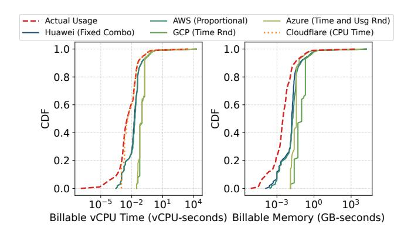
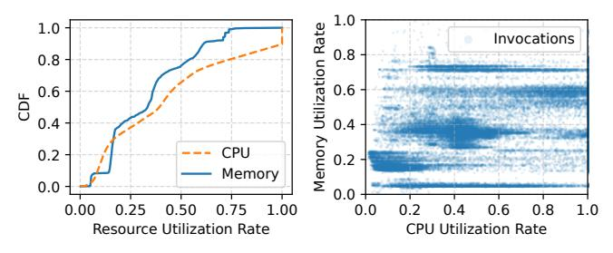
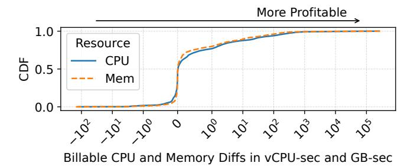
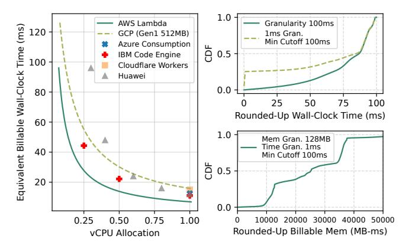
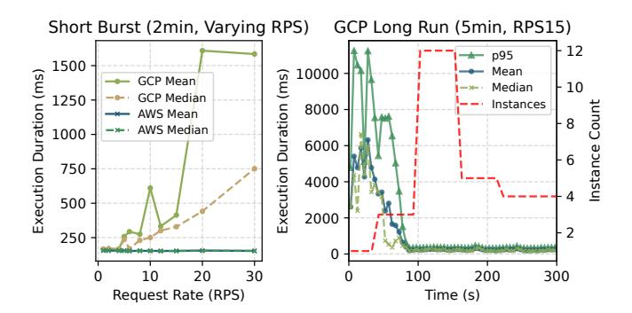
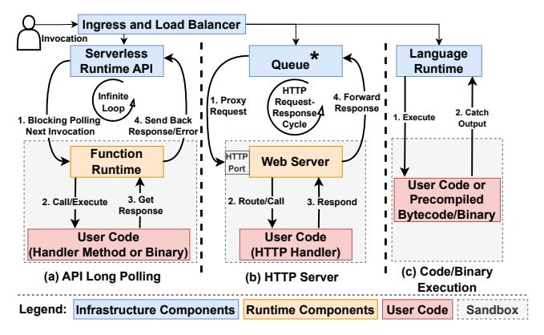
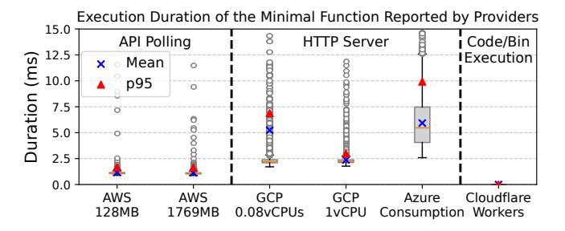

# 2.2 Coupled Control Knobs and Billable Resources

(12) Control knobs and billable resources are tied closely, but allocated resources are always billed directly or indirectly: The billable resources in serverless billing models are usually mainly defined by the available control knobs. Public serverless platforms usually bill the computing resources they expose to users as control knobs. For example, AWS Lambda, Vercel Functions, and the Azure Functions Flexible Consumption allocate vCPUs in proportion to the allocated memory size. Some platforms, such as Huawei Function Compute, Azure Functions Consumption, and Oracle Functions, offer only a fixed set of memory sizes or fixed vCPU-memory pairs, rather than fine-grained configurations (e.g., per-MB memory configuration). In these cases, billing often appears to be based solely on memory

allocation/usage, but the cost of CPU is embedded implicitly within the memory price. For instance, an AWS Lambda function with 1,769 MB of memory (which corresponds to 1 vCPU [89]) incurs a charge of  $$2.8792 \times 10^{-5}$  per second, while a GCP function (first generation with request-based billing) provisioned with 1 vCPU and 1,769 MB of memory costs  $$2.8319 \times 10^{-5}$  per second. The price per GB-second of memory on the platforms that mainly expose and bill memory control knobs usually closely matches what one would pay for memory and CPU on platforms that allow separate CPU allocations. Also, the ratio between the unit prices of CPU (in vCPU-seconds) and memory (in GB-seconds) on GCP, AWS Fargate (a container hosting platform that bills CPU and memory separately) [91], and IBM Cloud Code Engine (function workloads) lies in a narrow range between 9 and 9.64, indicating a broad industry consensus on the relative value of vCPU versus memory.

On serverless platforms where vCPU and memory settings are relatively decoupled, CPU and memory are typically billed as two separate resources. However, even these platforms impose limits on how finely resources can be tuned. For example, Alibaba Cloud requires the ratio of vCPU to memory (in GB) to remain between 1:1 and 1:4, with step sizes of 0.05 vCPUs and 64 MB of memory [19]. Similarly, GCP imposes a minimum CPU allocation on the configured memory size (e.g., allocated memory of 512 MB must be configured with at least 0.333 vCPUs) [25]. These constraints on resource control knobs usually reflect an underlying function placement challenge: highly unbalanced CPU-to-memory combinations can fragment the resource capacity on host servers, potentially leading to higher deployment costs; e.g., through decreased deployment density [16, 68], or higher scheduling delay waiting for placement [53, 84].

#### 2.3 Inflation of Billable Resources

(I3) Billable resources are greatly inflated under wallclock time allocation-based billing: Understanding the amount of billable resources under different billing models is critical to evaluating the cost of serverless platforms. To measure how much billable resources users pay on public serverless platforms, we analyze 558.74 million2 requests from the Huawei serverless trace (Huawei Public request tables) [51, 53] and compute the billable vCPU time and the billable memory resources of each request under the billing models presented in Table 1. To avoid distortions from differences in per-unit prices on different platforms (however, they are mostly similar as discussed in §2.1), we report raw billable resources rather than cost in dollars. Figure 2 shows the distribution of these billable vCPU times and memories across requests under several representative billing models and resource allocation patterns, including proportional

**Figure 2. Billable resources under different billing models.** The billable resources can be multiple times higher than actual consumption on major serverless platforms.

vCPU allocation (AWS Lambda), fixed vCPU-memory combinations (Huawei), wall-clock duration and resource usage rounding (GCP and Azure), and usage-based billing (Cloudflare Workers). As discussed in §2.2, CPU pricing is usually embedded for platforms with memory-based billing. Therefore, we include billable vCPU time for AWS.

The gap between billed and actual resource usage quantifies the degree of inflated billable resources on current serverless platforms. Our analysis reveals that, under current models, billable vCPU time exceeds actual CPU usage by a factor of 1.01× (Cloudflare) up to 3.63× (GCP) on average, and billable memory exceeds real memory use by 1.57× (Azure) up to 4.35× (GCP) on average, among which usage-based billing (Cloudflare billable CPU and Azure billable memory) shows the lowest inflation. While differences in unit pricing shift the curve horizontally, these ratios remain the same (we do not compare absolute costs across platforms). Also, when mapping Huawei's reported vCPU and memory allocations to AWS, we choose the larger of the two values to match its proportional vCPU allocation, which makes AWS billable resources slightly higher than Huawei.

One of the major driving factors of inflated billable resources is allocation-based wall-clock time billing. Even AWS, with one of the finest billing granularities (i.e., 1 ms), charges billable vCPUs and memory, 2.49× and 2.72× higher than actual consumption on average. Functions rarely consume their full resource allocation [52, 75], and wall-clock time includes periods when functions hold resources but remain idle or use little (e.g., blocking on remote API calls). Figure 3 illustrates resource usage relative to allocations. More than 65% of requests use less than 50% of the allotted CPU, and around 76% of requests use less than half of the allotted memory. The scatter plot of CPU and memory utilization shows a Pearson correlation of 0.552 and a Spearman correlation of 0.565, which is slightly smaller than the value reported on serverless traces of Huawei private cloud (i.e., 0.6) in 2023 [52]. The moderate Pearson correlation suggests that the linear relationship is not strong, indicating that decoupling vCPU

&lt;sup>2The Huawei trace contains over 947.97 million requests. We exclude the requests reporting zero CPU usage or missing valid pod IDs/flavors.

Figure 3. Resource utilization rate distributions and their correlations. Huawei serverless traces [51, 53] show that serverless functions usually have low utilization of allocated resources. Billable resources are further inflated by inflexible resource control knobs as no strong linear relationships between CPU and memory utilization rates exist.

and memory configurations is crucial for reducing inflated costs. Inflexible allocations (e.g., proportional/linear) force developers to over-provision one resource to satisfy another bottleneck [15, 107].

Although usage-based billing offers the lowest inflation in billable resources, it currently faces limitations and has not gained widespread adoption across providers. Cloudflare Workers is the only platform we studied that bills only on actual CPU time and aligns well with the actual CPU usage. However, it caps code artifacts at 10 MB and memory at 128 MB. This is mainly designed for small, short, singlethreaded JavaScript or WebAssembly (Wasm) tasks (under 1-2 ms) running on the V8 engine within their content delivery network (CDN) [4, 34, 35], rather than general serverless workloads. Note that we do not argue that billing solely on the absolute amount of consumed resources is the only valid model in serverless computing. This is because resource allocation tied to wall-clock time, particularly for resources like memory (which is risky to overcommit [102]), significantly impacts function scheduling and deployment density. An ideal pay-per-use billing model is one that tracks real usage, exhibiting a perfect positive correlation statistically. There have been recent studies that aimed to move towards this ideal direction through dynamic or cooperative scheduling, or new billing models [16, 73, 81, 116].

## 2.4 Turnaround Time Billing and Cold Starts

(I4) Billing on wall-clock turnaround time has become a common practice to compensate for the initialization phase: The serverless runtime sandbox lifecycle typically consists of initialization (cold start), request execution, keepalive, and shutdown (e.g., SIGTERM handling) [72, 94]. Depending on whether the initialization duration is included, serverless providers usually define billable wall-clock time as either execution time or turnaround time (i.e., execution time plus initialization) in their request-based, pay-per-use billing models. Besides billing based on execution time and

**Figure 4.** The differences between the billable CPU and memory resources consumed during request execution and those during initialization.

turnaround time, users may customize provisioned concurrency, minimum instances, or scale-down delay, and pay for the whole runtime instance lifespan (i.e., instance time) on most platforms. Such instance time billing can further increase billable resources under bursty traffic patterns since scale-down-to-zero is delayed or disabled, and instance idle time is billed. We observe that billing based on turnaround time has become increasingly popular on major platforms: GCP and IBM explicitly state that they charge for the turnaround time [28, 45], while AWS recently updated its billing model to include the initialization phase (cold start delay) starting August 2025 [48].

Our analysis of cold start resource usage helps explain why providers favor turnaround time billing. We analyze 388,955 traceable cold starts from the Huawei serverless traces [51, 53]. For each cold start, we consider the duration spent on the initialization of the runtime sandbox and the resource allocation. We compute the difference between the billable resources (measured in wall-clock resource allocations) consumed during cold start and the sum of billable resources used by all subsequent requests within the sandbox. A negative difference means the cold start alone consumed more billable resources than all later requests combined. Figure 4 quantifies, for the first time, such relative resource cost of cold starts compared to subsequent executions on production systems, which shows that 42.1% of cold starts produce a zero or negative difference. In other words, under a billing model based on purely execution duration of requests, providers would charge less (or the same) for request execution than the actual cost of the initialization phase in about 42.1% of cold start cases.

To avoid this revenue gap, it is a natural choice for providers to include initialization delay in the billed duration, i.e., to bill on turnaround time, which also captures variation in initialization delays (and wall-clock-based resource usage) across functions with different language runtimes and dependency requirements. Also, providers may impose additional billing components to offset cold start costs, such as a fixed perinvocation fee and minimum billing cutoffs for billable time and resources, which we further discuss in §2.5. Additionally, the results also show that a small portion of functions exhibit

**Figure 5.** The equivalent billable wall-clock time of invocation fees (left) (as of 2025-05-15) and the rounded-up amount of billable wall-clock time and memory (right).

a long tail of negative resource differences, indicating that turnaround-time billing can substantially increase the cost of these functions.

### 2.5 High Invocation Fee and Expensive Rounding Up

Major serverless platforms charge a fixed fee per invocation, typically between \$1.5 \times 10^{-7} and  $$6 \times 10^{-7}$  per request [17, 92, 106]. Although these amounts seem small, they can add up disproportionately when functions run for very short durations or use minimal resources. For example, on AWS Lambda, a fixed invocation fee of  $$2 \times 10^{-7}$  is equivalent to 96 ms of billable wall-clock time for a function with the default 128 MB memory configuration, which exceeds the average execution durations reported in the Huawei traces (i.e., 58.19 ms) [53]. Figure 5-left shows how invocation fees convert to equivalent billable wall-clock time across different platforms. Besides invocation fees, several platforms apply coarse billing granularity (minimum billing increments) or cutoffs.

The charts on the right in Figure 5 present the inflated billable time and memory usage under different billing granularities for 527.05 million requests with execution times of at least 1 ms in Huawei traces [51, 53]. For a 100 ms billing granularity (e.g., GCP and IBM), the average rounded-up wall-clock time is 77.12 ms, while for a 1 ms granularity with a 100 ms minimum cutoff (e.g., Azure Consumption), the average rounded-up wall-clock time is 61.35 ms. When billing memory with a 128 MB granularity (e.g., Azure Consumption), the average rounded-up billable memory is  $2.67 \times 10^{-2}$  GB-seconds. These values are on the same order of magnitude as the average execution durations and billable memory amounts reported in the studied serverless traces (58.19 ms and  $2.75 \times 10^{-2}$  GB-seconds).

Therefore, our analysis shows that (15) invocation fees are high, and together with billing granularity, they can cause disproportionate costs for short, small function invocations. These extra costs may not be explained

only as a way to offset resource usage during the initialization phase (cold start), since providers that bill for turnaround time still charge the invocation fee. They may further be linked to overheads in the serving architecture and OS scheduling, which we analyze further in §3 and §4.

## 3 Hidden Cost of Serverless Serving Architecture

Serverless computing platforms usually abstract away low-level infrastructure details. However, the overhead of the underlying serving layer directly affects how providers schedule and run serverless workloads and at what cost. These are passed on to the users as the billing model and pricing parameters. Therefore, studying serverless serving architectures is key to understanding serverless computing costs. In this section, we analyze the serverless runtime of major serverless platforms, run benchmarks on major platforms to quantify the costs that remain hidden in the serving layer, and discuss their implications on cost.

### 3.1 Cost Implications of the Concurrency Model

Serverless platforms vary in how they map concurrent requests to sandboxes. Depending on the maximum number of concurrent requests allowed per sandbox, there are two common serving models: the single-concurrency model, in which the concurrency limit is strictly one (i.e., no intra-runtime concurrency), and the multi-concurrency model, where the concurrency limit can be greater than one.

In the single-concurrency model (e.g., AWS Lambda and Cloudflare Workers), each sandbox accepts only one request at a time. When a request arrives, the serverless platform allocates a new runtime sandbox or reuses a warm, idle sandbox for the request. As there is no resource competition (e.g., CPU and memory) among concurrent requests, this can help keep the execution duration consistent even under high load.

Under the multi-concurrency model, multiple requests can enter and be executed within the same sandbox concurrently, if the user code supports concurrency. Platforms using this model usually allow users to set the maximum concurrency per sandbox and concurrency-based scaling policies. However, (16) if the extra control knob on concurrency is not configured properly, multi-concurrency can degrade function performance while increasing cost since resource contention (e.g., CPU, memory, and cache) slows down all concurrent requests and increases billable wallclock time (e.g., execution time) under request-based billing. For example, running two CPU-bound requests, each requiring 1s of CPU time, together in a sandbox with 1vCPU doubles the execution duration of each request to 2 s, thus doubling billable resources as well. In practice, such slowdowns stemming from resource contention are often worse due to context switch overhead and cache misses [96].

To show how concurrency models affect performance and cost, we deploy the same compute-intensive function (PyAES from Functionbench [62]) on AWS Lambda and GCP with 1 vCPU allocation. Each request takes about 160 ms of CPU time. We use the default concurrency configurations (i.e., limit of 80) and scaling policy (60% CPU utilization target and concurrency-based scaling [20]) on GCP. At various request rates (in RPS), we send bursts of requests for 120 s to simulate a short traffic spike. The plot on the left in Figure 6 presents the average execution duration reported by providers. AWS maintains a stable execution time at all request rates due to dedicated sandboxes without resource contention. The average execution time (and cost) of the function deployed on GCP rises by up to 9.65× when the request rate is higher than 6 RPS.

Longer traffic logs reveal a key caveat of multi-concurrency models: it takes time to gather scaling metrics to scale instances to match demand. We send a steady traffic of 15 RPS to the GCP function for 20 minutes. The plot on the right in Figure 6 shows the first five minutes (later data remains stable) of execution time and container count reported by GCP. Scaling does not begin until about 40 s. This is likely due to the fact that platforms with the multi-concurrency serving model usually aggregate the scaling metrics over a time window (e.g., 60 s by default in Knative [65]) to avoid oscillation [6]. The execution duration and instance count remain stable after around 90 s, but the average duration is still 1.43 times higher (i.e., 239.29 ms versus 166.78 ms) than that under the RPS of 1 due to resource contention.

Such a dual penalty of slowdowns and higher bills stemming from the multi-concurrency model is particularly concerning, given that a recent characterization study reports that 93.3% of serverless workloads on IBM Cloud Code Engine used Knative's default container concurrency of 100 as the limit [63, 79]. This suggests that most users either do not optimize, or might be unaware of concurrency settings, highlighting the critical need for relevant control knob tuning tools and concurrency optimization guidance from cloud providers.

### 3.2 Request Serving Architecture Overhead

Figure 7 depicts three common request serving architectures on major serverless platforms. In the runtime API long polling model (e.g., AWS Lambda [95]), the user provides a handler method (non-HTTP) or a binary executable for processing requests. A runtime program (usually offered by providers) runs inside the sandbox and repeatedly polls the runtime API endpoint over HTTP or RPC in a blocking infinite loop. The retrieved request event is processed by the handler, and the result is posted back to the runtime API before the next poll. In the HTTP server model (e.g., Azure, GCP, IBM, and Knative [7, 26, 30, 64]), the function itself runs an HTTP server on a given port, with the user logic

**Figure 6. Function execution durations under varying request rates.** The multi-concurrency serving model can lead to non-linear slowdowns and increased costs under high concurrency, mainly due to delays in scaling the number of sandboxes to match the incoming request load.

\*The queue can be a runtime component as it can be located within the same scaling unit (e.g., pod) or sandbox (e.g., container) and be dedicated to each function instance on some platforms (e.g., GCP, IBM, and Knative).

Figure 7. The three mainstream serverless request serving architectures, including (a) API long polling (e.g., AWS Lambda), (b) HTTP server (e.g., Azure and GCP), and (c) code/binary execution (e.g., Cloudflare Workers).

wrapped in an HTTP handler. The queue (e.g., usually running in a sidecar container) that receives the request from the ingress acts like a reverse proxy and forwards requests to the HTTP server. In the code/binary execution architecture (e.g., Cloudflare Workers), the user uploads a code block or precompiled binary (e.g., Wasm modules [35]). For each request, the language runtime engine (e.g., V8 JavaScript engine) compiles and executes (JIT) or loads and executes the binary, captures the output, and sends back the response.

Each serving architecture has its own benefits. The API polling architecture can avoid exposed ports and simplify the concurrency models by serializing event handling in each sandbox, while the HTTP server model natively supports rich HTTP semantics. Lastly, the code/binary execution architecture generally requires minimal runtime dependencies and artifacts.

Figure 8. Execution durations of the minimal serverless function across platforms with different serving architectures. The functions with HTTP servers have the highest overhead, while code/binary execution has the smallest

To quantify the overhead of these architectures, we deploy a minimal serverless function that simply returns an empty string and status code across major platforms. We measure the execution duration of the minimal function that encapsulates pod-/container-level system software. Figure 8 presents the execution duration of the minimal function reported by the providers, which reflects the latency added by the request serving architecture, such as polling request events, HTTP routing, and sending back responses. Our measurements reveal that (I7) platforms using the HTTP server architecture (i.e., GCP and Azure) usually have notably higher overhead, compared to API polling and code/binary execution architectures, with an average latency up to 5.93 ms. This added latency can impact short functions or round the billable time up to the next interval.

This is due to that functions with the HTTP server model usually host standard HTTP servers as the upstream of the ingress, queue, and/or load balancer, which add overheads, such as maintaining HTTP listeners, connections, thread pools, and handler routing. Also, requests usually traverse additional middleware (e.g., queues, ingress, and/or service mesh sidecars) across containers and veth devices, adding latencies [21, 27, 40, 117]. The resource configuration may also affect such overhead (i.e., GCP 0.08 vCPUs vs GCP 1 vCPU), as the HTTP request-response cycle and HTTP server involve CPU-bound tasks (e.g., header and payload parsing, encoding, and serialization), and a lower CPU allocation can slow these operations. The AWS Lambda functions that use long polling maintain a stable overhead of around 1.17 ms on average. Cloudflare Workers delivers near-zero latency (falling below the precision limit of 0.01 ms reported by Cloudflare), suggesting the high efficiency of the code/binary execution architecture.

