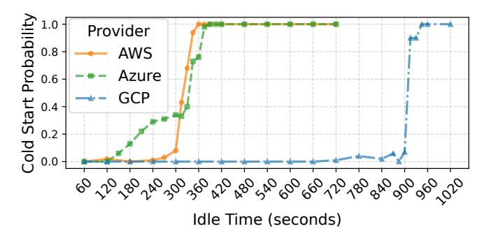

# 3.3 Keep-Alive Duration and Resource Allocation Patterns

Cold start is one of the main causes of performance degradation in serverless functions, and keep-alive has become a common practice to mitigate the cold start latency [97].

**Figure 9. Cold start probabilities versus function idle times.** The probabilities of having cold starts increase as the function sandbox idle time becomes longer. The keep-alive durations vary across platforms (as of 2025-05-15).

Major serverless providers keep the user function sandbox active for a period after each request to reduce the chance of cold starts for subsequent invocations. Common keep-alive mechanisms include scale-down delay (e.g., Azure Consumption Plan, GCP, and IBM) [20], container snapshotting [66], code caching (e.g., Cloudflare Workers) [80], and runtime freezing (e.g., AWS Lambda) [94]. Function keep-alive has a direct impact on provider cost, as idle functions can hold active resources (e.g., memory) or reserved capacity (for some schedulers), affecting deployment density. Even techniques that deallocate CPU and memory during the keepalive phase, such as snapshotting, freezing (e.g., microVM pause), and caching, require CPU time for processing snapshots and cache/storage space. These costs are ultimately passed on to users through per-unit resource pricing or invocation fees.

We deploy serverless functions on major serverless platforms and analyze the keep-alive durations as well as the underlying keep-alive mechanisms. We send requests at different idle intervals to check whether the sandbox is re-created and empirically measure the keep-alive duration. The idle interval is the duration between the end of the previous invocation and the arrival of the next. Figure 9 presents the probability of a cold start as a function of the sandbox idle time, calculated over 100 data points per idle interval. The results show that AWS Lambda keeps the function sandbox alive for up to 300 to 360 s. Azure is likely to use an opportunistic keep-alive strategy, resulting in varying keep-alive durations between 120 s and 360 s. Also, Azure pre-warms the function if the platform detects cold starts occurring at regular intervals (i.e., through idle time histograms) [3, 98]. However, we did not observe such behavior in our experiments, despite regular traffic patterns, as we encountered consistent cold starts at high idle times. This is probably due to the test period being too short for Azure to learn traffic patterns [97]. Besides, Azure may further increase the keepalive duration for functions with higher traffic and that have been scaled up to multiple instances. We observe a maximum

| Serverless Platform                  | Keep-Alive Phase Behavior                     | Graceful Shutdown after Keep-Alive                                |
|-----------------------------------------|--------------------------------------------------|----------------------------------------------------------------------|
| AWS Lambda                              | Deallocate CPU and memory (Freeze and Resume) | Supported with Lambda Extensions (wait for SIGTERM handling) [87] |
| GCP Function (Request-Based Billing) | Scale down CPU (to about 0.01 vCPUs)          | N/A (kill without SIGTERM)                                        |
| Azure Function (Consumption)         | Run as usual                                     | N/A (kill right after SIGTERM)                                    |
| Cloudflare Workers                      | Code/Bytecode Cache                              | N/A                                                                  |

**Table 2.** The resource allocation behavior during keep-alive varies across platforms (as of 2025-05-15).

keep-alive duration of around 740 s for the Azure function that has scaled up to 3 instances. In contrast, GCP has the longest keep-alive duration, with the most instances being kept alive for about 900 s. Compared with the data reported in 2018 (e.g., AWS Lambda usually kept functions alive for up to 27 minutes) [109], our observations reveal that (*I8*) keep-alive durations on current serverless platforms still vary but have become shorter than previous measurements, possibly reflecting opportunistic strategies or measures for cost savings.

To examine resource consumption during keep-alive, we run CPU profiling workloads (i.e., Algorithm 1 discussed in §4) and empirically measure the CPU resources available to sandboxes during the keep-alive phase. Table 2 summarizes the resource allocation patterns of the function sandbox during keep-alive and its graceful shutdown behavior when exiting the keep-alive phase and being terminated across platforms. (19) The resource allocation behavior during keep-alive varies across platforms, and so do its performance and cost implications for serverless providers and users.

AWS freezes the sandbox (e.g., puts the microVM to sleep) and resumes it when a new request arrives [61]. Therefore, no active CPU or memory resources are allocated during keep-alive. On GCP, CPU allocation is dynamically scaled down to around 0.01 vCPUs during keep-alive and is scaled back up to the user-configured level when requests arrive within the keep-alive window. Both AWS and GCP deallocate or scale down resources during keep-alive, which naturally saves cost. In contrast, Azure appears to make no change to CPU and memory allocation during keep-alive, which may explain its shorter, opportunistic keep-alive period that reflects a trade-off between resource use and cold start probabilities. Cloudflare pre-warms functions on receiving the TLS handshake before the connection establishment, which can mask the very short loading and JIT compilation latency (e.g., around 5 ms) in case of cold starts [80].

The keep-alive duration and behaviors can directly affect function performance and user costs. A longer keep-alive period can help reduce user costs on platforms that charge based on turnaround time, which includes the cold start latency. Also, keeping resources and sandboxes active during keep-alive (e.g., Azure and GCP) can enable the execution of background tasks and increase the probability of reusing

long-lived, persistent connections. Deallocating resources (e.g., AWS and Cloudflare) may cause remote servers to close connections when they stop receiving heartbeat packets, adding overhead and cost when connections must be reestablished. Furthermore, Azure maintains full resource allocation during keep-alive, enabling user-created background tasks to run outside the request execution window. Since Azure Consumption is billed on memory consumption during request execution, resource consumption during keepalive is not billed (although background tasks can still affect billable wall-clock time and memory usage during request executions due to resource contention) [118]. This may provide opportunities for users to exploit resource allocation. For example, a short request can start a background task running in another thread or coroutine. The background task can send results to other cloud services (e.g., block storage) or remote endpoints after completion, or a subsequent request can retrieve those results. We have successfully implemented this execution pattern on Azure. By doing so, only one or two brief requests are billed, which can substantially reduce overall cloud costs.

