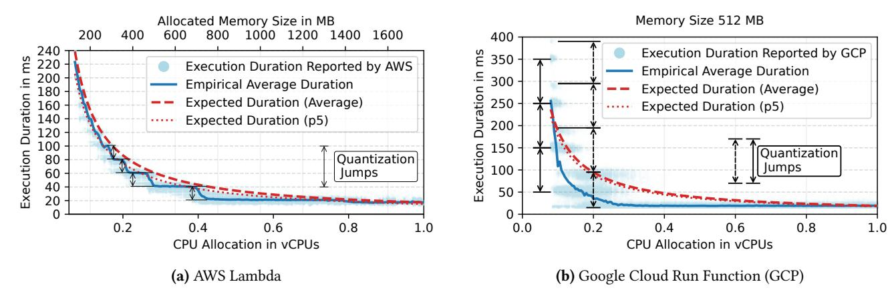
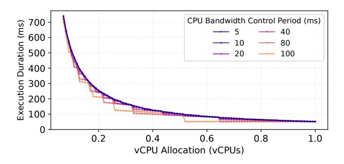
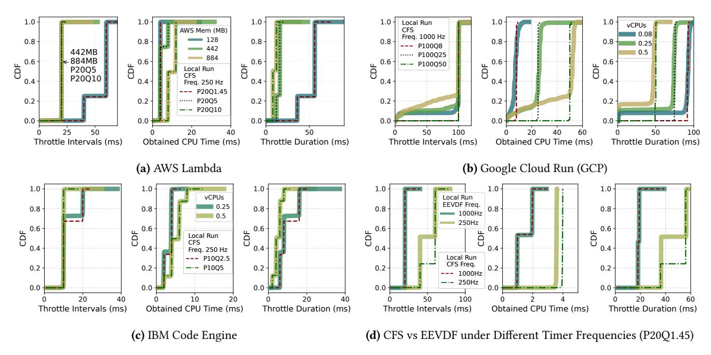

# <span id="page-8-0"></span>4 Impact of OS Scheduling on Performance and Cost

Serverless has a high degree of co-tenancy on servers compared to traditional VM hosting environments [38, 96]. In this environment, the OS kernel plays a crucial role in enforcing resource isolation and fair allocation across workloads with varying limits from different tenants. Common approaches involve fairness-oriented schedulers (e.g., CFS and EEVDF) and control groups (cgroups) for CPU bandwidth control and resource isolation. We observe that when the execution time of a function, the required CPU time, and the billing granularity all fall within the same range as the OS timer tick, scheduling can significantly impact performance and costs. For the first time, we carefully characterize and understand these effects on public serverless platforms.

### <span id="page-8-2"></span>4.1 Overallocation on Public Serverless Platforms

We deploy a single-threaded, compute-bound serverless function (PyAES from Functionbench [62]) on AWS Lambda under memory sizes ranging from 128 MB (minimum size) to 1,769 MB, and on GCP (first generation is used due to its support for fractional vCPU allocation) under CPU configurations ranging from 0.08 (minimum size) to 1 vCPU. AWS Lambda allocates vCPUs proportionately to the configured memory size, with 1,769 MB equivalent to 1 vCPU [89, 115], while GCP provides a fine-grained CPU control knob with a 0.01 vCPUs increment [24]. Figure 10 shows the execution duration reported by the serverless platform with 900,000 samples in total under different CPU configurations. We make two main observations based on these real-world execution logs.

<span id="page-9-0"></span>

**Figure 10. Function execution durations and varying fractional CPU allocations.** The difference between the ideal (expected) and actual execution duration shows CPU overallocation for functions hosted on major serverless platforms. GCP logs show two sets of quantization jumps, which may be the cause of CPU scaling down/up when entering/exiting keep-alive phases (§3.3).

First, a single-threaded, CPU-bound workload like PyAES with a fractional vCPU allocation should experience a slow-down of  $\frac{1}{\text{vCPUFraction}}$  that follows reciprocal scaling (i.e., half the core allocation, double the execution time). However, the empirical average (solid blue line) is consistently less than the expected average duration (dashed red line) on AWS and GCP (except for a few of the smallest vCPU allocations on GCP). The expected average and expected 5th percentile shown in the figure are based on measurements at full vCPU allocations, scaled proportionally for smaller resource allocations. In other words, a function can ask for, say, half the resources, but be less than twice as slow. In cost terms, this means that users may be charged less than expected under the current wall-clock time billing models presented in Equation (1).

Second, the average empirical execution duration does not have a smooth, reciprocal decline with increasing resource allocations. Instead, it falls with sudden drops, which become less frequent at higher resource allocations. These sudden drops create considerable performance jitters. Also, this means that the allocation-based component in the billing model (i.e.,  $R_{ALLOC}$  in Equation (1)), also known as the capacity cost, can be reduced by choosing smaller resource limits. We observed this pattern in other functions too, and it is more pronounced with increased compute-boundness.

The performance patterns shown in Figure 10 give us clues into what might be going on. Reducing the resource allocation of the AWS Lambda function from 1 vCPU at first does not affect the performance of the function, but suddenly there are increases at slightly above 1400 MB, 700 MB, 470 MB, 350 MB, 280 MB, and so on. These follow a scaled harmonic sequence: ~1400 ×  $\{1, \frac{1}{2}, \frac{1}{3}, \frac{1}{4}, \frac{1}{5}, ...\}$ . This discrete  $\frac{1}{n}$  sequence suggests the presence of a quantization effect,

rather than the continuous proportional allocation  $(\frac{1}{x})$  initially expected. Namely, the function is sometimes given more than it is supposed to receive, since the underlying CPU allocation units are quantized, causing jumps on the performance curve. As an analogy, if you want 2 kg of sugar and it is sold in 1 kg packs, the seller gives you two packs. However, if you ask for 1.5 kg, the seller would still need to give you 2 packs, leaving you with an extra 0.5 kg (i.e., overallocation). We observe the same quantization-based overallocation on major serverless platforms.

### <span id="page-9-1"></span>4.2 Quantized OS Scheduling

By default, the Linux kernel leverages the Completely Fair Scheduler (CFS) or the Earliest Eligible Virtual Deadline First (EEVDF) scheduler (default scheduler since Linux kernel 6.8) to allocate resources in a fair or latency-sensitive manner [39]. The scheduler generally provides each runnable process with a baseline allocation of resources (e.g., CPU time slice), ensuring that it receives at least one opportunity to execute on the processor. It also incorporates mechanisms like CPU Bandwidth Control [104] and cgroups [55] to impose resource limits and provide resource isolation. Such mechanisms have become the foundation of resource isolation and allocation in the sandboxing solutions widely deployed in serverless, such as containers [5, 70], microVMs [2], and Wasm [99]. Our observations in §4.1 are the results of the existing allocation slices in the OS scheduler and cgroups, which seem to be coarse-grained for increasingly short serverless functions, causing issues with cost fairness and performance variability.

The OS maintains a kernel data structure (cfs\_bandwidth) for bandwidth control of each cgroup (task\_group), which includes information such as the enforcement period (CFS)

period), runtime quota (CFS quota) within each period, remaining runtime available for use (global runtime pool) protected by a spinlock, as well as the throttled run queue [58]. Note that the newer Linux kernels with the EEVDF scheduler use a similar interface and kernel data structure for CPU bandwidth control as CFS. Therefore, the CFS period and quota we discuss in this section also apply to kernels with the EEVDF scheduler. For the rest of the section, we refer to them as (CPU bandwidth control) period and quota.

A high-resolution timer (hrtimer) is registered with a callback [56] to refill the global pool with the quota once per period. Each logical CPU core within the cgroup has a local pool of available runtime for per-CPU-basis runtime accounting. During runtime accounting (e.g., at scheduler ticks or context switches), the consumed runtime is subtracted from the local pool for processes running on a core within the cgroup. When the local pool runs out of runtime, it attempts to acquire more (the smaller of sched\_cfs\_bandwidth\_slice [54] or remaining runtime) from the global pool. If both the global and local pools are exhausted, processes on the core are throttled and moved to the throttled run queue. When the global pool is refilled to have available runtime in the new period (hrtimer callback), the scheduler distributes runtime among throttled run queues and unthrottles them (i.e., marks them as eligible to be scheduled again). Under this schema, the wall clock duration of a CPU-bound process can be calculated as:

<span id="page-10-1"></span>
$$d = \begin{cases} \left| \frac{T}{Q} \right| \times P + T \mod Q & \text{if } T \mod Q \neq 0, \\ \left( \left| \frac{T}{Q} \right| - 1 \right) \times P + Q & \text{otherwise} \end{cases}$$
 (2)

Here, d is the execution duration, T is the required CPU time, P is the period, and Q is the quota. The scheduler tries to limit the CPU utilization of tasks under CPU bandwidth control to Q/P. Figure 11 shows the execution durations derived by Equation (2) for a CPU-bound workload with a CPU time of 51.8 ms (the average value<sup>3</sup> in Huawei serverless traces [51, 53]) under different periods from 5 ms to 100 ms and the quotas mapped by varying fractional vCPU allocations. These periods are in the same scale compared to those we found empirically (shown later in §4.3). With longer periods, the quantization effect becomes more pronounced. As periods decrease, the execution duration converges to the ideal execution duration following reciprocal scaling.

The model above does not account for the fact that the runtime accounting and throttling mechanisms cannot operate with infinite frequency or precision due to excessive overhead (e.g., handling hrtimer interrupts [85]) in realworld systems. Since the scheduling tick frequency is usually between 100 and 1,000 Hz (CONFIG\_HZ) [82, 86], runtime accounting and task group throttling is often delayed, especially with the relatively long scheduler tick frequency (e.g., 250 Hz or less). Therefore, a task may often consume

<span id="page-10-0"></span>

**Figure 11. Theoretical execution durations under fractional CPU allocations.** Shorter CPU bandwidth control periods improve degradation proportionality for sub-core allocations.

runtime more than the quota within a period (overrun) due to lagged accounting, resulting in a negative runtime in the local pool [105]. In this case, the task may be throttled for one or more periods to wait for the quota refill and pay back the runtime debt. For example, consider a CPU-bound task within cgroup with 1.45 ms quota over 20 ms period (i.e., 0.072 vCPU allocated to AWS Lambda with 128 MB memory) and tick interval of 4 ms (250 Hz). A possible scenario is that it first gets 4 ms CPU time and is throttled for 36 ms (rest of the first period and the whole second period) and becomes eligible to run again in the third period (after 40 ms). Then, the task runs another 4 ms after the quota is refilled, causing overrun again with more debt, and is throttled for 56 ms until 100 ms and so on. This task repeatedly alternates between running for 4 ms and being throttled for long periods (i.e., 36 ms or 56 ms) over multiple periods due to overrun and lagged accounting.

Modern kernels often run with the tickless mechanism, with less frequent scheduling interrupts under light loads [59, 100]. Also, scheduling decisions and runtime accounting do not occur only at scheduler ticks. Events like voluntary context switches or interrupts (e.g., hrtimer) can also trigger accounting, rescheduling, or preemption. This can lead to variations in runtime allocation and throttled duration. Overrun issues marginally impact long tasks as the OS scheduler ensures fairness over time, but can significantly affect short tasks. However, a defining feature of serverless is the short execution for the majority of requests [52, 53, 97]. Therefore, even without the aforementioned overrun effect, CPU overallocation can still happen if a serverless workload is shorter than the CPU bandwidth control enforcement period. For example, a task that requires 10 ms CPU time running within a cgroup with a 20 ms period of a 10 ms quota is allowed to consume 100% of the CPU during its brief execution, regardless of the configured limit of 0.5 vCPUs. For relatively long tasks that span multiple periods, such overallocation can still happen within the last period before the task is finished. I/O-bound tasks are usually blocked, usually not using CPU while waiting for I/O (e.g., epoll\_wait()). However, when

<span id="page-10-2"></span> $<sup>^3</sup>$ The requests that report zero CPU usage are excluded.

## <span id="page-11-0"></span>Algorithm 1 Profile Runtime and Throttle

```
1: s \leftarrow get\_clock\_monotonic()
                                         ▶ Get monotonic clock time
 2: n\_throt \leftarrow 0
 3: THRO ← []
                     ▶ Array of tuples of throttle detected time and
    throttle duration
 4: last\_chkpt \leftarrow s
 5: while true do
        now \leftarrow get\_clock\_monotonic()
 6:
        if now - last\_chkpt \ge 500\mu s then
 7:
            THRO[n\_throt + +] \leftarrow (now, now - last\_chkpt)
 8:
 9:
        end if
        last\_chkpt \leftarrow now
10:
        if now - s \ge EXEC\_DUR then return THRO
11:
        end if
13: end while
```

the task resumes after data becomes available, overruns and throttling across periods may occur, though this is less pronounced as the task uses the CPU intermittently, consuming less runtime and triggering fewer throttles. In a word, (I10) current OS scheduling granularity seems to be coarse in the context of serverless computing.

## <span id="page-11-1"></span>4.3 Scheduling Granularity of Serverless Platforms

The observations and discussions in §4.1 and §4.2 prompt us to further investigate the OS scheduling settings of major serverless platforms and their impact on performance and cost. We analyze three major serverless providers, namely AWS Lambda, GCP, and IBM. However, public serverless providers abstract away infrastructure details and do not expose the underlying scheduling mechanisms and parameters [50, 76]. Therefore, we run functions on target platforms to profile the scheduling behaviors and empirically peek at their scheduling behaviors from the user space.

*Methodology*: Algorithm 1 presents the pseudocode of the scheduler profile function, in which the function runs for a predefined duration (EXEC\_DUR) and records the time and value of sudden increases (>500  $\mu$ s) in monotonic clock time (CLOCK\_MONOTONIC) readings. The default minimal preemption granularity for CPU-bound tasks in the kernel is 750 µs [57], and such time jumps can effectively suggest the occurrence of throttles. We invoke the function with different vCPU configurations, each with 300 invocations. Each function request runs for 10 s, leading to runtime/throttle data collected over 3,000 s of execution span for each configuration. Additionally, to be able to assess the effect of different quotas, periods, and OS schedulers, we use in-house VMs, each with 10 vCPUs (Intel Xeon E5-2673 v4), Linux kernel 6.2 (CFS) or 6.8 (EEVDF scheduler), and the timer frequency of either 250 Hz or 1,000 Hz, to profile the function within containers (runC runtime). We analyze the interval between throttles, the throttle duration, and the consumed CPU time before each throttle by calculating the differences between consecutive events in the recorded data.

<span id="page-11-2"></span>

| Serverless<br>Platform             | Bandwidth Control Period (cfs.cpu_period) | Scheduler Tick Freq<br>(CONFIG_HZ) |
|------------------------------------|-------------------------------------------|------------------------------------|
| AWS Lambda                         | 20 ms                                     | 250                                |
| Google Cloud Run<br>Functions      | 100 ms                                    | 1000                               |
| IBM Cloud Code<br>Engine Functions | 10 ms                                     | 250                                |

**Table 3.** Scheduling parameters obtained by empirical analysis (as of 2025-05-15), which vary across different providers.

Empirical Analysis: Figures 12(a) to (c) present the distribution of throttle intervals, durations, and obtained CPU time (runtime) of the studied settings. AWS Lambda functions have throttle intervals that are multiples of 20 ms, whereas IBM functions show multiples of 10 ms. The interval, duration, and runtime results closely align with local runs with corresponding vCPU allocations, periods of 20 ms (for AWS) and 10 ms (for IBM), and the timer frequency of 250 Hz. Also, the runtime and throttle duration of the AWS function (128 MB, 0.072 vCPUs) and their distributions align with the theoretical analysis discussed in § 4.2. The quantized obtained CPU time of AWS Lambda suggests a coarse scheduling granularity under a lower timer frequency (i.e., 250 Hz). The overrun almost happens every time the task is scheduled. Functions on IBM show similar quantized scheduling patterns. The GCP functions exhibit throttle intervals of 100 ms in most cases, while they have 6.42% - 14.83% of throttle durations shorter than 2 ms, indicating frequent context switches and preemption events even within the CPU bandwidth control quota. Compared to other platforms, the less quantized obtained CPU time (i.e., a smoother curve without distinct step-like jumps as shown in Figure 12(b)-Mid) indicates finergrained time slice allocation under a higher timer frequency. Table 3 presents the scheduling parameters obtained by our empirical analysis, which suggest that public cloud providers do not have a unanimous configuration.

Does the new EEVDF scheduler solve the overallocation issue? The EEVDF scheduler has replaced the CFS scheduler in Linux kernel version 6.8, which introduces a virtual deadline mechanism that improves system responsiveness by prioritizing latency-sensitive tasks with shorter time slices [39, 101]. However, overrun issues still persist under EEVDF because runtime accounting and scheduling granularity remain tied to the timer frequency. As shown in Figure 12(d), when using EEVDF with a 250 Hz timer, the CPU time obtained often exceeds the configured quota, though it is slightly better than CFS with less overrun. Raising the timer frequency to 1000 Hz significantly mitigates the overrun issue. However, even with higher timer frequencies, the fundamental overallocation problem still exists. Whenever required CPU time falls below the quota, overallocation cannot be avoided, regardless of scheduler or timer settings.

*Implications*: Overrun and overallocation are widespread on public serverless platforms. However, providers can absorb this under-accounted resource usage through currently

<span id="page-12-0"></span>

Note: The dashed and dotted lines are results of local runs with configurations that match the cloud profiling results most. The numbers following P and Q in the legend stand for CPU bandwidth control period and quota in milliseconds. The legend also shows the scheduler and the timer frequency of local runs.

Figure 12. Distributions of throttle intervals, throttle durations, and obtained CPU times (runtime) under the studied scheduling settings. We successfully match the local scheduling setting to cloud deployments. The scheduler profiling results (figures (a), (b), and (c)) reveal that the scheduling settings and granularity vary across serverless platforms.

high invocation fees and coarse billing granularity (rounding up), as discussed in §2.5. For example, a GCP function configured with 0.5 vCPUs and 512 MB memory can potentially consume 100% CPU within 50 ms, but GCP will round its billable wall-clock time up to 100 ms plus a high invocation fee equivalent to 30.19 ms. Also, we tested a user-side exploit on AWS Lambda. We implement an intermittent execution framework and decompose a long function (the videoprocessing application from SeBS [38]) into a sequence of short bursts, each falling within the quota. We could reduce billable memory GB-seconds by 66.7% on average (calculated over 100 data points). However, because AWS charges a fixed invocation fee, our actual bill increased by 76.7%. In other words, providers that plan to eliminate invocation fees and coarse billing granularity should account for these overallocation effects.

Besides billing, overallocation has clear performance impacts as shown in Figure 10. Users can experience high jitters when vCPU allocations are near quantization boundaries. Existing function-rightsizing tools [42, 71, 78] are agnostic to the quantization effect we described. However, they should be able to capture this effect if equipped with finegrained, data-driven search. For the first time, we reveal the interplay between scheduling, performance, and billing that these frameworks implicitly use, potentially unlocking more optimal rightsizing strategies.

One potential way to address overrun and overallocation within the serverless computing context is to adopt an eventdriven quota enforcement mechanism instead of periodic polling mechanisms based on periodic timers/ticks [103]. For example, one-shot timers that expire upon a function process exhausting its bandwidth control quota may be set to trigger an immediate throttle and reschedule. Also, per-task timers can be set to fire after a short, adaptive time (e.g., depending on the global bandwidth control period, overhead tolerance, accuracy requirements, and predicted task duration) to enforce more frequent and accurate CPU time accounting for short-lived tasks with fractional vCPU allocations. In addition, BPF programs can be attached to the scheduler (e.g., through sched\_ext [60]) to selectively apply fine-grained quota enforcement to shorter functions that are more susceptible to overallocation.

### 5 Discussions

### Relative contributions of each cost-related component:

In this work, we chose not to quantify the relative contribution of each cost-related component since such numerical breakdowns are highly dependent on context-specific factors. These factors include workload characteristics (e.g., traffic patterns, execution durations, and resource demands), user configurations (e.g., concurrency settings, provisioned resources [\[90\]](#page-16-5), and subscription plans [\[13\]](#page-14-9)), and providerspecific policies (e.g., ARM CPU and committed use discounts and free tiers [\[83,](#page-16-31) [92\]](#page-16-1)), which vary across applications and providers. Therefore, any numerical breakdown would not be broadly applicable. Instead, our approach decomposes the inherent sources of cost inefficiencies and presents a systematic analysis framework across multiple abstraction layers from user-facing billing models to OS scheduling, which enables practitioners to measure and rank cost drivers within their own context.

Actionables for serverless users: Our findings lead to several actionable recommendations for reducing serverless costs. First, users can conduct trace-based analysis to pick an appropriate platform whose cost drivers, such as billing practices ([§2](#page-1-0) and Table [1\)](#page-2-0), concurrency modes ([§3.1\)](#page-5-1), serving architectures ([§3.2\)](#page-6-0), keep-alive patterns ([§3.3\)](#page-7-0), and scheduling granularity ([§4.3](#page-11-1) and Table [3\)](#page-11-2), best match their workload. Depending on the cost breakdown, users may consider merging similar functions to lower invocation fees, decomposing functions to better utilize resources, or configuring alwaysready instances to avoid cold starts [\[14,](#page-14-35) [74,](#page-16-32) [90,](#page-16-5) [114\]](#page-17-4). Also, users should be wary of serverless concurrency models and tune control knobs for resources and scaling to avoid the dual penalty of slowdowns and higher bills ([§3.1\)](#page-5-1). Furthermore, it is a good practice to tune workload resource demands and fractional vCPU allocations to avoid performance jitters due to coarse OS scheduling granularity (i.e., quantization jumps shown in Figure [10\)](#page-9-0). Lastly, serverless users may also consider the possibility of running background tasks during keep-alive periods ([§3.3](#page-7-0) and Table [2\)](#page-8-1).

