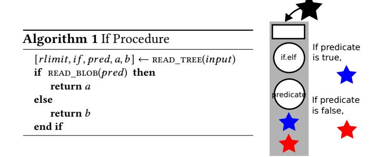

# 3.3 Minimum Repositories

Each Thunk has the ability to access a bounded set of resources, including both Fix data and hardware resources like RAM. In order to ensure that a function won't require any I/O operations before finishing, the runtime must ensure these resources are available throughout its execution. This set is called the "minimum repository" of the Thunk. While a function may not change its minimum repository, it may create new Thunks with different minimum repositories:

- 1. It may specify new resource limits in the new Thunk;
- 2. It may grow the repository by including an Encode, which will evaluate its referent and add the result to the new repository;

1 an Explicit Named Computation on Data or Encodes

Figure 1. Fix represents function invocations and data dependencies with a unified serializable format.

3. It may shrink the repository by excluding data which were part of its own repository from the new Thunk. Since a function can't directly call another one (can't directly evaluate a Thunk), these operations don't affect the minimum repository of the currently-running function.

#### 3.4 Expressivity

Fix enables programs to express their dataflow at fine granularity by specifying the minimum repositories of child functions. Programs are required to express, at worst, an overapproximation of their data dependencies; it's impossible for a program to access any data not explicitly requested. Fix's different types allow programs to describe complex access patterns to Fixpoint. A pseudocode version of the Fix API is shown in Table 1; the exact implementation varies depending on the implementation language.

| Function                                   | Description                    |  |
|--------------------------------------------|--------------------------------|--|
| T read_blob(BlobObject)                    | Read a Blob into a variable.   |  |
| <pre>Value[] read_tree(TreeObject)</pre>   | Read a Tree into an array.     |  |
| BlobObject create_blob(T)                  | Create a Blob from a variable. |  |
| <pre>TreeObject create_tree(Value[])</pre> | Create a Tree from an array.   |  |
| Thunk application(Tree)                    | Apply a function (lazily).     |  |
| Thunk identification(Value)                | Apply the identity function.   |  |
| Thunk <b>selection</b> (Value, int)        | Select a child element.        |  |
| <pre>Encode strict(Thunk)</pre>            | Strictly evaluate a Thunk.     |  |
| Encode <b>shallow</b> (Thunk)              | Shallowly evaluate a Thunk.    |  |

Table 1. Fix Pseudocode API

Fix's Thunks are lazy by default, which allows control flow to be expressed by user-provided programs. For example, Fig. 2 shows how a user-provided if procedure can lazily select one of two Thunks based on a predicate. The other Thunk, and its data dependencies, never need to be loaded or executed by Fixpoint. The minimum repository of the if procedure includes the machine codelet and the predicate, but excludes the Thunks' definitions or results.

By returning a Thunk, as in Fig. 3, a function can recurse or call other functions. In this case, a user-provided fibonacci procedure creates two Thunks corresponding to recursive

**Figure 2.** This if procedure reads a boolean predicate from its input and selects one of two Thunks to return.

**Figure 3.** A Fix version of the Fibonacci algorithm creates recursive Thunks and passes them to an addition procedure.

calls of itself, and a third Thunk adding the two results. The first two Thunks are wrapped in Strict Encodes, specifying that the addition function needs the evaluated results.

Selection Thunks provide efficient access to large or partially evaluated data structures without including the entire structure in a program's minimum repository. Fig. 4 shows how a Fix procedure may recursively descend a directory structure without fetching the full contents of the directories or the files within. The procedure uses a strictly-encoded

