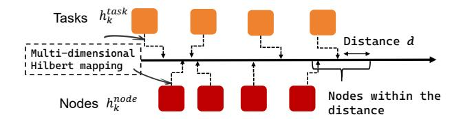

# 5 Fine-grained Resource Management

Fine-grained resource management enhances resource efficiency and handles multi-priority tasks by enabling resource preemption and isolation mechanisms. Wind aims to leverage idle resources during off-peak times and gracefully degrade in the face of increased system pressure, avoiding over-occupation of system resources and thus improving overall resource scheduling efficiency.

### 5.1 Dynamic Resource Quota Management

The soft preemption mechanism achieves flexible resource orchestration through dynamic management of heterogeneous resource quotas, encompassing CPU, memory, and GPU resources. For Burstable Pods, the system enables the configuration of variable resource bounds to adapt resource consumption according to real-time system load conditions. Specifically, each Burstable Pod is provisioned with adjustable CPU, memory, and GPU quotas that define both baseline requirements and peak allocation limits. When requesting resources, the Pod declares the minimum resource guarantee (e.g., 2 CPUs, 4Gi memory, and 1 GPU) alongside the maximum resource ceiling (e.g., 8 CPUs, 16Gi memory, and 4 GPUs). This elastic resource model ensures that Pods can exploit surplus resources during low-contention periods while gracefully degrading resource usage under high system load, thereby preventing resource starvation and maintaining system stability.

The resource management orchestration leverages Kubernetes' kubelet as the primary enforcement agent for multi-resource coordination. For CPU resources, the system employs dynamic cpu.shares adjustment to modulate the CPU time allocation for Burstable Pods. Under high node utilization, the scheduler reduces CPU shares (e.g., from 1024 to 512) to prioritize critical workloads while maintaining fairness guarantees. Memory management operates through continuous monitoring of memory.pressure metrics, where the system progressively decreases memory.high thresholds for Burstable Pods when memory contention exceeds predefined bounds, triggering controlled memory reclamation

to prevent out-of-memory conditions. For GPU resources, the system utilizes device-plugin interfaces to implement fractional GPU sharing and dynamic GPU memory allocation. The scheduler monitors GPU utilization metrics and memory fragmentation patterns to redistribute GPU resources among competing Pods, ensuring optimal GPU memory locality and minimizing inter-device communication overhead in multi-GPU scenarios.

### 5.2 Preemption-Aware GPU Sharing

For dynamic adjustment of GPU resources, the system introduces a preemption-aware GPU sharing mechanism to further enhance GPU resource utilization. By extending the device plugin, the system allows Pods to declare their GPU time slice requirements, enabling the system to set preemption policies for GPU resources and define the duration of each time slice. For example, a Pod can declare its need for preemptible GPU resources and specify that it will occupy 200 milliseconds of GPU time per second. This allows for more refined GPU resource allocation, particularly in multitask scenarios where multiple tasks share a single GPU, thus avoiding resource wastage.

In terms of preemption strategy, the system provides both active relinquishment and passive preemption. To achieve millisecond-level passive preemption, we modify the CUDA scheduler within the NVIDIA open-source kernel driver. This implementation enables a hardware-level pause-resume mechanism: when a high-priority task arrives, the driver triggers a context switch that saves current register states and execution metadata directly into the GPU's High Bandwidth Memory (HBM), rather than offloading to host memory. By minimizing host-to-device synchronization, the system reduces the total context switch latency to approximately 5-10 ms. The active relinquishment strategy complements this by requiring tasks to periodically check their remaining time slice and proactively save model checkpoints before the time slice is exhausted. In contrast, the passive preemption strategy leverages the kernel-level scheduler to suspend kernels or sends a SIGTERM signal to the task via the device plugin when the task does not release GPU resources in time. After a specified grace period (defined by terminationGracePeriodSeconds), the task is forcibly terminated to ensure that higher-priority tasks have sufficient access to the GPU resources.

#### 5.3 Isolation Guarantee for Exclusive Resources

In Wind, the resource preemption mechanism serves as the fundamental basis for ensuring service quality for AI tasks with different priorities. It primarily encompasses strong isolation and fine-grained scheduling for CPU, memory, and GPU resources.

### 1) CPU/Memory Isolation

The system employs the cgroups v2 mechanism in the Linux kernel to isolate and control different QoS levels for

**Figure 5.** Hilbert mapping in Wind: Tasks and nodes are ordered using multi-dimensional Hilbert mapping, where nodes within the Hilbert distance threshold of a given task are prioritized for task placement.

Pods. For high-priority tasks marked as 'Guaranteed', the system allocates a fixed real-time execution window by configuring the cpu.rt\_runtime\_us parameter and combines it with the SCHED\_FIFO real-time scheduling policy. This ensures that such Pods have scheduling priority over low-priority processes running under regular scheduling policies, such as CFS (Completely Fair Scheduler [38]). However, as Kubernetes does not enable real-time scheduling by default, the system requires pre-configuration of the nodes and runtime extension to explicitly enable real-time privileges for these Pods.

For memory isolation, the system uses the memory.high parameter to set memory usage limits for non-critical tasks (e.g., BestEffort Pods). When the node enters a memory pressure state, the system gradually compresses or terminates non-critical tasks to avoid excessive memory consumption, ensuring that critical tasks maintain available memory.

#### 2) GPU Exclusive Allocation

In GPU resource isolation, the system employs both spatial and temporal isolation mechanisms to support exclusive access and preemption capabilities for high-priority tasks. Our spatial isolation follows a two-tier approach: we perform static rebalancing during off-peak windows based on 7-day usage patterns to reduce overhead, while utilizing HAMI for dynamic sharing to enable flexible allocation without disruptive hardware resets. For temporal isolation, the system customizes the NVIDIA driver to introduce a Preemptive Time-Slicing mechanism. This mechanism enables time-slice scheduling for the CUDA kernel, and when a task exceeds its allocated time slice, the kernel scheduler forcibly interrupts the current GPU execution, making room for higher-priority tasks. This mechanism overcomes the limitations of traditional GPU scheduling, where tasks cannot be preempted, thus significantly improving preemption response time and task-switching granularity.

