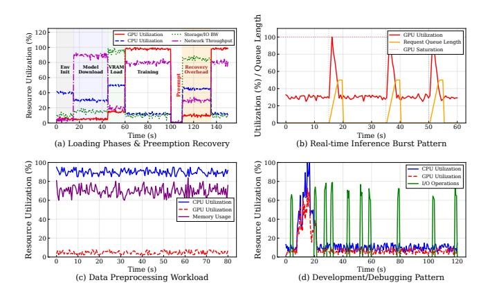
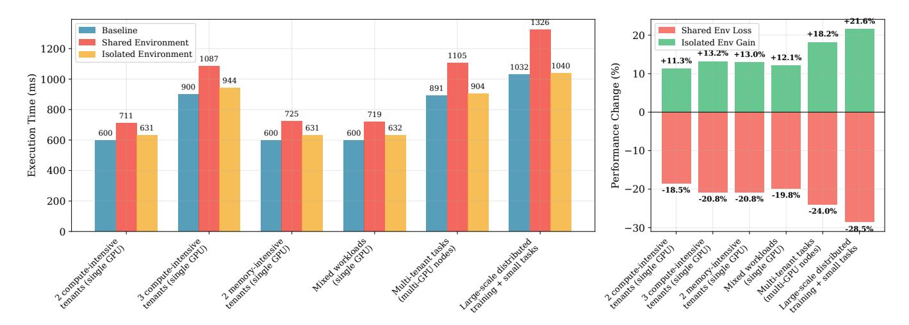
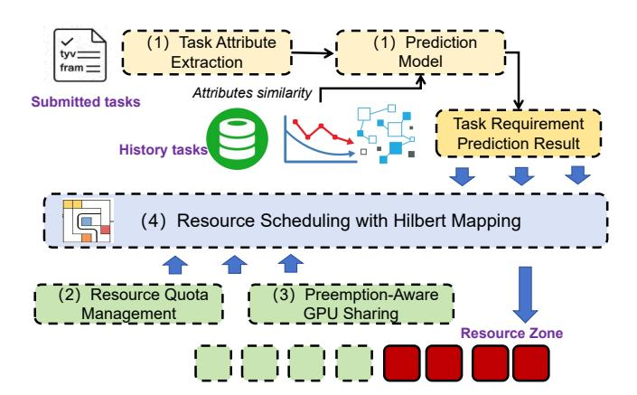
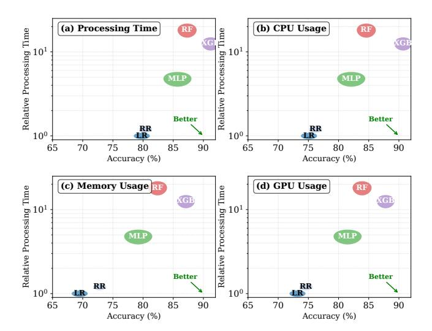

# Bridging the GPU Utilization Gap: Predictive Multi-Dimensional Resource Scheduling for AI Workloads

Yilei Lu lu-yl20@mails.tsinghua.edu.cn Tsinghua University and Baihai Beijing, China

> Zhe Liu lz@baihai.ai Baihai Beijing, China

Dongbiao He\* hdb@seu.edu.cn Southeast University Nanjing, China

Letian Ruan 1291903308rlt@sjtu.edu.cn Shanghai Jiao Tong University Shanghai, China

Yongwei Wu wuyw@tsinghua.edu.cn Tsinghua University Beijing, China Teng Ma sima.mt@alibaba-inc.com Alibaba Group Beijing, China

> Jinlei Jiang jjlei@tsinghua.edu.cn Tsinghua University Beijing, China

#### **Abstract**

Modern AI data centers face a critical paradox: while machine learning workloads dominate infrastructure demands, actual GPU utilization remains consistently low. Existing schedulers fail to coordinate heterogeneous resources effectively, lack predictive capabilities for dynamic workloads, and cannot balance isolation requirements with sharing optimization in multi-tenant clusters. This paper presents Wind, a novel resource scheduler that bridges the GPU utilization gap through predictive scheduling and geometric resource coordination. Wind introduces three key innovations: (1) a resource prediction framework that leverages historical execution patterns to forecast task requirements and completion times with high accuracy;(2) a unified scheduling architecture supporting isolation, sharing, preemption, and prioritization policies that eliminate resource fragmentation while maintaining performance guarantees; and (3) a Hilbert curve-based multi-dimensional scheduling algorithm that maps CPU-memory-GPU resource space to preserve spatial locality while achieving linear computational complexity.

Our evaluation on a 139-node cluster demonstrates that Wind consistently outperforms K8s Default, DRF, and Synergy across diverse workloads. It reduces average response

\*Corresponding author (hdb@seu.edu.cn).

This work is licensed under a Creative Commons Attribution 4.0 International License.

EUROSYS '26, April 27–30, 2026, Edinburgh, Scotland Uk
© 2026 Copyright held by the owner/author(s).
ACM ISBN 979-8-4007-2212-7/2026/04.
https://doi.org/10.1145/3767295.3803579

time by 33–48%, lowers P99 JCT by 37%, and improves throughput by up to 46.6% under bursty loads. GPU utilization remains above 92%, while medium-load scenarios yield upmei to 25% resource savings, highlighting the practicality of Wind for production-scale AI clusters.

*CCS Concepts:* • Software and its engineering  $\rightarrow$  Scheduling; • Computing methodologies  $\rightarrow$  Machine learning.

*Keywords:* GPU resource scheduling, AI workloads , Predictive modeling , Hilbert curve

#### **ACM Reference Format:**

Yilei Lu, Dongbiao He, Teng Ma, Zhe Liu, Letian Ruan, Jinlei Jiang, and Yongwei Wu. 2026. Bridging the GPU Utilization Gap: Predictive Multi-Dimensional Resource Scheduling for AI Workloads. In 21st European Conference on Computer Systems (EUROSYS '26), April 27–30, 2026, Edinburgh, Scotland Uk. ACM, New York, NY, USA, 17 pages. https://doi.org/10.1145/3767295.3803579

#### 1 Introduction

In recent years, artificial intelligence and machine learning workloads have emerged as core components of modern data centers [11, 41, 48, 50]. According to McKinsey's analysis, approximately 70% of data center infrastructure requirements are dedicated to machine learning training and inference tasks [34]. Data center clusters are managed in a multi-tenant fashion, providing services to diverse user groups based on their specific requirements while incorporating resource regulation and access control mechanisms. However, empirical studies [63] reveal that GPU utilization for individual tasks remains suboptimal, with overall GPU resource utilization averaging below 50% [15]. This paradox between surging resource demands and low utilization

rates exposes fundamental limitations in traditional resource scheduling systems: simplistic static allocation strategies (e.g., Kubernetes' static bin-packing algorithms [45]) fail to effectively accommodate the dynamic, heterogeneous, and multi-tenant isolation requirements inherent in machine learning workloads [3]. These data centers encompass substantial heterogeneous computing resources that host numerous AI workloads, which require efficient schedulers to coordinate resource allocation and workload distribution. Such schedulers [49, 63] are essential to ensure efficient AI task execution [30, 37], optimal hardware resource utilization [32, 65], and achievement of other scheduling objectives [51, 59].

Existing scheduling systems confront three fundamental challenges in resource orchestration:(1) Inadequate multidimensional resource coordination, which results in a failure to achieve synergistic allocation across heterogeneous resource types including CPU, memory, and GPU components. Contemporary schedulers, exemplified by Kubernetes' default scheduler, treat computational resources as orthogonal dimensions, neglecting the intrinsic dependencies between GPU memory bandwidth and compute throughput characteristics, resulting in suboptimal resource placement decisions [42]. (2) Limited predictive modeling capabilities arise in conventional scheduling algorithms when confronted with dynamic workload patterns, preventing an accurate estimation of task resource requirements and execution characteristics based on historical profiling data [2, 24, 57, 58]. Traditional resource management frameworks rely predominantly on user-specified resource declarations, whereas actual demands of machine learning workloads exhibit significant variability due to evolving data distributions and model architectural changes. Production-scale analyses reveal that a substantial proportion of deep learning training workloads demonstrate considerable deviation between the declared and actual resource consumption patterns [40, 44, 47]. (3) The fundamental tension between resource isolation and sharing optimization: existing systems lack sophisticated mechanisms to balance resource exclusivity guarantees with utilization efficiency in multi-tenant environments. Strict isolation [21] approaches provide deterministic performance guarantees but introduce resource fragmentation overhead, while permissive sharing strategies [29] enable a higher utilization density at the cost of performance interference. Cloud infrastructure studies [54, 56] indicate that inference workloads that execute on shared GPU resources may experience significant tail latency degradation compared to dedicated resource allocation scenarios.

To address these challenges, this paper proposes a resource scheduling system named Wind. The core contributions encompass the following four aspects:

1) We analyze **the diversity of AI workloads**, revealing high burstiness and heterogeneity in their demands across compute, storage, and network resources. By quantitatively

**Table 1.** Different types of machines in the GPU cluster.

| System | s CPUs | Mem(GB) | GPUs | GPU type | Nodes |
|--------|--------|---------|------|----------|-------|
|        | 128    | 1024    | 8    | A800     | 68    |
|        | 40     | 256     | 2    | T4       | 12    |
| IDP    | 96     | 1024    | 4    | V100     | 24    |
|        | 64     | 256     | 8    | In-house | 31    |
|        | 192    | 2048    | 8    | H800     | 4     |
|        |        |         |      |          |       |

**Table 2.** Distribution of task types and runtime statistics.

| Task Type                  | Count | %    | Avg (min) | Min (min) | Max (min) |
|----------------------------|-------|------|--------------|--------------|--------------|
| Short tasks 1   | 809   | 77%  | 23           | 17           | 30           |
| Medium tasks 2  | 125   | 12%  | 135          | 35           | 276          |
| Long Services 3 | 113   | 11%  | 413          | 362          | 728          |
| Total                      | 1047  | 100% | _            | _            | -            |

&lt;sup>1Scripts and small batch processes (runtime ≤30 min)

comparing GPU sharing versus isolation, we derive key insights for designing dynamic schedulers in AI environments.

2) We propose a **history-based task parameter prediction method** that accurately predicts task processing time and resource requirements. This method matches similar tasks from a historical task database, then uses logistic regression models to learn the mapping relationship between task attributes and execution parameters, providing crucial insights for scheduling decisions.

3) We present a **fine-grained scheduling mechanism** that addresses multi-priority AI workload scheduling through dynamic resource quotas and preemption-aware policies. It provides elastic resource boundaries for burstable tasks and GPU time-slicing with proactive release, enabling precise allocation and efficient multi-task sharing.

4) We develop a **Hilbert-mapping-based scheduler for multi-dimensional resources**. By projecting compact 3–4D task and node descriptors onto a 1D Hilbert curve, the model enables unified similarity measurement and efficient matching. The design incorporates priority-aware Hilbert spaces with tiered distance thresholds and a three-stage scheduling pipeline, ensuring responsiveness for high-priority tasks while maintaining overall resource utilization.

Our 139-node cluster evaluation shows that Wind consistently outperforms Kubernetes' default scheduler, DRF, and Synergy across heterogeneous workloads. It reduces average response time by up to 44.4%, improves system throughput by 46.6%, and lowers burst-task latency by 47.9%. For training, Wind achieves the highest throughput (1.42 min/job) and GPU utilization (91.2%), while for inference it cuts P99 JCT by 37% over Synergy. Moreover, it sustains >92% GPU utilization and yields up to 25% resource savings under medium loads, demonstrating its ability to balance diverse priorities with strong service quality guarantees.

&lt;sup>2Training tasks (runtime 30 min to 6 hours)

&lt;sup>3Continuous services (runtime ≥6 hours)

### 2 Background

This paper focuses on the task scheduling problem of deep neural network (DNN) models (including CNN [4], Transformer [19], and Transformer-based generative models [55]) on heterogeneous GPU clusters. To begin, we present a brief overview of IDP (Intelligent Development Platform) developed by Baihai Technology, highlighting its core software and hardware components that form the foundational infrastructure for conducting and executing the framework of Wind. Following this, we uncover the key characteristics of AI workloads and the significant challenges that arise in the context of task scheduling. As a result, it is imperative for us to develop a novel and efficient scheduling framework that can effectively address these challenges.

#### 2.1 The Overview of Baihai IDP

Hardware Architecture: Table 1 provides a detailed comparison of different machine types within a GPU cluster, showcasing their capabilities in terms of CPUs, memory (GB), number and type of GPUs, and the number of nodes. There are a total of 139 nodes, including 68 A800 nodes and 4 H800 nodes. The diversity and scale of these configurations highlight Wind's capacity to support extensive research and application in large-scale GPU scheduling systems. The varied setups allow for testing different scenarios, optimizing performance, and adjusting to the specific demands of advanced computational tasks.

**Software Architecture:** Wind presents a comprehensive four-tier architecture designed to address the complex challenges of heterogeneous GPU cluster management and AI workload orchestration. The platform integrates an AI Platform layer featuring IDP Studio for streamlined MLOps workflows, IDP LM for zero-code operations, and IDP MaaS for seamless model marketplace access. Built upon versatile AI Algorithm Frameworks that support TensorFlow [39], PyTorch [26], Ray [36], and XGBoost [9], the system provides critical flexibility for diverse computational workloads. The Wind platform implements task scheduling to optimize AI workload performance through dynamic resource adaptation, while providing compute resource management that orchestrates heterogeneous GPU, TPU, and CPU resources with multi-tenant isolation, continuous monitoring, and maintenance capabilities. This unified architecture effectively bridges the gap between complex resource heterogeneity and the demanding requirements of modern AI workloads, establishing a foundation for efficient, scalable, and reliable AI infrastructure deployment.

#### 2.2 Workload Diversity Characteristics

The workloads within AI environments exhibit significant heterogeneity, presenting unique challenges for AI system

Figure 1. Task burstiness and resource contention.

architecture. Based on our empirical data collection and analysis, we observe the following distinctive patterns in task distribution:

(1)Long-Tail Distribution of Tasks: Table 2 reveals pronounced asymmetry in task distribution patterns. Shortduration tasks constitute an overwhelming majority (77%) of all tasks, with a mean execution time of merely 23 minutes, representing typical "rapid experimentation" workloads. In contrast, medium-duration tasks, while comprising only 12% of tasks, demonstrate substantially longer average execution times (135 minutes) with considerable runtime variance (35-276 minutes). Most notably, long-running service tasks, despite representing just 11% of the total task count, exhibit extraordinarily extended average runtimes of 413 minutes, with maximum continuous execution reaching 728 minutes (approximately 12 hours). (2)Resource Utilization Asymmetry: Although short-duration tasks numerically dominate the workload, their cumulative resource consumption remains relatively limited. Conversely, the small fraction of long-running service tasks potentially monopolizes a disproportionate share of system resources. Our analysis suggests that, measured by average runtime, the 11% of long-running service tasks may consume over 50% of system resource time. (3) High Variance in Task Duration: The empirical data demonstrates substantial variance in execution times across different task categories. Notably, even within individual categories, task durations exhibit considerable internal variance. Medium-duration tasks exemplify this phenomenon, with the ratio between minimum and maximum runtimes approaching 1:8 (35 minutes versus 276 minutes). This high-variance characteristic substantially complicates resource pre-allocation strategies and task scheduling algorithms.

#### 2.3 Task Burstiness and Resource Contention

**Task Burstiness.** AI workloads exhibit pronounced temporal locality and highly non-linear resource demand patterns that defy conventional capacity planning assumptions. As

Figure 2. Performance analysis of GPU resource sharing in various multi-tenant scenarios.

illustrated in Figure 1(a), training workflows exhibit finegrained phase transitions. Initial loading stages including environment setup, model download, and VRAM loading consume peak network and storage bandwidth. While GPU utilization 1 stabilizes above 95% during active training, preemption events trigger substantial recovery overheads. These overheads manifest as prolonged I/O spikes and execution delays required for state restoration. Figure 1(b) reveals the pulsatile nature of real-time inference workloads, where GPU utilization can spike from a 30% idle state to full saturation within seconds. Such high-frequency, high-amplitude resource demand oscillations render conventional historybased prediction algorithms ineffective, exposing a critical gap in existing resource forecasting methodologies. The development and debugging patterns shown in Figure 1(d), while exhibiting relatively modest overall resource consumption, introduce unpredictable intermittent burst behaviors that further complicate task scheduling approaches.

Resource Contention. The heterogeneous nature of AI task types creates structural disparities in compute, storage, and network resource preferences, culminating in multi-layered resource competition scenarios. Figure 1(c) demonstrates that data preprocessing and similar CPU-intensive operations monopolize 90% of available CPU capacity while maintaining minimal GPU requirements (2-8%), ostensibly complementing the resource profiles of GPU-intensive training and inference tasks. However, in practice, multi-tenant environments transform this apparent resource complementarity into fierce contention due to suboptimal scheduling policies. The situation becomes particularly acute when inference tasks encounter sudden request surges—scheduling latencies trigger request queue buildup, precipitating cascading performance degradation and resource waste. Moreover, the

temporal overlap between high I/O demands during model loading phases and massive distributed communication requirements during training execution exacerbates contention intensity across network and storage subsystems.

#### 2.4 GPU Resource Sharing vs Isolation

GPU resource sharing [46, 60, 66] has emerged as a prevalent strategy to enhance computational resource utilization efficiency. However, this sharing paradigm introduces some performance challenges and resource contention issues in multi-tenant environments. While prior research has investigated GPU virtualization techniques and resource isolation mechanisms, there remains a notable absence of systematic analysis regarding the impact of GPU sharing across diverse workload characteristics and varying tenant scales.

Our preliminary experiments reveal substantial performance degradation resulting from GPU resource sharing in multi-tenant scenarios (shown in Figure 2). In single-GPU configurations, even with merely two compute-intensive tenants coexisting, we observed an 18.50% performance deterioration; this degradation intensifies to 20.80% when the number of tenants increases to three. Memory-intensive workloads similarly experience considerable resource contention, manifested as a 20.80% performance reduction. In mixed workload scenarios, which more accurately reflect production environments, performance decreased by 19.80%.

The situation becomes increasingly critical in more complex multi-GPU environments. Multi-tenant workloads executing across multiple GPU nodes suffer a 24.00% performance penalty, while the co-location of large-scale distributed training with smaller tasks results in performance degradation reaching 28.50%. These findings indicate that resource contention issues exhibit non-linear growth patterns as system complexity and tenant heterogeneity increase. Significantly, our experiments demonstrate that these performance issues can be substantially mitigated through appropriate

&lt;sup>1GPU utilization (%) is measured via NVIDIA DCGM, primarily using DCGM\_FI\_PROF\_SM\_ACTIVE (SM active time) or DCGM\_FI\_DEV\_GPU\_UTIL, with VRAM usage from DCGM\_FI\_DEV\_FB\_USED.

resource isolation mechanisms. Across various scenarios, isolation techniques enabled performance improvements ranging from 11.30% to 21.60%, with particularly pronounced benefits observed in complex multi-GPU and heterogeneous workload environments. In practice, we enforce strict host memory isolation via Kubernetes cgroups and guide VRAM quotas and limits using the aforementioned predictions, preventing long-running jobs from inefficiently monopolizing or over-reserving GPU memory and further reducing on-node contention.

While resource isolation mechanisms effectively mitigate performance contention issues in multi-tenant environments, their implementation introduces a series of adverse effects, primarily manifested as reduced resource utilization and exacerbated fragmentation problems. Our experimental data reveals that under shared mode, resource fragmentation remains relatively low, with fragmentation rates maintained within the 15%-35%. However, when strict resource isolation policies are enabled, fragmentation issues significantly deteriorate, with fragmentation rates escalating to 35%-50%, representing an average increase of approximately 67%.

This fragmentation intensification primarily stems from isolation mechanisms' pre-allocation and static partitioning of resources, preventing flexible resource sharing and dynamic adjustment among tenants. Even when certain tenants' actual resource demands fall below their allocated quotas, other tenants cannot access these idle resources, consequently resulting in resource wastage. In Baihai IDP, single-GPU scenarios currently rely on sequential task switching and CRIU-based preemption. However, the recovery overhead increases approximately linearly with the VRAM footprint, making preemption costly for high-memory jobs. Consequently, runtime memory pressure must still be handled at the application level, underscoring the need for more dynamic resource orchestration and finer-grained VRAM reuse and reclamation.

#### 3 Design of Wind

Figure 3. The overall architecture of Wind.

**Table 3.** Taxonomy of task attributes in Wind.

| Category      | Specific Attributes                                        |  |  |  |
|---------------|------------------------------------------------------------|--|--|--|
| Semantic      | Model Architecture (e.g., LLM, ViT),                       |  |  |  |
|               | Framework Type, Model Size, Dataset                        |  |  |  |
|               | Type/Scale                                                 |  |  |  |
| Structural    | GPU Vendor/Model/Count, VRAM Ca-                           |  |  |  |
|               | pacity, Priority Class, Est. Duration, Pre- emptibility |  |  |  |
| Phase Markers | Model Loading, Tokenization, Quan-                         |  |  |  |
|               | tization, LoRA Fine-tuning, Train-                         |  |  |  |
|               | ing/Inference, Model Merging                               |  |  |  |

Wind is a unified prediction-aware scheduling framework designed to improve resource utilization and scheduling efficiency in large-scale, multi-tenant AI computing environments. Figure 3 illustrates the architecture of Wind, which consists of four major functional components: Task Understanding and Prediction, Resource Quota Management, Preemption-Aware GPU Sharing, and Resource Scheduling with Hilbert Mapping [6, 25, 61]. Together, these components support critical scheduling policies such as isolation, sharing, preemption, and prioritization.

1) Task Attribute Extraction and Prediction Module (*Details in §4*): This module serves as the predictive layer, extracting semantic and structural attributes (shown in Table3) from incoming tasks and using machine learning models, trained on historical execution traces, to predict resource requirements and expected processing times. By transforming reactive scheduling into proactive resource planning, it enables the system to make informed allocation decisions prior to task execution.

This module underpins *prioritization* by producing accurate estimates of task completion times and resource consumption, which downstream scheduling algorithms leverage to rank and schedule tasks effectively. Moreover, it enables *isolation* by providing these precise resource predictions to the Resource Quota Management module, which then validates them against team-specific quotas to enforce resource boundaries.

2) Resource Quota Management (*Details in §5.1*): This module enforces hierarchical resource governance by managing team-level resource allocations through strict policies, while also providing controlled mechanisms for resource flexibility. It continuously monitors resource utilization, tracks allocation patterns, and enforces policy constraints across organizational boundaries.

As the primary enforcement mechanism for *isolation*, it guarantees that each team operates within specified resource boundaries. Simultaneously, it facilitates *sharing* by supporting resource pooling and borrowing protocols. When a team's quota is insufficient for an incoming task, this module can trigger two actions: attempt to borrow resources from other teams, or interface with an external cluster autoscaler to request new nodes if the policy allows.

#### 3) Preemption-Aware GPU Sharing (Details in §5.2):

This module addresses the tension between resource utilization and responsiveness by implementing cooperative preemption mechanisms. It maintains real-time monitoring of borrowed resources and orchestrates their reclamation when the resource-owning team submits higher-priority workloads.

It directly realizes the **preemption** principle via dynamic, policy-driven rebalancing algorithms capable of rapidly reclaiming GPU resources based on priority signals, urgency, and team policies. This ensures that critical workloads can access the required resources predictably, even under high contention conditions.

4) Resource Scheduling with Hilbert Mapping (*Details in §6*): This module orchestrates the final placement of tasks by employing spatial locality-aware GPU allocation strategies based on Hilbert space-filling curves [28, 43]. It integrates predicted resource needs and real-time cluster state information to optimize hardware utilization and reduce communication overhead.

The Hilbert mapping scheduler embodies *prioritization* by dispatching tasks according to their priority scores while considering resource fit and hardware locality. Specifically, it maps tasks with high predicted inter-communication needs to GPUs that are physically proximate (e.g., on the same node or connected by a high-speed interconnect), thereby minimizing communication latency and improving the performance of distributed training workloads. This approach ensures higher-priority workloads are allocated resources efficiently in both temporal and spatial dimensions.

#### 4 Resource Allocation Prediction

### 4.1 Historical Task Data Collection

To establish a reliable task resource prediction model, we conducted systematic data collection of historical task execution. The data is sourced from a production IDP (Intelligent Development Platform) serving 1,000+ concurrent users across 139 physical nodes. The final dataset encompasses 2,500 task samples across diverse workload types, totaling over 8,000 compute hours.

Task Selection. We selected tasks from production environments spanning multiple application domains, including deep learning training, inference, and data preprocessing. To reflect realistic multi-tenant dynamics, the trace specifically captures co-located task interference patterns and the communication overhead of NVLink/InfiniBand for multi-GPU workloads. The tasks utilize frameworks like TensorFlow and PyTorch, with execution times ranging from 30 seconds to 3.600 seconds.

**Data Collection.** We conducted data collection on the cluster described in Table 1. As quantified in Table 4, our dataset captures diverse multi-tenant patterns: the 160-GPU cluster is dominated by long-running inference (avg. 4 GPUs),

**Table 4.** Multi-tenant characteristics across the cluster.

| GPUs (Size) | Tenants (#) | Users (#) | Shared (Wkly) | Preempt (Wkly) | Tasks (Wkly) |
|----------------|----------------|--------------|------------------|-------------------|-----------------|
| 160            | 5              | 98           | 20               | 22                | 2,917           |
| 400            | 12             | 51           | 3                | 55                | 493             |
| 1024           | 3              | 1054         | 16               | 214               | 8,206           |

**Figure 4.** The results of resource prediction using LR, RR, MLP, RF, and XGBoost.

while the 400-GPU cluster exhibits frequent preemptions (55/week) for training experiments. The 1,024-GPU cluster represents extreme diversity, ranging from large-scale 48-GPU training jobs (avg. 52 hours) to massive small-scale bursty tasks (avg. 1.7 GPUs) with high preemption rates. During task execution, the system automatically records resource utilization metrics at 1-second sampling intervals over a 6-month period. Task metadata includes task type, framework, and batch size. The dataset contains three distinct task categories: short tasks (80%, avg. 23 min), medium tasks (10%, avg. 135 min), and long services (10%, avg. 413 min).

**Dataset Construction.** We preprocessed the collected raw execution data to generate a standardized dataset for model training. Task attributes were encoded as numerical feature vectors, while resource utilization metrics were normalized to the 0-1 range. The final dataset contains 2,500 task records, with each record comprising a 15-dimensional feature vector and a 4-dimensional target vector (execution time, CPU, memory, and GPU utilization).

### 4.2 Prediction Methods of Wind

Wind uses supervised learning on historical task attributes and resource consumption to predict future requirements. We prioritize lightweight algorithms to meet real-time scheduling demands while maintaining acceptable accuracy, but also consider more complex models when their accuracy gains justify the overhead.

We evaluate five machine learning algorithms: Linear Regression (LR [\[52\]](#page-15-25)), Ridge Regression (RR [\[33\]](#page-15-26)), Multi-Layer Perceptron (MLP [\[27\]](#page-14-15)), Random Forest (RF [\[5\]](#page-14-16)), and XG-Boost [\[9\]](#page-14-11), across four prediction targets: processing time, CPU usage, memory usage, and GPU usage. Each algorithm represents different complexity-accuracy trade-offs: LR/RR provide fast linear modeling, MLP captures moderate nonlinearity, while RF/XGBoost handle complex patterns at a higher computational cost. Models are trained dynamically on the 1,000 most recent similar tasks.

Algorithm Selection. Figure [4](#page-5-2) shows the accuracy-latency trade-off for each algorithm across prediction targets. We define prediction accuracy as the percentage of predictions with relative error below 20%. The results reveal target-dependent optimal choices: linear models (LR/RR) achieve ∼80% accuracy for processing time and CPU usage with minimal latency (sub-0.1 ms), while complex models like XGBoost reach the highest accuracies (up to 91.2% for processing time and 90.7% for CPU usage). Although XGBoost is roughly 12.6× slower than LR, its absolute inference time remains on the order of 1–2 ms, which is well within the acceptable range for online scheduling.

Based on these trade-offs, Wind adopts XGBoost as the primary prediction model, leveraging its consistently superior accuracy across all four targets (processing time, CPU, memory, GPU). To further optimize latency-sensitive scenarios, lightweight models such as LR/RR or MLP are employed as fallbacks—e.g., for rapid estimation in ultra-tight scheduling loops or on resource-constrained devices. This strategy ensures high prediction fidelity (above 87% across all metrics with XGBoost) while preserving sub-millisecond responsiveness when necessary, making it well-suited for real-time scheduling in dynamic environments.

#### 4.3 Prediction Model Maintenance and Robustness

To ensure the long-term fidelity of resource forecasts in dynamic cluster environments, Wind implements a systematic model maintenance and error-handling pipeline.

Model Retraining and Feature Importance. The system adopts a "daily-ingestion, weekly-update" strategy. While production data is accumulated in real-time to capture potential shifts in workload patterns, we perform full model retraining on a weekly basis. This cadence is justified by our observation that in typical multi-tenant AI clusters, the tenant base and their core model architectures (e.g., recurring LLM pre-training or fine-tuning pipelines) remain relatively stable over several months.

Handling Prediction Errors and Safety Margins. Despite a baseline accuracy of 87%, mispredictions are inevitable. Wind handles these via a conservative resource fallback mechanism. When the prediction model reports high variance (low confidence) or encounters out-of-distribution task

attributes, the system applies a "safety margin" by reverting to the user-requested resource values as the upper bound for scheduling.Crucially, the impact of such mispredictions is mitigated by two architectural features: 1) Hilbert Mapping Resilience: Since Hilbert curves optimize for spatial locality (placing related tasks on proximate nodes), a slight error in execution time estimation primarily affects the temporal packing efficiency rather than physical interconnect contention. 2) K8s Enforcement: Wind acts as a high-level orchestrator that modifies the task's resource specifications. Kubernetes then strictly enforces these modified limits at the container level, ensuring that even under-predicted tasks do not cause resource starvation for co-located neighbors.

