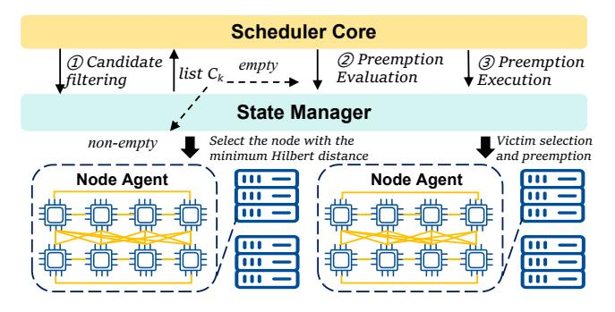
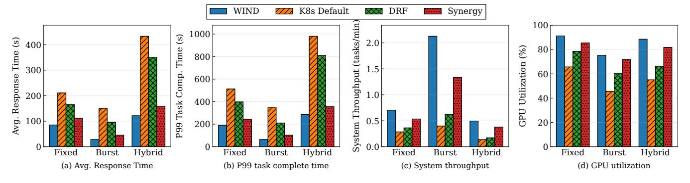
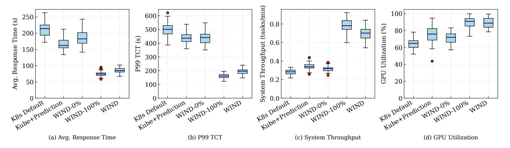
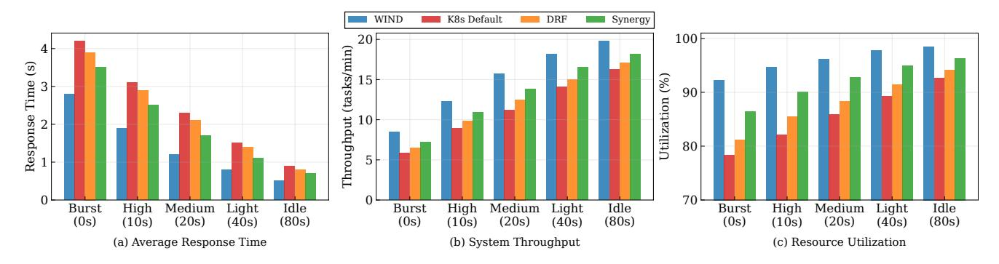
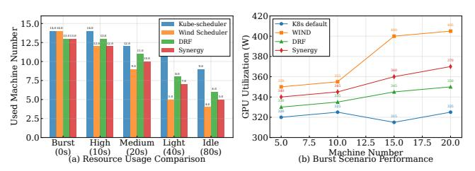

# 6 Hilbert-based Multi-dimensional Resource Scheduling Algorithm

To address the challenge of matching multi-attribute tasks with heterogeneous cluster resources, we designed and implemented a novel scheduling system. Its core is a scheduling algorithm that leverages Hilbert space-filling curves to map high-dimensional resource vectors onto a one-dimensional

space. This mapping transforms the complex multi-dimensional best-fit problem into an efficient one-dimensional proximity search, enabling fine-grained, priority-aware task placement.

#### 6.1 The framework

The scheduling framework is composed of three key components that work in concert: a centralized **Scheduler Core**, a per-node **Node Agent**, and a shared **State Manager**.

**Scheduler Core:** This is the central decision-making entity. It is designed to be stateless to ensure scalability and fault tolerance. It continuously monitors the task queues and node states stored in the State Manager and executes a three-phase scheduling pipeline (§6.3) to make placement and preemption decisions.

**Node Agent:**A daemon process running on each worker node. Its responsibilities are twofold: (1) monitoring local resource utilization (CPU, memory, GPU), running task statuses, and real-time load, and periodically reporting these as 6-dimensional state vectors to the State Manager; (2) executing commands from the Scheduler Core, such as launching a container, terminating a task, or signaling a process for resource reclamation (e.g., via SIGUSR1).

**State Manager:** A logically centralized, highly available key-value store. It maintains the global state of the cluster, including: (1) multiple priority-based task queues, (2) the Hilbert value and resource state for every node, and (3) metadata for ongoing preemption operations. This decoupled framework allows the Scheduler and Agents to operate asynchronously.

#### 6.2 The model

The foundation of our scheduler is a compact multi-dimensional model for both tasks and nodes, capturing essential resource demands together with high quality services. To avoid the instability of high-dimensional Hilbert mappings, we separate hard resource feasibility from QoS-sensitive placement, resulting in a more efficient 3–4D representation.

**Definition.** A task  $j_k$  is described by  $j_k = (r_k, q_k, \xi_k, \tau_k)$ , where  $r_k$  is the aggregated demand for CPU, memory, and GPU (computed as a weighted sum of normalized resources),  $q_k$  is its priority level,  $\xi_k$  indicates preemptibility, and  $\tau_k$  is the estimated duration. A node  $n_i$  is formally defined as a tuple  $n_i = (r_i, \bar{q}_i, \bar{\xi}_i, \bar{t}_i)$ , where  $r_i = (\text{cpu}_i, \text{mem}_i, \text{gpu}_i)$  represents the aggregated available resource capacity in terms of CPU cores, memory, and GPU count, respectively. The parameter  $\bar{q}_i$  summarizes the average priority of the tasks currently executing on the node, while  $\bar{\xi}_i$  denotes the ratio of preemptible tasks, incorporating per-GPU tracking to facilitate fine-grained scheduling. Finally,  $\bar{t}_i$  serves as a normalized load metric, where higher values indicate heavier node utilization, a characteristic preferred during Hilbert-based matching to promote workload consolidation.

**Hilbert Mapping.** Resource feasibility  $(r_i \ge r_k)$  is checked first to ensure hard constraints are met. For QoS-sensitive

scheduling, we employ a mapping function  $H: \mathbb{R}^d \to \mathbb{N}$  (d=3 or 4 depending on configuration) that projects task and node vectors into a one-dimensional Hilbert value. To enforce priority, the system maintains P distinct mappings  $H^{(p)}_{p=1}^P$ , where higher-priority mappings weigh QoS attributes more strongly than load. The Hilbert value for a task  $j_k$  with priority  $q_k$  is  $h_k^{task} = H^{(q_k)}(j_k)$ , computed by the Scheduler Core upon task arrival. A node's Hilbert value,  $h_i^{node}$ , is updated dynamically by its Node Agent.

The effectiveness of the Hilbert-based mapping stems from the locality-preserving properties inherent in Space-Filling Curves [43]. By projecting multi-dimensional resource vectors into a one-dimensional continuum while maintaining spatial proximity, the Hilbert curve naturally clusters similar resource footprints. In this framework, the input vector  $r_k$ can be derived either from dynamic usage predictions or, in the absence of such information, from the static resource declarations provided in the task specification. While accurate predictions can further refine the alignment by reflecting actual runtime behavior, the fundamental advantage of the Hilbert approach, reducing multi-dimensional fragmentation through geometric clustering, remains robust. This ensures that the scheduler efficiently addresses the "resource matching" problem by optimizing bin-packing density, a spatial benefit that persists even when temporal predictions are unavailable or imprecise.

**Distance-based Filtering.** Matching is performed by comparing distances in the Hilbert space:

$$d(j_k, n_i) = |h_k^{task} - h_i^{node}|$$

A smaller distance indicates a better fit in terms of QoS and workload state. For a task  $j_k$  with priority  $q_k$ , the candidate set is defined as

$$C_k = \{ n_i \in \mathcal{N} \mid r_i \ge r_k \land d(j_k, n_i) \le \theta^{(q_k)} \}$$

where  $\theta^{(q_k)}$  is a priority-dependent distance threshold. High-priority tasks use a small  $\theta$ , enforcing a strict match, while low-priority tasks are allowed a larger threshold, increasing their placement chances.

#### 6.3 The pipeline

As shown in the Figure 6, the Scheduler Core executes the following pipeline for each scheduling cycle, operating on the head of the highest-priority non-empty task queue.

**Phase 1: Candidate Filtering and Adaptive Scanning.** For a task  $j_k$ , the scheduler first determines its Hilbert anchor  $h_k^{task}$  in O(1) time and queries the State Manager to retrieve a list of nodes that satisfy the basic resource requirements. To accelerate subsequent matching and positioning, node states in the State Manager are indexed by their Hilbert values using a B+-tree. The scheduler performs a range query on this index for candidate nodes with  $h_i^{node} \in [h_k^{task} - \theta^{(p_k)}, h_k^{task} + \theta^{(p_k)}]$ . The intersection of these two sets

**Figure 6.** The pipeline of the Hilbert-based multidimensional resource scheduling algorithm is integrated into a framework composed of the Scheduler Core, Node Agent, and State Manager.

forms the final candidate list  $C_k$ . Starting from this anchor, the scheduler performs a second-round linear scan (O(n)) on the candidate set  $C_k$  to verify resource feasibility  $(r_i \geq r_k)$  and optimize load balance. This design ensures structural robustness: even with low prediction accuracy, the Hilbert curve maintains relative rankings. If  $C_k$  is non-empty, the node with the minimum Hilbert distance is chosen, followed by sending a LaunchTask command to the corresponding Node Agent, and the task is dequeued. Otherwise, the scheduler proceeds to Phase 2.

**Phase 2: Preemption Evaluation.** If no suitable node is found, the scheduler evaluates the viability of preemption. A preemption is considered beneficial if there exists a node  $n_i$  that, after preempting a set of lower-priority tasks  $\mathcal{P}_i$ , could accommodate the high-priority task  $j_k$ . To prevent system thrashing, the scheduler enforces a cooldown mechanism: a preemption on node  $n_i$  is suppressed if the node has undergone preemption within a dynamically calculated window  $T_{cooldown}$ , which is proportional to the recent preemption frequency on that node.

**Phase 3: Adaptive Preemption Execution.** If preemption is deemed necessary and viable, the scheduler selects the best preemption target.

**Victim Selection:** The scheduler scores potential victim nodes using a cost function  $S(n_i) = \gamma \cdot d(j_k, n_i) + C(n_i)$ , which minimizes both the Hilbert distance (for a better fit) and the preemption cost  $C(n_i)$ . The cost  $C(n_i)$  penalizes preempting tasks that have run for a long time or have high (relative to other preemptible tasks) priority, thereby preserving work.

**Execution and State Reconciliation:** Once the victim node  $n_i$  and victim tasks  $\mathcal{P}_i$  are identified, the scheduler sends a PreemptTask command to the Node Agent on  $n_i$ . For GPU tasks, our Node Agent implements a two-stage preemption: it first sends SIGUSR1 to the task's process group, allowing for voluntary checkpointing and resource release. If the resources are not freed within a short timeout, SIGTERM is sent for forced termination. The preempted tasks are requeued

in the State Manager, and the released resources trigger an immediate rescheduling attempt for task  $j_k$ . This closed-loop process ensures that resources are rapidly re-allocated to high-priority workloads.

Complexity and Scalability Analysis. The scheduling pipeline balances constant-time indexing with linear adaptive scanning. Specifically, the Hilbert anchor positioning achieves O(1) complexity, while the adaptive scan follows a worst-case O(n) complexity. Overall, the Hilbert scheduling computation is completed on a 100-nanosecond scale, even at a scale of 1,024 nodes.

#### 7 Evaluations

### 7.1 Evaluation Configurations

**Experimental Setup:** Our experiments are conducted on a 139-node physical cluster composed of five different hardware configurations, as detailed in Table 1. All nodes are interconnected via a 100GbE RoCE v2 (RDMA) network. This high-performance interconnect is crucial for modern distributed ML workloads and ensures that the network does not become a bottleneck, allowing us to accurately assess the scheduler's performance itself. The software stack across all nodes includes *Ubuntu 22.04*, *Kubernetes v1.28*, and *NVIDIA Driver 535+*. To eliminate network latency during job startup, all necessary container images are pre-pulled to the nodes.

Benchmark Comparison: We compare the performance of Wind against four representative baseline schedulers: (1) Kubernetes Default: The default Kubernetes scheduler, which serves as the de facto industry standard baseline. (2) DRF (Dominant Resource Fairness [16]): A classic algorithm designed to provide fairness across users with multi-resource demands. (3) Synergy [35]: A state-of-the-art scheduler that is a direct competitor in multi-dimensional resource-aware scheduling.

All the schedulers operate under identical experimental conditions and workloads, with a unified configuration across all test dimensions.

Workloads: To ensure our evaluation reflects real-world scenarios, we use a workload derived from production traces of our ML platform. We have categorized the tasks from the trace into three distinct workload scenarios to stress-test different aspects of the schedulers: (1) Fixed tasks: Periodic, fixed-interval compute tasks with stable and predictable resource footprints. Their arrival patterns and runtimes show low variance. (2) Burst Tasks: High-priority, time-critical workloads requiring immediate resource allocation, such as inference traffic spikes and emergency parameter tuning. These bursts are typically short-lived but intense. (3) Hybrid Workload: Mixed workloads combining periodic background tasks with burst interactive requests, simulating production AI platforms with concurrent training and serving demands.

Figure 7. Performance evaluation (average response time, P99 task complete time, system throughput, GPU utilization) under different task submission intervals.

#### 7.2 The Basic Performance

We evaluate the performance of Wind across three workloads: batch training, model inference, and hybrid load, comparing it with K8s Default, DRF, and Synergy. The results are summarized in Figure [7,](#page-10-0) which presents average response time, P99 job completion time (JCT), system throughput, and GPU utilization.

In the batch training workload, Wind achieves the highest System Throughput (1.42 min/job) and GPU Utilization (91.2%), significantly outperforming all baselines. This is due to its accurate resource demand prediction and multidimensional resource packing based on Hilbert curves, which reduces resource fragmentation. In contrast, K8s Default exhibits low throughput and poor resource utilization due to the lack of resource awareness. For model inference, Wind delivers the lowest Average Response Time (28.5s) and P99 Completion Time (65.1s), outperforming Synergy by 37% in response time. This is achieved through its ability to quickly match small, latency-sensitive jobs with fragmented resources. K8s Default fails to prioritize latency-sensitive tasks, resulting in significantly higher response times. In the hybrid load scenario, Wind maintains the lowest Average Response Time(121.5s), 28% better than K8s Default, by leveraging intelligent preemption. It preempts lower-priority jobs to meet the QoS of high-priority inference tasks. Without effective preemption, K8s Default and FIFO suffer from severe delays, with P99 JCT exceeding 1500 seconds.

Across all three workloads, Wind outperforms all baselines by efficiently balancing throughput, latency, and resource utilization. Its combination of resource prediction, multidimensional mapping, and preemption offers an effective scheduling solution for large-scale GPU clusters.

### 7.3 Ablation Study: Prediction and Hilbert Scheduling

To decompose the performance gains of WIND, we conducted an ablation study focusing on two core components: the Prediction Module and the Hilbert-based Multidimensional Packing. We evaluate five configurations: (1) K8s Default:

Baseline without prediction or Hilbert optimization; (2) Kube +Prediction: Integrates prediction into the default scheduler (demonstrating the "Prediction-only" gain); (3) WIND-0%: Employs Hilbert scheduling but with zero-accuracy/random predictions (demonstrating the "Hilbert-only" gain); (4) WIND-100%: The theoretical upper bound with Hilbert and perfect predictions; (5) WIND: The full system with realistic prediction and Hilbert scheduling. Figure [8](#page-11-0) presents the boxplots for these configurations.

Contribution of Prediction Module. Comparing K8s Default with Kube+Prediction highlights the benefit of foresight alone. As shown in Figure [8\(](#page-11-0)a-c), adding prediction to the standard K8s scheduler leads to a downward shift in latency and an upward shift in throughput. Quantitatively, the median response time improves by 21%, and the system throughput increases from 0.28 to 0.35 tasks/min (a 25% improvement). Figure [8\(](#page-11-0)d) shows a tighter GPU utilization distribution (median increased from 65.7% to 74.3%), proving that even without Hilbert optimization, prediction reduces resource stragglers.

Robustness via Hilbert Scheduling. A key finding is the performance of WIND-0%. Even when the prediction accuracy is forced to zero, the Hilbert-based packing strategy significantly outperforms K8s Default. The median response time drops from 210.6s to 180.3s, and throughput increases to 0.32 tasks/min. Crucially, WIND-0% exhibits much lower variance (shorter whiskers in the boxplots) than K8s Default. This demonstrates that the Hilbert curve mapping provides a robust structural foundation by naturally reducing resource fragmentation, regardless of prediction quality.

Synergy and Upper Bound. The full WIND system achieves its best performance by coupling both modules. While WIND-100% sets the theoretical ceiling (e.g., 0.78 tasks/min throughput, 94.1% GPU utilization), the standard WIND with its realworld model operates remarkably close to this optimum. It achieves a throughput of 0.70 tasks/min and 91.2% GPU utilization. The gap between WIND-0% and WIND (0.32 vs 0.70 tasks/min) quantifies the additional value that accurate temporal predictions bring to the spatial packing process.

Figure 8. Performance of ablation study: Kube+Prediction (Prediction-only) vs. WIND-0% (Hilbert-only).

These results validate the functional independence and combined efficacy of our design: (1) Prediction provides the necessary look-ahead to avoid future bottlenecks; (2) Hilbert Scheduling ensures stable and efficient spatial packing even under prediction uncertainty; and (3) together, they bridge the gap between reactive baselines and ideal proactive scheduling.

#### 7.4 Performance on Task Submitted Patterns

We constructed a comprehensive workload comprising 200 tasks categorized into eight distinct resource consumption profiles, ranging from 1/8 to full resource (8/8) utilization. These profiles correspond to CPU allocations from 2 to 16 cores and memory requirements from 8GB to 64GB. Task design follows the principle of positive correlation between resource demands and execution time, where higher resource-consuming tasks exhibit proportionally longer runtimes, thereby simulating the characteristics of real-world compute-intensive applications.

To evaluate scheduler performance under varying system pressures, we established five task submission patterns: zero-interval submission (200 tasks submitted simultaneously, simulating burst peak loads), 10-second intervals (high-load scenarios), 20-second intervals (medium load), 40-second intervals (light load), and 80-second intervals (system idle state). This progressive load design enables systematic observation of scheduling strategy behaviors across system states ranging from extreme bursts to relative quiescence.

Figure 9 presents a comparative performance analysis of Wind against three baseline schedulers: K8s Default, DRF, and Synergy. The results across five distinct task submission patterns reveal Wind's substantial advantages in response time, system throughput, and resource utilization metrics.

Wind consistently outperforms all baseline schedulers, achieving significant response time reductions. For instance, compared to the K8s Default scheduler, it registers improvements of 33-48% across all load patterns. Under burst load scenarios (0-second intervals), Wind dramatically reduces

response time from 4.2 seconds to 2.8 seconds, while maintaining sub-second response (0.5 seconds) during idle periods. This consistent improvement stems from Wind's resource quota management established through historical load analysis, enabling proactive resource window identification prior to task arrival. The Hilbert curve optimization compresses candidate node localization to under 100 milliseconds, achieving order-of-magnitude efficiency gains compared to the linear scanning strategies of other schedulers.

System throughput improvements are most pronounced under high-pressure scenarios, where Wind demonstrates clear superiority. In the burst load scenario, it achieves a throughput of 8.5 tasks/min, a 46.6% gain over the K8s Default scheduler (5.8 tasks/min) and also significantly surpassing DRF and Synergy. The technical foundation of this enhancement lies in Wind's transformation of traditional multi-dimensional resource matching into one-dimensional proximity search. Spatial locality preservation ensures natural clustering of similar resource requirements, thereby maintaining high task completion rates even under intensive resource contention.

Wind maintains consistently high resource utilization, staying above 92% across all patterns. This contrasts sharply with the wider fluctuation and lower efficiency of baseline schedulers, such as K8s Default (78.4-92.7%). The 17.7% improvement in burst scenarios (92.3% vs. 78.4%) particularly highlights Wind's **dynamic resource reclamation capability**. When compute nodes complete tasks and release resources, Wind utilizes real-time Hilbert values to immediately identify these resource opportunity windows and achieve instant reallocation, reducing resource reuse intervals from traditional minute-scale to second-scale operations.

#### 7.5 Resource Saving

Figure 10 further validates the advantages of the Wind scheduler from the perspective of resource savings in a 20-node cluster environment. In the resource usage comparison experiment, Wind demonstrates superior resource consolidation

**Figure 9.** Performance evaluation (average response time, system throughput, resource utilization) under different task submission intervals.

Figure 10. Performance of resource saving.

capabilities across all workload intensities. Under mediumload scenarios, Wind requires only 9 machines to complete tasks, representing a 25% reduction in resource consumption compared to K8s Default's 12 machines. The performance gap becomes even more pronounced in lighter workloads: in light-load and idle scenarios, Wind uses 5 and 4 machines respectively, compared to Kube-scheduler's 11 and 9 machines, demonstrating significant resource-saving effects. This differentiated performance verifies the technical advantages of advanced scheduling algorithms in resource saving.

GPU utilization analysis in burst scenarios reveals the performance potential of the Wind scheduler across different cluster scales (5 to 20 machines). Wind's GPU utilization gradually increases from an initial 350W at 5 machines to over 405W at 20 machines, achieving a 20-25% performance improvement compared to K8s Default's stable fluctuation range of 315-325W. DRF and Synergy demonstrate intermediate performance levels, with GPU utilization reaching 350W and 370W respectively at 20 machines. This gap holds important cost-efficiency value for resource-intensive AI workloads, fully proving the effectiveness of the Wind scheduler's predictive mechanism combined with geometric optimization in large-scale cluster environments.

#### 7.6 Reliability

We systematically evaluate Wind's reliability in a large-scale heterogeneous cluster of 13,302 nodes, comprising over 100,000 NVIDIA GPUs ranging from H100/H800 to the RTX 4090 series. Each node is equipped with up to 192 CPU cores and 2 TB RAM, utilizing NVLink for intra-node and IB/RoCE

**Table 5.** Reliability of Wind.

| <b>Failure Category</b> | Count | %    | Rate/1K days |  |
|-------------------------|-------|------|--------------|--|
| Faulty GPU              | 148   | 30.1 | 0.17         |  |
| GPU HBM3 Memory         | 72    | 17.2 | 0.08         |  |
| GPU SRAM Memory         | 19    | 4.5  | 0.02         |  |
| GPU System Processor    | 17    | 4.1  | 0.02         |  |
| Silent Data Corruption  | 6     | 1.4  | 0.01         |  |
| GPU Thermal Issues      | 6     | 1.4  | 0.01         |  |
| Total                   | 268   | 58.7 | 0.31         |  |

for inter-node communication with dedicated 4-lane bonded storage networking. Reliability is enhanced through hierarchical monitoring (ranging from 100 ms to 15 s) and a three-tier storage hierarchy consisting of Local NVMe, Distributed Cache, and GPFS for efficient checkpointing. Our evaluation spans diverse training workloads across the entire cluster.

During 54 days of continuous monitoring, we collected comprehensive operational data and recorded 419 system interruption events. Analysis reveals that GPU-related failures remain the dominant interruption source, accounting for 63.9% (268 incidents) of total events, with detailed failure types shown in Table 5. Among GPU failure categories, general GPU functional failures constitute 30.1% and HBM3 high-bandwidth memory failures represent 17.2%. In deployment, Wind includes an automated self-healing workflow for GPU faults. When a failure is detected, the system marks the node unschedulable, waits for running tasks to finish, and then replaces the node. This reduces manual work and shortens average recovery time from about 12 hours to roughly 2 hours.

Experimental results demonstrate that Wind achieves two significant reliability improvements. First, by integrating history-based task parameter prediction, the system accurately estimates resource requirements based on historical execution patterns, reducing task failures and system instability caused by resource misconfiguration. Second, Wind's finegrained scheduling mechanisms combined with dynamic resource quotas and preemption-aware policies substantially enhance fault recovery capabilities. Measurements show that

over 90% of GPU-related failures can be rapidly resolved through automated restart procedures or resource reallocation strategies without manual intervention or hardware replacement.

