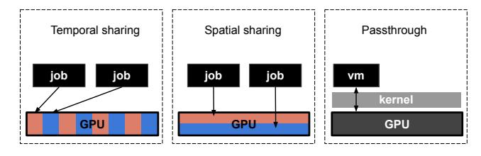

# 1 Introduction

Hyperscale Data Centers (DCs) are under increasing scrutiny due to their power consumption [\[1\]](#page-13-0). More than the absolute value itself, the rising trend draws attention, driven by the expansion of computing capacity and the construction of new DCs. A significant portion of this increase is attributed to Artificial Intelligence (AI) workloads, which rely on energyintensive accelerators such as GPUs [\[2\]](#page-13-1).

GPUs often consume more power than Central Processing Units (CPUs), sometimes by an order of magnitude in multi-GPUs servers. Monitoring and reporting power consumption is crucial for both cloud clients, who can optimize their workloads accordingly, and cloud operators, who need to manage power distribution across their infrastructure.

However, this issue is often overlooked due to two assumptions. (A) Monitoring GPU power consumption

Figure 1. Illustration of different GPU allocation

is straightforward: power consumption can be easily retrieved using the NVML API (or its executable, nvidia-smi) [\[3,](#page-13-2) [4\]](#page-13-3). (B) Accelerators are dedicated to a single job: the device's power consumption can be entirely attributed to a single process, avoiding complex attribution models like those used for CPUs [\[5](#page-13-4)[–7\]](#page-13-5). While these assumptions may hold in bare-metal environments (such as HPC), they are challenged in hyperscale cloud infrastructures, where virtualization layers introduce additional complexity.

In shared environments, depending on the product (ranging from IaaS to MLaaS and even cloud gaming), relying solely on the GPU driver for power consumption data is not always feasible. Furthermore, multiple jobs may share a single device through different allocation paradigms, making power attribution non-trivial. Figure [1](#page-1-0) introduces different allocation policies. Here, jobs can share the GPU over time (temporal sharing) or run in parallel on the same device (spatial sharing). Finally, passthrough situations bypass the host kernel by allowing direct access to the accelerator, making API calls to the accelerator infeasible from the host perspective.

This paper examines job power consumption in such shared GPU settings. We analyze how cloud providers can estimate individual usage while preserving the black-box nature of cloud computing. Our contributions are threefold:

- 1. Practical models for power estimation in different GPUsharing modes;
- 2. Empirical evidence that sharing can sometimes improve energy efficiency;
- 3. Identification of severe GPU underutilization in IaaS environments.

Our models are designed for GPUs operated in a black-box context. They rely on system metrics without compromising workload privacy. We notably demonstrate that IPMI temperature sensors provide a viable means for GPU power monitoring even in multi-tenant settings.

After reviewing previous work in Section [2,](#page-1-1) we present power monitoring approaches for temporal sharing (Section [3\)](#page-2-0), spatial sharing (Section [4\)](#page-4-0), and passthrough contexts (Section [5\)](#page-7-0). We then apply this knowledge to analyze GPU compute usage at a European cloud provider (Section [6\)](#page-11-0) and discuss our findings (Section [7\)](#page-12-0). Finally, we conclude our work and propose perspectives in Section [8.](#page-12-1)

