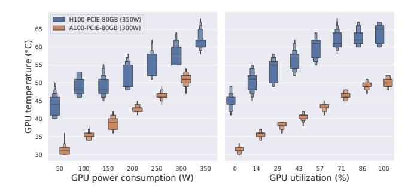

# **5.3.3** Precision in water-cooled configurations. Our final evaluation aimed to determine whether temperature remains a reliable proxy in environments where GPUs experience less intensive thermal variation, such as water-cooled servers.

We partnered with OVHcloud, one of Europe's largest cloud providers, to explore this scenario. OVHcloud employs a direct-to-chip water cooling system, where coolant flows through a water block in direct contact with the most thermally demanding components, such as CPUs and GPUs [41].

We analyzed temperature and power measurements of A100 and H100 GPUs under a controlled workload intensity (MIG-based) in a virtualized production environment over a week. As seen in Figure 12, the temperature range is narrower than in air-cooled configurations. While the minimum temperature remains similar (around 30°C), no reading exceeds 65°C (compared to 80°C for the 4xA100 configuration). Nevertheless, a clear correlation between power consumption and GPU usage and, consequently, between temperature and GPU usage can still be observed.

The difference in temperature readings between the two devices does not stem from the accelerators themselves, as

**Figure 11.** Temperature readings (initial and corrected) under 8xA100 GPUs with 2 stress levels

**Figure 12.** Comparison between GPUs power usage, compute usage, and temperature in a water-cooled environment

the same TDP should yield similar heat dissipation. Rather, it highlights the measurement's contextual nature, as the inlet water temperature influences the thermal baseline. This water temperature depends on the water-cooling configuration (in this case, some GPUs cooling flow may be mounted in series) and on seasonality—we observed variations in our dataset spanning both winter and spring. Interestingly, this thermal offset can be easily corrected using sliding time windows, as it remains a constant across all GPU usage levels.

Specifically, we employed the Automated Baseline Correction algorithm from [42], using the imor implementation provided by the pybaselines library [43]. This algorithm smooths temperature readings toward a local baseline by applying erosion and dilation within sliding windows (we used 24-hour time windows), effectively correcting thermal offsets and TDP variation between models. Next, we scaled the corrected readings using min-max normalization. Finally, we performed a regression between the corrected temperature values and GPU usage to build our inference model.

A simple linear regression yielded an average RMSE of 5.0% for A100 GPUs and 13.3% for the H100 configuration—higher in the latter due to greater temperature overlap across usage levels, as illustrated in Figure 12. Using a polynomial regression (with the degree selected through exploration in the range d=1 to d=100) slightly improved accuracy, achieving RMSE values of 3.7% for A100 and

**Figure 13.** Cumulative Distribution Functions (CDFs) of GPU compute utilization used by VMs on an IaaS GPU cluster

11.2% for H100. We consider this level of precision sufficient to infer general trends in GPU compute usage.

**5.3.4 Insights gained:** In conclusion, while this temperature-based approach requires calibration for each server type due to potential variations in cooling efficiency, it holds significant promise for cloud providers. By leveraging easily accessible IPMI sensors, cloud providers can implement a non-intrusive method for monitoring both GPU usage and power consumption across virtualized environments with precision and accuracy.

