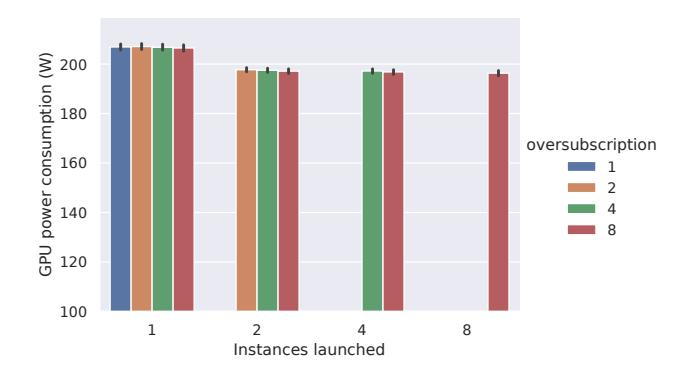

# 3 Inferring Power Consumption in Temporally Shared Situations

In its most basic form, an accelerator can always be shared temporally [27]. With GPUs, each process is loaded into the device memory, and context switching occurs on CUDA cores to create the "illusion of concurrency". The device driver typically manages the scheduling policy.

We now evaluate the impact of temporal sharing on GPUs power consumption. First, we summarize where temporal sharing is applicable in a cloud context (Subsection 3.1). We

then detail our experimental protocol for assessing its impact on both energy consumption and performance from a job perspective (Subsection 3.2). Finally, we present our findings (Subsection 3.3).

#### 3.1 Principle

When multiple jobs request access to a GPU, the accelerator's default behavior is to partition its time between the requesting processes. Specifically, with n processes, each process is allocated a coarse share of  $\frac{1}{n}$  of the GPU's computing time. However, the actual time slice allocation notably depends on the GPU scheduler and may vary depending on the scheduling policies and workload priorities. In a cloud context, processes originate from VMs or containers, which encapsulate the software stack and provide isolation from other tenants.

Workloads such as Jupyter notebooks, batch processing, or other services (MLaaS) are typically managed through containers and orchestrated by Kubernetes. Kubernetes interfaces with the NVIDIA GPU Operator, a component responsible for deploying NVIDIA drivers and runtime environments, and exposing GPUs as resources to Kubernetes. The GPU Operator manages how these resources are allocated, defining the maximum number of processes per device (and, therefore, the time-slice size).

Time-shared GPUs are also publicly promoted by cloud providers for virtual workstations through the vGPU software from NVIDIA [28–30].

While this configuration is common in cloud settings, we are unaware of previous work investigating how its power consumption can be modeled and the implications of this for efficiency.

#### 3.2 Experimental Protocol

Assessing the power consumption of GPUs jobs on a timesliced GPU was done in two stages. We first measured the device's highest power consumption before measuring the shared level's impact on performance and efficiency for various workloads.

**3.2.1** Highest power consumption. Assessing the highest power consumption was done using GPU-burn [31]. GPU-burn applies a compute-intensive workload by repeatedly multiplying large matrices, which maximizes the use of both the GPU cores and memory. This operation stresses the GPU with high-demand tasks, allowing for the evaluation of power consumption under full load.

We explored the replica parameters of the NVIDIA GPU Operator for Kubernetes. More specifically, we set up a Kubernetes cluster in which the replica setting was initially left at its default value (r = 1) before progressively increasing (we explored r = 2, r = 4, r = 8).

| Name    | Туре                              | Technical details                          | Metric                |
|---------|-----------------------------------|--------------------------------------------|-----------------------|
| Blender | 3D rendering                      | Rendering Scene 'Monster' on Blender 4.3.0 | Samples per minute    |
| HPCG    | HPC                               | Solving large-scale sparse linear systems  | GFLOP per second      |
| LLama   | Inference workload                | Model Llama-3.2-1B                         | Inferences per minute |
| Yolo    | Train model for image recognition | YOLOv8 reinforcement learning              | Trainings per hour    |

Table 1. Benchmarks presentation

**Figure 2.** Power consumption of P100 GPUs under different Kubernetes oversubscription settings

This represents an oversubscription policy1, allowing more GPU resources to be exposed than are physically available (under the default setting, a GPU can only be used by a single container). The rest of the NVIDIA GPU Operator parameters were left unchanged.

Under each r oversubscription policy, we deployed n containers, exploring all values in the [0, r] range. Power measurements were read from the GPU device using the NVML API through nvidia-smi.

**3.2.2** Explore the energy vs. power trade-off. To evaluate the impact of shared settings on applications, we built our testbed specifically targeting workloads that do not fully utilize the GPU resources we tested (P100, V100, A100, H100). These workloads do not exhaust all available memory, allowing for sharing mechanisms. This focus allows us to assess the impact of shared contexts specifically, as sharing is most relevant for workloads that do not fully exhaust their resources in terms of capacity or timeline.

We selected a set of applications that we consider representative of typical workloads on a cloud *Container as a Service* (CaaS) GPU-enabled platform: 3D simulation (Blender [32]), HPC-like workloads (HPCG [33] using NVIDIA's implementation [34]), inference workloads (Llama [35]), and model training (Yolo [36]). This selection allows us to broaden the scope of our study beyond MLaaS platforms (typically containerized) to include a wider range of use-cases.

Each workload was adapted for performance evaluation. A Python wrapper was written to load the application, execute it in a loop, and periodically dump a performance metric. Each setup is containerized. Selected performance metrics can be seen in Table 1. Performance degradation for each application was quantified as more workloads were introduced to the GPU based on these metrics.

For each configuration, we measured performance and power over a 30-minute period. This duration captures both steady-state and transient phases, providing meaningful insights into energy and temperature (notably considering the low sampling frequency of sensors). GPU settings were kept at their defaults.

#### 3.3 Results

We conducted our experiments on different GPUs. Regarding the highest power consumption on an oversubscribed Kubernetes cluster, our results, based on two P100 GPUs (Pascal architecture), are presented in Figure 2. As expected, the power consumption of a single replica is high (close to the *Thermal Design Power* (TDP) of the GPU under study), as exclusive access allows the container to utilize all available resources. Interestingly, power consumption slightly decreases as soon as the GPUs begin to be shared, likely due to the time overhead introduced by context switching between processes, which induces a certain level of throttling. However, the cost of these context switches does not appear to increase significantly with higher levels of multiplexing.

Regarding performance, the experiments were conducted on V100 (Volta), A100 (Ampere), and H100 (Hopper) architectures. Figure 3 illustrates our findings. The per-container consumption exposed was computed by  $Container_{power} = \frac{GPU_{power}}{n}$  where n is the number of concurrent containers. We observe a relatively proportional relationship between the power consumed by containers and their performance, which decreases as the time slice allocated to each container shortens.

However, for some workloads, performance decreases less than power consumption, leading to improved energy efficiency. For example, HPCG is more efficient when timeshared on the A100 but not on the H100. Since HPCG is memory-bound, the H100's higher memory bandwidth (3.9 TB/s vs. 1.5 TB/s, according to technical specifications) reduces idle times, making time-slicing less beneficial for this model.

This underscores the relevance of time-shared policies when GPU compute resources experience idle periods. The same principle applies to inference workloads such as Llama,

&lt;sup>1Oversubscription is also sometimes referred to as overcommitment

Figure 3. Performance per container (expressed as a percentage of the baseline where the benchmark is running alone on the GPU) compared to the container power consumption (also expressed as a percentage of its power consumption while running alone)

which also benefit from sharing. Conversely, for computebound tasks such as training and 3D modeling, sharing techniques offer limited energy efficiency advantages.

3.3.1 Insights gained: Temporal sharing is more relevant when workloads have staggered execution patterns (i.e., Streaming Multiprocessor (SM) resources experience idle time) than when workloads underutilize GPU capacity.

While the power consumption of time-shared GPUs is influenced by context-switching overhead, a proportional power allocation model—where the total power is evenly divided among active containers—provides a reasonable approximation.

