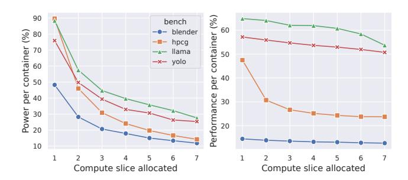

# 4 Inferring Power Consumption in Spatially Shared Situations

While temporal sharing has some limits regarding energy efficiency in a concurrent setting, we now explore how GPUs power consumption behaves when the accelerator is spatially shared between multi-tenant jobs. In this paradigm, the GPU device is divided into subsections, each with its own CUDA cores, cache levels, DRAM area, and system pipe. By allowing simultaneous execution, this paradigm offers more significant opportunities to reduce per-container static power consumption.

We first review where spatial sharing can be used in cloud computing (Subsection [4.1\)](#page-4-2), before detailing our experimental protocol (Subsection [4.2\)](#page-4-3) and then diving into our results (Subsection [4.3\)](#page-5-0).

#### 4.1 Principle

Spatial resource sharing has long been supported in computer science: multi-core CPUs allow multiple processes to run on separate cores, with mechanisms like Linux cgroups enabling exclusive core allocation.

In contrast, spatial sharing on GPUs is more recent. It is now widely available on Nvidia's Ampere and Hopper datacenter GPUs (released in 2021 and 2024, respectively). Although Nvidia's Blackwell architecture was recently introduced, it remains too scarce to be included in this study.

Given the rising power consumption of GPUs, spatial sharing is a compelling approach, particularly for workloads that do not require full access to the device's resources. Despite its potential, limited data exist on power consumption in these environments. Cloud providers leverage spatial partitioning to enforce isolation in multi-tenant settings (e.g., CaaS) using vGPU software or by directly assigning MIG devices to containers.

In this section, we investigate how to infer power consumption in sub-GPU partitioning, particularly in multitenant environments where cloud providers may aim to provide power usage estimates to their clients.

#### 4.2 Experimental Protocol

The spatial sharing of GPUs, referred to as MIG, involves dividing a GPU into GPU instances (GIs), a combination of dedicated SMs and engines. The GIs SMs can be further divided through Compute Instances (CIs), while other components are shared between CIs belonging to the same GI.

The GPU partitioning takes place with these two concepts through predefined profiles that apply multiple combinations. Profiles use a slice unit, with a total of 7 compute slices and 8 memory slices on explored architectures (Ampere, Hopper). For 40GB GPUs, a memory slice is, therefore, approximately 5GB.

We followed the same approach as in the previous section, first determining the highest power consumption for different configurations before analyzing the impact on performance and energy consumption for various workloads.

4.2.1 Highest power consumption. We first explore how this partitioning affects the device's energy consumption using the GPU-burn workload previously introduced. To this end, we measured all possible GIs sizes along with all the unique CIs sizes they can host while progressively increasing the workload of co-hosted GIs. For example, with a 3-compute-slice GI, we tested sizes of 1, 2, and 3 CI compute slices while introducing additional 1-compute-slice GIs until reaching the full capacity of the GPU.

Each run lasted 5 minutes to limit the experiment's total duration (approximately 18 hours due to the number of combinations), and power consumption was retrieved through NVML. We tested five different GPUs supporting MIG, with varying models and TDP.

**Figure 4.** Power consumption of one compute slice on A100, H100 and GH200 devices

Note that MIG does not prevent a time-sliced usage of a CI. This paper did not explore the combination of time-sharing with spatial sharing, both to restrict the scope of our work and because time-sharing behaves similarly in a sub-GPU as it does at the full-GPU level.

**4.2.2** Explore the energy vs. power trade-off. We then explore the implications of sub-GPU partitioning for the workloads introduced in Table 1. A key question was whether the degradation in performance could lead to improved energy efficiency (i.e., if the performance reduction is lower than the power reduction).

To investigate this, we tested all CI sizes for each benchmark, ranging from a single CI up to full GPU allocation. For example, with a CI size of 1, we assigned it a container running the Blender benchmark, measured its performance, then introduced a second container running the same benchmark on another 1-slice CI, and continued this process until all resources were utilized.

Each configuration was tested for 30 minutes, while percontainer and device power consumption were recorded.

## 4.3 Results

Regarding the highest power consumption across different MIGs levels, we first report on the smallest GI size in Figure 4. The static power consumption of an accelerator remains high and is primarily influenced by its TDP. The boxplots illustrate the range of measured values.

Our testbed included three single-GPU instances (A100-PCIE-80GB, H100-PCIE-80GB, and GH200-NVL-96GB), while other configurations consisted of servers equipped with two to four identical accelerators, all subjected to the same workload. While the single-GPU configurations confirm that power variation is minimal for the same device, multi-GPU setups reveal some variability between identical accelerators. We observed this as a static offset: a GPU consuming 10 watts more than its counterparts in idle typically maintained this difference under load. In our tests, 10 watts was the maximum observed variation.

Introducing multiple GIs reveals interesting power consumption patterns. As shown in Figure 5, the use of GIs enables energy-proportional computing, a long-standing design goal in cloud computing for efficiency [37].

We observed that GIs allow the power consumption of A100 GPUs to scale primarily with the number of slices used, regardless of the architecture. The size of the GI appears to have little impact, as a configuration with three GPU compute slices (MIG\_3g\_20gb) consumes approximately the same power as three GIs composed of a single GPU compute slice (MIG\_1g\_5gb). Additionally, increasing the number of compute slices utilized within a GPU leads to a predictable increase in power consumption.

While only full GIs are displayed in this graph (i.e., CIs utilizing all the resources of their respective GIs), we observed that both paradigms exhibit comparable power consumption. This implies that a CI consuming the equivalent of two GPU compute slices draws approximately the same power as a GI configured with two physical compute slices.

Additionally, the graph reveals a "last one for free" effect on specific hardware, where the maximum power consumption of the GPU is reached at n-2 or n-1 compute slices (where n is the maximum). As a result, the final slice(s) appear to consume negligible additional power.

**Driver impact on power consumption:** The NVIDIA driver version also influenced our findings. The experiments and results presented here were conducted using the latest drivers available on our test platforms (570.86.15 for A100-PCIE-80GB and H100-PCIE-80GB, and 570.124.06 for others). However, we observed unexpected behavior with older drivers.

As shown in Figure 6, the proportional scaling of MIG power consumption is absent when using driver version 535.183.06. In this configuration, the power consumption of a single compute slice was measured at approximately 300W—significantly higher than the 160W observed with the latest driver versions. Furthermore, the maximum power usage was reached as soon as a second compute slice was scheduled. We found no mention of this behavior in the changelogs between these driver versions.

**DCGM impact on power consumption:** The monitoring stack of GPUs also had a significant impact in some instances. The latest DCGM Prometheus exporter available at the time of writing (version 4.1.1-4.0.4) can increase the static power consumption of MIG-enabled devices by up to 50 watts compared to version 4.1.1-4.0.3. This increase is due to additional profiling mechanisms relying on the NVIDIA Perf Works library for A100 and older devices [38]. To mitigate this effect, we avoided any active profiling in our experiments.

Regarding performance impact, we first present the evolution of jobs performance and power while increasing the number of compute slices of size 1 on an H100 in Figure 7. Power is reported using the same formula as in the previous section:  $Container_{power} = \frac{GPU_{power}}{n}$  where n is the number of concurrent containers.

Figure 5. Power consumption of MIG configurations on A100 and H100 devices

**Figure 6.** Comparison of the consumption of different MIG configurations under different driver versions for the same hardware

**Figure 7.** Evolution of power and performance when increasing the number of 1 slice allocation on an H100-NVL-94GB

In contrast to the time-shared setting, deploying more containers on different GIs always leads to an increase in the raw power consumption of the device, as more SM are utilized. However, the per-container power consumption decreases as the device's static power is amortized across more containers. This decrease follows a hyperbolic pattern.

Performance remains more stable thanks to the guaranteed resources of MIG. This leads to efficiency gains (defined as the ratio of performance to energy) in some configurations, although contention effects can appear for certain benchmarks.

We generalize this study of performance and energy evolution to multiple compute slice sizes (1, 2, 3, 4, 7) across

different hardware in Figure 8. The first horizontal row reports power per container, while the second horizontal row shows the impact on performance. Performance is generally influenced more by the size of the CI than by the number of instances, as each container uses different SMs. The main exception is the HPCG benchmark, which experienced contention on shared resources (bus, CPU)

Finally, the last row reports the ratio between performance degradation and power gain. The "performance equals power" line is displayed for reference. Any configuration above this line shows that the performance degradation was less significant than the power consumption reduction, resulting in better energy efficiency. Anything below the line indicates the opposite, where the performance loss outweighs the power consumption gain.

Interestingly, AI workloads (inference and training) achieve higher energy efficiency in most configurations when the second instance is deployed, demonstrating the value of shared allocation paradigms with small models. In contrast, 3D rendering and HPCG appear less suitable for such configurations due to: A) the full utilization of SMs cores, and B) contention on other resources.

**4.3.1 Insights gained:** The mostly energy-proportional behaviors observed in Figure 5 lead us to propose a model that decomposes the power consumption into a static chiplevel component, evenly amortized across all slices, and a slice-specific component that depends on the slice size.

$$\mathcal{P}_{i}^{\text{slice}} = \frac{\mathcal{P}_{\text{chip}}^{\text{static}}}{N} + \left(\mathcal{P}_{\text{slice},i}^{\text{max}} - \mathcal{P}_{\text{chip}}^{\text{static}}\right) \tag{1}$$

Equation 1 models the power consumption of a slice of size i, where N is the maximum number of slices. The first term accounts for the static consumption of the GPU, divided evenly across slices, while the second term represents the range specific to the slice size. For clarity, both  $\mathcal{P}_{\text{chip}}^{\text{static}}$  and  $\mathcal{P}_{\text{slice }i}^{\text{max}}$  are obtained empirically for each MIG profile.

To improve determinism, we rely on the worst case, defined as the maximum power draw obtained with a GPU burn workload. This represents an upper bound, since all compute resources are saturated. Determinism is preferred in a cloud setting: otherwise, tenants would observe fluctuating power

Figure 8. Overview of the performance vs. Energy trade-off with MIG configurations under different benchmarks

readings for identical usage patterns, complicating analysis in multi-tenant scenarios. In contrast, models prioritizing empirical fidelity over determinism are harder to construct, especially given the lack of classic GPU usage metrics in MIG mode.

When applied to our benchmarks across the wide range of hardware tested, this model yields a *Root Mean Square Error* (RMSE) of 13.4 W (MAPE of 11.5%) on a 1-compute slice, which can be considered a right-sized configuration. On oversized allocations (where compute resources are underutilized), the error increases, as applications no longer reach the modeled upper bound (MAPE of 26.5%). These larger slices fail to use their full compute share, resulting in high modeled power despite low utilization.

$$\mathcal{P}_{i}^{\text{slice}} = \frac{\mathcal{P}_{\text{chip}}^{\text{static}}}{N} + F * \left(\mathcal{P}_{\text{slice},i}^{\text{max}} - \mathcal{P}_{\text{chip}}^{\text{static}}\right)$$
(2)

The difference between the predicted upper bound of power consumption and the actual measurement represents unused energy. This unused energy is captured by the factor F in Equation 2. On our testbed, the factor increases

with the allocation size and follows the relation:  $F_{\text{slice}(i)} = 1 - 0.07 \times (i - 1)$ .

Its integration into a carbon-accounting mechanism depends on provider policy. If the objective is to foster right-sizing, the unused energy can be interpreted as an energetic penalty induced by oversized workloads. In this case, Equation 1 should be preferred, as it encourages tenants to adopt more suitable application sizing (choosing a smaller envelope would drastically reduce the metric with limited impact on performance for oversized allocations). If the objective is accuracy, Equation 2 should be used. On our testbed, this model reduces global RMSE (19.7 W vs. 53.0 W) and MAPE (14.2% vs. 26.5%).

